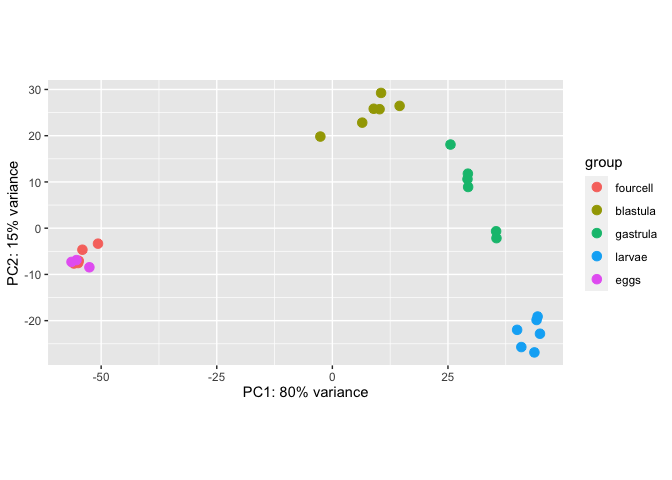

EL-DESeq2
================
Maggie Schedl
6/9/2020

``` r
library(DESeq2)
```

    ## Loading required package: S4Vectors

    ## Loading required package: stats4

    ## Loading required package: BiocGenerics

    ## Loading required package: parallel

    ## 
    ## Attaching package: 'BiocGenerics'

    ## The following objects are masked from 'package:parallel':
    ## 
    ##     clusterApply, clusterApplyLB, clusterCall, clusterEvalQ,
    ##     clusterExport, clusterMap, parApply, parCapply, parLapply,
    ##     parLapplyLB, parRapply, parSapply, parSapplyLB

    ## The following objects are masked from 'package:stats':
    ## 
    ##     IQR, mad, sd, var, xtabs

    ## The following objects are masked from 'package:base':
    ## 
    ##     anyDuplicated, append, as.data.frame, basename, cbind, colnames,
    ##     dirname, do.call, duplicated, eval, evalq, Filter, Find, get, grep,
    ##     grepl, intersect, is.unsorted, lapply, Map, mapply, match, mget,
    ##     order, paste, pmax, pmax.int, pmin, pmin.int, Position, rank,
    ##     rbind, Reduce, rownames, sapply, setdiff, sort, table, tapply,
    ##     union, unique, unsplit, which, which.max, which.min

    ## 
    ## Attaching package: 'S4Vectors'

    ## The following object is masked from 'package:base':
    ## 
    ##     expand.grid

    ## Loading required package: IRanges

    ## Loading required package: GenomicRanges

    ## Loading required package: GenomeInfoDb

    ## Loading required package: SummarizedExperiment

    ## Loading required package: Biobase

    ## Welcome to Bioconductor
    ## 
    ##     Vignettes contain introductory material; view with
    ##     'browseVignettes()'. To cite Bioconductor, see
    ##     'citation("Biobase")', and for packages 'citation("pkgname")'.

    ## Loading required package: DelayedArray

    ## Loading required package: matrixStats

    ## 
    ## Attaching package: 'matrixStats'

    ## The following objects are masked from 'package:Biobase':
    ## 
    ##     anyMissing, rowMedians

    ## 
    ## Attaching package: 'DelayedArray'

    ## The following objects are masked from 'package:matrixStats':
    ## 
    ##     colMaxs, colMins, colRanges, rowMaxs, rowMins, rowRanges

    ## The following objects are masked from 'package:base':
    ## 
    ##     aperm, apply, rowsum

``` r
# library(apeglm) can't use this one
library(ggplot2)
# library(vsn) can't use this one
library(pheatmap)
library(RColorBrewer)
# library(genefilter) can't use this one
library(reshape2)
library(rsconnect)
library(gplots)
```

    ## 
    ## Attaching package: 'gplots'

    ## The following object is masked from 'package:IRanges':
    ## 
    ##     space

    ## The following object is masked from 'package:S4Vectors':
    ## 
    ##     space

    ## The following object is masked from 'package:stats':
    ## 
    ##     lowess

``` r
library(ashr)
# library(limma) can't use this one
library(dplyr)
```

    ## 
    ## Attaching package: 'dplyr'

    ## The following object is masked from 'package:matrixStats':
    ## 
    ##     count

    ## The following object is masked from 'package:Biobase':
    ## 
    ##     combine

    ## The following objects are masked from 'package:GenomicRanges':
    ## 
    ##     intersect, setdiff, union

    ## The following object is masked from 'package:GenomeInfoDb':
    ## 
    ##     intersect

    ## The following objects are masked from 'package:IRanges':
    ## 
    ##     collapse, desc, intersect, setdiff, slice, union

    ## The following objects are masked from 'package:S4Vectors':
    ## 
    ##     first, intersect, rename, setdiff, setequal, union

    ## The following objects are masked from 'package:BiocGenerics':
    ## 
    ##     combine, intersect, setdiff, union

    ## The following objects are masked from 'package:stats':
    ## 
    ##     filter, lag

    ## The following objects are masked from 'package:base':
    ## 
    ##     intersect, setdiff, setequal, union

``` r
library(tidyr)
```

    ## 
    ## Attaching package: 'tidyr'

    ## The following object is masked from 'package:reshape2':
    ## 
    ##     smiths

    ## The following object is masked from 'package:S4Vectors':
    ## 
    ##     expand

``` r
library(dlookr)
```

    ## Loading required package: mice

    ## 
    ## Attaching package: 'mice'

    ## The following objects are masked from 'package:SummarizedExperiment':
    ## 
    ##     cbind, rbind

    ## The following objects are masked from 'package:DelayedArray':
    ## 
    ##     cbind, rbind

    ## The following objects are masked from 'package:IRanges':
    ## 
    ##     cbind, rbind

    ## The following objects are masked from 'package:S4Vectors':
    ## 
    ##     cbind, rbind

    ## The following objects are masked from 'package:BiocGenerics':
    ## 
    ##     cbind, rbind

    ## The following objects are masked from 'package:base':
    ## 
    ##     cbind, rbind

    ## Registered S3 method overwritten by 'quantmod':
    ##   method            from
    ##   as.zoo.data.frame zoo

    ## 
    ## Attaching package: 'dlookr'

    ## The following object is masked from 'package:IRanges':
    ## 
    ##     transform

    ## The following object is masked from 'package:S4Vectors':
    ## 
    ##     transform

    ## The following object is masked from 'package:base':
    ## 
    ##     transform

``` r
library(tximport)
```

DESeqDataSetFromMatrix
<http://bioconductor.org/packages/devel/bioc/vignettes/DESeq2/inst/doc/DESeq2.html>

``` r
# input sample/treatment info
Sample_info <- read.csv("el-treatment-data.csv", header=TRUE, sep=",")
print(Sample_info)
```

    ##            Sample    Stage    Temp
    ## 1  29_4cell_rep_1 fourcell ambient
    ## 2  29_4cell_rep_2 fourcell ambient
    ## 3  29_4cell_rep_3 fourcell ambient
    ## 4  29_blast_rep_1 blastula ambient
    ## 5  29_blast_rep_2 blastula ambient
    ## 6  29_blast_rep_3 blastula ambient
    ## 7   29_gast_rep_1 gastrula ambient
    ## 8   29_gast_rep_2 gastrula ambient
    ## 9   29_gast_rep_3 gastrula ambient
    ## 10  29_larv_rep_1   larvae ambient
    ## 11  29_larv_rep_2   larvae ambient
    ## 12  29_larv_rep_3   larvae ambient
    ## 13 33_4cell_rep_1 fourcell    high
    ## 14 33_4cell_rep_2 fourcell    high
    ## 15 33_4cell_rep_3 fourcell    high
    ## 16 33_blast_rep_1 blastula    high
    ## 17 33_blast_rep_2 blastula    high
    ## 18 33_blast_rep_3 blastula    high
    ## 19  33_gast_rep_1 gastrula    high
    ## 20  33_gast_rep_2 gastrula    high
    ## 21  33_gast_rep_3 gastrula    high
    ## 22  33_larv_rep_1   larvae    high
    ## 23  33_larv_rep_2   larvae    high
    ## 24  33_larv_rep_3   larvae    high
    ## 25     eggs_rep_1     eggs ambient
    ## 26     eggs_rep_2     eggs ambient
    ## 27     eggs_rep_3     eggs ambient

Shouldn’t be using the abundance estimation method from trinity. Should
be using tximport program, that takes the RSEM results from each sample
“Import and summarize transcript-level abundance estimates for
transcript- and gene-level
analysis”

<https://bioc.ism.ac.jp/packages/3.5/bioc/vignettes/tximport/inst/doc/tximport.html#import-transcript-level-estimates>
<https://bioconductor.org/packages/devel/bioc/vignettes/tximport/inst/doc/tximport.html#Import_transcript-level_estimates>

Have copy to my computer all of the RSEM.genes.results files because
this is what it takes

need “files” a character vector of filenames for the transcript-level
abundances

``` r
files <- list.files(path = ".", pattern = ".genes.results")
names(files) <- c("29_4cell_rep_1", "29_4cell_rep_2", "29_4cell_rep_3", "29_blast_rep_1", "29_blast_rep_2", "29_blast_rep_3", "29_gast_rep_1", "29_gast_rep_2", "29_gast_rep_3", "29_larv_rep_1", "29_larv_rep_2", "29_larv_rep_3", "33_4cell_rep_1", "33_4cell_rep_2", "33_4cell_rep_3", "33_blast_rep_1", "33_blast_rep_2", "33_blast_rep_3", "33_gast_rep_1", "33_gast_rep_2", "33_gast_rep_3", "33_larv_rep_1", "33_larv_rep_2", "33_larv_rep_3", "eggs_rep_1", "eggs_rep_2", "eggs_rep_3")
txi.rsem <- tximport(files, type = "rsem")
```

    ## It looks like you are importing RSEM genes.results files, setting txIn=FALSE

    ## reading in files with read_tsv

    ## 1 2 3 4 5 6 7 8 9 10 11 12 13 14 15 16 17 18 19 20 21 22 23 24 25 26 27

``` r
head(txi.rsem$counts)
```

    ##                        29_4cell_rep_1 29_4cell_rep_2 29_4cell_rep_3
    ## TRINITY_DN100003_c0_g1              1              0              0
    ## TRINITY_DN10000_c0_g1             369            587            931
    ## TRINITY_DN100013_c0_g1              5              1              5
    ## TRINITY_DN100032_c0_g1              0              0              0
    ## TRINITY_DN100034_c0_g1             38              4            759
    ## TRINITY_DN100035_c0_g1              1              0              0
    ##                        29_blast_rep_1 29_blast_rep_2 29_blast_rep_3
    ## TRINITY_DN100003_c0_g1              0              2              0
    ## TRINITY_DN10000_c0_g1             790            712            645
    ## TRINITY_DN100013_c0_g1              0              0              0
    ## TRINITY_DN100032_c0_g1              2              0              0
    ## TRINITY_DN100034_c0_g1              6              0             60
    ## TRINITY_DN100035_c0_g1              0              0              0
    ##                        29_gast_rep_1 29_gast_rep_2 29_gast_rep_3 29_larv_rep_1
    ## TRINITY_DN100003_c0_g1             2             0            23             0
    ## TRINITY_DN10000_c0_g1            675           546           662           536
    ## TRINITY_DN100013_c0_g1             1             0             3             0
    ## TRINITY_DN100032_c0_g1             6             0            18             7
    ## TRINITY_DN100034_c0_g1             0             0            11             1
    ## TRINITY_DN100035_c0_g1             7             8             8             6
    ##                        29_larv_rep_2 29_larv_rep_3 33_4cell_rep_1
    ## TRINITY_DN100003_c0_g1            10             6              0
    ## TRINITY_DN10000_c0_g1            253           387            263
    ## TRINITY_DN100013_c0_g1             0             1              5
    ## TRINITY_DN100032_c0_g1             8            16              0
    ## TRINITY_DN100034_c0_g1             0             0             42
    ## TRINITY_DN100035_c0_g1            21            18              1
    ##                        33_4cell_rep_2 33_4cell_rep_3 33_blast_rep_1
    ## TRINITY_DN100003_c0_g1              0              0              2
    ## TRINITY_DN10000_c0_g1             485            627            795
    ## TRINITY_DN100013_c0_g1              0              2              0
    ## TRINITY_DN100032_c0_g1              0              0              1
    ## TRINITY_DN100034_c0_g1              2            482              6
    ## TRINITY_DN100035_c0_g1              0              0              2
    ##                        33_blast_rep_2 33_blast_rep_3 33_gast_rep_1
    ## TRINITY_DN100003_c0_g1              1              5             4
    ## TRINITY_DN10000_c0_g1             485            603           621
    ## TRINITY_DN100013_c0_g1              1              4             0
    ## TRINITY_DN100032_c0_g1              0              7             2
    ## TRINITY_DN100034_c0_g1              2            239             1
    ## TRINITY_DN100035_c0_g1              0              1            12
    ##                        33_gast_rep_2 33_gast_rep_3 33_larv_rep_1 33_larv_rep_2
    ## TRINITY_DN100003_c0_g1             8            13             1            15
    ## TRINITY_DN10000_c0_g1            356           498           497           265
    ## TRINITY_DN100013_c0_g1             0             1             1             2
    ## TRINITY_DN100032_c0_g1             5            10            29            12
    ## TRINITY_DN100034_c0_g1             0             1             1             5
    ## TRINITY_DN100035_c0_g1            11             2             3            17
    ##                        33_larv_rep_3 eggs_rep_1 eggs_rep_2 eggs_rep_3
    ## TRINITY_DN100003_c0_g1             2          0          0          0
    ## TRINITY_DN10000_c0_g1            437        181        264        599
    ## TRINITY_DN100013_c0_g1             0          0          0          1
    ## TRINITY_DN100032_c0_g1            38          0          0          0
    ## TRINITY_DN100034_c0_g1             1         29          2        610
    ## TRINITY_DN100035_c0_g1            23          0          0          0

Yay these are integers1

Now I want to use DESeqDataSetFromTximport to make the DESeq object

not able to do “intereaction effect” in this part of the design because
eggs are only in the ambient treatment

``` r
# Set up for complete combinatorial design 
Sample_info$Stage = factor(x = Sample_info$Stage,levels = c('fourcell','blastula', "gastrula", "larvae", "eggs"))
Sample_info$Temp = factor(x = Sample_info$Temp, levels = c("ambient", "high"))
ddsTxi_Comb <- DESeqDataSetFromTximport(txi.rsem,
                                   colData = Sample_info,
                                   design = ~ Stage + Temp)
```

    ## using counts and average transcript lengths from tximport

Can pre-filter matrix to get rid of low-expressed genes

``` r
# then I need to filter out low count transcripts
# can't do pover a filtering because this is too new a version of R
# however I can make an educated guess for what I should do with filtering
# there are 27 samples
# 3 or 6 in each life stage
# lets go with 6 
# want at least 3 counts in six
# so 3*6 is 18
# DESeq manual says a good count to filter by is 10 so this seems reseaonable 
keep <- rowSums(counts(ddsTxi_Comb)) >= 18
length(keep[keep==FALSE])
```

    ## [1] 25

``` r
# this removes 25 genes, not sure if this is a lot or not
ddsTxi_Comb_filt <- ddsTxi_Comb[keep,]
```

add interaction this way? from DESEq2
vingette

``` r
ddsTxi_Comb_filt$group <- factor(paste0(ddsTxi_Comb_filt$Stage, ddsTxi_Comb_filt$Temp))
design(ddsTxi_Comb_filt) <- ~ group
dds <- DESeq(ddsTxi_Comb_filt)
```

    ## estimating size factors

    ## using 'avgTxLength' from assays(dds), correcting for library size

    ## estimating dispersions

    ## gene-wise dispersion estimates

    ## mean-dispersion relationship

    ## final dispersion estimates

    ## fitting model and testing

``` r
resultsNames(dds)
```

    ## [1] "Intercept"                               
    ## [2] "group_blastulahigh_vs_blastulaambient"   
    ## [3] "group_eggsambient_vs_blastulaambient"    
    ## [4] "group_fourcellambient_vs_blastulaambient"
    ## [5] "group_fourcellhigh_vs_blastulaambient"   
    ## [6] "group_gastrulaambient_vs_blastulaambient"
    ## [7] "group_gastrulahigh_vs_blastulaambient"   
    ## [8] "group_larvaeambient_vs_blastulaambient"  
    ## [9] "group_larvaehigh_vs_blastulaambient"

``` r
print(dds$group)
```

    ##  [1] fourcellambient fourcellambient fourcellambient blastulaambient
    ##  [5] blastulaambient blastulaambient gastrulaambient gastrulaambient
    ##  [9] gastrulaambient larvaeambient   larvaeambient   larvaeambient  
    ## [13] fourcellhigh    fourcellhigh    fourcellhigh    blastulahigh   
    ## [17] blastulahigh    blastulahigh    gastrulahigh    gastrulahigh   
    ## [21] gastrulahigh    larvaehigh      larvaehigh      larvaehigh     
    ## [25] eggsambient     eggsambient     eggsambient    
    ## 9 Levels: blastulaambient blastulahigh eggsambient ... larvaehigh

All possible results combinations?

``` r
# had to use F for 4 if starting the name of results
BA_4CA <- results(dds, alpha=0.05, contrast=c("group", "fourcellambient", "blastulaambient"))
GA_4CA <- results(dds, alpha=0.05, contrast=c("group", "fourcellambient", "gastrulaambient"))
LA_4CA <- results(dds, alpha=0.05, contrast=c("group", "fourcellambient", "larvaeambient"))
EA_4CA <- results(dds, alpha=0.05, contrast=c("group", "fourcellambient", "eggsambient"))
FCH_4CA <- results(dds, alpha=0.05, contrast=c("group", "fourcellambient", "fourcellhigh"))
BH_4CA <- results(dds, alpha=0.05, contrast=c("group", "fourcellambient", "blastulahigh"))
GH_4CA <- results(dds, alpha=0.05, contrast=c("group", "fourcellambient", "gastrulahigh"))
LH_4CA <- results(dds, alpha=0.05, contrast=c("group", "fourcellambient", "larvaehigh"))

GA_BA <- results(dds, alpha=0.05, contrast=c("group", "blastulaambient", "gastrulaambient"))
LA_BA <- results(dds, alpha=0.05, contrast=c("group", "blastulaambient", "larvaeambient"))
EA_BA <- results(dds, alpha=0.05, contrast=c("group", "blastulaambient", "eggsambient"))
FCH_BA <- results(dds, alpha=0.05, contrast=c("group", "blastulaambient", "fourcellhigh"))
BH_BA <- results(dds, alpha=0.05, contrast=c("group", "blastulaambient", "blastulahigh"))
GH_BA <- results(dds, alpha=0.05, contrast=c("group", "blastulaambient", "gastrulahigh"))
LH_BA <- results(dds, alpha=0.05, contrast=c("group", "blastulaambient", "larvaehigh"))

LA_GA <- results(dds, alpha=0.05, contrast=c("group", "gastrulaambient", "larvaeambient"))
EA_GA <- results(dds, alpha=0.05, contrast=c("group", "gastrulaambient", "eggsambient"))
FCH_GA <- results(dds, alpha=0.05, contrast=c("group", "gastrulaambient", "eggsambient"))
BH_GA <- results(dds, alpha=0.05, contrast=c("group", "gastrulaambient", "blastulahigh"))
GH_GA <- results(dds, alpha=0.05, contrast=c("group", "gastrulaambient", "gastrulahigh"))
LH_GA <- results(dds, alpha=0.05, contrast=c("group", "gastrulaambient", "larvaehigh"))

EA_LA <- results(dds, alpha=0.05, contrast=c("group", "larvaeambient", "eggsambient"))
FCH_LA <- results(dds, alpha=0.05, contrast=c("group", "larvaeambient", "fourcellhigh"))
BH_LA <- results(dds, alpha=0.05, contrast=c("group", "larvaeambient", "blastulahigh"))
GH_LA <- results(dds, alpha=0.05, contrast=c("group", "larvaeambient", "gastrulahigh"))
LH_LA <- results(dds, alpha=0.05, contrast=c("group", "larvaeambient", "larvaehigh"))

FCH_EA <- results(dds, alpha=0.05, contrast=c("group", "eggsambient", "fourcellhigh"))
BH_EA <- results(dds, alpha=0.05, contrast=c("group", "eggsambient", "blastulahigh"))
GH_EA <- results(dds, alpha=0.05, contrast=c("group", "eggsambient", "gastrulahigh"))
LH_EA <- results(dds, alpha=0.05, contrast=c("group", "eggsambient", "larvaehigh"))

BH_4CH <- results(dds, alpha=0.05, contrast=c("group", "fourcellhigh", "blastulahigh"))
GH_4CH <- results(dds, alpha=0.05, contrast=c("group", "fourcellhigh", "gastrulahigh"))
LH_4CH <- results(dds, alpha=0.05, contrast=c("group", "fourcellhigh", "larvaehigh"))

GH_BH <- results(dds, alpha=0.05, contrast=c("group", "blastulahigh", "gastrulahigh"))
LH_BH <- results(dds, alpha=0.05, contrast=c("group", "blastulahigh", "larvaehigh"))

LH_GH <- results(dds, alpha=0.05, contrast=c("group", "gastrulahigh", "larvaehigh"))
```

Subset all of these to be only the significantly differentially
expressed

``` r
sig_BA_4CA <- subset(BA_4CA, padj<0.05)
sig_GA_4CA <- subset(GA_4CA, padj<0.05)
sig_LA_4CA <- subset(LA_4CA, padj<0.05)
sig_EA_4CA <- subset(EA_4CA, padj<0.05)
sig_4CH_4CA <- subset(FCH_4CA, padj<0.05)
sig_BH_4CA <- subset(BH_4CA, padj<0.05)
sig_GH_4CA <- subset(GH_4CA, padj<0.05)
sig_LH_4CA <- subset(LH_4CA, padj<0.05)

sig_GA_BA <- subset(GA_BA, padj<0.05)
sig_LA_BA <- subset(LA_BA, padj<0.05)
sig_EA_BA <- subset(EA_BA, padj<0.05)
sig_4CH_BA <- subset(FCH_BA, padj<0.05)
sig_BH_BA <- subset(BH_BA, padj<0.05)
sig_GH_BA <- subset(GH_BA, padj<0.05)
sig_LH_BA <- subset(LH_BA, padj<0.05)

sig_LA_GA <- subset(LA_GA, padj<0.05)
sig_EA_GA <- subset(EA_GA, padj<0.05)
sig_4CH_GA <- subset(FCH_GA, padj<0.05)
sig_BH_GA <- subset(BH_GA, padj<0.05)
sig_GH_GA <- subset(GH_GA, padj<0.05)
sig_LH_GA <- subset(LH_GA, padj<0.05)

sig_EA_LA <- subset(EA_LA, padj<0.05)
sig_4CH_LA <- subset(FCH_LA, padj<0.05)
sig_BH_LA <- subset(BH_LA, padj<0.05)
sig_GH_LA <- subset(GH_LA, padj<0.05)
sig_LH_LA <- subset(LH_LA, padj<0.05)

sig_4CH_EA <- subset(FCH_EA, padj<0.05)
sig_BH_EA <- subset(BH_EA, padj<0.05)
sig_GH_EA <- subset(GH_EA, padj<0.05)
sig_LH_EA <- subset(LH_EA, padj<0.05)

sig_BH_4CH <- subset(BH_4CH, padj<0.05)
sig_GH_4CH <- subset(GH_4CH, padj<0.05)
sig_LH_4CH <- subset(LH_4CH, padj<0.05)

sig_GH_BH <- subset(GH_BH, padj<0.05)
sig_LH_BH <- subset(LH_BH, padj<0.05)

sig_LH_GH <- subset(LH_GH, padj<0.05)
```

Create just Stage and just Temp Models

Stage

``` r
ddsTxi_Stage <- DESeqDataSetFromTximport(txi.rsem,
                                   colData = Sample_info,
                                   design = ~ Stage)
```

    ## using counts and average transcript lengths from tximport

``` r
# then I need to filter out low count transcripts
# can't do pover a filtering because this is too new a version of R
# however I can make an educated guess for what I should do with filtering
# there are 27 samples
# 3 or 6 in each life stage
# lets go with 6 
# want at least 3 counts in six
# so 3*6 is 18
# DESeq manual says a good count to filter by is 10 so this seems reseaonable 
keep <- rowSums(counts(ddsTxi_Stage)) >= 18
length(keep[keep==FALSE])
```

    ## [1] 25

``` r
# this removes 25 genes, not sure if this is a lot or not
ddsTxi_Stage_filt <- ddsTxi_Stage[keep,]
```

``` r
dds_Stage <- DESeq(ddsTxi_Stage_filt)
```

    ## estimating size factors

    ## using 'avgTxLength' from assays(dds), correcting for library size

    ## estimating dispersions

    ## gene-wise dispersion estimates

    ## mean-dispersion relationship

    ## final dispersion estimates

    ## fitting model and testing

``` r
resultsNames(dds_Stage)
```

    ## [1] "Intercept"                  "Stage_blastula_vs_fourcell"
    ## [3] "Stage_gastrula_vs_fourcell" "Stage_larvae_vs_fourcell"  
    ## [5] "Stage_eggs_vs_fourcell"

Get results for all stage
comparisons

``` r
Blastula_4cell <- results(dds_Stage, alpha=0.05, contrast=c("Stage", "blastula", "fourcell"))
Gastrula_4cell <- results(dds_Stage, alpha=0.05, contrast=c("Stage", "gastrula", "fourcell"))
Larvae_4cell <- results(dds_Stage, alpha=0.05, contrast=c("Stage", "larvae", "fourcell"))
Eggs_4cell <- results(dds_Stage, alpha=0.05, contrast=c("Stage", "eggs", "fourcell"))

Blastula_Eggs <- results(dds_Stage, alpha=0.05, contrast=c("Stage", "blastula", "eggs"))
Gastrula_Eggs <- results(dds_Stage, alpha=0.05, contrast=c("Stage", "gastrula", "eggs"))
Larvae_Eggs <- results(dds_Stage, alpha=0.05, contrast=c("Stage", "larvae", "eggs"))

Blastula_Larvae <- results(dds_Stage, alpha=0.05, contrast=c("Stage", "blastula", "larvae"))
Gastrula_Larvae <- results(dds_Stage, alpha=0.05, contrast=c("Stage", "gastrula", "larvae"))

Blastula_Gastrula <- results(dds_Stage, alpha=0.05, contrast=c("Stage", "blastula", "gastrula"))

summary(Blastula_Gastrula)
```

    ## 
    ## out of 13296 with nonzero total read count
    ## adjusted p-value < 0.05
    ## LFC > 0 (up)       : 2638, 20%
    ## LFC < 0 (down)     : 2841, 21%
    ## outliers [1]       : 5, 0.038%
    ## low counts [2]     : 0, 0%
    ## (mean count < 1)
    ## [1] see 'cooksCutoff' argument of ?results
    ## [2] see 'independentFiltering' argument of ?results

Subset those to only DEGs

``` r
sig_Blastula_4cell <- subset(Blastula_4cell, padj<0.05)
sig_Gastrula_4cell <- subset(Gastrula_4cell, padj<0.05)
sig_Larvae_4cell <- subset(Larvae_4cell, padj<0.05)
sig_Eggs_4cell <- subset(Eggs_4cell, padj<0.05)

sig_Blastula_Eggs <- subset(Blastula_Eggs, padj<0.05)
sig_Gastrula_Eggs <- subset(Blastula_Eggs, padj<0.05)
sig_Larvae_Eggs <- subset(Blastula_Eggs, padj<0.05)

sig_Blastula_Larvae <- subset(Blastula_Larvae, padj<0.05)
sig_Gastrula_Larvae <- subset(Gastrula_Larvae, padj<0.05)

sig_Blastula_Gastrula <- subset(Gastrula_Larvae, padj<0.05)
```

Temp only

``` r
ddsTxi_Temp <- DESeqDataSetFromTximport(txi.rsem,
                                   colData = Sample_info,
                                   design = ~ Temp)
```

    ## using counts and average transcript lengths from tximport

``` r
# then I need to filter out low count transcripts
# can't do pover a filtering because this is too new a version of R
# however I can make an educated guess for what I should do with filtering
# there are 27 samples
# 3 or 6 in each life stage
# lets go with 6 
# want at least 3 counts in six
# so 3*10 is 30
# DESeq manual says a good count to filter by is 10 so this seems reseaonable 
keep <- rowSums(counts(ddsTxi_Temp)) >=30
length(keep[keep==FALSE])
```

    ## [1] 114

``` r
# this removes 114 genes, not sure if this is a lot or not
ddsTxi_Temp_filt <- ddsTxi_Temp[keep,]
```

``` r
dds_Temp <- DESeq(ddsTxi_Temp_filt)
```

    ## estimating size factors

    ## using 'avgTxLength' from assays(dds), correcting for library size

    ## estimating dispersions

    ## gene-wise dispersion estimates

    ## mean-dispersion relationship

    ## final dispersion estimates

    ## fitting model and testing

    ## -- replacing outliers and refitting for 451 genes
    ## -- DESeq argument 'minReplicatesForReplace' = 7 
    ## -- original counts are preserved in counts(dds)

    ## estimating dispersions

    ## fitting model and testing

``` r
resultsNames(dds_Temp)
```

    ## [1] "Intercept"            "Temp_high_vs_ambient"

Only one comparison
here

``` r
temp_amb_high <- results(dds_Temp, alpha=0.05, contrast=c("Temp", "high", "ambient"))
summary(temp_amb_high)
```

    ## 
    ## out of 13207 with nonzero total read count
    ## adjusted p-value < 0.05
    ## LFC > 0 (up)       : 0, 0%
    ## LFC < 0 (down)     : 0, 0%
    ## outliers [1]       : 0, 0%
    ## low counts [2]     : 0, 0%
    ## (mean count < 0)
    ## [1] see 'cooksCutoff' argument of ?results
    ## [2] see 'independentFiltering' argument of ?results

There are no significantly differentially expressed genes for
temperature….

Overall….

There are some stage-specific DEGs between the treatments, but not all

``` r
summary(GH_GA)
```

    ## 
    ## out of 13296 with nonzero total read count
    ## adjusted p-value < 0.05
    ## LFC > 0 (up)       : 5, 0.038%
    ## LFC < 0 (down)     : 23, 0.17%
    ## outliers [1]       : 48, 0.36%
    ## low counts [2]     : 516, 3.9%
    ## (mean count < 3)
    ## [1] see 'cooksCutoff' argument of ?results
    ## [2] see 'independentFiltering' argument of ?results

``` r
summary(BH_BA)
```

    ## 
    ## out of 13296 with nonzero total read count
    ## adjusted p-value < 0.05
    ## LFC > 0 (up)       : 50, 0.38%
    ## LFC < 0 (down)     : 86, 0.65%
    ## outliers [1]       : 48, 0.36%
    ## low counts [2]     : 5114, 38%
    ## (mean count < 274)
    ## [1] see 'cooksCutoff' argument of ?results
    ## [2] see 'independentFiltering' argument of ?results

``` r
summary(LH_LA)
```

    ## 
    ## out of 13296 with nonzero total read count
    ## adjusted p-value < 0.05
    ## LFC > 0 (up)       : 2, 0.015%
    ## LFC < 0 (down)     : 1, 0.0075%
    ## outliers [1]       : 48, 0.36%
    ## low counts [2]     : 0, 0%
    ## (mean count < 1)
    ## [1] see 'cooksCutoff' argument of ?results
    ## [2] see 'independentFiltering' argument of ?results

``` r
summary(FCH_4CA)
```

    ## 
    ## out of 13296 with nonzero total read count
    ## adjusted p-value < 0.05
    ## LFC > 0 (up)       : 0, 0%
    ## LFC < 0 (down)     : 0, 0%
    ## outliers [1]       : 48, 0.36%
    ## low counts [2]     : 0, 0%
    ## (mean count < 1)
    ## [1] see 'cooksCutoff' argument of ?results
    ## [2] see 'independentFiltering' argument of ?results

``` r
# write tables of the stage specific DEGs for temp

write.table(sig_GH_GA,"sig_GH_GA.txt",quote=FALSE,col.names=TRUE,row.names=TRUE,sep="\t")
write.table(sig_BH_BA,"sig_BH_BA.txt",quote=FALSE,col.names=TRUE,row.names=TRUE,sep="\t")
write.table(sig_LH_LA,"sig_LH_LA.txt",quote=FALSE,col.names=TRUE,row.names=TRUE,sep="\t")
```

Exploritory Data Visualizations

# general PCAs of the data

# using varience stablizing transformations

``` r
ddsvst <- vst(dds, blind = FALSE)
plotPCA(ddsvst, intgroup=c("Stage"))
```

<!-- -->

``` r
plotPCA(ddsvst, intgroup=c("Temp"))
```

<!-- -->

High Quality PCA of all genes, separated by stage

``` r
pcaData <- plotPCA(ddsvst, intgroup=c("Stage"), returnData=TRUE)
percentVar <- round(100 * attr(pcaData, "percentVar"))
ggplot(pcaData, aes(PC1, PC2, color=Stage)) +
  geom_point(size=3) +
  coord_fixed() + ylab("PC2: 14% Variance Explained") +
  xlab("PC1: 80% Variance Explained") +
  theme_linedraw() + scale_color_manual(values = c("fourcell" = "#ED6A5A", "blastula" = "#0D5C63", "gastrula" = "#FED766", "larvae" = "#A03E99", "eggs" = "#9DD9D2"))
```

<!-- -->

Can I plot the 3rd and 4th PCs? Of all genes

``` r
# different way of doing PCA
mat <- assay(ddsvst)
# need to transpose to tidy format for this PCA format
tmat <- as.data.frame(t(mat))
PCEL <- prcomp(tmat)
#loadings
head(PCEL$rotation)
```

    ##                                  PC1           PC2           PC3           PC4
    ## TRINITY_DN100003_c0_g1  0.0016113058  0.0006258341  2.941332e-03 -0.0007019476
    ## TRINITY_DN10000_c0_g1   0.0022889183 -0.0078098246 -5.331004e-03 -0.0068210554
    ## TRINITY_DN100013_c0_g1 -0.0003931593  0.0003345219  5.284377e-05 -0.0031302294
    ## TRINITY_DN100032_c0_g1  0.0024823916  0.0034761657 -1.469324e-03 -0.0017664112
    ## TRINITY_DN100034_c0_g1 -0.0066118604 -0.0016200872 -1.266556e-02 -0.0369265171
    ## TRINITY_DN100035_c0_g1  0.0022649004  0.0030514845  3.180486e-03 -0.0002798541
    ##                                  PC5           PC6           PC7          PC8
    ## TRINITY_DN100003_c0_g1 -0.0015072436  1.060551e-03 -0.0001595987 -0.009099186
    ## TRINITY_DN10000_c0_g1  -0.0101935505 -1.076901e-02  0.0029550435  0.026571690
    ## TRINITY_DN100013_c0_g1 -0.0006736247 -7.547145e-05  0.0025999912 -0.002727866
    ## TRINITY_DN100032_c0_g1 -0.0008440355 -4.678670e-03 -0.0016894690 -0.002315511
    ## TRINITY_DN100034_c0_g1 -0.0257831830  1.373722e-02  0.0006422697  0.005792167
    ## TRINITY_DN100035_c0_g1  0.0007312165  2.298434e-03  0.0016725104 -0.002351724
    ##                                  PC9         PC10         PC11          PC12
    ## TRINITY_DN100003_c0_g1 -5.862736e-03 -0.002886381 -0.005431963 -0.0092211460
    ## TRINITY_DN10000_c0_g1  -8.416926e-05 -0.009173179  0.003921331  0.0035598806
    ## TRINITY_DN100013_c0_g1 -4.321065e-04  0.001026864 -0.003499701 -0.0027582155
    ## TRINITY_DN100032_c0_g1  3.588844e-04  0.007841533  0.001332367 -0.0080468258
    ## TRINITY_DN100034_c0_g1 -1.254986e-02  0.006641213 -0.009906658  0.0112288038
    ## TRINITY_DN100035_c0_g1 -2.894581e-03  0.005161843  0.004946580  0.0003721972
    ##                                 PC13         PC14          PC15         PC16
    ## TRINITY_DN100003_c0_g1 -0.0003830677  0.006351743  0.0004495647  0.001644043
    ## TRINITY_DN10000_c0_g1   0.0143493252 -0.002121208  0.0127069311 -0.006111257
    ## TRINITY_DN100013_c0_g1  0.0014597739  0.007960523 -0.0007411929 -0.007186266
    ## TRINITY_DN100032_c0_g1  0.0047703924  0.006754957 -0.0050477570 -0.002416240
    ## TRINITY_DN100034_c0_g1  0.0086502134 -0.005273145  0.0068625442 -0.010695119
    ## TRINITY_DN100035_c0_g1 -0.0046278993  0.001581032  0.0014962887  0.012688689
    ##                                 PC17         PC18          PC19          PC20
    ## TRINITY_DN100003_c0_g1  0.0006802277  0.006501608  0.0117374810  0.0069112254
    ## TRINITY_DN10000_c0_g1  -0.0116245921  0.003828515  0.0005469772 -0.0008915356
    ## TRINITY_DN100013_c0_g1  0.0003692604 -0.004114285  0.0025402239  0.0106816991
    ## TRINITY_DN100032_c0_g1  0.0032649526  0.016766410  0.0085694355  0.0061715564
    ## TRINITY_DN100034_c0_g1  0.0081109066  0.002482950 -0.0061051533  0.0217493565
    ## TRINITY_DN100035_c0_g1  0.0027502835 -0.006973701 -0.0011656338  0.0145629345
    ##                                PC21         PC22         PC23         PC24
    ## TRINITY_DN100003_c0_g1 -0.010005736 -0.005372436  0.013813741 -0.005791809
    ## TRINITY_DN10000_c0_g1  -0.003720957 -0.003398858 -0.011109379  0.002679319
    ## TRINITY_DN100013_c0_g1  0.009825285  0.008167659  0.012965873 -0.012818471
    ## TRINITY_DN100032_c0_g1  0.008124206 -0.002470364  0.007605965  0.001969867
    ## TRINITY_DN100034_c0_g1  0.003889526  0.014143975 -0.009085139 -0.008342496
    ## TRINITY_DN100035_c0_g1 -0.013784370 -0.010192648 -0.007168364  0.002357744
    ##                                 PC25          PC26        PC27
    ## TRINITY_DN100003_c0_g1 -0.0137889593 -0.0029415012 -0.65387335
    ## TRINITY_DN10000_c0_g1  -0.0066830562  0.0034816969 -0.12891151
    ## TRINITY_DN100013_c0_g1 -0.0001200648  0.0138916037  0.19433490
    ## TRINITY_DN100032_c0_g1 -0.0025474257  0.0019254282 -0.20238193
    ## TRINITY_DN100034_c0_g1  0.0049340848  0.0099806777  0.10833319
    ## TRINITY_DN100035_c0_g1 -0.0007973496  0.0001022854 -0.03575822

``` r
# scores
head(PCEL$x)
```

    ##                      PC1        PC2        PC3         PC4        PC5
    ## 29_4cell_rep_1 -90.32408  11.626591   3.803139  -7.6788836  27.319041
    ## 29_4cell_rep_2 -95.29102  11.298991   6.023003  27.5941252  -9.096134
    ## 29_4cell_rep_3 -81.88746   4.034648  -5.953032 -20.6472021 -18.620954
    ## 29_blast_rep_1  27.02551 -52.407615 -16.110559  -0.5274744  11.909729
    ## 29_blast_rep_2  28.12611 -62.651232 -20.878381  16.6408115   2.735743
    ## 29_blast_rep_3  21.99730 -50.832502 -20.400337  -6.4529011  -7.285809
    ##                       PC6       PC7         PC8        PC9        PC10
    ## 29_4cell_rep_1  -1.476182  8.802167  -7.1555833  2.0040433  -0.9575659
    ## 29_4cell_rep_2 -12.607226  9.822559   0.1862998 -0.5158403  -0.6550996
    ## 29_4cell_rep_3   2.932867 13.776771   5.5625062 -0.8516513  -1.1369180
    ## 29_blast_rep_1  -8.503652 -3.643716  12.5623305 -8.3922070  -3.5994639
    ## 29_blast_rep_2  13.252779  4.267953  -0.1064852  7.1830840 -11.3900526
    ## 29_blast_rep_3 -10.447874 -5.226569 -10.8170805  0.2731349  -2.7187107
    ##                       PC11       PC12      PC13       PC14       PC15
    ## 29_4cell_rep_1  0.30922964  0.5371297  1.171244 -0.7046849 -1.6968696
    ## 29_4cell_rep_2  1.87305435 -0.2376878  1.921301 -0.9985970  4.3161705
    ## 29_4cell_rep_3 -1.91995090  0.6440187 -3.879117  1.5227644 -6.4300927
    ## 29_blast_rep_1  9.04872776 -4.1776390 -5.548965 -4.0952650 -3.2257460
    ## 29_blast_rep_2 -0.08466905 -0.7188696  4.275914  6.3497998 -1.4883894
    ## 29_blast_rep_3  3.66478710 12.2885616  5.836011 -7.1249892 -0.5909386
    ##                      PC16        PC17       PC18       PC19       PC20
    ## 29_4cell_rep_1 -1.1346643 -2.88358974 -2.5010132  0.4050318  3.4522512
    ## 29_4cell_rep_2 -0.3370680 -0.07122612  1.3298512 -0.4138727 -0.3388952
    ## 29_4cell_rep_3  0.2572273  0.68512625  0.2397323 -1.1875044 -2.2949583
    ## 29_blast_rep_1 -1.9672779  2.95685390  4.0389557 -1.8249872  1.7491015
    ## 29_blast_rep_2  4.5542527 -3.12443092  3.4763655  0.7793476  0.5273420
    ## 29_blast_rep_3 -0.1305708  1.23897873 -3.9873493  1.2191747 -1.6342925
    ##                      PC21        PC22       PC23       PC24        PC25
    ## 29_4cell_rep_1  0.7294052  0.75944080  0.3932599  0.2058826 -4.68293779
    ## 29_4cell_rep_2  0.1488440 -0.58488684 -0.4497337 -0.4331670 -1.43633327
    ## 29_4cell_rep_3  1.0198479 -2.56227367 -2.0505529 -4.3300551 -0.48518064
    ## 29_blast_rep_1  2.4356742  0.69228165  1.0624313  0.6942880 -0.21310776
    ## 29_blast_rep_2 -1.7631042  0.25308607 -0.1916629 -0.2858682 -0.00159132
    ## 29_blast_rep_3 -0.6264859  0.08034816 -0.6544807 -0.4997871  0.20622782
    ##                       PC26          PC27
    ## 29_4cell_rep_1 -1.20729593 -1.980148e-13
    ## 29_4cell_rep_2  4.08370298 -1.674330e-13
    ## 29_4cell_rep_3 -0.24459149 -1.634964e-13
    ## 29_blast_rep_1  0.18286852  8.508689e-14
    ## 29_blast_rep_2 -0.09911158  6.305091e-14
    ## 29_blast_rep_3 -0.06099759 -1.626845e-13

``` r
scores = as.data.frame(PCEL$x)

# plot of observations
ggplot(data = scores, aes(x = PC3, y = PC4, label = rownames(scores), color = )) +
  geom_hline(yintercept = 0, colour = "gray65") +
  geom_vline(xintercept = 0, colour = "gray65") +
  geom_text(colour = "tomato", alpha = 0.8, size = 4)
```

<!-- --> Does not
look like there is clustering by temp treatment

Sample to Sample distance matrix using all genes. Code form Erin Chille

The darker blue the less “distance” between the two samples

``` r
gsampleDists <- dist(t(assay(ddsvst))) #calculate distance matix
gsampleDistMatrix <- as.matrix(gsampleDists) #distance matrix
rownames(gsampleDistMatrix) <- colnames(ddsvst) #assign row names
colnames(gsampleDistMatrix) <- NULL #assign col names
colors <- colorRampPalette( rev(brewer.pal(9, "Blues")) )(255) #assign colors
pheatmap(gsampleDistMatrix, #plot matrix
         clustering_distance_rows=gsampleDists, #cluster rows
         clustering_distance_cols=gsampleDists, #cluster columns
         col=colors) #set colors
```

<!-- -->

In the clustering it doesn’t look like the temp treatments within stages
cluster…

And it shows no differentiation in overall expression from egg to 4cell

More specific PCAs using differentially expressed genes only.

Stage

``` r
# first have to combine all the significant lists
stage_combine <- rbind(sig_Blastula_4cell, sig_Gastrula_4cell, sig_Larvae_4cell, sig_Eggs_4cell, sig_Blastula_Eggs, sig_Gastrula_Eggs, sig_Larvae_Eggs, sig_Blastula_Larvae, sig_Gastrula_Larvae, sig_Blastula_Gastrula)

stage_list <- ddsTxi_Stage[which(rownames(ddsTxi_Stage) %in% rownames(stage_combine)),] 


stage_vst <- vst(stage_list)
```

    ## using 'avgTxLength' from assays(dds), correcting for library size

``` r
plotPCA(stage_vst, intgroup=c("Stage"))
```

<!-- -->

Heat map of all genes

``` r
select <- order(rowMeans(counts(dds,normalized=TRUE)),
                decreasing=TRUE)[1:20]
df <- as.data.frame(colData(dds)[,c("Stage","Temp")])
pheatmap(assay(ddsvst)[select,], cluster_rows=TRUE, show_rownames=FALSE,
         cluster_cols=TRUE, annotation_col=df)
```

<!-- -->

``` r
# sig.num <- sum(combine$padj <0.1, na.rm=T) 
# topVarGenes <- head(order(rowVars(assay(combine_rlog)),decreasing=TRUE),sig.num) #sort by decreasing sig
# mat <- assay(combine_rlog)[ topVarGenes, ] #make an expression object

# mat <- mat - rowMeans(mat) #difference in expression compared to average across all samples
# col.order <- c("29_4cell_rep_1", "29_4cell_rep_2", "29_4cell_rep_3", "29_blast_rep_1", "29_blast_rep_2", "29_blast_rep_3", "29_gast_rep_1", "29_gast_rep_2", "29_gast_rep_3", "29_larv_rep_1", "29_larv_rep_2", "29_larv_rep_3", "33_4cell_rep_1", "33_4cell_rep_2", "33_4cell_rep_3", "33_blast_rep_1", "33_blast_rep_2", "33_blast_rep_3", "33_gast_rep_1", "33_gast_rep_2", "33_gast_rep_3", "33_larv_rep_1", "33_larv_rep_2", "33_larv_rep_3", "eggs_rep_1", "eggs_rep_2", "eggs_rep_3")
# mat <- mat[,col.order]
# df1 <- as.data.frame(colData(combine_rlog)[c("effluent", "pCO2")]) #make dataframe for column naming 


select <- order(rowMeans(counts(dds,normalized=TRUE)),
                decreasing=TRUE)[1:50]

matri <- assay(ddsvst)[select,]
col.order <- c("29_4cell_rep_1", "29_4cell_rep_2", "29_4cell_rep_3", "29_blast_rep_1", "29_blast_rep_2", "29_blast_rep_3", "29_gast_rep_1", "29_gast_rep_2", "29_gast_rep_3", "29_larv_rep_1", "29_larv_rep_2", "29_larv_rep_3", "33_4cell_rep_1", "33_4cell_rep_2", "33_4cell_rep_3", "33_blast_rep_1", "33_blast_rep_2", "33_blast_rep_3", "33_gast_rep_1", "33_gast_rep_2", "33_gast_rep_3", "33_larv_rep_1", "33_larv_rep_2", "33_larv_rep_3", "eggs_rep_1", "eggs_rep_2", "eggs_rep_3")
matri <- matri[,col.order]


df <- as.data.frame(colData(dds)[,c("Stage","Temp")])

colfunc <- colorRampPalette(c("steelblue3", "white", "darkorange1")) #make function for the color gradient 
ann_colors <- list(Temp = c(ambient="skyblue1", high="tomato3"), Stage = c(fourcell= "#ED6A5A", blastula="#0D5C63",gastrula= "#FED766",larvae= "#A03E99",eggs= "#9DD9D2"))
# breakss <- c(-2, -1.9, -1.8, -1.7, -1.6, -1.5, -1.4, -1.3, -1.2, -1.1, -1, -.9, -.8, -.7, -.6, -.5, -.4, -.3, -.2, -.1, 0, .1, .2, .3, .4, .5, .6, .7, .8, .9, 1, 1.1, 1.2, 1.3, 1.4, 1.5, 1.6, 1.7, 1.8, 1.9, 2) 
pheatmap(matri, annotation_col=df, clustering_method = "average", 
         clustering_distance_rows="euclidean", show_rownames =FALSE, cluster_cols=TRUE,
         show_colnames =F, annotation_colors=ann_colors, color = colfunc(50))
```

<!-- -->

heatmap of stage DEGs

``` r
# using the combined list 
rlog_stage <- rlog(stage_list, blind = FALSE)
```

    ## using 'avgTxLength' from assays(dds), correcting for library size

``` r
sig.num <- sum(stage_combine$padj <0.00000000005, na.rm=T) 
topVarGenes <- head(order(rowVars(assay(rlog_stage)),decreasing=TRUE),sig.num) #sort by decreasing sig
mat <- assay(rlog_stage)[ topVarGenes, ] #make an expression object

mat <- mat - rowMeans(mat) #difference in expression compared to average across all samples
col.order <- c("29_4cell_rep_1", "29_4cell_rep_2", "29_4cell_rep_3", "29_blast_rep_1", "29_blast_rep_2", "29_blast_rep_3", "29_gast_rep_1", "29_gast_rep_2", "29_gast_rep_3", "29_larv_rep_1", "29_larv_rep_2", "29_larv_rep_3", "33_4cell_rep_1", "33_4cell_rep_2", "33_4cell_rep_3", "33_blast_rep_1", "33_blast_rep_2", "33_blast_rep_3", "33_gast_rep_1", "33_gast_rep_2", "33_gast_rep_3", "33_larv_rep_1", "33_larv_rep_2", "33_larv_rep_3", "eggs_rep_1", "eggs_rep_2", "eggs_rep_3")
mat <- mat[,col.order]
df1 <- as.data.frame(colData(rlog_stage)[c("Stage", "Temp")]) #make dataframe for column naming 

colfunc <- colorRampPalette(c("steelblue3", "white", "darkorange1")) #make function for the color gradient 
ann_colors <- list(Temp = c(ambient="skyblue1", high="tomato3"), Stage = c(fourcell= "#ED6A5A", blastula="#0D5C63",gastrula= "#FED766",larvae= "#A03E99",eggs= "#9DD9D2"))
# breakss <- c(-2, -1.9, -1.8, -1.7, -1.6, -1.5, -1.4, -1.3, -1.2, -1.1, -1, -.9, -.8, -.7, -.6, -.5, -.4, -.3, -.2, -.1, 0, .1, .2, .3, .4, .5, .6, .7, .8, .9, 1, 1.1, 1.2, 1.3, 1.4, 1.5, 1.6, 1.7, 1.8, 1.9, 2) 
pheatmap(mat, annotation_col=df1, clustering_method = "average", 
         clustering_distance_rows="euclidean", show_rownames =FALSE, cluster_cols=TRUE ,
         show_colnames =F, annotation_colors=ann_colors, color = colfunc(50))
```

<!-- -->

``` r
temp_comb <- rbind(sig_GH_GA, sig_BH_BA, sig_LH_LA)

temp_list <- ddsTxi_Stage[which(rownames(ddsTxi_Stage) %in% rownames(temp_comb)),] 

rlog_templist <- rlog(temp_list, blind = FALSE)
```

    ## using 'avgTxLength' from assays(dds), correcting for library size

``` r
sig.num <- sum(temp_comb$padj <0.05, na.rm=T) 
topVarGenes <- head(order(rowVars(assay(rlog_templist)),decreasing=TRUE),sig.num) #sort by decreasing sig
mat <- assay(rlog_stage)[ topVarGenes, ] #make an expression object

mat <- mat - rowMeans(mat) #difference in expression compared to average across all samples
col.order <- c("eggs_rep_1", "eggs_rep_2", "eggs_rep_3",  "29_4cell_rep_1", "29_4cell_rep_2", "29_4cell_rep_3", "29_blast_rep_1", "29_blast_rep_2", "29_blast_rep_3", "29_gast_rep_1", "29_gast_rep_2", "29_gast_rep_3", "29_larv_rep_1", "29_larv_rep_2", "29_larv_rep_3", "33_4cell_rep_1", "33_4cell_rep_2", "33_4cell_rep_3", "33_blast_rep_1", "33_blast_rep_2", "33_blast_rep_3", "33_gast_rep_1", "33_gast_rep_2", "33_gast_rep_3", "33_larv_rep_1", "33_larv_rep_2", "33_larv_rep_3")
mat <- mat[,col.order]
df1 <- as.data.frame(colData(rlog_templist)[c("Stage", "Temp")]) #make dataframe for column naming 

colfunc <- colorRampPalette(c("steelblue3", "white", "darkorange1")) #make function for the color gradient 
ann_colors <- list(Temp = c(ambient="skyblue1", high="tomato3"), Stage = c(fourcell= "#ED6A5A", blastula="#0D5C63",gastrula= "#FED766",larvae= "#A03E99",eggs= "#9DD9D2"))
# breakss <- c(-2, -1.9, -1.8, -1.7, -1.6, -1.5, -1.4, -1.3, -1.2, -1.1, -1, -.9, -.8, -.7, -.6, -.5, -.4, -.3, -.2, -.1, 0, .1, .2, .3, .4, .5, .6, .7, .8, .9, 1, 1.1, 1.2, 1.3, 1.4, 1.5, 1.6, 1.7, 1.8, 1.9, 2) 
pheatmap(mat, annotation_col=df1, clustering_method = "average", 
         clustering_distance_rows="euclidean", show_rownames =FALSE, cluster_cols=FALSE ,
         show_colnames =F, annotation_colors=ann_colors, color = colfunc(50))
```

<!-- -->
