GRN-Count-Vis
================
Maggie Schedl
6/30/2020

``` r
library(DESeq2)
```

    ## Loading required package: S4Vectors

    ## Loading required package: stats4

    ## Loading required package: BiocGenerics

    ## Loading required package: parallel

    ## 
    ## Attaching package: 'BiocGenerics'

    ## The following objects are masked from 'package:parallel':
    ## 
    ##     clusterApply, clusterApplyLB, clusterCall, clusterEvalQ,
    ##     clusterExport, clusterMap, parApply, parCapply, parLapply,
    ##     parLapplyLB, parRapply, parSapply, parSapplyLB

    ## The following objects are masked from 'package:stats':
    ## 
    ##     IQR, mad, sd, var, xtabs

    ## The following objects are masked from 'package:base':
    ## 
    ##     anyDuplicated, append, as.data.frame, basename, cbind, colnames,
    ##     dirname, do.call, duplicated, eval, evalq, Filter, Find, get, grep,
    ##     grepl, intersect, is.unsorted, lapply, Map, mapply, match, mget,
    ##     order, paste, pmax, pmax.int, pmin, pmin.int, Position, rank,
    ##     rbind, Reduce, rownames, sapply, setdiff, sort, table, tapply,
    ##     union, unique, unsplit, which, which.max, which.min

    ## 
    ## Attaching package: 'S4Vectors'

    ## The following object is masked from 'package:base':
    ## 
    ##     expand.grid

    ## Loading required package: IRanges

    ## Loading required package: GenomicRanges

    ## Loading required package: GenomeInfoDb

    ## Loading required package: SummarizedExperiment

    ## Loading required package: Biobase

    ## Welcome to Bioconductor
    ## 
    ##     Vignettes contain introductory material; view with
    ##     'browseVignettes()'. To cite Bioconductor, see
    ##     'citation("Biobase")', and for packages 'citation("pkgname")'.

    ## Loading required package: DelayedArray

    ## Loading required package: matrixStats

    ## 
    ## Attaching package: 'matrixStats'

    ## The following objects are masked from 'package:Biobase':
    ## 
    ##     anyMissing, rowMedians

    ## 
    ## Attaching package: 'DelayedArray'

    ## The following objects are masked from 'package:matrixStats':
    ## 
    ##     colMaxs, colMins, colRanges, rowMaxs, rowMins, rowRanges

    ## The following objects are masked from 'package:base':
    ## 
    ##     aperm, apply, rowsum

``` r
library(ggplot2)
library(pheatmap)
library(RColorBrewer)
library(reshape2)
library(rsconnect)
library(gplots)
```

    ## 
    ## Attaching package: 'gplots'

    ## The following object is masked from 'package:IRanges':
    ## 
    ##     space

    ## The following object is masked from 'package:S4Vectors':
    ## 
    ##     space

    ## The following object is masked from 'package:stats':
    ## 
    ##     lowess

``` r
library(ashr)
library(dplyr)
```

    ## 
    ## Attaching package: 'dplyr'

    ## The following object is masked from 'package:matrixStats':
    ## 
    ##     count

    ## The following object is masked from 'package:Biobase':
    ## 
    ##     combine

    ## The following objects are masked from 'package:GenomicRanges':
    ## 
    ##     intersect, setdiff, union

    ## The following object is masked from 'package:GenomeInfoDb':
    ## 
    ##     intersect

    ## The following objects are masked from 'package:IRanges':
    ## 
    ##     collapse, desc, intersect, setdiff, slice, union

    ## The following objects are masked from 'package:S4Vectors':
    ## 
    ##     first, intersect, rename, setdiff, setequal, union

    ## The following objects are masked from 'package:BiocGenerics':
    ## 
    ##     combine, intersect, setdiff, union

    ## The following objects are masked from 'package:stats':
    ## 
    ##     filter, lag

    ## The following objects are masked from 'package:base':
    ## 
    ##     intersect, setdiff, setequal, union

``` r
library(tidyr)
```

    ## 
    ## Attaching package: 'tidyr'

    ## The following object is masked from 'package:reshape2':
    ## 
    ##     smiths

    ## The following object is masked from 'package:S4Vectors':
    ## 
    ##     expand

``` r
library(dlookr)
```

    ## Loading required package: mice

    ## 
    ## Attaching package: 'mice'

    ## The following objects are masked from 'package:SummarizedExperiment':
    ## 
    ##     cbind, rbind

    ## The following objects are masked from 'package:DelayedArray':
    ## 
    ##     cbind, rbind

    ## The following objects are masked from 'package:IRanges':
    ## 
    ##     cbind, rbind

    ## The following objects are masked from 'package:S4Vectors':
    ## 
    ##     cbind, rbind

    ## The following objects are masked from 'package:BiocGenerics':
    ## 
    ##     cbind, rbind

    ## The following objects are masked from 'package:base':
    ## 
    ##     cbind, rbind

    ## Registered S3 method overwritten by 'quantmod':
    ##   method            from
    ##   as.zoo.data.frame zoo

    ## 
    ## Attaching package: 'dlookr'

    ## The following object is masked from 'package:IRanges':
    ## 
    ##     transform

    ## The following object is masked from 'package:S4Vectors':
    ## 
    ##     transform

    ## The following object is masked from 'package:base':
    ## 
    ##     transform

``` r
library(tximport)
library(naniar)
library(tidyverse)
```

    ## ── Attaching packages ─────────────────────────────────────── tidyverse 1.3.0 ──

    ## ✓ tibble  3.0.1     ✓ stringr 1.4.0
    ## ✓ readr   1.3.1     ✓ forcats 0.5.0
    ## ✓ purrr   0.3.4

    ## ── Conflicts ────────────────────────────────────────── tidyverse_conflicts() ──
    ## x dplyr::collapse()   masks IRanges::collapse()
    ## x dplyr::combine()    masks Biobase::combine(), BiocGenerics::combine()
    ## x dplyr::count()      masks matrixStats::count()
    ## x dplyr::desc()       masks IRanges::desc()
    ## x tidyr::expand()     masks S4Vectors::expand()
    ## x dplyr::filter()     masks stats::filter()
    ## x dplyr::first()      masks S4Vectors::first()
    ## x dplyr::lag()        masks stats::lag()
    ## x ggplot2::Position() masks BiocGenerics::Position(), base::Position()
    ## x purrr::reduce()     masks GenomicRanges::reduce(), IRanges::reduce()
    ## x dplyr::rename()     masks S4Vectors::rename()
    ## x purrr::simplify()   masks DelayedArray::simplify()
    ## x dplyr::slice()      masks IRanges::slice()

``` r
library(dplyr)
library(stringr)
library(ggpubr)
```

First I want the the Trinity transcript names of the GRN genes

Read in orthogroups file and do same file manipulations as in annotation
script

``` r
orthologs <- read.delim("LORF_EL90.pep__v__SPU_peptide.tsv", sep = "\t")
head(orthologs)
```

    ##   Orthogroup
    ## 1  OG0000000
    ## 2  OG0000000
    ## 3  OG0000001
    ## 4  OG0000001
    ## 5  OG0000002
    ## 6  OG0000003
    ##                                                                           LORF_EL90.pep
    ## 1 TRINITY_DN56081_c1_g2_i2.p1, TRINITY_DN56081_c1_g3_i1.p1, TRINITY_DN56081_c1_g1_i1.p1
    ## 2                              TRINITY_DN56081_c0_g1_i2.p1, TRINITY_DN56081_c0_g1_i5.p1
    ## 3                                                          TRINITY_DN108939_c0_g1_i1.p1
    ## 4                                                           TRINITY_DN10826_c0_g1_i6.p1
    ## 5                              TRINITY_DN17786_c0_g1_i2.p1, TRINITY_DN17786_c0_g1_i5.p1
    ## 6                             TRINITY_DN49892_c0_g1_i11.p1, TRINITY_DN35058_c0_g1_i6.p1
    ##                                                                                                                                                                                                                                                                                                  SPU_peptide
    ## 1                                                                                                                                                                                                                                                                         SPU_027035, SPU_004012, SPU_027207
    ## 2                         SPU_023183, SPU_022564, SPU_002888, SPU_008707, SPU_026036, SPU_008498, SPU_000863, SPU_018384, SPU_025179, SPU_016759, SPU_003303, SPU_003553, SPU_015033, SPU_003539, SPU_003247, SPU_006610, SPU_022001, SPU_005383, SPU_003797, SPU_017505, SPU_009659, SPU_013038, SPU_016060
    ## 3                                                                                                                                                                                                                                                                                     SPU_027574, SPU_019249
    ## 4 SPU_009978, SPU_019937, SPU_018594, SPU_001189, SPU_018839, SPU_007888, SPU_007889, SPU_027473, SPU_012635, SPU_020572, SPU_020571, SPU_009630, SPU_006586, SPU_008153, SPU_017855, SPU_024683, SPU_017108, SPU_024682, SPU_002327, SPU_011979, SPU_013146, SPU_010581, SPU_009699, SPU_011131, SPU_013233
    ## 5 SPU_001711, SPU_010740, SPU_015261, SPU_000464, SPU_014175, SPU_002486, SPU_002905, SPU_002772, SPU_007666, SPU_005645, SPU_007820, SPU_009181, SPU_015741, SPU_002828, SPU_003576, SPU_024346, SPU_014085, SPU_000892, SPU_000474, SPU_016236, SPU_013389, SPU_012142, SPU_006563, SPU_013690, SPU_015560
    ## 6                                                                                                                                                                                                                                                                                                 SPU_002006

``` r
EL.orthologs <- orthologs %>% 
  select(1,2)
head(EL.orthologs)
```

    ##   Orthogroup
    ## 1  OG0000000
    ## 2  OG0000000
    ## 3  OG0000001
    ## 4  OG0000001
    ## 5  OG0000002
    ## 6  OG0000003
    ##                                                                           LORF_EL90.pep
    ## 1 TRINITY_DN56081_c1_g2_i2.p1, TRINITY_DN56081_c1_g3_i1.p1, TRINITY_DN56081_c1_g1_i1.p1
    ## 2                              TRINITY_DN56081_c0_g1_i2.p1, TRINITY_DN56081_c0_g1_i5.p1
    ## 3                                                          TRINITY_DN108939_c0_g1_i1.p1
    ## 4                                                           TRINITY_DN10826_c0_g1_i6.p1
    ## 5                              TRINITY_DN17786_c0_g1_i2.p1, TRINITY_DN17786_c0_g1_i5.p1
    ## 6                             TRINITY_DN49892_c0_g1_i11.p1, TRINITY_DN35058_c0_g1_i6.p1

``` r
# collapse df in to one column multiple rows instead of one row multiple columns
tr.orthogroups <- separate_rows(EL.orthologs, "LORF_EL90.pep", sep = ",", convert = FALSE)
head(tr.orthogroups)
```

    ## # A tibble: 6 x 2
    ##   Orthogroup LORF_EL90.pep                 
    ##   <chr>      <chr>                         
    ## 1 OG0000000  "TRINITY_DN56081_c1_g2_i2.p1" 
    ## 2 OG0000000  " TRINITY_DN56081_c1_g3_i1.p1"
    ## 3 OG0000000  " TRINITY_DN56081_c1_g1_i1.p1"
    ## 4 OG0000000  "TRINITY_DN56081_c0_g1_i2.p1" 
    ## 5 OG0000000  " TRINITY_DN56081_c0_g1_i5.p1"
    ## 6 OG0000001  "TRINITY_DN108939_c0_g1_i1.p1"

``` r
# remove extra characters of .p#s
tr.orthogroups <-mapply(gsub, pattern = ".p1", replacement = "", tr.orthogroups)
tr.orthogroups <- as.data.frame(tr.orthogroups)
# I don't know why this always removes the column names but it does
# remove .p2
tr.orthogroups <-mapply(gsub, pattern = ".p2", replacement = "", tr.orthogroups)
tr.orthogroups <- as.data.frame(tr.orthogroups)
# remove .p3
tr.orthogroups <-mapply(gsub, pattern = ".p3", replacement = "", tr.orthogroups)
tr.orthogroups <- as.data.frame(tr.orthogroups)
# remove .p4
tr.orthogroups <-mapply(gsub, pattern = ".p4", replacement = "", tr.orthogroups)
tr.orthogroups <- as.data.frame(tr.orthogroups)
# remove .p5
tr.orthogroups <-mapply(gsub, pattern = ".p5", replacement = "", tr.orthogroups)
tr.orthogroups <- as.data.frame(tr.orthogroups)
# add column names
colnames(tr.orthogroups) <- c("Orthogroup", "transcript_id")
head(tr.orthogroups)
```

    ##   Orthogroup             transcript_id
    ## 1  OG0000000  TRINITY_DN56081_c1_g2_i2
    ## 2  OG0000000  TRINITY_DN56081_c1_g3_i1
    ## 3  OG0000000  TRINITY_DN56081_c1_g1_i1
    ## 4  OG0000000  TRINITY_DN56081_c0_g1_i2
    ## 5  OG0000000  TRINITY_DN56081_c0_g1_i5
    ## 6  OG0000001 TRINITY_DN108939_c0_g1_i1

``` r
# remove the isoform notations from this file, because the counts file is only by gene. Its ok to collapse by uniquing the transcript ID because they should be in the same orthogroup 
# I can use . as any character! 
tr.orthogroups.genes <-mapply(gsub, pattern = "_i.", replacement = "", tr.orthogroups)
tr.orthogroups.genes <- as.data.frame(tr.orthogroups.genes)
# there might be random spaces in the file??
tr.orthogroups.genes <-mapply(gsub, pattern = " ", replacement = "", tr.orthogroups.genes)
tr.orthogroups.genes <- as.data.frame(tr.orthogroups.genes)
colnames(tr.orthogroups.genes) <- c("Orthogroup", "transcript_id")
tr.orthogroups.genes.d <- unique(tr.orthogroups.genes)

tr.orthogroups.genes[1:100,]
```

    ##     Orthogroup          transcript_id
    ## 1    OG0000000  TRINITY_DN56081_c1_g2
    ## 2    OG0000000  TRINITY_DN56081_c1_g3
    ## 3    OG0000000  TRINITY_DN56081_c1_g1
    ## 4    OG0000000  TRINITY_DN56081_c0_g1
    ## 5    OG0000000  TRINITY_DN56081_c0_g1
    ## 6    OG0000001 TRINITY_DN108939_c0_g1
    ## 7    OG0000001  TRINITY_DN10826_c0_g1
    ## 8    OG0000002  TRINITY_DN17786_c0_g1
    ## 9    OG0000002  TRINITY_DN17786_c0_g1
    ## 10   OG0000003 TRINITY_DN49892_c0_g11
    ## 11   OG0000003  TRINITY_DN35058_c0_g1
    ## 12   OG0000003 TRINITY_DN114943_c0_g1
    ## 13   OG0000003  TRINITY_DN78128_c0_g1
    ## 14   OG0000004   TRINITY_DN6826_c0_g1
    ## 15   OG0000005 TRINITY_DN110841_c0_g1
    ## 16   OG0000005  TRINITY_DN46534_c0_g1
    ## 17   OG0000005  TRINITY_DN92340_c0_g1
    ## 18   OG0000006  TRINITY_DN42618_c0_g1
    ## 19   OG0000006  TRINITY_DN26758_c0_g1
    ## 20   OG0000006  TRINITY_DN72314_c0_g1
    ## 21   OG0000006  TRINITY_DN76548_c0_g1
    ## 22   OG0000006  TRINITY_DN74097_c0_g1
    ## 23   OG0000007  TRINITY_DN91752_c0_g1
    ## 24   OG0000008  TRINITY_DN35209_c0_g1
    ## 25   OG0000008  TRINITY_DN35209_c0_g2
    ## 26   OG0000009  TRINITY_DN68318_c0_g1
    ## 27   OG0000009  TRINITY_DN98384_c0_g1
    ## 28   OG0000009  TRINITY_DN79843_c0_g1
    ## 29   OG0000010  TRINITY_DN72839_c0_g1
    ## 30   OG0000011  TRINITY_DN23187_c0_g1
    ## 31   OG0000011  TRINITY_DN34527_c0_g1
    ## 32   OG0000011  TRINITY_DN42403_c0_g1
    ## 33   OG0000011  TRINITY_DN17592_c0_g1
    ## 34   OG0000011 TRINITY_DN33021_c0_g10
    ## 35   OG0000011  TRINITY_DN31699_c0_g1
    ## 36   OG0000011  TRINITY_DN31699_c0_g1
    ## 37   OG0000011  TRINITY_DN42166_c0_g1
    ## 38   OG0000011  TRINITY_DN79436_c0_g1
    ## 39   OG0000011  TRINITY_DN17106_c1_g1
    ## 40   OG0000011  TRINITY_DN60091_c0_g1
    ## 41   OG0000011  TRINITY_DN52646_c0_g1
    ## 42   OG0000011  TRINITY_DN18134_c0_g1
    ## 43   OG0000011  TRINITY_DN20561_c0_g1
    ## 44   OG0000011  TRINITY_DN61326_c0_g1
    ## 45   OG0000011  TRINITY_DN43346_c0_g1
    ## 46   OG0000011  TRINITY_DN45540_c0_g1
    ## 47   OG0000011  TRINITY_DN48062_c0_g1
    ## 48   OG0000012  TRINITY_DN82227_c0_g1
    ## 49   OG0000012  TRINITY_DN82227_c0_g1
    ## 50   OG0000012  TRINITY_DN45193_c0_g1
    ## 51   OG0000012  TRINITY_DN45193_c0_g1
    ## 52   OG0000012  TRINITY_DN51900_c0_g1
    ## 53   OG0000013  TRINITY_DN64607_c0_g1
    ## 54   OG0000013  TRINITY_DN40302_c0_g1
    ## 55   OG0000013  TRINITY_DN40302_c0_g1
    ## 56   OG0000014   TRINITY_DN3740_c0_g1
    ## 57   OG0000015 TRINITY_DN110830_c0_g1
    ## 58   OG0000017  TRINITY_DN15019_c0_g1
    ## 59   OG0000017  TRINITY_DN15019_c0_g1
    ## 60   OG0000017 TRINITY_DN109560_c0_g1
    ## 61   OG0000018  TRINITY_DN64986_c0_g1
    ## 62   OG0000018 TRINITY_DN106894_c0_g1
    ## 63   OG0000018  TRINITY_DN64986_c0_g1
    ## 64   OG0000019 TRINITY_DN102067_c0_g1
    ## 65   OG0000019 TRINITY_DN115068_c0_g1
    ## 66   OG0000020  TRINITY_DN65263_c0_g1
    ## 67   OG0000020  TRINITY_DN65263_c0_g1
    ## 68   OG0000020  TRINITY_DN65263_c0_g1
    ## 69   OG0000020  TRINITY_DN78837_c0_g1
    ## 70   OG0000020  TRINITY_DN59168_c0_g1
    ## 71   OG0000020   TRINITY_DN7000_c0_g2
    ## 72   OG0000020  TRINITY_DN51152_c0_g1
    ## 73   OG0000020  TRINITY_DN72197_c0_g1
    ## 74   OG0000020  TRINITY_DN33746_c0_g1
    ## 75   OG0000020  TRINITY_DN78842_c0_g1
    ## 76   OG0000020  TRINITY_DN34255_c0_g1
    ## 77   OG0000020  TRINITY_DN54484_c0_g1
    ## 78   OG0000020  TRINITY_DN62929_c0_g1
    ## 79   OG0000020  TRINITY_DN46633_c0_g1
    ## 80   OG0000021  TRINITY_DN35207_c0_g2
    ## 81   OG0000021  TRINITY_DN33378_c0_g2
    ## 82   OG0000021  TRINITY_DN33378_c0_g2
    ## 83   OG0000021  TRINITY_DN42287_c0_g1
    ## 84   OG0000021  TRINITY_DN42287_c0_g1
    ## 85   OG0000021 TRINITY_DN104561_c0_g1
    ## 86   OG0000021  TRINITY_DN84167_c0_g1
    ## 87   OG0000021 TRINITY_DN24349_c0_g10
    ## 88   OG0000021  TRINITY_DN24349_c0_g1
    ## 89   OG0000021  TRINITY_DN24349_c0_g1
    ## 90   OG0000021  TRINITY_DN40403_c0_g1
    ## 91   OG0000021  TRINITY_DN75469_c0_g1
    ## 92   OG0000021 TRINITY_DN107161_c0_g1
    ## 93   OG0000021  TRINITY_DN73480_c0_g1
    ## 94   OG0000022  TRINITY_DN59104_c0_g1
    ## 95   OG0000023  TRINITY_DN46228_c0_g1
    ## 96   OG0000023  TRINITY_DN63184_c0_g1
    ## 97   OG0000023  TRINITY_DN67584_c0_g1
    ## 98   OG0000023  TRINITY_DN53859_c0_g1
    ## 99   OG0000023  TRINITY_DN10093_c0_g1
    ## 100  OG0000023  TRINITY_DN10093_c0_g1

``` r
tr.orthogroups.genes.d[1:100,]
```

    ##     Orthogroup          transcript_id
    ## 1    OG0000000  TRINITY_DN56081_c1_g2
    ## 2    OG0000000  TRINITY_DN56081_c1_g3
    ## 3    OG0000000  TRINITY_DN56081_c1_g1
    ## 4    OG0000000  TRINITY_DN56081_c0_g1
    ## 6    OG0000001 TRINITY_DN108939_c0_g1
    ## 7    OG0000001  TRINITY_DN10826_c0_g1
    ## 8    OG0000002  TRINITY_DN17786_c0_g1
    ## 10   OG0000003 TRINITY_DN49892_c0_g11
    ## 11   OG0000003  TRINITY_DN35058_c0_g1
    ## 12   OG0000003 TRINITY_DN114943_c0_g1
    ## 13   OG0000003  TRINITY_DN78128_c0_g1
    ## 14   OG0000004   TRINITY_DN6826_c0_g1
    ## 15   OG0000005 TRINITY_DN110841_c0_g1
    ## 16   OG0000005  TRINITY_DN46534_c0_g1
    ## 17   OG0000005  TRINITY_DN92340_c0_g1
    ## 18   OG0000006  TRINITY_DN42618_c0_g1
    ## 19   OG0000006  TRINITY_DN26758_c0_g1
    ## 20   OG0000006  TRINITY_DN72314_c0_g1
    ## 21   OG0000006  TRINITY_DN76548_c0_g1
    ## 22   OG0000006  TRINITY_DN74097_c0_g1
    ## 23   OG0000007  TRINITY_DN91752_c0_g1
    ## 24   OG0000008  TRINITY_DN35209_c0_g1
    ## 25   OG0000008  TRINITY_DN35209_c0_g2
    ## 26   OG0000009  TRINITY_DN68318_c0_g1
    ## 27   OG0000009  TRINITY_DN98384_c0_g1
    ## 28   OG0000009  TRINITY_DN79843_c0_g1
    ## 29   OG0000010  TRINITY_DN72839_c0_g1
    ## 30   OG0000011  TRINITY_DN23187_c0_g1
    ## 31   OG0000011  TRINITY_DN34527_c0_g1
    ## 32   OG0000011  TRINITY_DN42403_c0_g1
    ## 33   OG0000011  TRINITY_DN17592_c0_g1
    ## 34   OG0000011 TRINITY_DN33021_c0_g10
    ## 35   OG0000011  TRINITY_DN31699_c0_g1
    ## 37   OG0000011  TRINITY_DN42166_c0_g1
    ## 38   OG0000011  TRINITY_DN79436_c0_g1
    ## 39   OG0000011  TRINITY_DN17106_c1_g1
    ## 40   OG0000011  TRINITY_DN60091_c0_g1
    ## 41   OG0000011  TRINITY_DN52646_c0_g1
    ## 42   OG0000011  TRINITY_DN18134_c0_g1
    ## 43   OG0000011  TRINITY_DN20561_c0_g1
    ## 44   OG0000011  TRINITY_DN61326_c0_g1
    ## 45   OG0000011  TRINITY_DN43346_c0_g1
    ## 46   OG0000011  TRINITY_DN45540_c0_g1
    ## 47   OG0000011  TRINITY_DN48062_c0_g1
    ## 48   OG0000012  TRINITY_DN82227_c0_g1
    ## 50   OG0000012  TRINITY_DN45193_c0_g1
    ## 52   OG0000012  TRINITY_DN51900_c0_g1
    ## 53   OG0000013  TRINITY_DN64607_c0_g1
    ## 54   OG0000013  TRINITY_DN40302_c0_g1
    ## 56   OG0000014   TRINITY_DN3740_c0_g1
    ## 57   OG0000015 TRINITY_DN110830_c0_g1
    ## 58   OG0000017  TRINITY_DN15019_c0_g1
    ## 60   OG0000017 TRINITY_DN109560_c0_g1
    ## 61   OG0000018  TRINITY_DN64986_c0_g1
    ## 62   OG0000018 TRINITY_DN106894_c0_g1
    ## 64   OG0000019 TRINITY_DN102067_c0_g1
    ## 65   OG0000019 TRINITY_DN115068_c0_g1
    ## 66   OG0000020  TRINITY_DN65263_c0_g1
    ## 69   OG0000020  TRINITY_DN78837_c0_g1
    ## 70   OG0000020  TRINITY_DN59168_c0_g1
    ## 71   OG0000020   TRINITY_DN7000_c0_g2
    ## 72   OG0000020  TRINITY_DN51152_c0_g1
    ## 73   OG0000020  TRINITY_DN72197_c0_g1
    ## 74   OG0000020  TRINITY_DN33746_c0_g1
    ## 75   OG0000020  TRINITY_DN78842_c0_g1
    ## 76   OG0000020  TRINITY_DN34255_c0_g1
    ## 77   OG0000020  TRINITY_DN54484_c0_g1
    ## 78   OG0000020  TRINITY_DN62929_c0_g1
    ## 79   OG0000020  TRINITY_DN46633_c0_g1
    ## 80   OG0000021  TRINITY_DN35207_c0_g2
    ## 81   OG0000021  TRINITY_DN33378_c0_g2
    ## 83   OG0000021  TRINITY_DN42287_c0_g1
    ## 85   OG0000021 TRINITY_DN104561_c0_g1
    ## 86   OG0000021  TRINITY_DN84167_c0_g1
    ## 87   OG0000021 TRINITY_DN24349_c0_g10
    ## 88   OG0000021  TRINITY_DN24349_c0_g1
    ## 90   OG0000021  TRINITY_DN40403_c0_g1
    ## 91   OG0000021  TRINITY_DN75469_c0_g1
    ## 92   OG0000021 TRINITY_DN107161_c0_g1
    ## 93   OG0000021  TRINITY_DN73480_c0_g1
    ## 94   OG0000022  TRINITY_DN59104_c0_g1
    ## 95   OG0000023  TRINITY_DN46228_c0_g1
    ## 96   OG0000023  TRINITY_DN63184_c0_g1
    ## 97   OG0000023  TRINITY_DN67584_c0_g1
    ## 98   OG0000023  TRINITY_DN53859_c0_g1
    ## 99   OG0000023  TRINITY_DN10093_c0_g1
    ## 101  OG0000023  TRINITY_DN40415_c0_g1
    ## 102  OG0000023 TRINITY_DN102989_c0_g1
    ## 103  OG0000024  TRINITY_DN45722_c0_g1
    ## 104  OG0000024 TRINITY_DN35920_c0_g17
    ## 105  OG0000024  TRINITY_DN73627_c0_g1
    ## 106  OG0000024   TRINITY_DN8604_c0_g1
    ## 107  OG0000025  TRINITY_DN36347_c0_g1
    ## 110  OG0000025  TRINITY_DN29599_c0_g1
    ## 111  OG0000026  TRINITY_DN76575_c0_g1
    ## 112  OG0000026 TRINITY_DN76575_c0_g15
    ## 116  OG0000026 TRINITY_DN76575_c0_g11
    ## 117  OG0000026 TRINITY_DN76575_c0_g14
    ## 120  OG0000026 TRINITY_DN76575_c0_g13
    ## 123  OG0000027  TRINITY_DN72186_c0_g1

Bring in the counts file this is from the full model of DESeq2 that was
based on the comparison between
stages

``` r
normalized_counts_stage <- read.delim("normalized_counts_stage.txt", sep = "\t")
head(normalized_counts_stage)
```

    ##                        X X29_4cell_rep_1 X29_4cell_rep_2 X29_4cell_rep_3
    ## 1 TRINITY_DN100003_c0_g1       0.6596409       0.0000000        0.000000
    ## 2  TRINITY_DN10000_c0_g1     245.2934858     436.1378270      592.285287
    ## 3 TRINITY_DN100013_c0_g1       3.2732692       0.7317713        3.132227
    ## 4 TRINITY_DN100032_c0_g1       0.0000000       0.0000000        0.000000
    ## 5 TRINITY_DN100034_c0_g1      25.2194694       2.9671748      482.069172
    ## 6 TRINITY_DN100035_c0_g1       0.6627851       0.0000000        0.000000
    ##   X29_blast_rep_1 X29_blast_rep_2 X29_blast_rep_3 X29_gast_rep_1 X29_gast_rep_2
    ## 1        0.000000        2.330338         0.00000       2.236774       0.000000
    ## 2     1012.195279      836.015127       904.48344     760.736235     550.773207
    ## 3        0.000000        0.000000         0.00000       1.109960       0.000000
    ## 4        2.554428        0.000000         0.00000       6.741026       0.000000
    ## 5        7.674936        0.000000        84.00324       0.000000       0.000000
    ## 6        0.000000        0.000000         0.00000       7.865877       8.046165
    ##   X29_gast_rep_3 X29_larv_rep_1 X29_larv_rep_2 X29_larv_rep_3 X33_4cell_rep_1
    ## 1      17.438597       0.000000      11.787526      5.7987548       0.0000000
    ## 2     505.793084     696.078306     300.530327    376.9056264     207.2712893
    ## 3       2.257490       0.000000       0.000000      0.9591771       3.8800986
    ## 4      13.709918       9.061931       9.473254     15.5340991       0.0000000
    ## 5       8.390833       1.296526       0.000000      0.0000000      33.0458872
    ## 6       6.094338       7.768713      24.871559     17.4788538       0.7857461
    ##   X33_4cell_rep_2 X33_4cell_rep_3 X33_blast_rep_1 X33_blast_rep_2
    ## 1        0.000000        0.000000        2.080696        1.282274
    ## 2      398.347466      598.111444      833.512023      626.832366
    ## 3        0.000000        1.879087        0.000000        1.272400
    ## 4        0.000000        0.000000        1.045146        0.000000
    ## 5        1.639985      459.050736        6.280374        2.580565
    ## 6        0.000000        0.000000        2.090654        0.000000
    ##   X33_blast_rep_3 X33_gast_rep_1 X33_gast_rep_2 X33_gast_rep_3 X33_larv_rep_1
    ## 1       4.9203840       4.582290       9.052549     12.4744746       1.203557
    ## 2     598.1305745     716.901157     405.953252    481.5169149     602.773665
    ## 3       3.9058466       0.000000       0.000000      0.9524059       1.194504
    ## 4       6.9210666       2.301649       5.683783      9.6392154      35.062536
    ## 5     236.6720465       1.152556       0.000000      0.9653528       1.210864
    ## 6       0.9888989      13.812264      12.506467      1.9281696       3.627779
    ##   X33_larv_rep_2 X33_larv_rep_3 eggs_rep_1 eggs_rep_2 eggs_rep_3
    ## 1      14.215564      1.7291657    0.00000   0.000000   0.000000
    ## 2     253.067256    380.7379881  189.06947 251.791403 651.988611
    ## 3       1.881200      0.0000000    0.00000   0.000000   1.621334
    ## 4      11.424173     33.0044731    0.00000   0.000000   0.000000
    ## 5       4.767171      0.8698426   30.24205   1.904393 692.723534
    ## 6      16.186999     19.9798120    0.00000   0.000000   0.000000

``` r
colnames(normalized_counts_stage) <- c("transcript_id","29_4cell_rep_1" ,"29_4cell_rep_2" ,"29_4cell_rep_3", "29_blast_rep_1", "29_blast_rep_2" ,"29_blast_rep_3", "29_gast_rep_1",  "29_gast_rep_2",  "29_gast_rep_3", "29_larv_rep_1",  "29_larv_rep_2",  "29_larv_rep_3", "33_4cell_rep_1", "33_4cell_rep_2", "33_4cell_rep_3", "33_blast_rep_1", "33_blast_rep_2", "33_blast_rep_3", "33_gast_rep_1", "33_gast_rep_2",  "33_gast_rep_3",  "33_larv_rep_1",  "33_larv_rep_2",  "33_larv_rep_3", "eggs_rep_1" , "eggs_rep_2",  "eggs_rep_3"  )
head(normalized_counts_stage)
```

    ##            transcript_id 29_4cell_rep_1 29_4cell_rep_2 29_4cell_rep_3
    ## 1 TRINITY_DN100003_c0_g1      0.6596409      0.0000000       0.000000
    ## 2  TRINITY_DN10000_c0_g1    245.2934858    436.1378270     592.285287
    ## 3 TRINITY_DN100013_c0_g1      3.2732692      0.7317713       3.132227
    ## 4 TRINITY_DN100032_c0_g1      0.0000000      0.0000000       0.000000
    ## 5 TRINITY_DN100034_c0_g1     25.2194694      2.9671748     482.069172
    ## 6 TRINITY_DN100035_c0_g1      0.6627851      0.0000000       0.000000
    ##   29_blast_rep_1 29_blast_rep_2 29_blast_rep_3 29_gast_rep_1 29_gast_rep_2
    ## 1       0.000000       2.330338        0.00000      2.236774      0.000000
    ## 2    1012.195279     836.015127      904.48344    760.736235    550.773207
    ## 3       0.000000       0.000000        0.00000      1.109960      0.000000
    ## 4       2.554428       0.000000        0.00000      6.741026      0.000000
    ## 5       7.674936       0.000000       84.00324      0.000000      0.000000
    ## 6       0.000000       0.000000        0.00000      7.865877      8.046165
    ##   29_gast_rep_3 29_larv_rep_1 29_larv_rep_2 29_larv_rep_3 33_4cell_rep_1
    ## 1     17.438597      0.000000     11.787526     5.7987548      0.0000000
    ## 2    505.793084    696.078306    300.530327   376.9056264    207.2712893
    ## 3      2.257490      0.000000      0.000000     0.9591771      3.8800986
    ## 4     13.709918      9.061931      9.473254    15.5340991      0.0000000
    ## 5      8.390833      1.296526      0.000000     0.0000000     33.0458872
    ## 6      6.094338      7.768713     24.871559    17.4788538      0.7857461
    ##   33_4cell_rep_2 33_4cell_rep_3 33_blast_rep_1 33_blast_rep_2 33_blast_rep_3
    ## 1       0.000000       0.000000       2.080696       1.282274      4.9203840
    ## 2     398.347466     598.111444     833.512023     626.832366    598.1305745
    ## 3       0.000000       1.879087       0.000000       1.272400      3.9058466
    ## 4       0.000000       0.000000       1.045146       0.000000      6.9210666
    ## 5       1.639985     459.050736       6.280374       2.580565    236.6720465
    ## 6       0.000000       0.000000       2.090654       0.000000      0.9888989
    ##   33_gast_rep_1 33_gast_rep_2 33_gast_rep_3 33_larv_rep_1 33_larv_rep_2
    ## 1      4.582290      9.052549    12.4744746      1.203557     14.215564
    ## 2    716.901157    405.953252   481.5169149    602.773665    253.067256
    ## 3      0.000000      0.000000     0.9524059      1.194504      1.881200
    ## 4      2.301649      5.683783     9.6392154     35.062536     11.424173
    ## 5      1.152556      0.000000     0.9653528      1.210864      4.767171
    ## 6     13.812264     12.506467     1.9281696      3.627779     16.186999
    ##   33_larv_rep_3 eggs_rep_1 eggs_rep_2 eggs_rep_3
    ## 1     1.7291657    0.00000   0.000000   0.000000
    ## 2   380.7379881  189.06947 251.791403 651.988611
    ## 3     0.0000000    0.00000   0.000000   1.621334
    ## 4    33.0044731    0.00000   0.000000   0.000000
    ## 5     0.8698426   30.24205   1.904393 692.723534
    ## 6    19.9798120    0.00000   0.000000   0.000000

VST transformed
counts?

``` r
vst_counts_stage <- read.delim("vst_stage_counts.txt", sep = "\t", header = TRUE)
head(vst_counts_stage)
```

    ##                        X29_4cell_rep_1 X29_4cell_rep_2 X29_4cell_rep_3
    ## TRINITY_DN100003_c0_g1        6.841787        6.728011        6.728011
    ## TRINITY_DN10000_c0_g1         8.752377        9.299948        9.625846
    ## TRINITY_DN100013_c0_g1        6.981198        6.847842        6.975697
    ## TRINITY_DN100032_c0_g1        6.728011        6.728011        6.728011
    ## TRINITY_DN100034_c0_g1        7.424897        6.969098        9.404068
    ## TRINITY_DN100035_c0_g1        6.842057        6.728011        6.728011
    ##                        X29_blast_rep_1 X29_blast_rep_2 X29_blast_rep_3
    ## TRINITY_DN100003_c0_g1        6.728011        6.941719        6.728011
    ## TRINITY_DN10000_c0_g1        10.246692       10.018470       10.111578
    ## TRINITY_DN100013_c0_g1        6.728011        6.728011        6.728011
    ## TRINITY_DN100032_c0_g1        6.951739        6.728011        6.728011
    ## TRINITY_DN100034_c0_g1        7.115040        6.728011        7.973263
    ## TRINITY_DN100035_c0_g1        6.728011        6.728011        6.728011
    ##                        X29_gast_rep_1 X29_gast_rep_2 X29_gast_rep_3
    ## TRINITY_DN100003_c0_g1       6.937392       6.728011       7.309218
    ## TRINITY_DN10000_c0_g1        9.908478       9.546428       9.454904
    ## TRINITY_DN100013_c0_g1       6.875572       6.728011       6.938358
    ## TRINITY_DN100032_c0_g1       7.090861       6.728011       7.244085
    ## TRINITY_DN100034_c0_g1       6.728011       6.728011       7.132576
    ## TRINITY_DN100035_c0_g1       7.119796       7.124233       7.073104
    ##                        X29_larv_rep_1 X29_larv_rep_2 X29_larv_rep_3
    ## TRINITY_DN100003_c0_g1       6.728011       7.206892       7.064670
    ## TRINITY_DN10000_c0_g1        9.806620       8.935433       9.152730
    ## TRINITY_DN100013_c0_g1       6.728011       6.728011       6.865192
    ## TRINITY_DN100032_c0_g1       7.148334       7.157699       7.276963
    ## TRINITY_DN100034_c0_g1       6.887480       6.728011       6.728011
    ## TRINITY_DN100035_c0_g1       7.117383       7.420164       7.309879
    ##                        X33_4cell_rep_1 X33_4cell_rep_2 X33_4cell_rep_3
    ## TRINITY_DN100003_c0_g1        6.728011        6.728011        6.728011
    ## TRINITY_DN10000_c0_g1         8.609209        9.207888        9.636638
    ## TRINITY_DN100013_c0_g1        7.003605        6.728011        6.919949
    ## TRINITY_DN100032_c0_g1        6.728011        6.728011        6.728011
    ## TRINITY_DN100034_c0_g1        7.523401        6.907339        9.352878
    ## TRINITY_DN100035_c0_g1        6.852180        6.728011        6.728011
    ##                        X33_blast_rep_1 X33_blast_rep_2 X33_blast_rep_3
    ## TRINITY_DN100003_c0_g1        6.929967        6.886602        7.038232
    ## TRINITY_DN10000_c0_g1        10.014947        9.688650        9.636674
    ## TRINITY_DN100013_c0_g1        6.728011        6.885991        7.004515
    ## TRINITY_DN100032_c0_g1        6.871203        6.728011        7.095649
    ## TRINITY_DN100034_c0_g1        7.078306        6.952878        8.721305
    ## TRINITY_DN100035_c0_g1        6.930449        6.728011        6.867299
    ##                        X33_gast_rep_1 X33_gast_rep_2 X33_gast_rep_3
    ## TRINITY_DN100003_c0_g1       7.027424       7.148118       7.220518
    ## TRINITY_DN10000_c0_g1        9.840236       9.226925       9.402862
    ## TRINITY_DN100013_c0_g1       6.728011       6.728011       6.864707
    ## TRINITY_DN100032_c0_g1       6.940402       7.061331       7.161419
    ## TRINITY_DN100034_c0_g1       6.878374       6.728011       6.865632
    ## TRINITY_DN100035_c0_g1       7.245988       7.221143       6.922436
    ##                        X33_larv_rep_1 X33_larv_rep_2 X33_larv_rep_3 eggs_rep_1
    ## TRINITY_DN100003_c0_g1       6.881662       7.253414       6.912144   6.728011
    ## TRINITY_DN10000_c0_g1        9.645214       8.779761       9.162756   8.534400
    ## TRINITY_DN100013_c0_g1       6.881084       6.920057       6.728011   6.728011
    ## TRINITY_DN100032_c0_g1       7.546698       7.199519       7.522915   6.728011
    ## TRINITY_DN100034_c0_g1       6.882127       7.033382       6.858652   7.489706
    ## TRINITY_DN100035_c0_g1       6.994519       7.288240       7.349524   6.728011
    ##                        eggs_rep_2 eggs_rep_3
    ## TRINITY_DN100003_c0_g1   6.728011   6.728011
    ## TRINITY_DN10000_c0_g1    8.775307   9.732666
    ## TRINITY_DN100013_c0_g1   6.728011   6.906318
    ## TRINITY_DN100032_c0_g1   6.728011   6.728011
    ## TRINITY_DN100034_c0_g1   6.921235   9.801128
    ## TRINITY_DN100035_c0_g1   6.728011   6.728011

``` r
vst_counts_stage$transcript_id <- rownames(vst_counts_stage)
colnames(vst_counts_stage) <- c("29_4cell_rep_1" ,"29_4cell_rep_2" ,"29_4cell_rep_3", "29_blast_rep_1", "29_blast_rep_2" ,"29_blast_rep_3", "29_gast_rep_1",  "29_gast_rep_2",  "29_gast_rep_3", "29_larv_rep_1",  "29_larv_rep_2",  "29_larv_rep_3", "33_4cell_rep_1", "33_4cell_rep_2", "33_4cell_rep_3", "33_blast_rep_1", "33_blast_rep_2", "33_blast_rep_3", "33_gast_rep_1", "33_gast_rep_2",  "33_gast_rep_3",  "33_larv_rep_1",  "33_larv_rep_2",  "33_larv_rep_3", "eggs_rep_1" , "eggs_rep_2",  "eggs_rep_3", "transcript_id"  )
rownames(vst_counts_stage) <- NULL
head(vst_counts_stage)
```

    ##   29_4cell_rep_1 29_4cell_rep_2 29_4cell_rep_3 29_blast_rep_1 29_blast_rep_2
    ## 1       6.841787       6.728011       6.728011       6.728011       6.941719
    ## 2       8.752377       9.299948       9.625846      10.246692      10.018470
    ## 3       6.981198       6.847842       6.975697       6.728011       6.728011
    ## 4       6.728011       6.728011       6.728011       6.951739       6.728011
    ## 5       7.424897       6.969098       9.404068       7.115040       6.728011
    ## 6       6.842057       6.728011       6.728011       6.728011       6.728011
    ##   29_blast_rep_3 29_gast_rep_1 29_gast_rep_2 29_gast_rep_3 29_larv_rep_1
    ## 1       6.728011      6.937392      6.728011      7.309218      6.728011
    ## 2      10.111578      9.908478      9.546428      9.454904      9.806620
    ## 3       6.728011      6.875572      6.728011      6.938358      6.728011
    ## 4       6.728011      7.090861      6.728011      7.244085      7.148334
    ## 5       7.973263      6.728011      6.728011      7.132576      6.887480
    ## 6       6.728011      7.119796      7.124233      7.073104      7.117383
    ##   29_larv_rep_2 29_larv_rep_3 33_4cell_rep_1 33_4cell_rep_2 33_4cell_rep_3
    ## 1      7.206892      7.064670       6.728011       6.728011       6.728011
    ## 2      8.935433      9.152730       8.609209       9.207888       9.636638
    ## 3      6.728011      6.865192       7.003605       6.728011       6.919949
    ## 4      7.157699      7.276963       6.728011       6.728011       6.728011
    ## 5      6.728011      6.728011       7.523401       6.907339       9.352878
    ## 6      7.420164      7.309879       6.852180       6.728011       6.728011
    ##   33_blast_rep_1 33_blast_rep_2 33_blast_rep_3 33_gast_rep_1 33_gast_rep_2
    ## 1       6.929967       6.886602       7.038232      7.027424      7.148118
    ## 2      10.014947       9.688650       9.636674      9.840236      9.226925
    ## 3       6.728011       6.885991       7.004515      6.728011      6.728011
    ## 4       6.871203       6.728011       7.095649      6.940402      7.061331
    ## 5       7.078306       6.952878       8.721305      6.878374      6.728011
    ## 6       6.930449       6.728011       6.867299      7.245988      7.221143
    ##   33_gast_rep_3 33_larv_rep_1 33_larv_rep_2 33_larv_rep_3 eggs_rep_1 eggs_rep_2
    ## 1      7.220518      6.881662      7.253414      6.912144   6.728011   6.728011
    ## 2      9.402862      9.645214      8.779761      9.162756   8.534400   8.775307
    ## 3      6.864707      6.881084      6.920057      6.728011   6.728011   6.728011
    ## 4      7.161419      7.546698      7.199519      7.522915   6.728011   6.728011
    ## 5      6.865632      6.882127      7.033382      6.858652   7.489706   6.921235
    ## 6      6.922436      6.994519      7.288240      7.349524   6.728011   6.728011
    ##   eggs_rep_3          transcript_id
    ## 1   6.728011 TRINITY_DN100003_c0_g1
    ## 2   9.732666  TRINITY_DN10000_c0_g1
    ## 3   6.906318 TRINITY_DN100013_c0_g1
    ## 4   6.728011 TRINITY_DN100032_c0_g1
    ## 5   9.801128 TRINITY_DN100034_c0_g1
    ## 6   6.728011 TRINITY_DN100035_c0_g1

Want to merge the counts file and the orthogroup
file

``` r
counts_stage_orthogroups <- merge(normalized_counts_stage, tr.orthogroups.genes.d, by= "transcript_id", sort = TRUE )
head(counts_stage_orthogroups)
```

    ##            transcript_id 29_4cell_rep_1 29_4cell_rep_2 29_4cell_rep_3
    ## 1      TRINITY_DN1_c0_g1   1525.2931225     1055.75121      3887.1416
    ## 2     TRINITY_DN10_c0_g1    218.9623850       17.85284       652.2288
    ## 3    TRINITY_DN100_c0_g1   1936.2004864     1248.62278      2002.0052
    ## 4   TRINITY_DN1000_c1_g1    488.8102540      475.82717       764.6208
    ## 5  TRINITY_DN10000_c0_g1    245.2934858      436.13783       592.2853
    ## 6 TRINITY_DN100003_c0_g1      0.6596409        0.00000         0.0000
    ##   29_blast_rep_1 29_blast_rep_2 29_blast_rep_3 29_gast_rep_1 29_gast_rep_2
    ## 1      8465.8548    5510.562339     15838.1453   4629.475106     3480.4523
    ## 2     18061.7012   22146.482243     16507.4466   9432.963810    11029.4570
    ## 3      8480.8062    6594.337487      6871.8474   4975.803475     5326.9765
    ## 4       343.0609     364.836499       449.7334    405.356820      563.3738
    ## 5      1012.1953     836.015127       904.4834    760.736235      550.7732
    ## 6         0.0000       2.330338         0.0000      2.236774        0.0000
    ##   29_gast_rep_3 29_larv_rep_1 29_larv_rep_2 29_larv_rep_3 33_4cell_rep_1
    ## 1     9205.1098     6944.6664    2624.55566   7468.076235      1587.5235
    ## 2     9056.0805    10119.4735   13620.71192   8288.045792       253.2844
    ## 3     5031.1780     4319.4069    2984.27103   3970.378375      1946.0540
    ## 4      390.8323      529.3630     487.76805    356.129044       528.3288
    ## 5      505.7931      696.0783     300.53033    376.905626       207.2713
    ## 6       17.4386        0.0000      11.78753      5.798755         0.0000
    ##   33_4cell_rep_2 33_4cell_rep_3 33_blast_rep_1 33_blast_rep_2 33_blast_rep_3
    ## 1      1093.9295      3488.9028    6183.663200    4957.303527    9401.982053
    ## 2        33.7148       412.5793   12533.300214   15905.943486    8807.145990
    ## 3      1335.8978      1673.7495    6144.282605    7517.413594    5057.644626
    ## 4       449.6783       623.3024     376.045352     502.287275     520.269279
    ## 5       398.3475       598.1114     833.512023     626.832366     598.130575
    ## 6         0.0000         0.0000       2.080696       1.282274       4.920384
    ##   33_gast_rep_1 33_gast_rep_2 33_gast_rep_3 33_larv_rep_1 33_larv_rep_2
    ## 1    6541.88911   4074.786060   10010.12666   6859.423584    2466.40463
    ## 2    9179.31616  10803.578478    8971.67993   7714.132486   14305.95015
    ## 3    4694.73694   4701.263328    3554.62936   3469.405069    3013.74914
    ## 4     500.56578    609.513820     460.79712    420.467965     460.83407
    ## 5     716.90116    405.953252     481.51691    602.773665     253.06726
    ## 6       4.58229      9.052549      12.47447      1.203557      14.21556
    ##   33_larv_rep_3 eggs_rep_1 eggs_rep_2 eggs_rep_3 Orthogroup
    ## 1   7361.753303  1320.2167 1100.41685  3674.5034  OG0009146
    ## 2   9377.019057   263.5568   64.93252   453.8350  OG0009109
    ## 3   3334.713199  2185.2433 1255.34260  1694.1266  OG0003068
    ## 4    316.847883   562.4990  609.84291   895.0971  OG0003190
    ## 5    380.737988   189.0695  251.79140   651.9886  OG0010723
    ## 6      1.729166     0.0000    0.00000     0.0000  OG0012527

``` r
dim(normalized_counts_stage) # 13296
```

    ## [1] 13296    28

``` r
dim(counts_stage_orthogroups) # 13226
```

    ## [1] 13226    29

``` r
# not all the ones in the original orthogroups file are present because lowly expressed genes were filtered out in making the normalized count matrix
```

Now to limit the anotation file that has orthogroups to the GRN genes to
find the orthogroups of the GRN genes

read in annotation file limited by orthogroups

``` r
annot.ortho.SPU <- read.delim("annot.ortho.SPU.txt", sep = "\t")
head(annot.ortho.SPU)
```

    ##       spu_id Orthogroup    family_member   common_name
    ## 1 SPU_000002  OG0001426     LNB-7TM GPCR Cub/Ldla/Gpcr
    ## 2 SPU_000003  OG0002596             <NA>     Hypp_1239
    ## 3 SPU_000006  OG0012715     RNA helicase        RigIL4
    ## 4 SPU_000007  OG0002845              WNT          Wnt7
    ## 5 SPU_000008  OG0010762 PLCc superfamily       Plcxd3L
    ## 6 SPU_000009  OG0002329             <NA>         Mfsd1
    ##                                                               synonyms
    ## 1                                                                 <NA>
    ## 2                                            hypothetical protein-1239
    ## 3                                          MDA-5 like 12, LGP2 like 12
    ## 4                             wingless-related MMTV integration site 7
    ## 5 phosphatidylinositol-specific phospholipase C, X domain containing 3
    ## 6                    major facilitator superfamily domain containing 1
    ##   best_genbank_hit
    ## 1             <NA>
    ## 2   XP_002121667.1
    ## 3             <NA>
    ## 4         AAC80433
    ## 5   XP_001371514.1
    ## 6         27503032

Read in GRN file and make vector of gene names

``` r
GRN <- read.csv("journal.pbio.1002391.s013.GRN.csv", header = TRUE)
head(GRN)
```

    ##   Gene.Name    Signal Cluster.Assignment..L.v.. Membership.Score..L.v..
    ## 1    Blimp1 Conserved                         6               0.5031831
    ## 2      Bmp2 Conserved                         6               0.9951625
    ## 3       Bra Conserved                         6               0.9805601
    ## 4    Endo16 Conserved                         6               0.9149388
    ## 5   Chordin Conserved                         6               0.9366175
    ## 6    Cycpln Conserved                         6               0.9659888
    ##   Cluster.Assignment..H.t.. Membership.Score..H.t.. Cluster.Assignment..H.e..
    ## 1                         6               0.9854622                         6
    ## 2                         6               0.9775867                         6
    ## 3                         6               0.9911317                         6
    ## 4                         6               0.9726211                         6
    ## 5                         6               0.9915541                         6
    ## 6                         6               0.6135961                         6
    ##   Membership.Score..H.e..
    ## 1               0.9376113
    ## 2               0.9685458
    ## 3               0.9819882
    ## 4               0.9803611
    ## 5               0.9718851
    ## 6               0.9876851

``` r
dim(GRN) #126
```

    ## [1] 126   8

``` r
GRN.genes <- GRN$Gene.Name
```

subset

``` r
annot.otho.GRNs <- subset(annot.ortho.SPU, common_name %in% GRN.genes)
print(annot.otho.GRNs) 
```

    ##           spu_id Orthogroup                   family_member common_name
    ## 205   SPU_000438  OG0005119                            <NA>       p58-b
    ## 206   SPU_000439  OG0000526                            <NA>       p58-a
    ## 454   SPU_000975  OG0012269                        Forkhead        FoxF
    ## 938   SPU_002088  OG0009280                   MSP130 family      Msp130
    ## 963   SPU_002129  OG0002162                    homeobox-NKL         Not
    ## 1185  SPU_002592  OG0004855                    homeobox-NKL         Emx
    ## 1191  SPU_002603  OG0009832                         sox-hmg        SoxC
    ## 1207  SPU_002634  OG0011416                   homeobox-HOXL        Hox7
    ## 1297  SPU_002815  OG0007600                    homeobox-NKL         Dlx
    ## 1316  SPU_002874  OG0000751         Ets, SAM/Pointed domain      Ets1/2
    ## 1443  SPU_003166  OG0004343                       Myc, bHLH         Myc
    ## 1858  SPU_004136  OG0012251                            <NA>         P19
    ## 2061  SPU_004551  OG0005903                        Forkhead        FoxB
    ## 2083  SPU_004599  OG0007858                    homeobox-PRD       Pitx2
    ## 2246  SPU_004924  OG0008773                             WNT       Wnt10
    ## 2272  SPU_004983  OG0006673                         chordin     Chordin
    ## 2730  SPU_005990  OG0005092          Spicule Matrix Protein        Sm29
    ## 2944  SPU_006462  OG0003225                             GCM         Gcm
    ## 3038  SPU_006676  OG0007507                        Forkhead        FoxA
    ## 3072  SPU_006753  OG0006475                          E2F/DP        E2f3
    ## 3404  SPU_007484  OG0004537                            <NA>      Cycpln
    ## 3587  SPU_007882  OG0009679                            <NA>    C-lectin
    ## 3680  SPU_008117  OG0010002        nuclear hormone receptor        Shr2
    ## 4429  SPU_009771  OG0005382                        Forkhead        FoxG
    ## 4490  SPU_009911  OG0010829 Transforming growth factor beta       Lefty
    ## 4678  SPU_010351  OG0004607                   homeobox-TALE        IrxA
    ## 4697  SPU_010403  OG0010228                        Forkhead        FoxY
    ## 4706  SPU_010424  OG0003558                    homeobox-PRD         Otx
    ## 4790  SPU_010635  OG0010319                GATA zinc finger       Gatae
    ## 4974  SPU_011029  OG0003133     Ras superfamily, Rho family        RhoA
    ## 4978  SPU_011038  OG0006375                     Reeler-like      Endo16
    ## 4991  SPU_011064  OG0006643 Transforming growth factor beta       Nodal
    ## 5020  SPU_011130  OG0004987                             WNT       Wnt16
    ## 5272  SPU_011756  OG0004886                             WNT        Wnt1
    ## 5489  SPU_012238  OG0011437   Hint (Hedgehog/Intein) domain          Hh
    ## 5497  SPU_012253  OG0003098                   homeobox-HOXL         Eve
    ## 5605  SPU_012491  OG0008153                    homeobox-NKL         Nk1
    ## 5621  SPU_012518  OG0001798              carbonic anhydrase     Cara7LA
    ## 5847  SPU_013015  OG0011242                           T-box         Bra
    ## 6334  SPU_014131  OG0006595                     Notch/Lin12       Notch
    ## 6997  SPU_015640  OG0005540                         zf-C2H2    ScratchX
    ## 7161  SPU_015982  OG0010470                    homeobox-PRD         Gsc
    ## 7230  SPU_016128  OG0005164                             DSL       Delta
    ## 7556  SPU_016881  OG0008519                         sox-hmg        SoxE
    ## 8105  SPU_018126  OG0007463                   homeobox-TALE        Tgif
    ## 8271  SPU_018483  OG0001475                             Ets         Erg
    ## 8416  SPU_018811  OG0009254         Spicule Matrix Proteins        Sm50
    ## 8417  SPU_018813  OG0003551         Spicule Matrix Proteins        Sm37
    ## 8462  SPU_018908  OG0010862                   homeobox-SINE        Six3
    ## 8505  SPU_019002  OG0001074                        Forkhead     FoxQ2_1
    ## 9125  SPU_020371  OG0006735                             WNT        Wnt8
    ## 9214  SPU_020565  OG0005721                    homeobox-NKL        Msxl
    ## 9697  SPU_021608  OG0009524                            bHLH        HesC
    ## 10526 SPU_023463  OG0005124                             WNT        Wnt4
    ## 10839 SPU_024139  OG0008813                        Forkhead        FoxC
    ## 10861 SPU_024189  OG0004057                         zf-C2H2         Sp5
    ## 11167 SPU_024903  OG0010291                             Ets         Ese
    ## 11245 SPU_025068  OG0001729                     tetraspanin   Ttrspn_19
    ## 11345 SPU_025302  OG0007582                    homeobox-PRD        Alx1
    ## 11468 SPU_025584  OG0003814                           T-box         Tbr
    ## 11724 SPU_026099  OG0008735                   homeobox-HOXL         Lox
    ## 11812 SPU_026277  OG0004631                             WNT        Wnt5
    ## 11957 SPU_026620  OG0007778                SIP1 superfamily        Sip1
    ## 12120 SPU_027015  OG0005470                         zf-GATA       GataC
    ## 12202 SPU_027235  OG0003129             zf-C2H2, SET domain      Blimp1
    ## 12718 SPU_028395  OG0003727                            <NA>        Pks2
    ## 12760 SPU_028479  OG0003942                             Ets         Tel
    ## 12845 SPU_028698  OG0002555                        Forkhead      FoxO_1
    ## 12983 SPU_030148  OG0007686                PDGF/VEGF domain       Vegf3
    ##                                                                                        synonyms
    ## 205                                                   P58-B biomineralization protein, Hypp_302
    ## 206                                                     P58-A biomineralization protein, FcgbpL
    ## 454                                                                              forkhead box F
    ## 938                                              mesenchyme specific protein, 130 kDa; Msp130_1
    ## 963                                                          notochord homeobox-like, Noto, flh
    ## 1185                                                           empty spiracles homeobox, Emx1/2
    ## 1191                                      SRY (sex determining region Y)-box C, Sox4/11/12-like
    ## 1207                                                                         homeobox 7, Hox7_1
    ## 1297                                                                  distal-less homeobox, Dll
    ## 1316          v-ets erythroblastosis virus E26 oncogene homolog 1/2-like, pointed (pnt) homolog
    ## 1443                                myelocytomatosis viral related oncogene, Myc/Mycn/Mycl-like
    ## 1858                                  biomineralization protein SpP19, tooth matrix protein P19
    ## 2061                                                                             forkhead box B
    ## 2083                                                                  paired-like homeodomain 2
    ## 2246                                      wingless-type MMTV integration site family, member 10
    ## 2272                                            chordin, short gastrulation (sog) homolog, Chrd
    ## 2730                                                                                       <NA>
    ## 2944                                                   glial cells missing homolog, Gcm1/2-like
    ## 3038                                                                  forkhead box A, fkh, HNF3
    ## 3072                                E2F transcription factor 3-like, E2f1/2/3-like, SpE2F3, E2F
    ## 3404                                                                                       <NA>
    ## 3587                                                                                       <NA>
    ## 3680   steroid hormone receptor 2, SpSHR2, nuclear receptor subfamily 2 group C-like, Nr2c-like
    ## 4429                                                         Forkhead box G, Bf1, BF-1,\\nFoxG1
    ## 4490                                               Left right determination factor, lft,antivin
    ## 4678                                                                        iroquois homeobox A
    ## 4697                                                          forkhead box Y, forkhead\\nC-like
    ## 4706                                                                      orthodenticle homolog
    ## 4790                                  GATA binding protein E, SpGatae, SpGata-e, Gata4/5/6-like
    ## 4974                                                            RhoA/B/C;  Rho1, RAS Homology A
    ## 4978                                                                                     Endo16
    ## 4991                                                                              nodal homolog
    ## 5020                                      wingless-type MMTV integration site family, member 16
    ## 5272                                       wingless-type MMTV integration site family, member 1
    ## 5489                                                                      hedgehog (hh) homolog
    ## 5497                                                                 even-skipped homeobox, Evx
    ## 5605          NK1 homeobox, NK1 transcription factor-related protein, Nkx1, Sax, slouch homolog
    ## 5621                                                                                       <NA>
    ## 5847                                       brachyury, T, TA, brachyenteron (byn) homolog, SpBra
    ## 6334                                                           neurogenic locus Notch homolog,N
    ## 6997                                                           scratch subfamily member X, z191
    ## 7161                                                                        goosecoid homeobox 
    ## 7230                            Delta (Dl) homolog, neurogenic locus protein delta, Dll1/4-like
    ## 7556                                            SRY (sex determining region Y)-box E, Sox8/9/10
    ## 8105                                                               TGFB-induced factor homeobox
    ## 8271               v-ets oncogene related (Erg)-like, Friend leukemia integration 1 (Fli1)-like
    ## 8416                                                                                       <NA>
    ## 8417                                                                spicule matrix protein SM37
    ## 8462                                   SIX homeobox 3, sine oculis-related homeobox 3/6, Six3/6
    ## 8505                                                                   forkhead box Q2 (copy 2)
    ## 9125                                       wingless-type MMTV integration site family, member 8
    ## 9214                                                                   Msh homeobox-like, Msxlx
    ## 9697                                                    hairy and enhancer of split-like C, Hes
    ## 10526                       wingless-type MMTV integration site family member 4, Wnt4_1, Wnt4_2
    ## 10839                                                                            forkhead box C
    ## 10861                                                       Sp5 transcription factor-like, z199
    ## 11167                                epithelium-specific ets factor-like, Ehf-like, Elf3/5-like
    ## 11245                                                                                      <NA>
    ## 11345             aristaless-like homeobox 1-like, Alx1(Cart1)/Alx3/Alx4 subfamily-like, Alx1_1
    ## 11468                                           T-box brain-like, Eomes-like, Tbx21-like, ske-T
    ## 11724                                             pancreas/duodenum homeobox, Pdx1, IPF1, Splox
    ## 11812                                       wingless-type MMTV integration site family member 5
    ## 11957                                    survival of motor neuron protein interacting protein 1
    ## 12120                                           GATA binding protein C, SpGATAc, Gata1/2/3-like
    ## 12202            B lymphocyte induced maturation protein-like, PRDM1-like, blimp1/krox, SpKrox1
    ## 12718                                                                                      <NA>
    ## 12760                  ets variant 6 (TEL oncogene) and 7-like (partial), Etv6/7-like, Yan-like
    ## 12845                                                                                      <NA>
    ## 12983 vascular endothelial growth factor-like 3, PDGF- and VEGF-related factor 3 (Pvf3) homolog
    ##       best_genbank_hit
    ## 205          XP_799905
    ## 206    \\tXP_003724499
    ## 454       NP_001158437
    ## 938       NP_001116986
    ## 963         BAD91047.1
    ## 1185   \\tNP_001179152
    ## 1191      NP_001158501
    ## 1207                  
    ## 1297      NP_001158371
    ## 1316                  
    ## 1443                  
    ## 1858        AAM70484.1
    ## 2061        ABX89143.1
    ## 2083          AAW51825
    ## 2246        AHY22362.1
    ## 2272      NP_001158390
    ## 2730         NP_999804
    ## 2944       NP_999826.1
    ## 3038        CAY90194.1
    ## 3072      XP_005106760
    ## 3404        AE003458.3
    ## 3587         NP_999805
    ## 3680      XP_002739506
    ## 4429          AAP79301
    ## 4490         AAS00535 
    ## 4678     \\tADW95342.1
    ## 4697        BAE45343.1
    ## 4706                  
    ## 4790      NP_001164701
    ## 4974          BAA75688
    ## 4978         NP_999684
    ## 4991          AAS00534
    ## 5020          BAD12590
    ## 5272          CAA38991
    ## 5489      XP_003439270
    ## 5497         NM_214651
    ## 5605        ADW95337.1
    ## 5621          AAH94913
    ## 5847        BAD74048.1
    ## 6334        AAB82088.1
    ## 6997                  
    ## 7161        AAR17089.1
    ## 7230          AAL71862
    ## 7556       NP_989612.1
    ## 8105      NP_001158452
    ## 8271      NP_001161529
    ## 8416         NP_999775
    ## 8417      \\tNP_999776
    ## 8462      NP_001158378
    ## 8505      XP_003725384
    ## 9125         NP_999832
    ## 9214      XP_002597186
    ## 9697      XP_003974264
    ## 10526     XP_002613927
    ## 10839         AAH46028
    ## 10861     NP_001158478
    ## 11167       ACZ65094.1
    ## 11245     NP_001020405
    ## 11345                 
    ## 11468                 
    ## 11724        AAN17337 
    ## 11812         CAA51916
    ## 11957       CAG32122.1
    ## 12120       ABX71821.1
    ## 12202       AEO92035.1
    ## 12718         63086968
    ## 12760                 
    ## 12845     NP_001009988
    ## 12983     XP_003965794

Subset to be just othogroup and common name and merge with counts file

``` r
ortho.GRN <- annot.otho.GRNs[,c(2,4)]

dim(ortho.GRN) #69
```

    ## [1] 69  2

``` r
EL.ortho.GRN.counts <- merge(counts_stage_orthogroups, ortho.GRN, by= "Orthogroup", sort = TRUE)
EL.ortho.GRN.counts
```

    ##    Orthogroup         transcript_id 29_4cell_rep_1 29_4cell_rep_2
    ## 1   OG0000526  TRINITY_DN3715_c0_g1   4.569280e+00   3.810516e+00
    ## 2   OG0000751 TRINITY_DN30130_c0_g1   3.421769e+04   6.133235e+04
    ## 3   OG0001074  TRINITY_DN1584_c0_g1   3.495238e+02   2.130536e+02
    ## 4   OG0001475 TRINITY_DN18880_c0_g1   1.369656e+02   5.027794e+01
    ## 5   OG0001729  TRINITY_DN2379_c1_g1   2.222244e+02   1.289148e+02
    ## 6   OG0001798  TRINITY_DN4697_c0_g1   1.231355e+00   0.000000e+00
    ## 7   OG0002162 TRINITY_DN48762_c0_g1   1.128081e+01   1.112535e+01
    ## 8   OG0002162  TRINITY_DN5408_c0_g1   6.053989e+01   1.717655e+02
    ## 9   OG0003098   TRINITY_DN266_c0_g1   2.294644e+02   2.356567e+02
    ## 10  OG0003129   TRINITY_DN821_c0_g1   4.245200e+02   5.719089e+02
    ## 11  OG0003133   TRINITY_DN813_c0_g1   5.491114e+03   6.161919e+03
    ## 12  OG0003225  TRINITY_DN1080_c1_g1   4.657936e+00   2.231206e+00
    ## 13  OG0003551  TRINITY_DN2633_c0_g1   5.982816e+00   6.687005e+00
    ## 14  OG0003558  TRINITY_DN2685_c0_g1   5.343863e+03   5.413305e+03
    ## 15  OG0003727  TRINITY_DN3022_c0_g1   6.660475e+00   9.677619e+00
    ## 16  OG0003814  TRINITY_DN3382_c0_g1   2.295196e+03   2.379319e+03
    ## 17  OG0003942  TRINITY_DN3591_c1_g1   2.102610e+03   2.855351e+03
    ## 18  OG0004057  TRINITY_DN4373_c0_g1   3.323363e+00   1.485813e+00
    ## 19  OG0004343  TRINITY_DN7164_c0_g1   1.015387e+03   3.926757e+02
    ## 20  OG0004537  TRINITY_DN9176_c1_g1   1.130432e+01   6.689032e+00
    ## 21  OG0004607  TRINITY_DN9641_c0_g1   5.325660e+00   3.720275e+00
    ## 22  OG0004631  TRINITY_DN9837_c0_g1   1.997287e+00   8.557334e+01
    ## 23  OG0004855 TRINITY_DN11393_c0_g1   1.997684e+01   1.414100e+01
    ## 24  OG0004886 TRINITY_DN11496_c1_g1   3.528837e+02   1.406497e+02
    ## 25  OG0004987 TRINITY_DN12895_c0_g1   1.995359e+00   7.434025e-01
    ## 26  OG0005092 TRINITY_DN14532_c0_g1   5.317833e+00   4.457816e+00
    ## 27  OG0005119 TRINITY_DN14836_c0_g1   1.131764e+01   5.952758e+00
    ## 28  OG0005124 TRINITY_DN14855_c0_g1   5.047094e+02   2.385776e+02
    ## 29  OG0005164 TRINITY_DN15144_c0_g1   2.862098e+01   4.910006e+01
    ## 30  OG0005382 TRINITY_DN19769_c0_g1   6.655783e-01   2.231735e+00
    ## 31  OG0005470 TRINITY_DN21818_c0_g1   1.330480e+00   0.000000e+00
    ## 32  OG0005540 TRINITY_DN23219_c1_g1   0.000000e+00   0.000000e+00
    ## 33  OG0005721 TRINITY_DN29448_c0_g1   1.994240e+00   2.228966e+00
    ## 34  OG0005903 TRINITY_DN38852_c0_g1   6.654011e-01   0.000000e+00
    ## 35  OG0006375   TRINITY_DN475_c0_g1   8.653616e+00   1.116008e+01
    ## 36  OG0006475  TRINITY_DN2066_c0_g1   4.666533e+02   5.491037e+02
    ## 37  OG0006643  TRINITY_DN2593_c0_g1   6.385414e+01   4.386257e+01
    ## 38  OG0006673  TRINITY_DN2547_c0_g1   1.125439e+02   9.080619e+01
    ## 39  OG0006735  TRINITY_DN2784_c0_g1   4.587822e+01   2.749695e+01
    ## 40  OG0007463  TRINITY_DN9238_c0_g1   5.991251e+00   1.934506e+01
    ## 41  OG0007507  TRINITY_DN9360_c0_g1   1.131212e+01   9.668552e+00
    ## 42  OG0007582 TRINITY_DN10374_c0_g1   9.321536e+01   1.153486e+02
    ## 43  OG0007686 TRINITY_DN11952_c0_g1   1.198142e+01   4.463846e+00
    ## 44  OG0007778 TRINITY_DN13564_c0_g1   3.498178e+02   6.187676e+02
    ## 45  OG0007858 TRINITY_DN14737_c0_g1   6.652342e-01   2.230589e+00
    ## 46  OG0008153 TRINITY_DN19905_c0_g1   1.330998e+00   2.975294e+00
    ## 47  OG0008519 TRINITY_DN32902_c0_g1   1.331391e+00   1.116063e+01
    ## 48  OG0008735 TRINITY_DN45723_c0_g1   2.658706e+00   7.429108e-01
    ## 49  OG0008773 TRINITY_DN49954_c0_g1   0.000000e+00   0.000000e+00
    ## 50  OG0008813 TRINITY_DN52103_c0_g1   6.649703e-01   1.486474e+00
    ## 51  OG0009254   TRINITY_DN519_c0_g1   2.639082e+00   2.212384e+00
    ## 52  OG0009280   TRINITY_DN656_c0_g1   1.464061e+01   1.264469e+01
    ## 53  OG0009524  TRINITY_DN1800_c1_g1   1.632092e+02   2.178774e+02
    ## 54  OG0009679  TRINITY_DN3842_c0_g1   3.325558e+00   7.433937e+00
    ## 55  OG0009832  TRINITY_DN4262_c0_g1   2.429124e+02   2.209203e+02
    ## 56  OG0010002  TRINITY_DN5476_c0_g1   3.139790e+03   3.376890e+03
    ## 57  OG0010228  TRINITY_DN6565_c1_g1   5.317499e+00   7.429228e-01
    ## 58  OG0010291  TRINITY_DN6807_c0_g1   7.322270e+00   2.232010e+00
    ## 59  OG0010319  TRINITY_DN7008_c0_g1   5.280224e+00   3.296480e+00
    ## 60  OG0010470  TRINITY_DN7800_c2_g1   2.127780e+01   2.526858e+01
    ## 61  OG0010829 TRINITY_DN12113_c0_g1   8.640375e+00   1.337175e+01
    ## 62  OG0010862 TRINITY_DN12223_c0_g1   3.325211e+01   3.716583e+00
    ## 63  OG0011242 TRINITY_DN18341_c0_g1   1.996632e+00   1.487747e+00
    ## 64  OG0011416 TRINITY_DN23359_c0_g1   0.000000e+00   7.429152e-01
    ## 65  OG0011437 TRINITY_DN23610_c0_g1   6.657638e-01   0.000000e+00
    ## 66  OG0012251 TRINITY_DN77381_c0_g1   3.957445e+00   3.686216e+00
    ## 67  OG0012269 TRINITY_DN80409_c0_g1   0.000000e+00   0.000000e+00
    ##    29_4cell_rep_3 29_blast_rep_1 29_blast_rep_2 29_blast_rep_3 29_gast_rep_1
    ## 1    5.220421e+00    7074.240656    9408.874932    6810.257243  10955.119965
    ## 2    2.154622e+04    2801.399543    3821.099761    3866.755690   2460.254407
    ## 3    9.648690e+02    7613.726239    7273.572486    8355.350716   4859.208214
    ## 4    1.387915e+02    5063.346426    8799.640759    4029.839086   4229.020969
    ## 5    2.544976e+02    2193.415429    2190.324025    1528.523093   1597.025472
    ## 6    1.178443e+00     425.254816     445.157185     476.748795    789.436278
    ## 7    8.255611e+00     251.957940     508.694598     309.369011    195.755766
    ## 8    8.340582e+01    3267.235459    3298.499186    2930.262074   2198.270857
    ## 9    1.420102e+03    5811.145247    5797.721470    6357.226990   3327.630060
    ## 10   7.106686e+02    9298.157902   11635.529537    8336.143693   8337.759680
    ## 11   8.154206e+03    7229.568527    7293.173628    6767.671566  12544.398374
    ## 12   1.783115e+01    3834.849686    4480.452559    4873.594140   5514.363087
    ## 13   9.542805e+00    3505.555584    3482.641705    5426.943853  11502.424569
    ## 14   6.929855e+03   22152.502252   27517.638583   23623.748350  12749.084768
    ## 15   1.147380e+01   16092.187357   29210.358757   21833.503616   9464.975761
    ## 16   3.034949e+03    4967.877967    8310.402869    6568.771660   4746.676145
    ## 17   1.994431e+03    1678.565786    2274.447570    1508.414844   1743.984074
    ## 18   8.269366e+00    1141.464825     486.051954    1022.156416   1103.218031
    ## 19   4.865146e+02   14571.802682   13660.568938   12423.495428  11440.013733
    ## 20   4.836511e+01     402.442806     956.080095     432.041496    974.046046
    ## 21   1.975025e+01     124.462534      21.165523     113.746877   3328.327042
    ## 22   2.421200e+01    2249.494831    1659.278411    2086.933005   2892.913786
    ## 23   1.172606e+02    2916.074253    2597.032868    2319.111621   2122.416702
    ## 24   2.364057e+02    1194.784492    1379.515661    1328.668634   1001.259826
    ## 25   1.273074e+00    1188.390660    1261.763371     948.470325   1029.532457
    ## 26   4.453118e+00    2111.443043    1852.790262    2696.531595   4131.501777
    ## 27   1.911418e+01    2580.492078    4054.590814    2518.011411   2872.514488
    ## 28   4.518361e+02     448.586870     440.458592     468.516729    242.386341
    ## 29   4.522735e+01    2898.110980    2948.605799    2850.257876   1204.060990
    ## 30   2.038336e+01     424.629111      72.889348     366.447747   1059.577896
    ## 31   1.273306e+00     355.171819     156.280067     269.435918   1382.731529
    ## 32   5.724806e+00       0.000000       2.348020      44.867253     87.894726
    ## 33   1.208736e+01     201.156141      95.107689     277.653154    414.738760
    ## 34   3.184044e+00     737.450534     682.862334     510.927444    464.782149
    ## 35   7.007678e+00    2287.645770    2045.863370    3636.851153  17648.320379
    ## 36   4.848288e+02   10199.343330   13336.413043    6430.105605   5260.454114
    ## 37   1.992444e+02    1466.640982    1380.478301    1668.309933    674.354858
    ## 38   2.370866e+02    5969.889926    7123.503147    8001.538689   7426.701696
    ## 39   5.427865e+02    4784.030313    4525.126631    4839.006755   2163.229839
    ## 40   1.401603e+01    1076.515483    1443.930811     832.723455   1650.023508
    ## 41   4.521465e+01    4043.903085    5926.133734    4268.602200   8219.642788
    ## 42   2.472404e+02    3909.070601    5017.104523    3185.460456   2712.567838
    ## 43   1.847400e+01    1596.023645    1141.637785    1297.417414   1362.106954
    ## 44   2.293266e+02     249.481171     151.250528     190.441407    263.342319
    ## 45   6.366476e-01     100.011437      54.051302      56.132021     56.391518
    ## 46   2.993445e+01     125.705858      23.509893     133.365710    971.446435
    ## 47   1.019349e+01      20.529532      15.285938      58.978826     81.259845
    ## 48   1.781105e+01       3.843339      10.566410       2.804286     67.613356
    ## 49   6.364639e-01       0.000000       0.000000       1.402906     37.207810
    ## 50   2.227375e+01      11.535161      14.094760      16.833036    155.579143
    ## 51   1.894124e+00    1127.890071    1328.553325    1476.852639   3952.034959
    ## 52   1.464841e+01   19936.706377   32392.304736   19670.260433  28093.401948
    ## 53   7.784039e+02    2534.288044    2680.949276    3337.273871   1699.475574
    ## 54   1.973240e+01    3497.185136    3841.635975    2413.239328   2852.887336
    ## 55   7.050674e+02    7412.959956    8196.901803    8024.575498   4623.778762
    ## 56   1.954416e+03    3982.349906    5930.385970    4465.125464   1936.511159
    ## 57   8.205940e+01     641.848156     243.031367     809.049591   2125.347544
    ## 58   1.337826e+02    2282.507123    4689.011547    1457.544786   3018.872240
    ## 59   3.514546e+00    2690.744695    3573.133957    1519.190341   3431.191482
    ## 60   2.927233e+01     335.781445     177.348664     388.540129    762.067758
    ## 61   2.137221e+02    1608.999096    1779.766784    1622.202210   1070.493048
    ## 62   8.210362e+01     889.586114    1271.014526    1059.191117   2137.752066
    ## 63   9.554204e+00    2256.446440    3215.195532    2139.609513   2274.759900
    ## 64   0.000000e+00       2.562241       3.522157       5.608606    555.559688
    ## 65   0.000000e+00      16.681969       4.703846       4.213197    484.222594
    ## 66   2.524742e+00    7974.220571   11861.390110    9036.630587   9017.765012
    ## 67   0.000000e+00       1.281503       7.046393       0.000000      7.890593
    ##    29_gast_rep_2 29_gast_rep_3 29_larv_rep_1 29_larv_rep_2 29_larv_rep_3
    ## 1   17027.433007   9493.220089   10033.32279   11098.25194    9324.58454
    ## 2    3492.329269   2270.121415     760.20539    1172.83258     875.79751
    ## 3    3959.819946   5125.955068    1105.75296    1227.26685     399.06104
    ## 4    4677.499329   2752.884465    1807.07112    2147.82680    1601.14396
    ## 5    1811.467647   1987.064267     806.87728     995.11076     765.02917
    ## 6     521.160695    690.196772    3213.62046    3978.54405    3110.74027
    ## 7     418.898183    314.993551      32.40855      93.67595      39.86029
    ## 8    2537.958222   2626.514958     458.78691     561.11207     362.57982
    ## 9    3394.239856   3741.989317    1824.31010    1617.56580    1499.67024
    ## 10   8662.289038   7264.532154    3656.65309    4606.21511    3082.47357
    ## 11  10651.076002  15036.512989   24631.12265   23037.53101   24638.89968
    ## 12   6855.194823   2922.299661    1037.37344     711.05602     660.00033
    ## 13  17329.320810  12678.546706   31627.66652   31029.70991   22727.49503
    ## 14  13176.795185  13204.279080   10612.77953    8842.54483    9448.03156
    ## 15  16356.136105  10136.966222    1227.03380    2302.99117    1739.86086
    ## 16   7328.373275   5078.561979     167.75674     481.74166     235.03292
    ## 17   1786.265966   1414.926536    1008.06097     925.61993     919.85008
    ## 18   1311.208766   1126.058180    1188.12500    1254.23787    1110.13255
    ## 19  11715.636473  11730.002081    8517.01680    6918.82821    7209.00400
    ## 20   1609.445462    628.998823    2244.78130    2610.55934    2184.20139
    ## 21   1382.943703   2388.730863    7151.63350    5812.24085    5727.01860
    ## 22   2653.974769   2452.437419    3014.88712    2984.87776    2910.56317
    ## 23   1723.858697   2201.123924    1982.57466    1837.21217    2028.23662
    ## 24    959.835059   1645.297958    1008.08244     962.52227    1103.25804
    ## 25   1292.909799    880.654896     110.44701     249.58965     142.27004
    ## 26   6417.398082   3782.622585   15230.08221   13789.47439   12587.43846
    ## 27   3013.543928   2451.602151    4044.87793    4571.76396    3595.18379
    ## 28    221.994490    318.705810     275.40394     260.22653     285.44907
    ## 29   1036.289886   1884.220571    1477.17484     790.94169    2086.84006
    ## 30    523.174887   1247.683872    2781.29711    1257.13235    2974.11983
    ## 31   1417.308316    863.227293     415.87619     656.18254     322.60175
    ## 32      1.008598     70.281456     814.13798     472.70326     595.95156
    ## 33    240.078680    496.620609     761.00474     586.80148     768.41376
    ## 34    708.825231    510.107413     174.19069     107.01217     154.02834
    ## 35  17352.812817  24138.955271   24768.28352   50442.72841   34048.71013
    ## 36   6492.355103   4641.193314    4430.84432    2942.94896    3876.79282
    ## 37    880.143779    995.364754    1265.64597     744.04584     964.74787
    ## 38   7763.950830   8250.178007    1982.71007    1851.61627    2085.93676
    ## 39   2276.232487   3220.375860    1413.25553    1459.02837    1237.15107
    ## 40   1045.521435   1645.759198    2402.03794    2258.95002    2486.99129
    ## 41   8352.647145   6188.753732    9553.44683    8022.55969    8008.71189
    ## 42   3281.653249   3328.121431    1290.35655    1445.58028    1175.45284
    ## 43   1459.558879   1378.611641     789.33684     735.07427     886.46001
    ## 44    308.230816    248.718669     258.05588     232.48605     228.54093
    ## 45     10.094705     55.050353    1572.51861    1040.13574    1418.07140
    ## 46    735.185476    951.523490    1196.11303     809.84408    1260.68202
    ## 47     14.142343    185.157786     738.68970     705.40265     558.84252
    ## 48     81.698878     64.935897     736.25238     629.49813     595.96943
    ## 49      2.018366     81.787713     219.56952     360.08140     149.07435
    ## 50     33.299373     71.842987     791.14158     595.31633     634.22682
    ## 51   4489.444181   3335.972656    7840.14102    7129.31409    5326.23181
    ## 52  47137.555588  24120.985320   18964.41829   20000.63224   16455.73533
    ## 53   1809.907520   2507.061536    2342.83215    1497.20234    2089.16197
    ## 54   4600.322230   2731.373793    8067.73204    7165.51454    6595.98925
    ## 55   4410.198282   5768.926734    6416.24658    5327.72404    6320.12174
    ## 56   2516.090628   2082.447489    1452.53170    1404.72535    1684.17177
    ## 57    436.743045   1474.450655     881.69938    1424.11417     674.85867
    ## 58   5886.949668   1740.546068    1702.27821    1608.18677    1439.45678
    ## 59   2703.138130   2051.115998    3751.91165    3430.49468    3282.11378
    ## 60    614.488863    635.849764    1339.27539     876.88164    1281.04377
    ## 61   1391.839523   1376.574632    1628.24574     925.19866    1265.88695
    ## 62    662.022383   1511.922106    1451.23369    1849.12592    1441.04818
    ## 63   3291.389115   2040.864715    2712.24162    2600.95287    1998.89611
    ## 64    156.338283    454.553961    1584.18566    1023.83133    1323.41054
    ## 65    132.345410    231.853363    1281.13453    1291.98238    1061.22624
    ## 66  15123.861496   8440.190055    7236.07738    7333.45784    5327.55219
    ## 67      6.053586      5.349264     238.99751     123.56134     197.74203
    ##    33_4cell_rep_1 33_4cell_rep_2 33_4cell_rep_3 33_blast_rep_1 33_blast_rep_2
    ## 1    4.041928e+00   4.032574e+00   4.892286e+00    7038.345426   11406.013802
    ## 2    2.696750e+04   5.626720e+04   2.085357e+04    5967.577180    3137.298175
    ## 3    5.358285e+02   3.135431e+02   6.035056e+02    6978.052704    5259.424835
    ## 4    1.122359e+02   5.143239e+01   1.368102e+02    4216.619306    5878.848516
    ## 5    2.523836e+02   1.805411e+02   2.710678e+02    2091.111862    2179.506007
    ## 6    7.299310e-01   3.619047e+00   2.802185e+00     699.836079     743.158868
    ## 7    1.652059e+01   1.557765e+01   9.522545e-01     187.337982     465.724815
    ## 8    5.284486e+01   1.750823e+02   7.160004e+01    2272.717203    3285.433934
    ## 9    3.548422e+02   4.125359e+02   5.306691e+02    4762.536196    5272.213952
    ## 10   4.133685e+02   6.264624e+02   4.869660e+02    6669.296693    9841.280567
    ## 11   6.149453e+03   6.428425e+03   7.714418e+03    6780.016922    8187.272815
    ## 12   7.889044e-01   8.221636e+00   1.241337e+01    3595.588668    4979.716910
    ## 13   6.304882e+00   8.213417e+00   3.815734e+00    4788.277193    8063.586793
    ## 14   5.177051e+03   5.001340e+03   6.011116e+03   17537.040124   23736.271963
    ## 15   3.948289e+00   3.291773e+00   2.867301e+00   17334.228932   22563.171440
    ## 16   2.381784e+03   2.288090e+03   3.397705e+03    4529.189078    6114.031326
    ## 17   1.919738e+03   2.857856e+03   2.072309e+03    1788.337812    1671.247020
    ## 18   3.152034e+00   1.642473e+00   1.907626e+00    1233.869004    1147.544185
    ## 19   1.142284e+03   4.316174e+02   4.134433e+02   10920.635025   12413.171501
    ## 20   6.306828e+00   3.286374e+00   4.293998e+01     262.193199     664.526495
    ## 21   8.681749e+00   4.112606e+00   9.552841e+00     259.339368     117.785279
    ## 22   8.682474e+00   9.295260e+01   2.006260e+01    1997.183713    2174.681637
    ## 23   2.842109e+01   2.468261e+01   1.070216e+02    1815.888793    2189.367345
    ## 24   3.781144e+02   1.809849e+02   3.563797e+02     888.412178    1434.377922
    ## 25   3.942723e+00   8.217912e-01   9.544483e-01     936.779468    1524.648253
    ## 26   3.940382e+00   1.642613e+00   2.861680e+00    2525.611554    2875.572991
    ## 27   8.682221e+00   6.580524e+00   1.337469e+01    2684.884868    4367.356556
    ## 28   4.375402e+02   2.234755e+02   4.561222e+02     337.707931     303.823318
    ## 29   3.629979e+01   4.605399e+01   2.960925e+01    1704.863922    2329.447233
    ## 30   6.312759e+00   8.223607e-01   4.775502e+00     179.507615     146.231698
    ## 31   0.000000e+00   0.000000e+00   9.546192e-01     465.851761     600.142467
    ## 32   7.879892e-01   8.212164e-01   1.907580e+00       3.144874       1.292247
    ## 33   1.576195e+00   8.213283e-01   8.585262e+00     222.268052     178.354935
    ## 34   7.888823e-01   0.000000e+00   3.819394e+00     947.672643    1014.286160
    ## 35   1.578393e+01   8.224656e+00   1.910441e+00    2804.245639    3748.160870
    ## 36   5.019546e+02   5.601277e+02   3.133281e+02    5853.413590    9420.075124
    ## 37   5.598903e+01   5.341867e+01   1.002212e+02     907.444814    1450.999642
    ## 38   9.474346e+01   9.050907e+01   2.561047e+02    4836.748215    6085.595995
    ## 39   1.190308e+02   8.790273e+01   1.631577e+02    3383.041828    4184.587688
    ## 40   8.681577e+00   2.138513e+01   1.719478e+01     962.791589    1215.364340
    ## 41   2.130040e+01   1.644326e+01   1.336823e+01    2744.441325    5973.326067
    ## 42   1.081464e+02   1.316265e+02   7.356962e+01    3611.436787    4260.450219
    ## 43   2.288571e+01   5.757015e+00   1.910361e+01    1176.872385    1191.956745
    ## 44   4.076408e+02   5.855815e+02   2.829100e+02     227.181656     152.281689
    ## 45   1.577364e+00   8.219335e-01   9.546113e-01      45.115895      14.227393
    ## 46   2.366999e+00   8.222621e-01   4.583940e+01     156.394311     125.510951
    ## 47   7.892357e-01   9.047570e+00   7.642137e+00      20.998762       9.060240
    ## 48   2.364040e+00   1.642483e+00   1.049200e+01       4.193293       2.584575
    ## 49   0.000000e+00   0.000000e+00   0.000000e+00       1.048905       0.000000
    ## 50   2.365097e+00   1.643212e+00   1.145083e+01      18.878197       2.585746
    ## 51   2.346409e+00   8.151544e-01   9.468365e-01    1416.192944    2082.830652
    ## 52   7.100818e+00   9.044657e+00   1.241453e+01   19786.011248   34276.556501
    ## 53   2.240317e+02   2.824706e+02   4.143870e+02    2874.192122    2917.115378
    ## 54   3.154140e+00   1.890097e+01   5.726622e+00    3108.224236    4577.768164
    ## 55   2.611646e+02   2.335275e+02   4.775040e+02    4359.192897    7243.566584
    ## 56   3.044580e+03   3.265863e+03   1.851135e+03    3285.994755    4202.250101
    ## 57   1.576052e+01   5.748783e+00   4.292252e+01     603.844025     351.508032
    ## 58   1.894066e+01   5.757243e+00   5.731307e+01    2363.286780    3062.197123
    ## 59   1.088961e+01   1.743846e+00   1.350214e+00    2213.013197    2688.335868
    ## 60   2.049629e+01   2.546828e+01   4.580067e+01     299.935878     289.586142
    ## 61   1.654747e+01   9.854415e+00   6.581030e+01    1137.375179    2018.452412
    ## 62   4.494175e+01   9.860342e+00   3.912787e+01     564.309609     747.363523
    ## 63   3.156215e+00   1.644636e+00   4.775258e+00    1867.412403    3273.864100
    ## 64   0.000000e+00   8.212462e-01   0.000000e+00       5.241647       6.461476
    ## 65   0.000000e+00   8.225910e-01   0.000000e+00      17.850784      14.239016
    ## 66   2.345705e+00   8.149110e-01   2.839671e+00    8972.091449   11738.007797
    ## 67   0.000000e+00   0.000000e+00   0.000000e+00       3.145923       2.585374
    ##    33_blast_rep_3 33_gast_rep_1 33_gast_rep_2 33_gast_rep_3 33_larv_rep_1
    ## 1     3812.338942   10668.23924  14282.441660   10807.51338    7445.27622
    ## 2     7035.315519    1084.87100   3743.177913    1294.61266     701.01554
    ## 3     4805.689932    4227.14189   4421.557876    4163.90617     206.06512
    ## 4     1988.473758    2362.87942   3458.948169    2173.65532    1220.52752
    ## 5     1523.806737    1200.24351   1689.926220    1330.21405     923.22550
    ## 6      353.926583    1999.06604    746.472798    1763.95717    5560.79567
    ## 7      152.477838     125.61093    357.428294     239.37430      37.53153
    ## 8     1442.434273    1857.77687   2179.712528    1995.28957     443.02577
    ## 9     3407.193373    2248.89760   2644.694467    2579.14110    1294.78378
    ## 10    3441.428083    7504.06837   8686.153497    7518.00109    2055.27389
    ## 11    7907.977382   16214.00242  14423.811101   14181.20140   23873.63282
    ## 12    1900.512577    1882.45072   4804.407116    2034.43424     770.91131
    ## 13    3314.048010   21211.67192  14878.991045   17726.34521   30165.60791
    ## 14   15262.261910   13018.77542  11737.181583   10595.87761   10537.84114
    ## 15   10307.963215    2745.94552   6357.065238    5625.55720    1211.52550
    ## 16    3834.230935    1509.74032   6799.847727    2622.85483      54.65111
    ## 17    1669.158408    1025.59671   1554.423917     978.09084    1027.66207
    ## 18     621.860039    1252.40741   1191.490344    1203.65073    1096.26301
    ## 19    7059.587368   12490.20613  10827.434230   10828.89240    6530.01056
    ## 20     164.712755     575.08595    821.285684     462.32134     858.94675
    ## 21     120.201091    5887.94459   2687.016360    4449.19336    6229.45431
    ## 22    1291.526823    2912.41967   2439.413269    2355.01984    2567.78032
    ## 23    1299.741747    2403.02041   1841.345561    2201.48290    1495.53523
    ## 24     798.828987    1069.55690   1061.050908    1168.89128     852.75877
    ## 25     506.170371     645.68245   1360.008974     593.03295     115.28157
    ## 26    1395.588530    6540.77742   5453.954696    6322.35485   14091.32464
    ## 27    1384.872934    3844.19106   3796.056559    3777.41461    3925.65222
    ## 28     346.296941     228.65071    232.699725     285.32640     272.97283
    ## 29    1828.551056     727.06522    905.428697     947.78997    1993.99225
    ## 30     190.694040    1889.83405    949.921210    1347.57233    3088.01886
    ## 31     271.000609     887.25143   1314.608126     730.53750     303.42699
    ## 32      26.777994     211.23044     17.102320     222.35589     557.81956
    ## 33     218.221591     517.18053    407.090259     624.61332     982.37971
    ## 34     355.467131     201.06654    678.008838     329.06225     197.88204
    ## 35    2330.348519   17060.36913  24881.496253   29495.37964   20780.86956
    ## 36    3259.281778    5095.94251   4765.293603    3161.34540    3138.35989
    ## 37     749.362948     676.89744    686.878771     916.19129    1231.74356
    ## 38    4238.369391    4385.40414   8444.259999    5971.42402    1526.01032
    ## 39    3363.406557    2124.62893   1985.739998    2416.82214    1415.68252
    ## 40     517.549596    1952.59065   1477.658845    1843.54757    1609.25454
    ## 41    1606.596933    8520.13311   8518.711938    6232.99003    7488.15242
    ## 42    2088.499071    1023.31445   2146.104981    1455.55778     828.47063
    ## 43     778.735551    1177.92280   1341.648827    1023.34964     824.59351
    ## 44     168.375678     267.44145    224.318607     202.76037     226.47245
    ## 45      40.699374      93.57652     11.411434      77.40731    2053.57684
    ## 46     100.300639    1407.67205   1016.020690    1103.48575    1299.16974
    ## 47     124.172386     312.13758     20.554795     277.88815    1005.63397
    ## 48       8.926276     215.85399    115.159082     174.02281     641.51169
    ## 49       3.969498     105.09919     49.055167      55.13720     273.00449
    ## 50      16.868437     336.04927     43.346288     251.47560     465.87642
    ## 51     820.885478    5340.55979   4559.983711    5364.10401    6990.42097
    ## 52   10453.839273   21686.62757  37616.949732   21919.14488   13591.16621
    ## 53    2783.899282    1998.98388   1906.538053    2314.54424    2233.97276
    ## 54    1416.267071    5491.12302   4173.534835    3992.52567    6973.84520
    ## 55    4258.403854    5228.60944   4169.199918    4710.24235    6376.99676
    ## 56    2947.068420    1883.05283   2083.831675    1912.11913    1541.09902
    ## 57     566.332104    3302.50422   1020.485653    2656.79080     428.08560
    ## 58    1175.104108    1617.25092   3818.425362    1282.86730    1467.08082
    ## 59     786.277229    4086.78894   2717.094067    2597.02155    2679.97595
    ## 60     206.377773     943.42324    582.859338     914.93143    1537.05988
    ## 61     736.876709    1061.90401   1167.496903    1403.71696    1507.29788
    ## 62     440.613058    1931.04798   1745.446608    1754.71247    1678.06312
    ## 63    1033.864221    2229.54286   2557.348776    1884.76325    1958.59997
    ## 64       7.934516    1168.15793    372.843991    1004.50422    1426.12892
    ## 65       2.980453     768.86184    290.080626     426.07351    1043.39060
    ## 66    4576.466056    6526.81250  10933.243392    7218.16171    8965.59824
    ## 67       1.984235      32.33011      2.281064      23.20993     132.22254
    ##    33_larv_rep_2 33_larv_rep_3   eggs_rep_1   eggs_rep_2   eggs_rep_3
    ## 1    10982.16284    7150.19503    13.929299 1.760930e+01 3.271848e+00
    ## 2     1124.87312     766.17597 23372.886285 6.087316e+04 1.731563e+04
    ## 3     1168.19108     194.85355    81.124084 2.994284e+01 1.793683e+01
    ## 4     2261.36756    1314.47847   174.088375 9.921982e+01 1.868781e+02
    ## 5     1289.35599     851.39451   341.701667 2.059183e+02 3.060527e+02
    ## 6     4099.30406    4841.90589     1.534250 7.066796e+00 9.832002e-01
    ## 7       91.51694      41.74659    15.640168 1.808917e+01 3.419355e+00
    ## 8      607.83241     292.09802    33.453729 1.689478e+02 7.251911e+01
    ## 9     2335.20566    1293.64220     2.090341 2.862832e+00 3.219390e+00
    ## 10    4129.39800    1994.46665   461.118842 9.489495e+02 5.679208e+02
    ## 11   23548.21117   25609.55276  7854.901684 8.376108e+03 8.884556e+03
    ## 12     642.37722     545.95008     1.045666 4.773587e+00 3.181153e+00
    ## 13   27446.07979   22333.90443    24.025603 1.526021e+01 5.441162e+00
    ## 14    9340.65087    9639.47313  5969.780305 5.036001e+03 6.612281e+03
    ## 15    2227.45313    1360.91941    11.513545 9.556228e+00 5.173276e+00
    ## 16     611.05003      96.84066  3970.830095 4.948187e+03 6.799589e+03
    ## 17     927.77072     945.92729  1539.093784 1.403295e+03 1.412219e+03
    ## 18    1375.95031     980.04412     1.044454 2.860922e+00 1.091855e+00
    ## 19    6838.35318    6095.02157  1341.530379 5.260268e+02 3.959620e+02
    ## 20    2157.94705     800.06057    13.583968 8.586500e+00 6.801602e+01
    ## 21    5000.63569    4761.23501     3.138401 1.337186e+01 8.388008e+00
    ## 22    2672.19645    2410.91675     6.277337 1.576100e+02 3.138751e+01
    ## 23    1889.27152    1560.46763    16.743007 6.019037e+01 1.165750e+02
    ## 24    1092.30547    1045.42873   732.419580 2.521972e+02 6.075880e+02
    ## 25     270.40442     112.45361     4.180716 9.542851e+00 1.072908e+00
    ## 26   12588.95238   11800.73169     9.400911 5.722334e+00 2.178871e+00
    ## 27    4354.38953    3508.51193     8.369534 7.641474e+00 2.094070e+00
    ## 28     234.99768     276.27615   293.625444 1.211662e+02 4.414596e+02
    ## 29     756.33881    2074.48529    39.746696 8.690351e+01 2.737155e+01
    ## 30    1197.09215    3088.92716     1.045924 1.909893e+00 4.215264e+00
    ## 31     675.65398     266.79843     0.000000 4.772292e+00 0.000000e+00
    ## 32     529.93351     426.85339     0.000000 9.536177e-01 0.000000e+00
    ## 33     508.04036     854.69322     0.000000 0.000000e+00 5.443464e+00
    ## 34     123.31012     158.72234     0.000000 2.864073e+00 0.000000e+00
    ## 35   52358.31403   27187.04069    15.690915 7.640546e+00 1.050338e+01
    ## 36    2362.09028    2852.15746   687.298169 8.443234e+02 3.702789e+02
    ## 37     913.48864     934.53707    42.854187 2.099515e+01 1.071742e+01
    ## 38    1923.83774    1720.29600   115.116239 1.098788e+02 3.449520e+02
    ## 39    1566.50077    1125.04107     6.268954 1.907942e+00 1.082097e+00
    ## 40    2737.91223    1767.65149    10.461125 4.011479e+01 2.517686e+01
    ## 41    6852.01766    6511.27753     8.365320 3.818867e+01 9.543680e+00
    ## 42    1227.18009     794.98632   140.207263 1.652670e+02 3.339952e+01
    ## 43     702.82463     688.32792     9.414139 1.050531e+01 1.472089e+01
    ## 44     173.55623     175.74000   494.393686 5.628507e+02 3.515082e+02
    ## 45    1034.97484    1670.52788     1.045365 7.635603e+00 5.340512e+00
    ## 46     940.73464    1252.51977     3.137384 1.909664e+00 5.919740e+01
    ## 47     752.61633     922.21658     0.000000 1.241650e+01 0.000000e+00
    ## 48     671.26910     523.56446     2.088921 0.000000e+00 1.637528e+01
    ## 49     423.23572     201.34766     2.090113 0.000000e+00 0.000000e+00
    ## 50     552.15230     412.23786     1.044937 1.431105e+01 5.395970e+00
    ## 51    6840.91251    5482.52779     2.073054 2.839735e+00 1.323933e+00
    ## 52   18660.31433   12426.32917    27.189967 1.718655e+01 2.221337e+01
    ## 53    1397.37696    1707.85384    20.762659 3.507644e+01 6.746802e+01
    ## 54    7007.50025    5501.44434     1.045166 1.717693e+01 2.146483e+00
    ## 55    6495.41487    6077.81781   256.225467 2.625845e+02 4.035826e+02
    ## 56    1336.79741    1529.32251  3594.098426 4.589850e+03 2.062128e+03
    ## 57    1445.68671     324.07509     1.044478 0.000000e+00 1.309468e+01
    ## 58    1894.35337    1596.56455     9.414521 3.342729e+01 1.680664e+01
    ## 59    3261.86189    2480.26548     9.824689 4.049998e+00 1.240685e+01
    ## 60     730.74738    1380.43675    17.762850 1.717225e+01 3.026369e+01
    ## 61    1135.27831    1301.44341     2.088816 3.814400e+00 4.372266e+00
    ## 62    1893.56879    1588.11453    37.621927 3.816694e+00 1.183778e+01
    ## 63    2395.97466    1885.88484     1.045868 0.000000e+00 1.055230e+00
    ## 64     699.91912    1110.72983     8.355733 1.239748e+01 1.091516e+00
    ## 65    1499.64652     964.19412     1.046225 0.000000e+00 0.000000e+00
    ## 66    6985.77572    7344.75549     7.253474 2.460369e+01 2.668457e+00
    ## 67     141.36195     139.42673     4.179142 9.539355e-01 1.083145e+00
    ##    common_name
    ## 1        p58-a
    ## 2       Ets1/2
    ## 3      FoxQ2_1
    ## 4          Erg
    ## 5    Ttrspn_19
    ## 6      Cara7LA
    ## 7          Not
    ## 8          Not
    ## 9          Eve
    ## 10      Blimp1
    ## 11        RhoA
    ## 12         Gcm
    ## 13        Sm37
    ## 14         Otx
    ## 15        Pks2
    ## 16         Tbr
    ## 17         Tel
    ## 18         Sp5
    ## 19         Myc
    ## 20      Cycpln
    ## 21        IrxA
    ## 22        Wnt5
    ## 23         Emx
    ## 24        Wnt1
    ## 25       Wnt16
    ## 26        Sm29
    ## 27       p58-b
    ## 28        Wnt4
    ## 29       Delta
    ## 30        FoxG
    ## 31       GataC
    ## 32    ScratchX
    ## 33        Msxl
    ## 34        FoxB
    ## 35      Endo16
    ## 36        E2f3
    ## 37       Nodal
    ## 38     Chordin
    ## 39        Wnt8
    ## 40        Tgif
    ## 41        FoxA
    ## 42        Alx1
    ## 43       Vegf3
    ## 44        Sip1
    ## 45       Pitx2
    ## 46         Nk1
    ## 47        SoxE
    ## 48         Lox
    ## 49       Wnt10
    ## 50        FoxC
    ## 51        Sm50
    ## 52      Msp130
    ## 53        HesC
    ## 54    C-lectin
    ## 55        SoxC
    ## 56        Shr2
    ## 57        FoxY
    ## 58         Ese
    ## 59       Gatae
    ## 60         Gsc
    ## 61       Lefty
    ## 62        Six3
    ## 63         Bra
    ## 64        Hox7
    ## 65          Hh
    ## 66         P19
    ## 67        FoxF

``` r
dim(EL.ortho.GRN.counts) #67
```

    ## [1] 67 30

``` r
# so that means at least 2 of the GRN genes may have had too low counts to measure
# but hard to tell because multiple of the transcripts will match 
```

so now I will have to figure out how to separate these out and plot
them…

and I want them grouped and plotted in stage groups

I don’t think it’s in tidy format?

I think I will have to transpose/change the way the dataframe is
organized after I subset it for each gene

``` r
# start wth first genee p58-a
# separate out the row number, number one!
p58_a <- EL.ortho.GRN.counts[1,]
p58_a # TRINITY_DN3715_c0_g1 OG0000526
```

    ##   Orthogroup        transcript_id 29_4cell_rep_1 29_4cell_rep_2 29_4cell_rep_3
    ## 1  OG0000526 TRINITY_DN3715_c0_g1        4.56928       3.810516       5.220421
    ##   29_blast_rep_1 29_blast_rep_2 29_blast_rep_3 29_gast_rep_1 29_gast_rep_2
    ## 1       7074.241       9408.875       6810.257      10955.12      17027.43
    ##   29_gast_rep_3 29_larv_rep_1 29_larv_rep_2 29_larv_rep_3 33_4cell_rep_1
    ## 1       9493.22      10033.32      11098.25      9324.585       4.041928
    ##   33_4cell_rep_2 33_4cell_rep_3 33_blast_rep_1 33_blast_rep_2 33_blast_rep_3
    ## 1       4.032574       4.892286       7038.345       11406.01       3812.339
    ##   33_gast_rep_1 33_gast_rep_2 33_gast_rep_3 33_larv_rep_1 33_larv_rep_2
    ## 1      10668.24      14282.44      10807.51      7445.276      10982.16
    ##   33_larv_rep_3 eggs_rep_1 eggs_rep_2 eggs_rep_3 common_name
    ## 1      7150.195    13.9293    17.6093   3.271848       p58-a

``` r
# now only retain the columns with the sample names
dim(p58_a) #30
```

    ## [1]  1 30

``` r
p58_a_samp <- p58_a[,c(3:29)]
dim(p58_a_samp) # 27
```

    ## [1]  1 27

``` r
# ok now transpose?
t.p58_a_samp <- as.data.frame(t(p58_a_samp))
t.p58_a_samp
```

    ##                           1
    ## 29_4cell_rep_1     4.569280
    ## 29_4cell_rep_2     3.810516
    ## 29_4cell_rep_3     5.220421
    ## 29_blast_rep_1  7074.240656
    ## 29_blast_rep_2  9408.874932
    ## 29_blast_rep_3  6810.257243
    ## 29_gast_rep_1  10955.119965
    ## 29_gast_rep_2  17027.433007
    ## 29_gast_rep_3   9493.220089
    ## 29_larv_rep_1  10033.322787
    ## 29_larv_rep_2  11098.251937
    ## 29_larv_rep_3   9324.584540
    ## 33_4cell_rep_1     4.041928
    ## 33_4cell_rep_2     4.032574
    ## 33_4cell_rep_3     4.892286
    ## 33_blast_rep_1  7038.345426
    ## 33_blast_rep_2 11406.013802
    ## 33_blast_rep_3  3812.338942
    ## 33_gast_rep_1  10668.239242
    ## 33_gast_rep_2  14282.441660
    ## 33_gast_rep_3  10807.513381
    ## 33_larv_rep_1   7445.276216
    ## 33_larv_rep_2  10982.162840
    ## 33_larv_rep_3   7150.195033
    ## eggs_rep_1        13.929299
    ## eggs_rep_2        17.609297
    ## eggs_rep_3         3.271848

``` r
# ok now this needs basically all the info from the sample file added to it, the sample names are in the same order
Sample_info <- read.csv("el-treatment-data.csv", header=TRUE, sep=",")

t.p58_a_samp_info <- cbind(Sample_info, t.p58_a_samp)
t.p58_a_samp_info
```

    ##                        Sample    Stage    Temp            1
    ## 29_4cell_rep_1 29_4cell_rep_1 fourcell ambient     4.569280
    ## 29_4cell_rep_2 29_4cell_rep_2 fourcell ambient     3.810516
    ## 29_4cell_rep_3 29_4cell_rep_3 fourcell ambient     5.220421
    ## 29_blast_rep_1 29_blast_rep_1 blastula ambient  7074.240656
    ## 29_blast_rep_2 29_blast_rep_2 blastula ambient  9408.874932
    ## 29_blast_rep_3 29_blast_rep_3 blastula ambient  6810.257243
    ## 29_gast_rep_1   29_gast_rep_1 gastrula ambient 10955.119965
    ## 29_gast_rep_2   29_gast_rep_2 gastrula ambient 17027.433007
    ## 29_gast_rep_3   29_gast_rep_3 gastrula ambient  9493.220089
    ## 29_larv_rep_1   29_larv_rep_1   larvae ambient 10033.322787
    ## 29_larv_rep_2   29_larv_rep_2   larvae ambient 11098.251937
    ## 29_larv_rep_3   29_larv_rep_3   larvae ambient  9324.584540
    ## 33_4cell_rep_1 33_4cell_rep_1 fourcell    high     4.041928
    ## 33_4cell_rep_2 33_4cell_rep_2 fourcell    high     4.032574
    ## 33_4cell_rep_3 33_4cell_rep_3 fourcell    high     4.892286
    ## 33_blast_rep_1 33_blast_rep_1 blastula    high  7038.345426
    ## 33_blast_rep_2 33_blast_rep_2 blastula    high 11406.013802
    ## 33_blast_rep_3 33_blast_rep_3 blastula    high  3812.338942
    ## 33_gast_rep_1   33_gast_rep_1 gastrula    high 10668.239242
    ## 33_gast_rep_2   33_gast_rep_2 gastrula    high 14282.441660
    ## 33_gast_rep_3   33_gast_rep_3 gastrula    high 10807.513381
    ## 33_larv_rep_1   33_larv_rep_1   larvae    high  7445.276216
    ## 33_larv_rep_2   33_larv_rep_2   larvae    high 10982.162840
    ## 33_larv_rep_3   33_larv_rep_3   larvae    high  7150.195033
    ## eggs_rep_1         eggs_rep_1     eggs ambient    13.929299
    ## eggs_rep_2         eggs_rep_2     eggs ambient    17.609297
    ## eggs_rep_3         eggs_rep_3     eggs ambient     3.271848

``` r
rownames(t.p58_a_samp_info) <- NULL
colnames(t.p58_a_samp_info) <- c("Sample", "Stage", "Temp", "Normalized_Counts")
t.p58_a_samp_info
```

    ##            Sample    Stage    Temp Normalized_Counts
    ## 1  29_4cell_rep_1 fourcell ambient          4.569280
    ## 2  29_4cell_rep_2 fourcell ambient          3.810516
    ## 3  29_4cell_rep_3 fourcell ambient          5.220421
    ## 4  29_blast_rep_1 blastula ambient       7074.240656
    ## 5  29_blast_rep_2 blastula ambient       9408.874932
    ## 6  29_blast_rep_3 blastula ambient       6810.257243
    ## 7   29_gast_rep_1 gastrula ambient      10955.119965
    ## 8   29_gast_rep_2 gastrula ambient      17027.433007
    ## 9   29_gast_rep_3 gastrula ambient       9493.220089
    ## 10  29_larv_rep_1   larvae ambient      10033.322787
    ## 11  29_larv_rep_2   larvae ambient      11098.251937
    ## 12  29_larv_rep_3   larvae ambient       9324.584540
    ## 13 33_4cell_rep_1 fourcell    high          4.041928
    ## 14 33_4cell_rep_2 fourcell    high          4.032574
    ## 15 33_4cell_rep_3 fourcell    high          4.892286
    ## 16 33_blast_rep_1 blastula    high       7038.345426
    ## 17 33_blast_rep_2 blastula    high      11406.013802
    ## 18 33_blast_rep_3 blastula    high       3812.338942
    ## 19  33_gast_rep_1 gastrula    high      10668.239242
    ## 20  33_gast_rep_2 gastrula    high      14282.441660
    ## 21  33_gast_rep_3 gastrula    high      10807.513381
    ## 22  33_larv_rep_1   larvae    high       7445.276216
    ## 23  33_larv_rep_2   larvae    high      10982.162840
    ## 24  33_larv_rep_3   larvae    high       7150.195033
    ## 25     eggs_rep_1     eggs ambient         13.929299
    ## 26     eggs_rep_2     eggs ambient         17.609297
    ## 27     eggs_rep_3     eggs ambient          3.271848

Ok so now I should be able to plot counts by stage?\!

``` r
# to order the stages in chronological order
t.p58_a_samp_info$Stage <- factor(t.p58_a_samp_info$Stage,
    levels = c('eggs','fourcell', "blastula", "gastrula", "larvae"),ordered = TRUE)
p58_a_point <- ggplot(t.p58_a_samp_info, aes(x=Stage, y=Normalized_Counts, group =Stage)) + 
  geom_point() + stat_summary(fun=mean, geom="line", aes(group=1)) + theme_linedraw() + ggtitle("p58-a") + scale_y_continuous(trans='log10')
p58_a_point
```

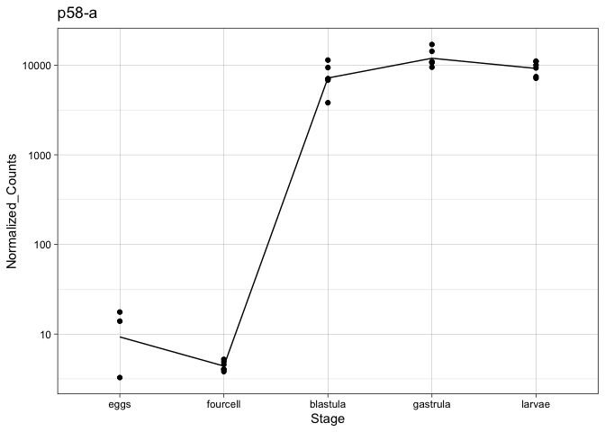<!-- -->

``` r
# Ets1/2
# separate out row number
gene<- EL.ortho.GRN.counts[2,]
# OG0000751 TRINITY_DN30130_c0_g1
gene_samp <- gene[,c(3:29)]
# transpose
t.gene_samp <- as.data.frame(t(gene_samp))
# add in other info for graphing 
t.gene_samp_info <- cbind(Sample_info, t.gene_samp)
rownames(t.gene_samp_info) <- NULL
colnames(t.gene_samp_info) <- c("Sample", "Stage", "Temp", "Normalized_Counts")
t.gene_samp_info$Stage <- factor(t.gene_samp_info$Stage,
    levels = c('eggs','fourcell', "blastula", "gastrula", "larvae"),ordered = TRUE)
Ets1_2_point <- ggplot(t.gene_samp_info, aes(x=Stage, y=Normalized_Counts, group =Stage)) + 
  geom_point() + stat_summary(fun=mean, geom="line", aes(group=1)) + theme_linedraw() + ggtitle("Ets1_2") + scale_y_continuous(trans='log10')
Ets1_2_point
```

<!-- -->

``` r
# FoxQ2_1 
# separate out row number 
gene <- EL.ortho.GRN.counts[3,]
# 
gene_samp <- gene[,c(3:29)]
# transpose
t.gene_samp <- as.data.frame(t(gene_samp))
# add in other info for graphing 
t.gene_samp_info <- cbind(Sample_info, t.gene_samp)
rownames(t.gene_samp_info) <- NULL
colnames(t.gene_samp_info) <- c("Sample", "Stage", "Temp", "Normalized_Counts")
t.gene_samp_info$Stage <- factor(t.gene_samp_info$Stage,
    levels = c('eggs','fourcell', "blastula", "gastrula", "larvae"),ordered = TRUE)
FoxQ2_1_point <- ggplot(t.gene_samp_info, aes(x=Stage, y=Normalized_Counts, group =Stage)) + 
  geom_point() + stat_summary(fun=mean, geom="line", aes(group=1)) + theme_linedraw() + ggtitle("FoxQ2_1") + scale_y_continuous(trans='log10')
FoxQ2_1_point
```

<!-- -->

``` r
# Erg
# separate out row number 
gene <- EL.ortho.GRN.counts[4,]
# 
gene_samp <- gene[,c(3:29)]
# transpose
t.gene_samp <- as.data.frame(t(gene_samp))
# add in other info for graphing 
t.gene_samp_info <- cbind(Sample_info, t.gene_samp)
rownames(t.gene_samp_info) <- NULL
colnames(t.gene_samp_info) <- c("Sample", "Stage", "Temp", "Normalized_Counts")
t.gene_samp_info$Stage <- factor(t.gene_samp_info$Stage,
    levels = c('eggs','fourcell', "blastula", "gastrula", "larvae"),ordered = TRUE)
Erg_point <- ggplot(t.gene_samp_info, aes(x=Stage, y=Normalized_Counts, group =Stage)) + 
  geom_point() + stat_summary(fun=mean, geom="line", aes(group=1)) + theme_linedraw() + ggtitle("Erg") + scale_y_continuous(trans='log10')
Erg_point
```

<!-- -->

``` r
# Ttrspn_19
# separate out row number
gene <- EL.ortho.GRN.counts[5,]
# 
gene_samp <- gene[,c(3:29)]
# transpose
t.gene_samp <- as.data.frame(t(gene_samp))
# add in other info for graphing 
t.gene_samp_info <- cbind(Sample_info, t.gene_samp)
rownames(t.gene_samp_info) <- NULL
colnames(t.gene_samp_info) <- c("Sample", "Stage", "Temp", "Normalized_Counts")
t.gene_samp_info$Stage <- factor(t.gene_samp_info$Stage,
    levels = c('eggs','fourcell', "blastula", "gastrula", "larvae"),ordered = TRUE)
Ttrspn_19_point <- ggplot(t.gene_samp_info, aes(x=Stage, y=Normalized_Counts, group =Stage)) + 
  geom_point() + stat_summary(fun=mean, geom="line", aes(group=1)) + theme_linedraw() + ggtitle("Ttrspn_19") + scale_y_continuous(trans='log10')
Ttrspn_19_point
```

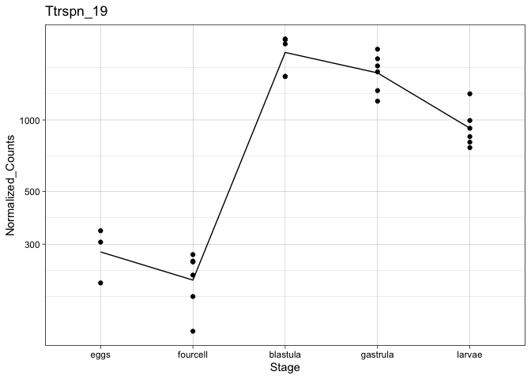<!-- -->

``` r
# Cara7LA
# separate out row number
gene <- EL.ortho.GRN.counts[6,]
# 
gene_samp <- gene[,c(3:29)]
# transpose
t.gene_samp <- as.data.frame(t(gene_samp))
# add in other info for graphing 
t.gene_samp_info <- cbind(Sample_info, t.gene_samp)
rownames(t.gene_samp_info) <- NULL
colnames(t.gene_samp_info) <- c("Sample", "Stage", "Temp", "Normalized_Counts")
t.gene_samp_info$Stage <- factor(t.gene_samp_info$Stage,
    levels = c('eggs','fourcell', "blastula", "gastrula", "larvae"),ordered = TRUE)
Cara7LA_point <- ggplot(t.gene_samp_info, aes(x=Stage, y=Normalized_Counts, group =Stage)) + 
  geom_point() + stat_summary(fun=mean, geom="line", aes(group=1)) + theme_linedraw() + ggtitle("TCara7LA") + scale_y_continuous(trans='log10')
Cara7LA_point 
```

    ## Warning: Transformation introduced infinite values in continuous y-axis
    
    ## Warning: Transformation introduced infinite values in continuous y-axis

    ## Warning: Removed 1 rows containing non-finite values (stat_summary).

<!-- -->

problem with the not gene, it has two EL genes that are a part of the
same orthogroup, I will have to make separate graphs to preserve the
information

``` r
# OG0002162 TRINITY_DN48762_c0_g1
# first not gene graph
# separate out row number
gene <- EL.ortho.GRN.counts[7,]
#
gene_samp <- gene[,c(3:29)]
# transpose
t.gene_samp <- as.data.frame(t(gene_samp))
# add in other info for graphing 
t.gene_samp_info <- cbind(Sample_info, t.gene_samp)
rownames(t.gene_samp_info) <- NULL
colnames(t.gene_samp_info) <- c("Sample", "Stage", "Temp", "Normalized_Counts")
t.gene_samp_info$Stage <- factor(t.gene_samp_info$Stage,
    levels = c('eggs','fourcell', "blastula", "gastrula", "larvae"),ordered = TRUE)
TRINITY_DN48762_c0_g1_not_point <- ggplot(t.gene_samp_info, aes(x=Stage, y=Normalized_Counts, group =Stage)) + 
  geom_point() + stat_summary(fun=mean, geom="line", aes(group=1)) + theme_linedraw() + ggtitle("TRINITY_DN48762_c0_g1_not") + scale_y_continuous(trans='log10')
TRINITY_DN48762_c0_g1_not_point
```

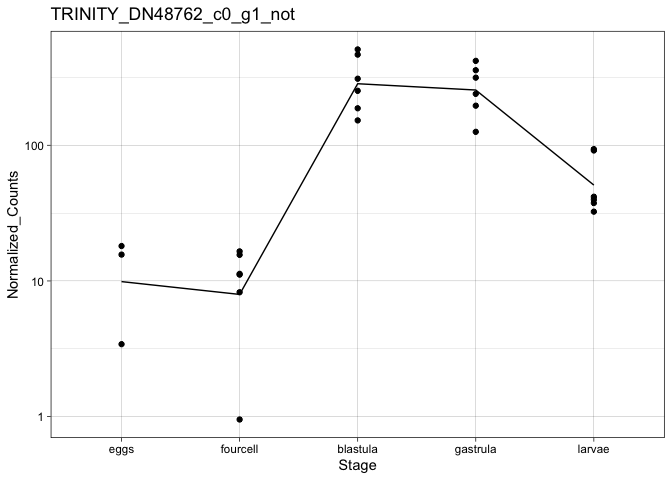<!-- -->

``` r
# OG0002162 TRINITY_DN5408_c0_g1
# second not gene graph
# separate out row number
gene <- EL.ortho.GRN.counts[8,]
#
gene_samp <- gene[,c(3:29)]
# transpose
t.gene_samp <- as.data.frame(t(gene_samp))
# add in other info for graphing 
t.gene_samp_info <- cbind(Sample_info, t.gene_samp)
rownames(t.gene_samp_info) <- NULL
colnames(t.gene_samp_info) <- c("Sample", "Stage", "Temp", "Normalized_Counts")
t.gene_samp_info$Stage <- factor(t.gene_samp_info$Stage,
    levels = c('eggs','fourcell', "blastula", "gastrula", "larvae"),ordered = TRUE)
TRINITY_DN5408_c0_g1_not_point <- ggplot(t.gene_samp_info, aes(x=Stage, y=Normalized_Counts, group =Stage)) + 
  geom_point() + stat_summary(fun=mean, geom="line", aes(group=1)) + theme_linedraw() + ggtitle("TRINITY_DN5408_c0_g1_not") + scale_y_continuous(trans='log10')
TRINITY_DN5408_c0_g1_not_point
```

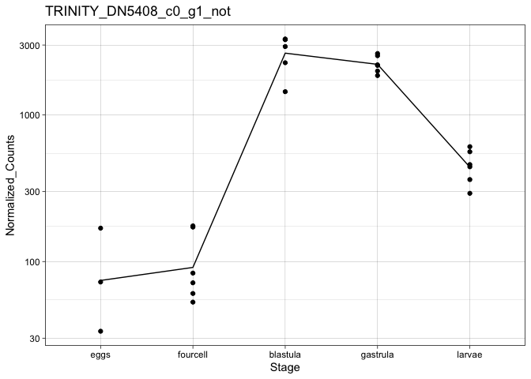<!-- -->

``` r
# Eve
# separate out row number
gene <- EL.ortho.GRN.counts[9,]
#
gene_samp <- gene[,c(3:29)]
# transpose
t.gene_samp <- as.data.frame(t(gene_samp))
# add in other info for graphing 
t.gene_samp_info <- cbind(Sample_info, t.gene_samp)
rownames(t.gene_samp_info) <- NULL
colnames(t.gene_samp_info) <- c("Sample", "Stage", "Temp", "Normalized_Counts")
t.gene_samp_info$Stage <- factor(t.gene_samp_info$Stage,
    levels = c('eggs','fourcell', "blastula", "gastrula", "larvae"),ordered = TRUE)
Eve_point <- ggplot(t.gene_samp_info, aes(x=Stage, y=Normalized_Counts, group =Stage)) + 
  geom_point() + stat_summary(fun=mean, geom="line", aes(group=1)) + theme_linedraw() + ggtitle("Eve") + scale_y_continuous(trans='log10')
Eve_point
```

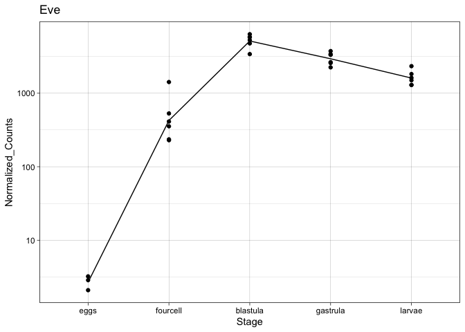<!-- -->

``` r
# Blimp1
# separate out row number
gene <- EL.ortho.GRN.counts[10,]
#
gene_samp <- gene[,c(3:29)]
# transpose
t.gene_samp <- as.data.frame(t(gene_samp))
# add in other info for graphing 
t.gene_samp_info <- cbind(Sample_info, t.gene_samp)
rownames(t.gene_samp_info) <- NULL
colnames(t.gene_samp_info) <- c("Sample", "Stage", "Temp", "Normalized_Counts")
t.gene_samp_info$Stage <- factor(t.gene_samp_info$Stage,
    levels = c('eggs','fourcell', "blastula", "gastrula", "larvae"),ordered = TRUE)
Blimp1_point <- ggplot(t.gene_samp_info, aes(x=Stage, y=Normalized_Counts, group =Stage)) + 
  geom_point() + stat_summary(fun=mean, geom="line", aes(group=1)) + theme_linedraw() + ggtitle("Blimp1") + scale_y_continuous(trans='log10')
Blimp1_point
```

<!-- -->

``` r
# RhoA
# separate out row number
gene <- EL.ortho.GRN.counts[11,]
#
gene_samp <- gene[,c(3:29)]
# transpose
t.gene_samp <- as.data.frame(t(gene_samp))
# add in other info for graphing 
t.gene_samp_info <- cbind(Sample_info, t.gene_samp)
rownames(t.gene_samp_info) <- NULL
colnames(t.gene_samp_info) <- c("Sample", "Stage", "Temp", "Normalized_Counts")
t.gene_samp_info$Stage <- factor(t.gene_samp_info$Stage,
    levels = c('eggs','fourcell', "blastula", "gastrula", "larvae"),ordered = TRUE)
RhoA_point <- ggplot(t.gene_samp_info, aes(x=Stage, y=Normalized_Counts, group =Stage)) + 
  geom_point() + stat_summary(fun=mean, geom="line", aes(group=1)) + theme_linedraw() + ggtitle("RhoA") + scale_y_continuous(trans='log10')
RhoA_point
```

<!-- -->

``` r
# Gcm
# separate out row number
gene <- EL.ortho.GRN.counts[12,]
#
gene_samp <- gene[,c(3:29)]
# transpose
t.gene_samp <- as.data.frame(t(gene_samp))
# add in other info for graphing 
t.gene_samp_info <- cbind(Sample_info, t.gene_samp)
rownames(t.gene_samp_info) <- NULL
colnames(t.gene_samp_info) <- c("Sample", "Stage", "Temp", "Normalized_Counts")
t.gene_samp_info$Stage <- factor(t.gene_samp_info$Stage,
    levels = c('eggs','fourcell', "blastula", "gastrula", "larvae"),ordered = TRUE)
Gcm_point <- ggplot(t.gene_samp_info, aes(x=Stage, y=Normalized_Counts, group =Stage)) + 
  geom_point() + stat_summary(fun=mean, geom="line", aes(group=1)) + theme_linedraw() + ggtitle("Gcm") + scale_y_continuous(trans='log10')
Gcm_point
```

<!-- -->

``` r
# Sm37
# separate out row number
gene <- EL.ortho.GRN.counts[13,]
#
gene_samp <- gene[,c(3:29)]
# transpose
t.gene_samp <- as.data.frame(t(gene_samp))
# add in other info for graphing 
t.gene_samp_info <- cbind(Sample_info, t.gene_samp)
rownames(t.gene_samp_info) <- NULL
colnames(t.gene_samp_info) <- c("Sample", "Stage", "Temp", "Normalized_Counts")
t.gene_samp_info$Stage <- factor(t.gene_samp_info$Stage,
    levels = c('eggs','fourcell', "blastula", "gastrula", "larvae"),ordered = TRUE)
Sm37_point <- ggplot(t.gene_samp_info, aes(x=Stage, y=Normalized_Counts, group =Stage)) + 
  geom_point() + stat_summary(fun=mean, geom="line", aes(group=1)) + theme_linedraw() + ggtitle("Sm37") + scale_y_continuous(trans='log10')
Sm37_point
```

<!-- -->

``` r
# Otx
# separate out row number
gene <- EL.ortho.GRN.counts[14,]
#
gene_samp <- gene[,c(3:29)]
# transpose
t.gene_samp <- as.data.frame(t(gene_samp))
# add in other info for graphing 
t.gene_samp_info <- cbind(Sample_info, t.gene_samp)
rownames(t.gene_samp_info) <- NULL
colnames(t.gene_samp_info) <- c("Sample", "Stage", "Temp", "Normalized_Counts")
t.gene_samp_info$Stage <- factor(t.gene_samp_info$Stage,
    levels = c('eggs','fourcell', "blastula", "gastrula", "larvae"),ordered = TRUE)
Otx_point <- ggplot(t.gene_samp_info, aes(x=Stage, y=Normalized_Counts, group =Stage)) + 
  geom_point() + stat_summary(fun=mean, geom="line", aes(group=1)) + theme_linedraw() + ggtitle("Otx") + scale_y_continuous(trans='log10')
Otx_point
```

<!-- -->

``` r
# Pks2
# separate out row number
gene <- EL.ortho.GRN.counts[15,]
#
gene_samp <- gene[,c(3:29)]
# transpose
t.gene_samp <- as.data.frame(t(gene_samp))
# add in other info for graphing 
t.gene_samp_info <- cbind(Sample_info, t.gene_samp)
rownames(t.gene_samp_info) <- NULL
colnames(t.gene_samp_info) <- c("Sample", "Stage", "Temp", "Normalized_Counts")
t.gene_samp_info$Stage <- factor(t.gene_samp_info$Stage,
    levels = c('eggs','fourcell', "blastula", "gastrula", "larvae"),ordered = TRUE)
Pks2_point <- ggplot(t.gene_samp_info, aes(x=Stage, y=Normalized_Counts, group =Stage)) + 
  geom_point() + stat_summary(fun=mean, geom="line", aes(group=1)) + theme_linedraw() + ggtitle("Pks2") + scale_y_continuous(trans='log10')
Pks2_point
```

<!-- -->

``` r
# Tbr
# separate out row number
gene <- EL.ortho.GRN.counts[16,]
#
gene_samp <- gene[,c(3:29)]
# transpose
t.gene_samp <- as.data.frame(t(gene_samp))
# add in other info for graphing 
t.gene_samp_info <- cbind(Sample_info, t.gene_samp)
rownames(t.gene_samp_info) <- NULL
colnames(t.gene_samp_info) <- c("Sample", "Stage", "Temp", "Normalized_Counts")
t.gene_samp_info$Stage <- factor(t.gene_samp_info$Stage,
    levels = c('eggs','fourcell', "blastula", "gastrula", "larvae"),ordered = TRUE)
Tbr_point <- ggplot(t.gene_samp_info, aes(x=Stage, y=Normalized_Counts, group =Stage)) + 
  geom_point() + stat_summary(fun=mean, geom="line", aes(group=1)) + theme_linedraw() + ggtitle("Tbr") + scale_y_continuous(trans='log10')
Tbr_point
```

<!-- -->

``` r
# Tel
# separate out row number
gene <- EL.ortho.GRN.counts[17,]
#
gene_samp <- gene[,c(3:29)]
# transpose
t.gene_samp <- as.data.frame(t(gene_samp))
# add in other info for graphing 
t.gene_samp_info <- cbind(Sample_info, t.gene_samp)
rownames(t.gene_samp_info) <- NULL
colnames(t.gene_samp_info) <- c("Sample", "Stage", "Temp", "Normalized_Counts")
t.gene_samp_info$Stage <- factor(t.gene_samp_info$Stage,
    levels = c('eggs','fourcell', "blastula", "gastrula", "larvae"),ordered = TRUE)
Tel_point <- ggplot(t.gene_samp_info, aes(x=Stage, y=Normalized_Counts, group =Stage)) + 
  geom_point() + stat_summary(fun=mean, geom="line", aes(group=1)) + theme_linedraw() + ggtitle("Tel") + scale_y_continuous(trans='log10')
Tel_point
```

<!-- -->

``` r
# Sp5
# separate out row number
gene <- EL.ortho.GRN.counts[18,]
#
gene_samp <- gene[,c(3:29)]
# transpose
t.gene_samp <- as.data.frame(t(gene_samp))
# add in other info for graphing 
t.gene_samp_info <- cbind(Sample_info, t.gene_samp)
rownames(t.gene_samp_info) <- NULL
colnames(t.gene_samp_info) <- c("Sample", "Stage", "Temp", "Normalized_Counts")
t.gene_samp_info$Stage <- factor(t.gene_samp_info$Stage,
    levels = c('eggs','fourcell', "blastula", "gastrula", "larvae"),ordered = TRUE)
Sp5_point <- ggplot(t.gene_samp_info, aes(x=Stage, y=Normalized_Counts, group =Stage)) + 
  geom_point() + stat_summary(fun=mean, geom="line", aes(group=1)) + theme_linedraw() + ggtitle("Sp5") + scale_y_continuous(trans='log10')
Sp5_point
```

<!-- -->

``` r
# Myc
# separate out row number
gene <- EL.ortho.GRN.counts[19,]
#
gene_samp <- gene[,c(3:29)]
# transpose
t.gene_samp <- as.data.frame(t(gene_samp))
# add in other info for graphing 
t.gene_samp_info <- cbind(Sample_info, t.gene_samp)
rownames(t.gene_samp_info) <- NULL
colnames(t.gene_samp_info) <- c("Sample", "Stage", "Temp", "Normalized_Counts")
t.gene_samp_info$Stage <- factor(t.gene_samp_info$Stage,
    levels = c('eggs','fourcell', "blastula", "gastrula", "larvae"),ordered = TRUE)
Myc_point <- ggplot(t.gene_samp_info, aes(x=Stage, y=Normalized_Counts, group =Stage)) + 
  geom_point() + stat_summary(fun=mean, geom="line", aes(group=1)) + theme_linedraw() + ggtitle("Myc") + scale_y_continuous(trans='log10')
Myc_point
```

<!-- -->

``` r
# Cycpln
# separate out row number
gene <- EL.ortho.GRN.counts[20,]
#
gene_samp <- gene[,c(3:29)]
# transpose
t.gene_samp <- as.data.frame(t(gene_samp))
# add in other info for graphing 
t.gene_samp_info <- cbind(Sample_info, t.gene_samp)
rownames(t.gene_samp_info) <- NULL
colnames(t.gene_samp_info) <- c("Sample", "Stage", "Temp", "Normalized_Counts")
t.gene_samp_info$Stage <- factor(t.gene_samp_info$Stage,
    levels = c('eggs','fourcell', "blastula", "gastrula", "larvae"),ordered = TRUE)
Cycpln_point <- ggplot(t.gene_samp_info, aes(x=Stage, y=Normalized_Counts, group =Stage)) + 
  geom_point() + stat_summary(fun=mean, geom="line", aes(group=1)) + theme_linedraw() + ggtitle("Cycpln") + scale_y_continuous(trans='log10')
Cycpln_point
```

<!-- -->

``` r
# IrxA
# separate out row number
gene <- EL.ortho.GRN.counts[21,]
#
gene_samp <- gene[,c(3:29)]
# transpose
t.gene_samp <- as.data.frame(t(gene_samp))
# add in other info for graphing 
t.gene_samp_info <- cbind(Sample_info, t.gene_samp)
rownames(t.gene_samp_info) <- NULL
colnames(t.gene_samp_info) <- c("Sample", "Stage", "Temp", "Normalized_Counts")
t.gene_samp_info$Stage <- factor(t.gene_samp_info$Stage,
    levels = c('eggs','fourcell', "blastula", "gastrula", "larvae"),ordered = TRUE)
IrxA_point <- ggplot(t.gene_samp_info, aes(x=Stage, y=Normalized_Counts, group =Stage)) + 
  geom_point() + stat_summary(fun=mean, geom="line", aes(group=1)) + theme_linedraw() + ggtitle("IrxA") + scale_y_continuous(trans='log10')
IrxA_point
```

<!-- -->

``` r
# Wnt5
# separate out row number
gene <- EL.ortho.GRN.counts[22,]
#
gene_samp <- gene[,c(3:29)]
# transpose
t.gene_samp <- as.data.frame(t(gene_samp))
# add in other info for graphing 
t.gene_samp_info <- cbind(Sample_info, t.gene_samp)
rownames(t.gene_samp_info) <- NULL
colnames(t.gene_samp_info) <- c("Sample", "Stage", "Temp", "Normalized_Counts")
t.gene_samp_info$Stage <- factor(t.gene_samp_info$Stage,
    levels = c('eggs','fourcell', "blastula", "gastrula", "larvae"),ordered = TRUE)
Wnt5_point <- ggplot(t.gene_samp_info, aes(x=Stage, y=Normalized_Counts, group =Stage)) + 
  geom_point() + stat_summary(fun=mean, geom="line", aes(group=1)) + theme_linedraw() + ggtitle("Wnt5") + scale_y_continuous(trans='log10')
Wnt5_point
```

<!-- -->

``` r
#   Emx
# separate out row number
gene <- EL.ortho.GRN.counts[23,]
#
gene_samp <- gene[,c(3:29)]
# transpose
t.gene_samp <- as.data.frame(t(gene_samp))
# add in other info for graphing 
t.gene_samp_info <- cbind(Sample_info, t.gene_samp)
rownames(t.gene_samp_info) <- NULL
colnames(t.gene_samp_info) <- c("Sample", "Stage", "Temp", "Normalized_Counts")
t.gene_samp_info$Stage <- factor(t.gene_samp_info$Stage,
    levels = c('eggs','fourcell', "blastula", "gastrula", "larvae"),ordered = TRUE)
Emx_point <- ggplot(t.gene_samp_info, aes(x=Stage, y=Normalized_Counts, group =Stage)) + 
  geom_point() + stat_summary(fun=mean, geom="line", aes(group=1)) + theme_linedraw() + ggtitle("Emx") + scale_y_continuous(trans='log10')
Emx_point
```

<!-- -->

``` r
# Wnt1
# separate out row number
gene <- EL.ortho.GRN.counts[24,]
#
gene_samp <- gene[,c(3:29)]
# transpose
t.gene_samp <- as.data.frame(t(gene_samp))
# add in other info for graphing 
t.gene_samp_info <- cbind(Sample_info, t.gene_samp)
rownames(t.gene_samp_info) <- NULL
colnames(t.gene_samp_info) <- c("Sample", "Stage", "Temp", "Normalized_Counts")
t.gene_samp_info$Stage <- factor(t.gene_samp_info$Stage,
    levels = c('eggs','fourcell', "blastula", "gastrula", "larvae"),ordered = TRUE)
Wnt1_point <- ggplot(t.gene_samp_info, aes(x=Stage, y=Normalized_Counts, group =Stage)) + 
  geom_point() + stat_summary(fun=mean, geom="line", aes(group=1)) + theme_linedraw() + ggtitle("Wnt1") + scale_y_continuous(trans='log10')
Wnt1_point
```

<!-- -->

``` r
# Wnt16
# separate out row number
gene <- EL.ortho.GRN.counts[25,]
#
gene_samp <- gene[,c(3:29)]
# transpose
t.gene_samp <- as.data.frame(t(gene_samp))
# add in other info for graphing 
t.gene_samp_info <- cbind(Sample_info, t.gene_samp)
rownames(t.gene_samp_info) <- NULL
colnames(t.gene_samp_info) <- c("Sample", "Stage", "Temp", "Normalized_Counts")
t.gene_samp_info$Stage <- factor(t.gene_samp_info$Stage,
    levels = c('eggs','fourcell', "blastula", "gastrula", "larvae"),ordered = TRUE)
Wnt16_point <- ggplot(t.gene_samp_info, aes(x=Stage, y=Normalized_Counts, group =Stage)) + 
  geom_point() + stat_summary(fun=mean, geom="line", aes(group=1)) + theme_linedraw() + ggtitle("Wnt16") + scale_y_continuous(trans='log10')
Wnt16_point
```

<!-- -->

``` r
# Sm29
# separate out row number
gene <- EL.ortho.GRN.counts[26,]
#
gene_samp <- gene[,c(3:29)]
# transpose
t.gene_samp <- as.data.frame(t(gene_samp))
# add in other info for graphing 
t.gene_samp_info <- cbind(Sample_info, t.gene_samp)
rownames(t.gene_samp_info) <- NULL
colnames(t.gene_samp_info) <- c("Sample", "Stage", "Temp", "Normalized_Counts")
t.gene_samp_info$Stage <- factor(t.gene_samp_info$Stage,
    levels = c('eggs','fourcell', "blastula", "gastrula", "larvae"),ordered = TRUE)
Sm29_point <- ggplot(t.gene_samp_info, aes(x=Stage, y=Normalized_Counts, group =Stage)) + 
  geom_point() + stat_summary(fun=mean, geom="line", aes(group=1)) + theme_linedraw() + ggtitle("Sm29") + scale_y_continuous(trans='log10')
Sm29_point
```

<!-- -->

``` r
# p58-b
# separate out row number
gene <- EL.ortho.GRN.counts[27,]
#
gene_samp <- gene[,c(3:29)]
# transpose
t.gene_samp <- as.data.frame(t(gene_samp))
# add in other info for graphing 
t.gene_samp_info <- cbind(Sample_info, t.gene_samp)
rownames(t.gene_samp_info) <- NULL
colnames(t.gene_samp_info) <- c("Sample", "Stage", "Temp", "Normalized_Counts")
t.gene_samp_info$Stage <- factor(t.gene_samp_info$Stage,
    levels = c('eggs','fourcell', "blastula", "gastrula", "larvae"),ordered = TRUE)
p58_b_point <- ggplot(t.gene_samp_info, aes(x=Stage, y=Normalized_Counts, group =Stage)) + 
  geom_point() + stat_summary(fun=mean, geom="line", aes(group=1)) + theme_linedraw() + ggtitle("p58-b") + scale_y_continuous(trans='log10')
p58_b_point
```

<!-- -->

``` r
# Wnt4
# separate out row number
gene <- EL.ortho.GRN.counts[28,]
#
gene_samp <- gene[,c(3:29)]
# transpose
t.gene_samp <- as.data.frame(t(gene_samp))
# add in other info for graphing 
t.gene_samp_info <- cbind(Sample_info, t.gene_samp)
rownames(t.gene_samp_info) <- NULL
colnames(t.gene_samp_info) <- c("Sample", "Stage", "Temp", "Normalized_Counts")
t.gene_samp_info$Stage <- factor(t.gene_samp_info$Stage,
    levels = c('eggs','fourcell', "blastula", "gastrula", "larvae"),ordered = TRUE)
Wnt4_point <- ggplot(t.gene_samp_info, aes(x=Stage, y=Normalized_Counts, group =Stage)) + 
  geom_point() + stat_summary(fun=mean, geom="line", aes(group=1)) + theme_linedraw() + ggtitle("Wnt4") + scale_y_continuous(trans='log10')
Wnt4_point
```

<!-- -->

``` r
# Delta
# separate out row number
gene <- EL.ortho.GRN.counts[29,]
#
gene_samp <- gene[,c(3:29)]
# transpose
t.gene_samp <- as.data.frame(t(gene_samp))
# add in other info for graphing 
t.gene_samp_info <- cbind(Sample_info, t.gene_samp)
rownames(t.gene_samp_info) <- NULL
colnames(t.gene_samp_info) <- c("Sample", "Stage", "Temp", "Normalized_Counts")
t.gene_samp_info$Stage <- factor(t.gene_samp_info$Stage,
    levels = c('eggs','fourcell', "blastula", "gastrula", "larvae"),ordered = TRUE)
Delta_point <- ggplot(t.gene_samp_info, aes(x=Stage, y=Normalized_Counts, group =Stage)) + 
  geom_point() + stat_summary(fun=mean, geom="line", aes(group=1)) + theme_linedraw() + ggtitle("Delta") + scale_y_continuous(trans='log10')
Delta_point
```

<!-- -->

``` r
# FoxG
# separate out row number
gene <- EL.ortho.GRN.counts[30,]
#
gene_samp <- gene[,c(3:29)]
# transpose
t.gene_samp <- as.data.frame(t(gene_samp))
# add in other info for graphing 
t.gene_samp_info <- cbind(Sample_info, t.gene_samp)
rownames(t.gene_samp_info) <- NULL
colnames(t.gene_samp_info) <- c("Sample", "Stage", "Temp", "Normalized_Counts")
t.gene_samp_info$Stage <- factor(t.gene_samp_info$Stage,
    levels = c('eggs','fourcell', "blastula", "gastrula", "larvae"),ordered = TRUE)
FoxG_point <- ggplot(t.gene_samp_info, aes(x=Stage, y=Normalized_Counts, group =Stage)) + 
  geom_point() + stat_summary(fun=mean, geom="line", aes(group=1)) + theme_linedraw() + ggtitle("FoxG") + scale_y_continuous(trans='log10')
FoxG_point
```

<!-- -->

``` r
# GataC
# separate out row number
gene <- EL.ortho.GRN.counts[31,]
#
gene_samp <- gene[,c(3:29)]
# transpose
t.gene_samp <- as.data.frame(t(gene_samp))
# add in other info for graphing 
t.gene_samp_info <- cbind(Sample_info, t.gene_samp)
rownames(t.gene_samp_info) <- NULL
colnames(t.gene_samp_info) <- c("Sample", "Stage", "Temp", "Normalized_Counts")
t.gene_samp_info$Stage <- factor(t.gene_samp_info$Stage,
    levels = c('eggs','fourcell', "blastula", "gastrula", "larvae"),ordered = TRUE)
GataC_point <- ggplot(t.gene_samp_info, aes(x=Stage, y=Normalized_Counts, group =Stage)) + 
  geom_point() + stat_summary(fun=mean, geom="line", aes(group=1)) + theme_linedraw() + ggtitle("GataC") + scale_y_continuous(trans='log10')
GataC_point
```

    ## Warning: Transformation introduced infinite values in continuous y-axis
    
    ## Warning: Transformation introduced infinite values in continuous y-axis

    ## Warning: Removed 5 rows containing non-finite values (stat_summary).

<!-- -->

``` r
# ScratchX
# separate out row number
gene <- EL.ortho.GRN.counts[32,]
#
gene_samp <- gene[,c(3:29)]
# transpose
t.gene_samp <- as.data.frame(t(gene_samp))
# add in other info for graphing 
t.gene_samp_info <- cbind(Sample_info, t.gene_samp)
rownames(t.gene_samp_info) <- NULL
colnames(t.gene_samp_info) <- c("Sample", "Stage", "Temp", "Normalized_Counts")
t.gene_samp_info$Stage <- factor(t.gene_samp_info$Stage,
    levels = c('eggs','fourcell', "blastula", "gastrula", "larvae"),ordered = TRUE)
ScratchX_point <- ggplot(t.gene_samp_info, aes(x=Stage, y=Normalized_Counts, group =Stage)) + 
  geom_point() + stat_summary(fun=mean, geom="line", aes(group=1)) + theme_linedraw() + ggtitle("ScratchX") + scale_y_continuous(trans='log10')
ScratchX_point
```

    ## Warning: Transformation introduced infinite values in continuous y-axis
    
    ## Warning: Transformation introduced infinite values in continuous y-axis

    ## Warning: Removed 5 rows containing non-finite values (stat_summary).

<!-- -->

``` r
# Msxl
# separate out row number
gene <- EL.ortho.GRN.counts[33,]
#
gene_samp <- gene[,c(3:29)]
# transpose
t.gene_samp <- as.data.frame(t(gene_samp))
# add in other info for graphing 
t.gene_samp_info <- cbind(Sample_info, t.gene_samp)
rownames(t.gene_samp_info) <- NULL
colnames(t.gene_samp_info) <- c("Sample", "Stage", "Temp", "Normalized_Counts")
t.gene_samp_info$Stage <- factor(t.gene_samp_info$Stage,
    levels = c('eggs','fourcell', "blastula", "gastrula", "larvae"),ordered = TRUE)
Msxl_point <- ggplot(t.gene_samp_info, aes(x=Stage, y=Normalized_Counts, group =Stage)) + 
  geom_point() + stat_summary(fun=mean, geom="line", aes(group=1)) + theme_linedraw() + ggtitle("Msxl") + scale_y_continuous(trans='log10')
Msxl_point
```

    ## Warning: Transformation introduced infinite values in continuous y-axis
    
    ## Warning: Transformation introduced infinite values in continuous y-axis

    ## Warning: Removed 2 rows containing non-finite values (stat_summary).

<!-- -->

``` r
# FoxB
# separate out row number
gene <- EL.ortho.GRN.counts[34,]
#
gene_samp <- gene[,c(3:29)]
# transpose
t.gene_samp <- as.data.frame(t(gene_samp))
# add in other info for graphing 
t.gene_samp_info <- cbind(Sample_info, t.gene_samp)
rownames(t.gene_samp_info) <- NULL
colnames(t.gene_samp_info) <- c("Sample", "Stage", "Temp", "Normalized_Counts")
t.gene_samp_info$Stage <- factor(t.gene_samp_info$Stage,
    levels = c('eggs','fourcell', "blastula", "gastrula", "larvae"),ordered = TRUE)
FoxB_point <- ggplot(t.gene_samp_info, aes(x=Stage, y=Normalized_Counts, group =Stage)) + 
  geom_point() + stat_summary(fun=mean, geom="line", aes(group=1)) + theme_linedraw() + ggtitle("FoxB") + scale_y_continuous(trans='log10')
FoxB_point
```

    ## Warning: Transformation introduced infinite values in continuous y-axis
    
    ## Warning: Transformation introduced infinite values in continuous y-axis

    ## Warning: Removed 4 rows containing non-finite values (stat_summary).

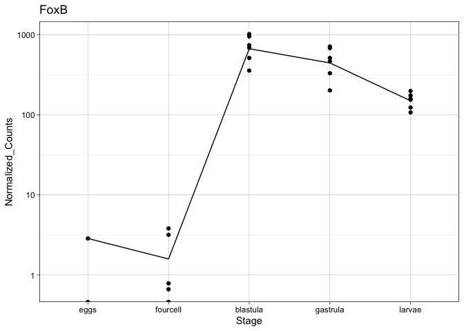<!-- -->

``` r
# Endo16
# separate out row number
gene <- EL.ortho.GRN.counts[35,]
#
gene_samp <- gene[,c(3:29)]
# transpose
t.gene_samp <- as.data.frame(t(gene_samp))
# add in other info for graphing 
t.gene_samp_info <- cbind(Sample_info, t.gene_samp)
rownames(t.gene_samp_info) <- NULL
colnames(t.gene_samp_info) <- c("Sample", "Stage", "Temp", "Normalized_Counts")
t.gene_samp_info$Stage <- factor(t.gene_samp_info$Stage,
    levels = c('eggs','fourcell', "blastula", "gastrula", "larvae"),ordered = TRUE)
Endo16_point <- ggplot(t.gene_samp_info, aes(x=Stage, y=Normalized_Counts, group =Stage)) + 
  geom_point() + stat_summary(fun=mean, geom="line", aes(group=1)) + theme_linedraw() + ggtitle("Endo16") + scale_y_continuous(trans='log10')
Endo16_point
```

<!-- -->

``` r
#   E2f3
# separate out row number
gene <- EL.ortho.GRN.counts[36,]
#
gene_samp <- gene[,c(3:29)]
# transpose
t.gene_samp <- as.data.frame(t(gene_samp))
# add in other info for graphing 
t.gene_samp_info <- cbind(Sample_info, t.gene_samp)
rownames(t.gene_samp_info) <- NULL
colnames(t.gene_samp_info) <- c("Sample", "Stage", "Temp", "Normalized_Counts")
t.gene_samp_info$Stage <- factor(t.gene_samp_info$Stage,
    levels = c('eggs','fourcell', "blastula", "gastrula", "larvae"),ordered = TRUE)
E2f3_point <- ggplot(t.gene_samp_info, aes(x=Stage, y=Normalized_Counts, group =Stage)) + 
  geom_point() + stat_summary(fun=mean, geom="line", aes(group=1)) + theme_linedraw() + ggtitle("E2f3") + scale_y_continuous(trans='log10')
E2f3_point
```

<!-- -->

``` r
# Nodal
# separate out row number
gene <- EL.ortho.GRN.counts[37,]
#
gene_samp <- gene[,c(3:29)]
# transpose
t.gene_samp <- as.data.frame(t(gene_samp))
# add in other info for graphing 
t.gene_samp_info <- cbind(Sample_info, t.gene_samp)
rownames(t.gene_samp_info) <- NULL
colnames(t.gene_samp_info) <- c("Sample", "Stage", "Temp", "Normalized_Counts")
t.gene_samp_info$Stage <- factor(t.gene_samp_info$Stage,
    levels = c('eggs','fourcell', "blastula", "gastrula", "larvae"),ordered = TRUE)
Nodal_point <- ggplot(t.gene_samp_info, aes(x=Stage, y=Normalized_Counts, group =Stage)) + 
  geom_point() + stat_summary(fun=mean, geom="line", aes(group=1)) + theme_linedraw() + ggtitle("Nodal") + scale_y_continuous(trans='log10')
Nodal_point
```

<!-- -->

``` r
# Chordin
# separate out row number
gene <- EL.ortho.GRN.counts[38,]
#
gene_samp <- gene[,c(3:29)]
# transpose
t.gene_samp <- as.data.frame(t(gene_samp))
# add in other info for graphing 
t.gene_samp_info <- cbind(Sample_info, t.gene_samp)
rownames(t.gene_samp_info) <- NULL
colnames(t.gene_samp_info) <- c("Sample", "Stage", "Temp", "Normalized_Counts")
t.gene_samp_info$Stage <- factor(t.gene_samp_info$Stage,
    levels = c('eggs','fourcell', "blastula", "gastrula", "larvae"),ordered = TRUE)
Chordin_point <- ggplot(t.gene_samp_info, aes(x=Stage, y=Normalized_Counts, group =Stage)) + 
  geom_point() + stat_summary(fun=mean, geom="line", aes(group=1)) + theme_linedraw() + ggtitle("Chordin") + scale_y_continuous(trans='log10')
Chordin_point
```

<!-- -->

``` r
# Wnt8
# separate out row number
gene <- EL.ortho.GRN.counts[39,]
#
gene_samp <- gene[,c(3:29)]
# transpose
t.gene_samp <- as.data.frame(t(gene_samp))
# add in other info for graphing 
t.gene_samp_info <- cbind(Sample_info, t.gene_samp)
rownames(t.gene_samp_info) <- NULL
colnames(t.gene_samp_info) <- c("Sample", "Stage", "Temp", "Normalized_Counts")
t.gene_samp_info$Stage <- factor(t.gene_samp_info$Stage,
    levels = c('eggs','fourcell', "blastula", "gastrula", "larvae"),ordered = TRUE)
Wnt8_point <- ggplot(t.gene_samp_info, aes(x=Stage, y=Normalized_Counts, group =Stage)) + 
  geom_point() + stat_summary(fun=mean, geom="line", aes(group=1)) + theme_linedraw() + ggtitle("Wnt8") + scale_y_continuous(trans='log10')
Wnt8_point
```

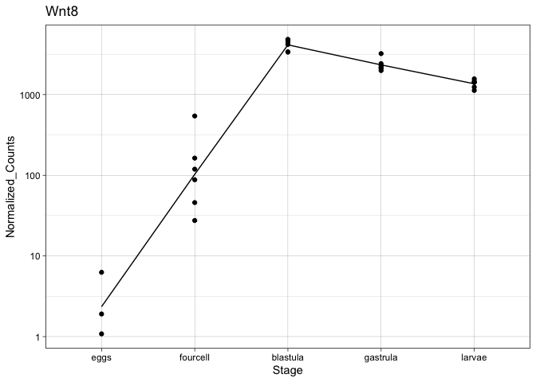<!-- -->

``` r
# Tgif
# separate out row number
gene <- EL.ortho.GRN.counts[40,]
#
gene_samp <- gene[,c(3:29)]
# transpose
t.gene_samp <- as.data.frame(t(gene_samp))
# add in other info for graphing 
t.gene_samp_info <- cbind(Sample_info, t.gene_samp)
rownames(t.gene_samp_info) <- NULL
colnames(t.gene_samp_info) <- c("Sample", "Stage", "Temp", "Normalized_Counts")
t.gene_samp_info$Stage <- factor(t.gene_samp_info$Stage,
    levels = c('eggs','fourcell', "blastula", "gastrula", "larvae"),ordered = TRUE)
Tgif_point <- ggplot(t.gene_samp_info, aes(x=Stage, y=Normalized_Counts, group =Stage)) + 
  geom_point() + stat_summary(fun=mean, geom="line", aes(group=1)) + theme_linedraw() + ggtitle("Tgif") + scale_y_continuous(trans='log10')
Tgif_point
```

<!-- -->

``` r
# FoxA
# separate out row number
gene <- EL.ortho.GRN.counts[41,]
#
gene_samp <- gene[,c(3:29)]
# transpose
t.gene_samp <- as.data.frame(t(gene_samp))
# add in other info for graphing 
t.gene_samp_info <- cbind(Sample_info, t.gene_samp)
rownames(t.gene_samp_info) <- NULL
colnames(t.gene_samp_info) <- c("Sample", "Stage", "Temp", "Normalized_Counts")
t.gene_samp_info$Stage <- factor(t.gene_samp_info$Stage,
    levels = c('eggs','fourcell', "blastula", "gastrula", "larvae"),ordered = TRUE)
FoxA_point <- ggplot(t.gene_samp_info, aes(x=Stage, y=Normalized_Counts, group =Stage)) + 
  geom_point() + stat_summary(fun=mean, geom="line", aes(group=1)) + theme_linedraw() + ggtitle("FoxA") + scale_y_continuous(trans='log10')
FoxA_point
```

<!-- -->

``` r
# Alx1
# separate out row number
gene <- EL.ortho.GRN.counts[42,]
#
gene_samp <- gene[,c(3:29)]
# transpose
t.gene_samp <- as.data.frame(t(gene_samp))
# add in other info for graphing 
t.gene_samp_info <- cbind(Sample_info, t.gene_samp)
rownames(t.gene_samp_info) <- NULL
colnames(t.gene_samp_info) <- c("Sample", "Stage", "Temp", "Normalized_Counts")
t.gene_samp_info$Stage <- factor(t.gene_samp_info$Stage,
    levels = c('eggs','fourcell', "blastula", "gastrula", "larvae"),ordered = TRUE)
Alx1_point <- ggplot(t.gene_samp_info, aes(x=Stage, y=Normalized_Counts, group =Stage)) + 
  geom_point() + stat_summary(fun=mean, geom="line", aes(group=1)) + theme_linedraw() + ggtitle("Alx1") + scale_y_continuous(trans='log10')
Alx1_point
```

<!-- -->

``` r
# Vegf3
# separate out row number
gene <- EL.ortho.GRN.counts[43,]
#
gene_samp <- gene[,c(3:29)]
# transpose
t.gene_samp <- as.data.frame(t(gene_samp))
# add in other info for graphing 
t.gene_samp_info <- cbind(Sample_info, t.gene_samp)
rownames(t.gene_samp_info) <- NULL
colnames(t.gene_samp_info) <- c("Sample", "Stage", "Temp", "Normalized_Counts")
t.gene_samp_info$Stage <- factor(t.gene_samp_info$Stage,
    levels = c('eggs','fourcell', "blastula", "gastrula", "larvae"),ordered = TRUE)
Vegf3_point <- ggplot(t.gene_samp_info, aes(x=Stage, y=Normalized_Counts, group =Stage)) + 
  geom_point() + stat_summary(fun=mean, geom="line", aes(group=1)) + theme_linedraw() + ggtitle("Vegf3") + scale_y_continuous(trans='log10')
Vegf3_point
```

<!-- -->

``` r
# Sip1
# separate out row number
gene <- EL.ortho.GRN.counts[44,]
#
gene_samp <- gene[,c(3:29)]
# transpose
t.gene_samp <- as.data.frame(t(gene_samp))
# add in other info for graphing 
t.gene_samp_info <- cbind(Sample_info, t.gene_samp)
rownames(t.gene_samp_info) <- NULL
colnames(t.gene_samp_info) <- c("Sample", "Stage", "Temp", "Normalized_Counts")
t.gene_samp_info$Stage <- factor(t.gene_samp_info$Stage,
    levels = c('eggs','fourcell', "blastula", "gastrula", "larvae"),ordered = TRUE)
Sip1_point <- ggplot(t.gene_samp_info, aes(x=Stage, y=Normalized_Counts, group =Stage)) + 
  geom_point() + stat_summary(fun=mean, geom="line", aes(group=1)) + theme_linedraw() + ggtitle("Sip1") + scale_y_continuous(trans='log10')
Sip1_point
```

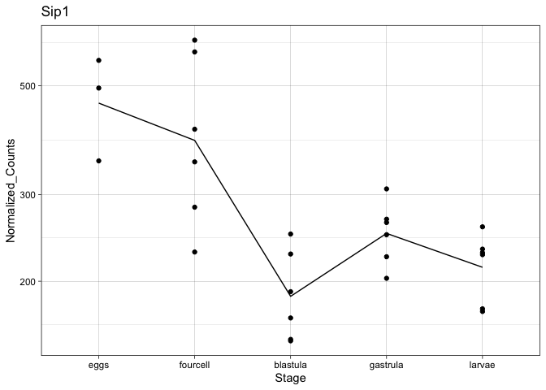<!-- -->

``` r
# Pitx2
# separate out row number
gene <- EL.ortho.GRN.counts[45,]
#
gene_samp <- gene[,c(3:29)]
# transpose
t.gene_samp <- as.data.frame(t(gene_samp))
# add in other info for graphing 
t.gene_samp_info <- cbind(Sample_info, t.gene_samp)
rownames(t.gene_samp_info) <- NULL
colnames(t.gene_samp_info) <- c("Sample", "Stage", "Temp", "Normalized_Counts")
t.gene_samp_info$Stage <- factor(t.gene_samp_info$Stage,
    levels = c('eggs','fourcell', "blastula", "gastrula", "larvae"),ordered = TRUE)
Pitx2_point <- ggplot(t.gene_samp_info, aes(x=Stage, y=Normalized_Counts, group =Stage)) + 
  geom_point() + stat_summary(fun=mean, geom="line", aes(group=1)) + theme_linedraw() + ggtitle("Pitx2") + scale_y_continuous(trans='log10')
Pitx2_point
```

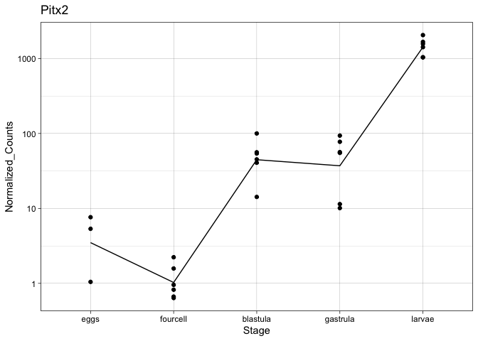<!-- -->

``` r
#   Nk1
# separate out row number
gene <- EL.ortho.GRN.counts[46,]
#
gene_samp <- gene[,c(3:29)]
# transpose
t.gene_samp <- as.data.frame(t(gene_samp))
# add in other info for graphing 
t.gene_samp_info <- cbind(Sample_info, t.gene_samp)
rownames(t.gene_samp_info) <- NULL
colnames(t.gene_samp_info) <- c("Sample", "Stage", "Temp", "Normalized_Counts")
t.gene_samp_info$Stage <- factor(t.gene_samp_info$Stage,
    levels = c('eggs','fourcell', "blastula", "gastrula", "larvae"),ordered = TRUE)
Nk1_point <- ggplot(t.gene_samp_info, aes(x=Stage, y=Normalized_Counts, group =Stage)) + 
  geom_point() + stat_summary(fun=mean, geom="line", aes(group=1)) + theme_linedraw() + ggtitle("Nk1") + scale_y_continuous(trans='log10')
Nk1_point
```

<!-- -->

``` r
# SoxE
# separate out row number
gene <- EL.ortho.GRN.counts[47,]
#
gene_samp <- gene[,c(3:29)]
# transpose
t.gene_samp <- as.data.frame(t(gene_samp))
# add in other info for graphing 
t.gene_samp_info <- cbind(Sample_info, t.gene_samp)
rownames(t.gene_samp_info) <- NULL
colnames(t.gene_samp_info) <- c("Sample", "Stage", "Temp", "Normalized_Counts")
t.gene_samp_info$Stage <- factor(t.gene_samp_info$Stage,
    levels = c('eggs','fourcell', "blastula", "gastrula", "larvae"),ordered = TRUE)
SoxE_point <- ggplot(t.gene_samp_info, aes(x=Stage, y=Normalized_Counts, group =Stage)) + 
  geom_point() + stat_summary(fun=mean, geom="line", aes(group=1)) + theme_linedraw() + ggtitle("SoxE") + scale_y_continuous(trans='log10')
SoxE_point
```

    ## Warning: Transformation introduced infinite values in continuous y-axis
    
    ## Warning: Transformation introduced infinite values in continuous y-axis

    ## Warning: Removed 2 rows containing non-finite values (stat_summary).

<!-- -->

``` r
# Lox
# separate out row number
gene <- EL.ortho.GRN.counts[48,]
#
gene_samp <- gene[,c(3:29)]
# transpose
t.gene_samp <- as.data.frame(t(gene_samp))
# add in other info for graphing 
t.gene_samp_info <- cbind(Sample_info, t.gene_samp)
rownames(t.gene_samp_info) <- NULL
colnames(t.gene_samp_info) <- c("Sample", "Stage", "Temp", "Normalized_Counts")
t.gene_samp_info$Stage <- factor(t.gene_samp_info$Stage,
    levels = c('eggs','fourcell', "blastula", "gastrula", "larvae"),ordered = TRUE)
Lox_point <- ggplot(t.gene_samp_info, aes(x=Stage, y=Normalized_Counts, group =Stage)) + 
  geom_point() + stat_summary(fun=mean, geom="line", aes(group=1)) + theme_linedraw() + ggtitle("Lox") + scale_y_continuous(trans='log10')
Lox_point
```

    ## Warning: Transformation introduced infinite values in continuous y-axis
    
    ## Warning: Transformation introduced infinite values in continuous y-axis

    ## Warning: Removed 1 rows containing non-finite values (stat_summary).

<!-- -->

``` r
# Wnt10
# separate out row number
gene <- EL.ortho.GRN.counts[49,]
#
gene_samp <- gene[,c(3:29)]
# transpose
t.gene_samp <- as.data.frame(t(gene_samp))
# add in other info for graphing 
t.gene_samp_info <- cbind(Sample_info, t.gene_samp)
rownames(t.gene_samp_info) <- NULL
colnames(t.gene_samp_info) <- c("Sample", "Stage", "Temp", "Normalized_Counts")
t.gene_samp_info$Stage <- factor(t.gene_samp_info$Stage,
    levels = c('eggs','fourcell', "blastula", "gastrula", "larvae"),ordered = TRUE)
Wnt10_point <- ggplot(t.gene_samp_info, aes(x=Stage, y=Normalized_Counts, group =Stage)) + 
  geom_point() + stat_summary(fun=mean, geom="line", aes(group=1)) + theme_linedraw() + ggtitle("Wnt10") + scale_y_continuous(trans='log10')
Wnt10_point
```

    ## Warning: Transformation introduced infinite values in continuous y-axis
    
    ## Warning: Transformation introduced infinite values in continuous y-axis

    ## Warning: Removed 10 rows containing non-finite values (stat_summary).

<!-- -->

``` r
# FoxC
# separate out row number
gene <- EL.ortho.GRN.counts[50,]
#
gene_samp <- gene[,c(3:29)]
# transpose
t.gene_samp <- as.data.frame(t(gene_samp))
# add in other info for graphing 
t.gene_samp_info <- cbind(Sample_info, t.gene_samp)
rownames(t.gene_samp_info) <- NULL
colnames(t.gene_samp_info) <- c("Sample", "Stage", "Temp", "Normalized_Counts")
t.gene_samp_info$Stage <- factor(t.gene_samp_info$Stage,
    levels = c('eggs','fourcell', "blastula", "gastrula", "larvae"),ordered = TRUE)
FoxC_point <- ggplot(t.gene_samp_info, aes(x=Stage, y=Normalized_Counts, group =Stage)) + 
  geom_point() + stat_summary(fun=mean, geom="line", aes(group=1)) + theme_linedraw() + ggtitle("FoxC") + scale_y_continuous(trans='log10')
FoxC_point
```

<!-- -->

``` r
# Sm50
# separate out row number
gene <- EL.ortho.GRN.counts[51,]
#
gene_samp <- gene[,c(3:29)]
# transpose
t.gene_samp <- as.data.frame(t(gene_samp))
# add in other info for graphing 
t.gene_samp_info <- cbind(Sample_info, t.gene_samp)
rownames(t.gene_samp_info) <- NULL
colnames(t.gene_samp_info) <- c("Sample", "Stage", "Temp", "Normalized_Counts")
t.gene_samp_info$Stage <- factor(t.gene_samp_info$Stage,
    levels = c('eggs','fourcell', "blastula", "gastrula", "larvae"),ordered = TRUE)
Sm50_point <- ggplot(t.gene_samp_info, aes(x=Stage, y=Normalized_Counts, group =Stage)) + 
  geom_point() + stat_summary(fun=mean, geom="line", aes(group=1)) + theme_linedraw() + ggtitle("Sm50") + scale_y_continuous(trans='log10')
Sm50_point
```

<!-- -->

``` r
# Msp130
# separate out row number
gene <- EL.ortho.GRN.counts[52,]
#
gene_samp <- gene[,c(3:29)]
# transpose
t.gene_samp <- as.data.frame(t(gene_samp))
# add in other info for graphing 
t.gene_samp_info <- cbind(Sample_info, t.gene_samp)
rownames(t.gene_samp_info) <- NULL
colnames(t.gene_samp_info) <- c("Sample", "Stage", "Temp", "Normalized_Counts")
t.gene_samp_info$Stage <- factor(t.gene_samp_info$Stage,
    levels = c('eggs','fourcell', "blastula", "gastrula", "larvae"),ordered = TRUE)
Msp130_point <- ggplot(t.gene_samp_info, aes(x=Stage, y=Normalized_Counts, group =Stage)) + 
  geom_point() + stat_summary(fun=mean, geom="line", aes(group=1)) + theme_linedraw() + ggtitle("Msp130") + scale_y_continuous(trans='log10')
Msp130_point
```

<!-- -->

``` r
# HesC
# separate out row number
gene <- EL.ortho.GRN.counts[53,]
#
gene_samp <- gene[,c(3:29)]
# transpose
t.gene_samp <- as.data.frame(t(gene_samp))
# add in other info for graphing 
t.gene_samp_info <- cbind(Sample_info, t.gene_samp)
rownames(t.gene_samp_info) <- NULL
colnames(t.gene_samp_info) <- c("Sample", "Stage", "Temp", "Normalized_Counts")
t.gene_samp_info$Stage <- factor(t.gene_samp_info$Stage,
    levels = c('eggs','fourcell', "blastula", "gastrula", "larvae"),ordered = TRUE)
HesC_point <- ggplot(t.gene_samp_info, aes(x=Stage, y=Normalized_Counts, group =Stage)) + 
  geom_point() + stat_summary(fun=mean, geom="line", aes(group=1)) + theme_linedraw() + ggtitle("HesC") + scale_y_continuous(trans='log10')
HesC_point
```

<!-- -->

``` r
# C-lectin
# separate out row number
gene <- EL.ortho.GRN.counts[54,]
#
gene_samp <- gene[,c(3:29)]
# transpose
t.gene_samp <- as.data.frame(t(gene_samp))
# add in other info for graphing 
t.gene_samp_info <- cbind(Sample_info, t.gene_samp)
rownames(t.gene_samp_info) <- NULL
colnames(t.gene_samp_info) <- c("Sample", "Stage", "Temp", "Normalized_Counts")
t.gene_samp_info$Stage <- factor(t.gene_samp_info$Stage,
    levels = c('eggs','fourcell', "blastula", "gastrula", "larvae"),ordered = TRUE)
C_lectin_point <- ggplot(t.gene_samp_info, aes(x=Stage, y=Normalized_Counts, group =Stage)) + 
  geom_point() + stat_summary(fun=mean, geom="line", aes(group=1)) + theme_linedraw() + ggtitle("C-lectin") + scale_y_continuous(trans='log10')
C_lectin_point
```

<!-- -->

``` r
# SoxC
# separate out row number
gene <- EL.ortho.GRN.counts[55,]
#
gene_samp <- gene[,c(3:29)]
# transpose
t.gene_samp <- as.data.frame(t(gene_samp))
# add in other info for graphing 
t.gene_samp_info <- cbind(Sample_info, t.gene_samp)
rownames(t.gene_samp_info) <- NULL
colnames(t.gene_samp_info) <- c("Sample", "Stage", "Temp", "Normalized_Counts")
t.gene_samp_info$Stage <- factor(t.gene_samp_info$Stage,
    levels = c('eggs','fourcell', "blastula", "gastrula", "larvae"),ordered = TRUE)
SoxC_point <- ggplot(t.gene_samp_info, aes(x=Stage, y=Normalized_Counts, group =Stage)) + 
  geom_point() + stat_summary(fun=mean, geom="line", aes(group=1)) + theme_linedraw() + ggtitle("SoxC") + scale_y_continuous(trans='log10')
SoxC_point
```

<!-- -->

``` r
# Shr2
# separate out row number
gene <- EL.ortho.GRN.counts[56,]
#
gene_samp <- gene[,c(3:29)]
# transpose
t.gene_samp <- as.data.frame(t(gene_samp))
# add in other info for graphing 
t.gene_samp_info <- cbind(Sample_info, t.gene_samp)
rownames(t.gene_samp_info) <- NULL
colnames(t.gene_samp_info) <- c("Sample", "Stage", "Temp", "Normalized_Counts")
t.gene_samp_info$Stage <- factor(t.gene_samp_info$Stage,
    levels = c('eggs','fourcell', "blastula", "gastrula", "larvae"),ordered = TRUE)
Shr2_point <- ggplot(t.gene_samp_info, aes(x=Stage, y=Normalized_Counts, group =Stage)) + 
  geom_point() + stat_summary(fun=mean, geom="line", aes(group=1)) + theme_linedraw() + ggtitle("Shr2") + scale_y_continuous(trans='log10')
Shr2_point
```

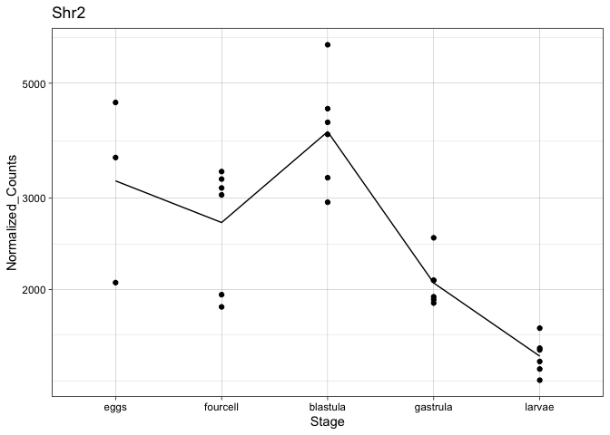<!-- -->

``` r
#   FoxY
# separate out row number
gene <- EL.ortho.GRN.counts[57,]
#
gene_samp <- gene[,c(3:29)]
# transpose
t.gene_samp <- as.data.frame(t(gene_samp))
# add in other info for graphing 
t.gene_samp_info <- cbind(Sample_info, t.gene_samp)
rownames(t.gene_samp_info) <- NULL
colnames(t.gene_samp_info) <- c("Sample", "Stage", "Temp", "Normalized_Counts")
t.gene_samp_info$Stage <- factor(t.gene_samp_info$Stage,
    levels = c('eggs','fourcell', "blastula", "gastrula", "larvae"),ordered = TRUE)
FoxY_point <- ggplot(t.gene_samp_info, aes(x=Stage, y=Normalized_Counts, group =Stage)) + 
  geom_point() + stat_summary(fun=mean, geom="line", aes(group=1)) + theme_linedraw() + ggtitle("FoxY") + scale_y_continuous(trans='log10')
FoxY_point
```

    ## Warning: Transformation introduced infinite values in continuous y-axis
    
    ## Warning: Transformation introduced infinite values in continuous y-axis

    ## Warning: Removed 1 rows containing non-finite values (stat_summary).

<!-- -->

``` r
# Ese
# separate out row number
gene <- EL.ortho.GRN.counts[58,]
#
gene_samp <- gene[,c(3:29)]
# transpose
t.gene_samp <- as.data.frame(t(gene_samp))
# add in other info for graphing 
t.gene_samp_info <- cbind(Sample_info, t.gene_samp)
rownames(t.gene_samp_info) <- NULL
colnames(t.gene_samp_info) <- c("Sample", "Stage", "Temp", "Normalized_Counts")
t.gene_samp_info$Stage <- factor(t.gene_samp_info$Stage,
    levels = c('eggs','fourcell', "blastula", "gastrula", "larvae"),ordered = TRUE)
Ese_point <- ggplot(t.gene_samp_info, aes(x=Stage, y=Normalized_Counts, group =Stage)) + 
  geom_point() + stat_summary(fun=mean, geom="line", aes(group=1)) + theme_linedraw() + ggtitle("Ese") + scale_y_continuous(trans='log10')
Ese_point
```

<!-- -->

``` r
# Gatae
# separate out row number
gene <- EL.ortho.GRN.counts[59,]
#
gene_samp <- gene[,c(3:29)]
# transpose
t.gene_samp <- as.data.frame(t(gene_samp))
# add in other info for graphing 
t.gene_samp_info <- cbind(Sample_info, t.gene_samp)
rownames(t.gene_samp_info) <- NULL
colnames(t.gene_samp_info) <- c("Sample", "Stage", "Temp", "Normalized_Counts")
t.gene_samp_info$Stage <- factor(t.gene_samp_info$Stage,
    levels = c('eggs','fourcell', "blastula", "gastrula", "larvae"),ordered = TRUE)
Gatae_point <- ggplot(t.gene_samp_info, aes(x=Stage, y=Normalized_Counts, group =Stage)) + 
  geom_point() + stat_summary(fun=mean, geom="line", aes(group=1)) + theme_linedraw() + ggtitle("Gatae") + scale_y_continuous(trans='log10')
Gatae_point
```

<!-- -->

``` r
# Gsc
# separate out row number
gene <- EL.ortho.GRN.counts[60,]
#
gene_samp <- gene[,c(3:29)]
# transpose
t.gene_samp <- as.data.frame(t(gene_samp))
# add in other info for graphing 
t.gene_samp_info <- cbind(Sample_info, t.gene_samp)
rownames(t.gene_samp_info) <- NULL
colnames(t.gene_samp_info) <- c("Sample", "Stage", "Temp", "Normalized_Counts")
t.gene_samp_info$Stage <- factor(t.gene_samp_info$Stage,
    levels = c('eggs','fourcell', "blastula", "gastrula", "larvae"),ordered = TRUE)
Gsc_point <- ggplot(t.gene_samp_info, aes(x=Stage, y=Normalized_Counts, group =Stage)) + 
  geom_point() + stat_summary(fun=mean, geom="line", aes(group=1)) + theme_linedraw() + ggtitle("Gsc") + scale_y_continuous(trans='log10')
Gsc_point
```

<!-- -->

``` r
# Lefty
# separate out row number
gene <- EL.ortho.GRN.counts[61,]
#
gene_samp <- gene[,c(3:29)]
# transpose
t.gene_samp <- as.data.frame(t(gene_samp))
# add in other info for graphing 
t.gene_samp_info <- cbind(Sample_info, t.gene_samp)
rownames(t.gene_samp_info) <- NULL
colnames(t.gene_samp_info) <- c("Sample", "Stage", "Temp", "Normalized_Counts")
t.gene_samp_info$Stage <- factor(t.gene_samp_info$Stage,
    levels = c('eggs','fourcell', "blastula", "gastrula", "larvae"),ordered = TRUE)
Lefty_point <- ggplot(t.gene_samp_info, aes(x=Stage, y=Normalized_Counts, group =Stage)) + 
  geom_point() + stat_summary(fun=mean, geom="line", aes(group=1)) + theme_linedraw() + ggtitle("Lefty") + scale_y_continuous(trans='log10')
Lefty_point
```

<!-- -->

``` r
# Six3
# separate out row number
gene <- EL.ortho.GRN.counts[62,]
#
gene_samp <- gene[,c(3:29)]
# transpose
t.gene_samp <- as.data.frame(t(gene_samp))
# add in other info for graphing 
t.gene_samp_info <- cbind(Sample_info, t.gene_samp)
rownames(t.gene_samp_info) <- NULL
colnames(t.gene_samp_info) <- c("Sample", "Stage", "Temp", "Normalized_Counts")
t.gene_samp_info$Stage <- factor(t.gene_samp_info$Stage,
    levels = c('eggs','fourcell', "blastula", "gastrula", "larvae"),ordered = TRUE)
Six3_point <- ggplot(t.gene_samp_info, aes(x=Stage, y=Normalized_Counts, group =Stage)) + 
  geom_point() + stat_summary(fun=mean, geom="line", aes(group=1)) + theme_linedraw() + ggtitle("Six3") + scale_y_continuous(trans='log10')
Six3_point
```

<!-- -->

``` r
# Bra
# separate out row number
gene <- EL.ortho.GRN.counts[63,]
#
gene_samp <- gene[,c(3:29)]
# transpose
t.gene_samp <- as.data.frame(t(gene_samp))
# add in other info for graphing 
t.gene_samp_info <- cbind(Sample_info, t.gene_samp)
rownames(t.gene_samp_info) <- NULL
colnames(t.gene_samp_info) <- c("Sample", "Stage", "Temp", "Normalized_Counts")
t.gene_samp_info$Stage <- factor(t.gene_samp_info$Stage,
    levels = c('eggs','fourcell', "blastula", "gastrula", "larvae"),ordered = TRUE)
Bra_point <- ggplot(t.gene_samp_info, aes(x=Stage, y=Normalized_Counts, group =Stage)) + 
  geom_point() + stat_summary(fun=mean, geom="line", aes(group=1)) + theme_linedraw() + ggtitle("Bra") + scale_y_continuous(trans='log10')
Bra_point
```

    ## Warning: Transformation introduced infinite values in continuous y-axis
    
    ## Warning: Transformation introduced infinite values in continuous y-axis

    ## Warning: Removed 1 rows containing non-finite values (stat_summary).

<!-- -->

``` r
# Hox7
# separate out row number
gene <- EL.ortho.GRN.counts[64,]
#
gene_samp <- gene[,c(3:29)]
# transpose
t.gene_samp <- as.data.frame(t(gene_samp))
# add in other info for graphing 
t.gene_samp_info <- cbind(Sample_info, t.gene_samp)
rownames(t.gene_samp_info) <- NULL
colnames(t.gene_samp_info) <- c("Sample", "Stage", "Temp", "Normalized_Counts")
t.gene_samp_info$Stage <- factor(t.gene_samp_info$Stage,
    levels = c('eggs','fourcell', "blastula", "gastrula", "larvae"),ordered = TRUE)
Hox7_point <- ggplot(t.gene_samp_info, aes(x=Stage, y=Normalized_Counts, group =Stage)) + 
  geom_point() + stat_summary(fun=mean, geom="line", aes(group=1)) + theme_linedraw() + ggtitle("Hox7") + scale_y_continuous(trans='log10')
Hox7_point
```

    ## Warning: Transformation introduced infinite values in continuous y-axis
    
    ## Warning: Transformation introduced infinite values in continuous y-axis

    ## Warning: Removed 4 rows containing non-finite values (stat_summary).

<!-- -->

``` r
# Hh
# separate out row number
gene <- EL.ortho.GRN.counts[65,]
#
gene_samp <- gene[,c(3:29)]
# transpose
t.gene_samp <- as.data.frame(t(gene_samp))
# add in other info for graphing 
t.gene_samp_info <- cbind(Sample_info, t.gene_samp)
rownames(t.gene_samp_info) <- NULL
colnames(t.gene_samp_info) <- c("Sample", "Stage", "Temp", "Normalized_Counts")
t.gene_samp_info$Stage <- factor(t.gene_samp_info$Stage,
    levels = c('eggs','fourcell', "blastula", "gastrula", "larvae"),ordered = TRUE)
Hh_point <- ggplot(t.gene_samp_info, aes(x=Stage, y=Normalized_Counts, group =Stage)) + 
  geom_point() + stat_summary(fun=mean, geom="line", aes(group=1)) + theme_linedraw() + ggtitle("Hh") + scale_y_continuous(trans='log10')
Hh_point
```

    ## Warning: Transformation introduced infinite values in continuous y-axis
    
    ## Warning: Transformation introduced infinite values in continuous y-axis

    ## Warning: Removed 6 rows containing non-finite values (stat_summary).

<!-- -->

``` r
# P19
# separate out row number
gene <- EL.ortho.GRN.counts[66,]
#
gene_samp <- gene[,c(3:29)]
# transpose
t.gene_samp <- as.data.frame(t(gene_samp))
# add in other info for graphing 
t.gene_samp_info <- cbind(Sample_info, t.gene_samp)
rownames(t.gene_samp_info) <- NULL
colnames(t.gene_samp_info) <- c("Sample", "Stage", "Temp", "Normalized_Counts")
t.gene_samp_info$Stage <- factor(t.gene_samp_info$Stage,
    levels = c('eggs','fourcell', "blastula", "gastrula", "larvae"),ordered = TRUE)
P19_point <- ggplot(t.gene_samp_info, aes(x=Stage, y=Normalized_Counts, group =Stage)) + 
  geom_point() + stat_summary(fun=mean, geom="line", aes(group=1)) + theme_linedraw() + ggtitle("P19") + scale_y_continuous(trans='log10')
P19_point
```

<!-- -->

``` r
# FoxF
# separate out row number
gene <- EL.ortho.GRN.counts[67,]
#
gene_samp <- gene[,c(3:29)]
# transpose
t.gene_samp <- as.data.frame(t(gene_samp))
# add in other info for graphing 
t.gene_samp_info <- cbind(Sample_info, t.gene_samp)
rownames(t.gene_samp_info) <- NULL
colnames(t.gene_samp_info) <- c("Sample", "Stage", "Temp", "Normalized_Counts")
t.gene_samp_info$Stage <- factor(t.gene_samp_info$Stage,
    levels = c('eggs','fourcell', "blastula", "gastrula", "larvae"),ordered = TRUE)
FoxF_point <- ggplot(t.gene_samp_info, aes(x=Stage, y=Normalized_Counts, group =Stage)) + 
  geom_point() + stat_summary(fun=mean, geom="line", aes(group=1)) + theme_linedraw() + ggtitle("FoxF") + scale_y_continuous(trans='log10')
FoxF_point
```

    ## Warning: Transformation introduced infinite values in continuous y-axis
    
    ## Warning: Transformation introduced infinite values in continuous y-axis

    ## Warning: Removed 7 rows containing non-finite values (stat_summary).

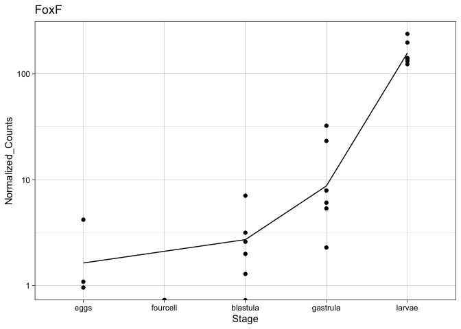<!-- -->

Want to only plot the GRN genes that are DEG

bring in counts dataset (warning not normalized) that has the first
column as a list of all sig DEGs for every stage comparison

``` r
all_stage_DEGs <- read.delim("all_stage_DEGs.txt", sep = "\t")
head(all_stage_DEGs)
```

    ##                        X29_4cell_rep_1 X29_4cell_rep_2 X29_4cell_rep_3
    ## TRINITY_DN100003_c0_g1               1               0               0
    ## TRINITY_DN10000_c0_g1              369             587             931
    ## TRINITY_DN100032_c0_g1               0               0               0
    ## TRINITY_DN100034_c0_g1              38               4             759
    ## TRINITY_DN100035_c0_g1               1               0               0
    ## TRINITY_DN10003_c0_g1              200             262             226
    ##                        X29_blast_rep_1 X29_blast_rep_2 X29_blast_rep_3
    ## TRINITY_DN100003_c0_g1               0               2               0
    ## TRINITY_DN10000_c0_g1              790             712             645
    ## TRINITY_DN100032_c0_g1               2               0               0
    ## TRINITY_DN100034_c0_g1               6               0              60
    ## TRINITY_DN100035_c0_g1               0               0               0
    ## TRINITY_DN10003_c0_g1               91              99             110
    ##                        X29_gast_rep_1 X29_gast_rep_2 X29_gast_rep_3
    ## TRINITY_DN100003_c0_g1              2              0             23
    ## TRINITY_DN10000_c0_g1             675            546            662
    ## TRINITY_DN100032_c0_g1              6              0             18
    ## TRINITY_DN100034_c0_g1              0              0             11
    ## TRINITY_DN100035_c0_g1              7              8              8
    ## TRINITY_DN10003_c0_g1             259            217            713
    ##                        X29_larv_rep_1 X29_larv_rep_2 X29_larv_rep_3
    ## TRINITY_DN100003_c0_g1              0             10              6
    ## TRINITY_DN10000_c0_g1             536            253            387
    ## TRINITY_DN100032_c0_g1              7              8             16
    ## TRINITY_DN100034_c0_g1              1              0              0
    ## TRINITY_DN100035_c0_g1              6             21             18
    ## TRINITY_DN10003_c0_g1            2148           2109           2994
    ##                        X33_4cell_rep_1 X33_4cell_rep_2 X33_4cell_rep_3
    ## TRINITY_DN100003_c0_g1               0               0               0
    ## TRINITY_DN10000_c0_g1              263             485             627
    ## TRINITY_DN100032_c0_g1               0               0               0
    ## TRINITY_DN100034_c0_g1              42               2             482
    ## TRINITY_DN100035_c0_g1               1               0               0
    ## TRINITY_DN10003_c0_g1              168             256             193
    ##                        X33_blast_rep_1 X33_blast_rep_2 X33_blast_rep_3
    ## TRINITY_DN100003_c0_g1               2               1               5
    ## TRINITY_DN10000_c0_g1              795             485             603
    ## TRINITY_DN100032_c0_g1               1               0               7
    ## TRINITY_DN100034_c0_g1               6               2             239
    ## TRINITY_DN100035_c0_g1               2               0               1
    ## TRINITY_DN10003_c0_g1               99             121             156
    ##                        X33_gast_rep_1 X33_gast_rep_2 X33_gast_rep_3
    ## TRINITY_DN100003_c0_g1              4              8             13
    ## TRINITY_DN10000_c0_g1             621            356            498
    ## TRINITY_DN100032_c0_g1              2              5             10
    ## TRINITY_DN100034_c0_g1              1              0              1
    ## TRINITY_DN100035_c0_g1             12             11              2
    ## TRINITY_DN10003_c0_g1             741            249           1335
    ##                        X33_larv_rep_1 X33_larv_rep_2 X33_larv_rep_3 eggs_rep_1
    ## TRINITY_DN100003_c0_g1              1             15              2          0
    ## TRINITY_DN10000_c0_g1             497            265            437        181
    ## TRINITY_DN100032_c0_g1             29             12             38          0
    ## TRINITY_DN100034_c0_g1              1              5              1         29
    ## TRINITY_DN100035_c0_g1              3             17             23          0
    ## TRINITY_DN10003_c0_g1            2893           2601           3843        181
    ##                        eggs_rep_2 eggs_rep_3
    ## TRINITY_DN100003_c0_g1          0          0
    ## TRINITY_DN10000_c0_g1         264        599
    ## TRINITY_DN100032_c0_g1          0          0
    ## TRINITY_DN100034_c0_g1          2        610
    ## TRINITY_DN100035_c0_g1          0          0
    ## TRINITY_DN10003_c0_g1         289        205

``` r
dim(all_stage_DEGs) # 12383 
```

    ## [1] 12383    27

``` r
# create vector of stage DEGs 
stage_DEGS <- rownames(all_stage_DEGs)
```

Now I can subset the normalized counts file by only these
DEGs

``` r
stage_DEG_counts_ortho <- subset(counts_stage_orthogroups, transcript_id %in% stage_DEGS)
dim(stage_DEG_counts_ortho) #12320
```

    ## [1] 12320    29

``` r
# not sure why a few DEGs aren't present 
# also is crazy that almost all genes are DEG in at least one stage comparison 
head(stage_DEG_counts_ortho)
```

    ##            transcript_id 29_4cell_rep_1 29_4cell_rep_2 29_4cell_rep_3
    ## 1      TRINITY_DN1_c0_g1   1525.2931225     1055.75121      3887.1416
    ## 2     TRINITY_DN10_c0_g1    218.9623850       17.85284       652.2288
    ## 3    TRINITY_DN100_c0_g1   1936.2004864     1248.62278      2002.0052
    ## 4   TRINITY_DN1000_c1_g1    488.8102540      475.82717       764.6208
    ## 5  TRINITY_DN10000_c0_g1    245.2934858      436.13783       592.2853
    ## 6 TRINITY_DN100003_c0_g1      0.6596409        0.00000         0.0000
    ##   29_blast_rep_1 29_blast_rep_2 29_blast_rep_3 29_gast_rep_1 29_gast_rep_2
    ## 1      8465.8548    5510.562339     15838.1453   4629.475106     3480.4523
    ## 2     18061.7012   22146.482243     16507.4466   9432.963810    11029.4570
    ## 3      8480.8062    6594.337487      6871.8474   4975.803475     5326.9765
    ## 4       343.0609     364.836499       449.7334    405.356820      563.3738
    ## 5      1012.1953     836.015127       904.4834    760.736235      550.7732
    ## 6         0.0000       2.330338         0.0000      2.236774        0.0000
    ##   29_gast_rep_3 29_larv_rep_1 29_larv_rep_2 29_larv_rep_3 33_4cell_rep_1
    ## 1     9205.1098     6944.6664    2624.55566   7468.076235      1587.5235
    ## 2     9056.0805    10119.4735   13620.71192   8288.045792       253.2844
    ## 3     5031.1780     4319.4069    2984.27103   3970.378375      1946.0540
    ## 4      390.8323      529.3630     487.76805    356.129044       528.3288
    ## 5      505.7931      696.0783     300.53033    376.905626       207.2713
    ## 6       17.4386        0.0000      11.78753      5.798755         0.0000
    ##   33_4cell_rep_2 33_4cell_rep_3 33_blast_rep_1 33_blast_rep_2 33_blast_rep_3
    ## 1      1093.9295      3488.9028    6183.663200    4957.303527    9401.982053
    ## 2        33.7148       412.5793   12533.300214   15905.943486    8807.145990
    ## 3      1335.8978      1673.7495    6144.282605    7517.413594    5057.644626
    ## 4       449.6783       623.3024     376.045352     502.287275     520.269279
    ## 5       398.3475       598.1114     833.512023     626.832366     598.130575
    ## 6         0.0000         0.0000       2.080696       1.282274       4.920384
    ##   33_gast_rep_1 33_gast_rep_2 33_gast_rep_3 33_larv_rep_1 33_larv_rep_2
    ## 1    6541.88911   4074.786060   10010.12666   6859.423584    2466.40463
    ## 2    9179.31616  10803.578478    8971.67993   7714.132486   14305.95015
    ## 3    4694.73694   4701.263328    3554.62936   3469.405069    3013.74914
    ## 4     500.56578    609.513820     460.79712    420.467965     460.83407
    ## 5     716.90116    405.953252     481.51691    602.773665     253.06726
    ## 6       4.58229      9.052549      12.47447      1.203557      14.21556
    ##   33_larv_rep_3 eggs_rep_1 eggs_rep_2 eggs_rep_3 Orthogroup
    ## 1   7361.753303  1320.2167 1100.41685  3674.5034  OG0009146
    ## 2   9377.019057   263.5568   64.93252   453.8350  OG0009109
    ## 3   3334.713199  2185.2433 1255.34260  1694.1266  OG0003068
    ## 4    316.847883   562.4990  609.84291   895.0971  OG0003190
    ## 5    380.737988   189.0695  251.79140   651.9886  OG0010723
    ## 6      1.729166     0.0000    0.00000     0.0000  OG0012527

``` r
ortho.GRN <- annot.otho.GRNs[,c(2,4)]

dim(ortho.GRN) #69
```

    ## [1] 69  2

``` r
EL.ortho.GRN.counts.DEG <- merge(stage_DEG_counts_ortho, ortho.GRN, by= "Orthogroup", sort = TRUE)
EL.ortho.GRN.counts.DEG
```

    ##    Orthogroup         transcript_id 29_4cell_rep_1 29_4cell_rep_2
    ## 1   OG0000526  TRINITY_DN3715_c0_g1   4.569280e+00   3.810516e+00
    ## 2   OG0000751 TRINITY_DN30130_c0_g1   3.421769e+04   6.133235e+04
    ## 3   OG0001074  TRINITY_DN1584_c0_g1   3.495238e+02   2.130536e+02
    ## 4   OG0001475 TRINITY_DN18880_c0_g1   1.369656e+02   5.027794e+01
    ## 5   OG0001729  TRINITY_DN2379_c1_g1   2.222244e+02   1.289148e+02
    ## 6   OG0001798  TRINITY_DN4697_c0_g1   1.231355e+00   0.000000e+00
    ## 7   OG0002162 TRINITY_DN48762_c0_g1   1.128081e+01   1.112535e+01
    ## 8   OG0002162  TRINITY_DN5408_c0_g1   6.053989e+01   1.717655e+02
    ## 9   OG0003098   TRINITY_DN266_c0_g1   2.294644e+02   2.356567e+02
    ## 10  OG0003129   TRINITY_DN821_c0_g1   4.245200e+02   5.719089e+02
    ## 11  OG0003133   TRINITY_DN813_c0_g1   5.491114e+03   6.161919e+03
    ## 12  OG0003225  TRINITY_DN1080_c1_g1   4.657936e+00   2.231206e+00
    ## 13  OG0003551  TRINITY_DN2633_c0_g1   5.982816e+00   6.687005e+00
    ## 14  OG0003558  TRINITY_DN2685_c0_g1   5.343863e+03   5.413305e+03
    ## 15  OG0003727  TRINITY_DN3022_c0_g1   6.660475e+00   9.677619e+00
    ## 16  OG0003814  TRINITY_DN3382_c0_g1   2.295196e+03   2.379319e+03
    ## 17  OG0003942  TRINITY_DN3591_c1_g1   2.102610e+03   2.855351e+03
    ## 18  OG0004057  TRINITY_DN4373_c0_g1   3.323363e+00   1.485813e+00
    ## 19  OG0004343  TRINITY_DN7164_c0_g1   1.015387e+03   3.926757e+02
    ## 20  OG0004537  TRINITY_DN9176_c1_g1   1.130432e+01   6.689032e+00
    ## 21  OG0004607  TRINITY_DN9641_c0_g1   5.325660e+00   3.720275e+00
    ## 22  OG0004855 TRINITY_DN11393_c0_g1   1.997684e+01   1.414100e+01
    ## 23  OG0004886 TRINITY_DN11496_c1_g1   3.528837e+02   1.406497e+02
    ## 24  OG0004987 TRINITY_DN12895_c0_g1   1.995359e+00   7.434025e-01
    ## 25  OG0005092 TRINITY_DN14532_c0_g1   5.317833e+00   4.457816e+00
    ## 26  OG0005119 TRINITY_DN14836_c0_g1   1.131764e+01   5.952758e+00
    ## 27  OG0005124 TRINITY_DN14855_c0_g1   5.047094e+02   2.385776e+02
    ## 28  OG0005164 TRINITY_DN15144_c0_g1   2.862098e+01   4.910006e+01
    ## 29  OG0005382 TRINITY_DN19769_c0_g1   6.655783e-01   2.231735e+00
    ## 30  OG0005470 TRINITY_DN21818_c0_g1   1.330480e+00   0.000000e+00
    ## 31  OG0005540 TRINITY_DN23219_c1_g1   0.000000e+00   0.000000e+00
    ## 32  OG0005721 TRINITY_DN29448_c0_g1   1.994240e+00   2.228966e+00
    ## 33  OG0005903 TRINITY_DN38852_c0_g1   6.654011e-01   0.000000e+00
    ## 34  OG0006375   TRINITY_DN475_c0_g1   8.653616e+00   1.116008e+01
    ## 35  OG0006475  TRINITY_DN2066_c0_g1   4.666533e+02   5.491037e+02
    ## 36  OG0006643  TRINITY_DN2593_c0_g1   6.385414e+01   4.386257e+01
    ## 37  OG0006673  TRINITY_DN2547_c0_g1   1.125439e+02   9.080619e+01
    ## 38  OG0006735  TRINITY_DN2784_c0_g1   4.587822e+01   2.749695e+01
    ## 39  OG0007463  TRINITY_DN9238_c0_g1   5.991251e+00   1.934506e+01
    ## 40  OG0007507  TRINITY_DN9360_c0_g1   1.131212e+01   9.668552e+00
    ## 41  OG0007582 TRINITY_DN10374_c0_g1   9.321536e+01   1.153486e+02
    ## 42  OG0007686 TRINITY_DN11952_c0_g1   1.198142e+01   4.463846e+00
    ## 43  OG0007778 TRINITY_DN13564_c0_g1   3.498178e+02   6.187676e+02
    ## 44  OG0007858 TRINITY_DN14737_c0_g1   6.652342e-01   2.230589e+00
    ## 45  OG0008153 TRINITY_DN19905_c0_g1   1.330998e+00   2.975294e+00
    ## 46  OG0008519 TRINITY_DN32902_c0_g1   1.331391e+00   1.116063e+01
    ## 47  OG0008735 TRINITY_DN45723_c0_g1   2.658706e+00   7.429108e-01
    ## 48  OG0008773 TRINITY_DN49954_c0_g1   0.000000e+00   0.000000e+00
    ## 49  OG0008813 TRINITY_DN52103_c0_g1   6.649703e-01   1.486474e+00
    ## 50  OG0009254   TRINITY_DN519_c0_g1   2.639082e+00   2.212384e+00
    ## 51  OG0009280   TRINITY_DN656_c0_g1   1.464061e+01   1.264469e+01
    ## 52  OG0009524  TRINITY_DN1800_c1_g1   1.632092e+02   2.178774e+02
    ## 53  OG0009679  TRINITY_DN3842_c0_g1   3.325558e+00   7.433937e+00
    ## 54  OG0009832  TRINITY_DN4262_c0_g1   2.429124e+02   2.209203e+02
    ## 55  OG0010002  TRINITY_DN5476_c0_g1   3.139790e+03   3.376890e+03
    ## 56  OG0010228  TRINITY_DN6565_c1_g1   5.317499e+00   7.429228e-01
    ## 57  OG0010291  TRINITY_DN6807_c0_g1   7.322270e+00   2.232010e+00
    ## 58  OG0010319  TRINITY_DN7008_c0_g1   5.280224e+00   3.296480e+00
    ## 59  OG0010470  TRINITY_DN7800_c2_g1   2.127780e+01   2.526858e+01
    ## 60  OG0010829 TRINITY_DN12113_c0_g1   8.640375e+00   1.337175e+01
    ## 61  OG0010862 TRINITY_DN12223_c0_g1   3.325211e+01   3.716583e+00
    ## 62  OG0011242 TRINITY_DN18341_c0_g1   1.996632e+00   1.487747e+00
    ## 63  OG0011416 TRINITY_DN23359_c0_g1   0.000000e+00   7.429152e-01
    ## 64  OG0011437 TRINITY_DN23610_c0_g1   6.657638e-01   0.000000e+00
    ## 65  OG0012251 TRINITY_DN77381_c0_g1   3.957445e+00   3.686216e+00
    ## 66  OG0012269 TRINITY_DN80409_c0_g1   0.000000e+00   0.000000e+00
    ##    29_4cell_rep_3 29_blast_rep_1 29_blast_rep_2 29_blast_rep_3 29_gast_rep_1
    ## 1    5.220421e+00    7074.240656    9408.874932    6810.257243  10955.119965
    ## 2    2.154622e+04    2801.399543    3821.099761    3866.755690   2460.254407
    ## 3    9.648690e+02    7613.726239    7273.572486    8355.350716   4859.208214
    ## 4    1.387915e+02    5063.346426    8799.640759    4029.839086   4229.020969
    ## 5    2.544976e+02    2193.415429    2190.324025    1528.523093   1597.025472
    ## 6    1.178443e+00     425.254816     445.157185     476.748795    789.436278
    ## 7    8.255611e+00     251.957940     508.694598     309.369011    195.755766
    ## 8    8.340582e+01    3267.235459    3298.499186    2930.262074   2198.270857
    ## 9    1.420102e+03    5811.145247    5797.721470    6357.226990   3327.630060
    ## 10   7.106686e+02    9298.157902   11635.529537    8336.143693   8337.759680
    ## 11   8.154206e+03    7229.568527    7293.173628    6767.671566  12544.398374
    ## 12   1.783115e+01    3834.849686    4480.452559    4873.594140   5514.363087
    ## 13   9.542805e+00    3505.555584    3482.641705    5426.943853  11502.424569
    ## 14   6.929855e+03   22152.502252   27517.638583   23623.748350  12749.084768
    ## 15   1.147380e+01   16092.187357   29210.358757   21833.503616   9464.975761
    ## 16   3.034949e+03    4967.877967    8310.402869    6568.771660   4746.676145
    ## 17   1.994431e+03    1678.565786    2274.447570    1508.414844   1743.984074
    ## 18   8.269366e+00    1141.464825     486.051954    1022.156416   1103.218031
    ## 19   4.865146e+02   14571.802682   13660.568938   12423.495428  11440.013733
    ## 20   4.836511e+01     402.442806     956.080095     432.041496    974.046046
    ## 21   1.975025e+01     124.462534      21.165523     113.746877   3328.327042
    ## 22   1.172606e+02    2916.074253    2597.032868    2319.111621   2122.416702
    ## 23   2.364057e+02    1194.784492    1379.515661    1328.668634   1001.259826
    ## 24   1.273074e+00    1188.390660    1261.763371     948.470325   1029.532457
    ## 25   4.453118e+00    2111.443043    1852.790262    2696.531595   4131.501777
    ## 26   1.911418e+01    2580.492078    4054.590814    2518.011411   2872.514488
    ## 27   4.518361e+02     448.586870     440.458592     468.516729    242.386341
    ## 28   4.522735e+01    2898.110980    2948.605799    2850.257876   1204.060990
    ## 29   2.038336e+01     424.629111      72.889348     366.447747   1059.577896
    ## 30   1.273306e+00     355.171819     156.280067     269.435918   1382.731529
    ## 31   5.724806e+00       0.000000       2.348020      44.867253     87.894726
    ## 32   1.208736e+01     201.156141      95.107689     277.653154    414.738760
    ## 33   3.184044e+00     737.450534     682.862334     510.927444    464.782149
    ## 34   7.007678e+00    2287.645770    2045.863370    3636.851153  17648.320379
    ## 35   4.848288e+02   10199.343330   13336.413043    6430.105605   5260.454114
    ## 36   1.992444e+02    1466.640982    1380.478301    1668.309933    674.354858
    ## 37   2.370866e+02    5969.889926    7123.503147    8001.538689   7426.701696
    ## 38   5.427865e+02    4784.030313    4525.126631    4839.006755   2163.229839
    ## 39   1.401603e+01    1076.515483    1443.930811     832.723455   1650.023508
    ## 40   4.521465e+01    4043.903085    5926.133734    4268.602200   8219.642788
    ## 41   2.472404e+02    3909.070601    5017.104523    3185.460456   2712.567838
    ## 42   1.847400e+01    1596.023645    1141.637785    1297.417414   1362.106954
    ## 43   2.293266e+02     249.481171     151.250528     190.441407    263.342319
    ## 44   6.366476e-01     100.011437      54.051302      56.132021     56.391518
    ## 45   2.993445e+01     125.705858      23.509893     133.365710    971.446435
    ## 46   1.019349e+01      20.529532      15.285938      58.978826     81.259845
    ## 47   1.781105e+01       3.843339      10.566410       2.804286     67.613356
    ## 48   6.364639e-01       0.000000       0.000000       1.402906     37.207810
    ## 49   2.227375e+01      11.535161      14.094760      16.833036    155.579143
    ## 50   1.894124e+00    1127.890071    1328.553325    1476.852639   3952.034959
    ## 51   1.464841e+01   19936.706377   32392.304736   19670.260433  28093.401948
    ## 52   7.784039e+02    2534.288044    2680.949276    3337.273871   1699.475574
    ## 53   1.973240e+01    3497.185136    3841.635975    2413.239328   2852.887336
    ## 54   7.050674e+02    7412.959956    8196.901803    8024.575498   4623.778762
    ## 55   1.954416e+03    3982.349906    5930.385970    4465.125464   1936.511159
    ## 56   8.205940e+01     641.848156     243.031367     809.049591   2125.347544
    ## 57   1.337826e+02    2282.507123    4689.011547    1457.544786   3018.872240
    ## 58   3.514546e+00    2690.744695    3573.133957    1519.190341   3431.191482
    ## 59   2.927233e+01     335.781445     177.348664     388.540129    762.067758
    ## 60   2.137221e+02    1608.999096    1779.766784    1622.202210   1070.493048
    ## 61   8.210362e+01     889.586114    1271.014526    1059.191117   2137.752066
    ## 62   9.554204e+00    2256.446440    3215.195532    2139.609513   2274.759900
    ## 63   0.000000e+00       2.562241       3.522157       5.608606    555.559688
    ## 64   0.000000e+00      16.681969       4.703846       4.213197    484.222594
    ## 65   2.524742e+00    7974.220571   11861.390110    9036.630587   9017.765012
    ## 66   0.000000e+00       1.281503       7.046393       0.000000      7.890593
    ##    29_gast_rep_2 29_gast_rep_3 29_larv_rep_1 29_larv_rep_2 29_larv_rep_3
    ## 1   17027.433007   9493.220089   10033.32279   11098.25194    9324.58454
    ## 2    3492.329269   2270.121415     760.20539    1172.83258     875.79751
    ## 3    3959.819946   5125.955068    1105.75296    1227.26685     399.06104
    ## 4    4677.499329   2752.884465    1807.07112    2147.82680    1601.14396
    ## 5    1811.467647   1987.064267     806.87728     995.11076     765.02917
    ## 6     521.160695    690.196772    3213.62046    3978.54405    3110.74027
    ## 7     418.898183    314.993551      32.40855      93.67595      39.86029
    ## 8    2537.958222   2626.514958     458.78691     561.11207     362.57982
    ## 9    3394.239856   3741.989317    1824.31010    1617.56580    1499.67024
    ## 10   8662.289038   7264.532154    3656.65309    4606.21511    3082.47357
    ## 11  10651.076002  15036.512989   24631.12265   23037.53101   24638.89968
    ## 12   6855.194823   2922.299661    1037.37344     711.05602     660.00033
    ## 13  17329.320810  12678.546706   31627.66652   31029.70991   22727.49503
    ## 14  13176.795185  13204.279080   10612.77953    8842.54483    9448.03156
    ## 15  16356.136105  10136.966222    1227.03380    2302.99117    1739.86086
    ## 16   7328.373275   5078.561979     167.75674     481.74166     235.03292
    ## 17   1786.265966   1414.926536    1008.06097     925.61993     919.85008
    ## 18   1311.208766   1126.058180    1188.12500    1254.23787    1110.13255
    ## 19  11715.636473  11730.002081    8517.01680    6918.82821    7209.00400
    ## 20   1609.445462    628.998823    2244.78130    2610.55934    2184.20139
    ## 21   1382.943703   2388.730863    7151.63350    5812.24085    5727.01860
    ## 22   1723.858697   2201.123924    1982.57466    1837.21217    2028.23662
    ## 23    959.835059   1645.297958    1008.08244     962.52227    1103.25804
    ## 24   1292.909799    880.654896     110.44701     249.58965     142.27004
    ## 25   6417.398082   3782.622585   15230.08221   13789.47439   12587.43846
    ## 26   3013.543928   2451.602151    4044.87793    4571.76396    3595.18379
    ## 27    221.994490    318.705810     275.40394     260.22653     285.44907
    ## 28   1036.289886   1884.220571    1477.17484     790.94169    2086.84006
    ## 29    523.174887   1247.683872    2781.29711    1257.13235    2974.11983
    ## 30   1417.308316    863.227293     415.87619     656.18254     322.60175
    ## 31      1.008598     70.281456     814.13798     472.70326     595.95156
    ## 32    240.078680    496.620609     761.00474     586.80148     768.41376
    ## 33    708.825231    510.107413     174.19069     107.01217     154.02834
    ## 34  17352.812817  24138.955271   24768.28352   50442.72841   34048.71013
    ## 35   6492.355103   4641.193314    4430.84432    2942.94896    3876.79282
    ## 36    880.143779    995.364754    1265.64597     744.04584     964.74787
    ## 37   7763.950830   8250.178007    1982.71007    1851.61627    2085.93676
    ## 38   2276.232487   3220.375860    1413.25553    1459.02837    1237.15107
    ## 39   1045.521435   1645.759198    2402.03794    2258.95002    2486.99129
    ## 40   8352.647145   6188.753732    9553.44683    8022.55969    8008.71189
    ## 41   3281.653249   3328.121431    1290.35655    1445.58028    1175.45284
    ## 42   1459.558879   1378.611641     789.33684     735.07427     886.46001
    ## 43    308.230816    248.718669     258.05588     232.48605     228.54093
    ## 44     10.094705     55.050353    1572.51861    1040.13574    1418.07140
    ## 45    735.185476    951.523490    1196.11303     809.84408    1260.68202
    ## 46     14.142343    185.157786     738.68970     705.40265     558.84252
    ## 47     81.698878     64.935897     736.25238     629.49813     595.96943
    ## 48      2.018366     81.787713     219.56952     360.08140     149.07435
    ## 49     33.299373     71.842987     791.14158     595.31633     634.22682
    ## 50   4489.444181   3335.972656    7840.14102    7129.31409    5326.23181
    ## 51  47137.555588  24120.985320   18964.41829   20000.63224   16455.73533
    ## 52   1809.907520   2507.061536    2342.83215    1497.20234    2089.16197
    ## 53   4600.322230   2731.373793    8067.73204    7165.51454    6595.98925
    ## 54   4410.198282   5768.926734    6416.24658    5327.72404    6320.12174
    ## 55   2516.090628   2082.447489    1452.53170    1404.72535    1684.17177
    ## 56    436.743045   1474.450655     881.69938    1424.11417     674.85867
    ## 57   5886.949668   1740.546068    1702.27821    1608.18677    1439.45678
    ## 58   2703.138130   2051.115998    3751.91165    3430.49468    3282.11378
    ## 59    614.488863    635.849764    1339.27539     876.88164    1281.04377
    ## 60   1391.839523   1376.574632    1628.24574     925.19866    1265.88695
    ## 61    662.022383   1511.922106    1451.23369    1849.12592    1441.04818
    ## 62   3291.389115   2040.864715    2712.24162    2600.95287    1998.89611
    ## 63    156.338283    454.553961    1584.18566    1023.83133    1323.41054
    ## 64    132.345410    231.853363    1281.13453    1291.98238    1061.22624
    ## 65  15123.861496   8440.190055    7236.07738    7333.45784    5327.55219
    ## 66      6.053586      5.349264     238.99751     123.56134     197.74203
    ##    33_4cell_rep_1 33_4cell_rep_2 33_4cell_rep_3 33_blast_rep_1 33_blast_rep_2
    ## 1    4.041928e+00   4.032574e+00   4.892286e+00    7038.345426   11406.013802
    ## 2    2.696750e+04   5.626720e+04   2.085357e+04    5967.577180    3137.298175
    ## 3    5.358285e+02   3.135431e+02   6.035056e+02    6978.052704    5259.424835
    ## 4    1.122359e+02   5.143239e+01   1.368102e+02    4216.619306    5878.848516
    ## 5    2.523836e+02   1.805411e+02   2.710678e+02    2091.111862    2179.506007
    ## 6    7.299310e-01   3.619047e+00   2.802185e+00     699.836079     743.158868
    ## 7    1.652059e+01   1.557765e+01   9.522545e-01     187.337982     465.724815
    ## 8    5.284486e+01   1.750823e+02   7.160004e+01    2272.717203    3285.433934
    ## 9    3.548422e+02   4.125359e+02   5.306691e+02    4762.536196    5272.213952
    ## 10   4.133685e+02   6.264624e+02   4.869660e+02    6669.296693    9841.280567
    ## 11   6.149453e+03   6.428425e+03   7.714418e+03    6780.016922    8187.272815
    ## 12   7.889044e-01   8.221636e+00   1.241337e+01    3595.588668    4979.716910
    ## 13   6.304882e+00   8.213417e+00   3.815734e+00    4788.277193    8063.586793
    ## 14   5.177051e+03   5.001340e+03   6.011116e+03   17537.040124   23736.271963
    ## 15   3.948289e+00   3.291773e+00   2.867301e+00   17334.228932   22563.171440
    ## 16   2.381784e+03   2.288090e+03   3.397705e+03    4529.189078    6114.031326
    ## 17   1.919738e+03   2.857856e+03   2.072309e+03    1788.337812    1671.247020
    ## 18   3.152034e+00   1.642473e+00   1.907626e+00    1233.869004    1147.544185
    ## 19   1.142284e+03   4.316174e+02   4.134433e+02   10920.635025   12413.171501
    ## 20   6.306828e+00   3.286374e+00   4.293998e+01     262.193199     664.526495
    ## 21   8.681749e+00   4.112606e+00   9.552841e+00     259.339368     117.785279
    ## 22   2.842109e+01   2.468261e+01   1.070216e+02    1815.888793    2189.367345
    ## 23   3.781144e+02   1.809849e+02   3.563797e+02     888.412178    1434.377922
    ## 24   3.942723e+00   8.217912e-01   9.544483e-01     936.779468    1524.648253
    ## 25   3.940382e+00   1.642613e+00   2.861680e+00    2525.611554    2875.572991
    ## 26   8.682221e+00   6.580524e+00   1.337469e+01    2684.884868    4367.356556
    ## 27   4.375402e+02   2.234755e+02   4.561222e+02     337.707931     303.823318
    ## 28   3.629979e+01   4.605399e+01   2.960925e+01    1704.863922    2329.447233
    ## 29   6.312759e+00   8.223607e-01   4.775502e+00     179.507615     146.231698
    ## 30   0.000000e+00   0.000000e+00   9.546192e-01     465.851761     600.142467
    ## 31   7.879892e-01   8.212164e-01   1.907580e+00       3.144874       1.292247
    ## 32   1.576195e+00   8.213283e-01   8.585262e+00     222.268052     178.354935
    ## 33   7.888823e-01   0.000000e+00   3.819394e+00     947.672643    1014.286160
    ## 34   1.578393e+01   8.224656e+00   1.910441e+00    2804.245639    3748.160870
    ## 35   5.019546e+02   5.601277e+02   3.133281e+02    5853.413590    9420.075124
    ## 36   5.598903e+01   5.341867e+01   1.002212e+02     907.444814    1450.999642
    ## 37   9.474346e+01   9.050907e+01   2.561047e+02    4836.748215    6085.595995
    ## 38   1.190308e+02   8.790273e+01   1.631577e+02    3383.041828    4184.587688
    ## 39   8.681577e+00   2.138513e+01   1.719478e+01     962.791589    1215.364340
    ## 40   2.130040e+01   1.644326e+01   1.336823e+01    2744.441325    5973.326067
    ## 41   1.081464e+02   1.316265e+02   7.356962e+01    3611.436787    4260.450219
    ## 42   2.288571e+01   5.757015e+00   1.910361e+01    1176.872385    1191.956745
    ## 43   4.076408e+02   5.855815e+02   2.829100e+02     227.181656     152.281689
    ## 44   1.577364e+00   8.219335e-01   9.546113e-01      45.115895      14.227393
    ## 45   2.366999e+00   8.222621e-01   4.583940e+01     156.394311     125.510951
    ## 46   7.892357e-01   9.047570e+00   7.642137e+00      20.998762       9.060240
    ## 47   2.364040e+00   1.642483e+00   1.049200e+01       4.193293       2.584575
    ## 48   0.000000e+00   0.000000e+00   0.000000e+00       1.048905       0.000000
    ## 49   2.365097e+00   1.643212e+00   1.145083e+01      18.878197       2.585746
    ## 50   2.346409e+00   8.151544e-01   9.468365e-01    1416.192944    2082.830652
    ## 51   7.100818e+00   9.044657e+00   1.241453e+01   19786.011248   34276.556501
    ## 52   2.240317e+02   2.824706e+02   4.143870e+02    2874.192122    2917.115378
    ## 53   3.154140e+00   1.890097e+01   5.726622e+00    3108.224236    4577.768164
    ## 54   2.611646e+02   2.335275e+02   4.775040e+02    4359.192897    7243.566584
    ## 55   3.044580e+03   3.265863e+03   1.851135e+03    3285.994755    4202.250101
    ## 56   1.576052e+01   5.748783e+00   4.292252e+01     603.844025     351.508032
    ## 57   1.894066e+01   5.757243e+00   5.731307e+01    2363.286780    3062.197123
    ## 58   1.088961e+01   1.743846e+00   1.350214e+00    2213.013197    2688.335868
    ## 59   2.049629e+01   2.546828e+01   4.580067e+01     299.935878     289.586142
    ## 60   1.654747e+01   9.854415e+00   6.581030e+01    1137.375179    2018.452412
    ## 61   4.494175e+01   9.860342e+00   3.912787e+01     564.309609     747.363523
    ## 62   3.156215e+00   1.644636e+00   4.775258e+00    1867.412403    3273.864100
    ## 63   0.000000e+00   8.212462e-01   0.000000e+00       5.241647       6.461476
    ## 64   0.000000e+00   8.225910e-01   0.000000e+00      17.850784      14.239016
    ## 65   2.345705e+00   8.149110e-01   2.839671e+00    8972.091449   11738.007797
    ## 66   0.000000e+00   0.000000e+00   0.000000e+00       3.145923       2.585374
    ##    33_blast_rep_3 33_gast_rep_1 33_gast_rep_2 33_gast_rep_3 33_larv_rep_1
    ## 1     3812.338942   10668.23924  14282.441660   10807.51338    7445.27622
    ## 2     7035.315519    1084.87100   3743.177913    1294.61266     701.01554
    ## 3     4805.689932    4227.14189   4421.557876    4163.90617     206.06512
    ## 4     1988.473758    2362.87942   3458.948169    2173.65532    1220.52752
    ## 5     1523.806737    1200.24351   1689.926220    1330.21405     923.22550
    ## 6      353.926583    1999.06604    746.472798    1763.95717    5560.79567
    ## 7      152.477838     125.61093    357.428294     239.37430      37.53153
    ## 8     1442.434273    1857.77687   2179.712528    1995.28957     443.02577
    ## 9     3407.193373    2248.89760   2644.694467    2579.14110    1294.78378
    ## 10    3441.428083    7504.06837   8686.153497    7518.00109    2055.27389
    ## 11    7907.977382   16214.00242  14423.811101   14181.20140   23873.63282
    ## 12    1900.512577    1882.45072   4804.407116    2034.43424     770.91131
    ## 13    3314.048010   21211.67192  14878.991045   17726.34521   30165.60791
    ## 14   15262.261910   13018.77542  11737.181583   10595.87761   10537.84114
    ## 15   10307.963215    2745.94552   6357.065238    5625.55720    1211.52550
    ## 16    3834.230935    1509.74032   6799.847727    2622.85483      54.65111
    ## 17    1669.158408    1025.59671   1554.423917     978.09084    1027.66207
    ## 18     621.860039    1252.40741   1191.490344    1203.65073    1096.26301
    ## 19    7059.587368   12490.20613  10827.434230   10828.89240    6530.01056
    ## 20     164.712755     575.08595    821.285684     462.32134     858.94675
    ## 21     120.201091    5887.94459   2687.016360    4449.19336    6229.45431
    ## 22    1299.741747    2403.02041   1841.345561    2201.48290    1495.53523
    ## 23     798.828987    1069.55690   1061.050908    1168.89128     852.75877
    ## 24     506.170371     645.68245   1360.008974     593.03295     115.28157
    ## 25    1395.588530    6540.77742   5453.954696    6322.35485   14091.32464
    ## 26    1384.872934    3844.19106   3796.056559    3777.41461    3925.65222
    ## 27     346.296941     228.65071    232.699725     285.32640     272.97283
    ## 28    1828.551056     727.06522    905.428697     947.78997    1993.99225
    ## 29     190.694040    1889.83405    949.921210    1347.57233    3088.01886
    ## 30     271.000609     887.25143   1314.608126     730.53750     303.42699
    ## 31      26.777994     211.23044     17.102320     222.35589     557.81956
    ## 32     218.221591     517.18053    407.090259     624.61332     982.37971
    ## 33     355.467131     201.06654    678.008838     329.06225     197.88204
    ## 34    2330.348519   17060.36913  24881.496253   29495.37964   20780.86956
    ## 35    3259.281778    5095.94251   4765.293603    3161.34540    3138.35989
    ## 36     749.362948     676.89744    686.878771     916.19129    1231.74356
    ## 37    4238.369391    4385.40414   8444.259999    5971.42402    1526.01032
    ## 38    3363.406557    2124.62893   1985.739998    2416.82214    1415.68252
    ## 39     517.549596    1952.59065   1477.658845    1843.54757    1609.25454
    ## 40    1606.596933    8520.13311   8518.711938    6232.99003    7488.15242
    ## 41    2088.499071    1023.31445   2146.104981    1455.55778     828.47063
    ## 42     778.735551    1177.92280   1341.648827    1023.34964     824.59351
    ## 43     168.375678     267.44145    224.318607     202.76037     226.47245
    ## 44      40.699374      93.57652     11.411434      77.40731    2053.57684
    ## 45     100.300639    1407.67205   1016.020690    1103.48575    1299.16974
    ## 46     124.172386     312.13758     20.554795     277.88815    1005.63397
    ## 47       8.926276     215.85399    115.159082     174.02281     641.51169
    ## 48       3.969498     105.09919     49.055167      55.13720     273.00449
    ## 49      16.868437     336.04927     43.346288     251.47560     465.87642
    ## 50     820.885478    5340.55979   4559.983711    5364.10401    6990.42097
    ## 51   10453.839273   21686.62757  37616.949732   21919.14488   13591.16621
    ## 52    2783.899282    1998.98388   1906.538053    2314.54424    2233.97276
    ## 53    1416.267071    5491.12302   4173.534835    3992.52567    6973.84520
    ## 54    4258.403854    5228.60944   4169.199918    4710.24235    6376.99676
    ## 55    2947.068420    1883.05283   2083.831675    1912.11913    1541.09902
    ## 56     566.332104    3302.50422   1020.485653    2656.79080     428.08560
    ## 57    1175.104108    1617.25092   3818.425362    1282.86730    1467.08082
    ## 58     786.277229    4086.78894   2717.094067    2597.02155    2679.97595
    ## 59     206.377773     943.42324    582.859338     914.93143    1537.05988
    ## 60     736.876709    1061.90401   1167.496903    1403.71696    1507.29788
    ## 61     440.613058    1931.04798   1745.446608    1754.71247    1678.06312
    ## 62    1033.864221    2229.54286   2557.348776    1884.76325    1958.59997
    ## 63       7.934516    1168.15793    372.843991    1004.50422    1426.12892
    ## 64       2.980453     768.86184    290.080626     426.07351    1043.39060
    ## 65    4576.466056    6526.81250  10933.243392    7218.16171    8965.59824
    ## 66       1.984235      32.33011      2.281064      23.20993     132.22254
    ##    33_larv_rep_2 33_larv_rep_3   eggs_rep_1   eggs_rep_2   eggs_rep_3
    ## 1    10982.16284    7150.19503    13.929299 1.760930e+01 3.271848e+00
    ## 2     1124.87312     766.17597 23372.886285 6.087316e+04 1.731563e+04
    ## 3     1168.19108     194.85355    81.124084 2.994284e+01 1.793683e+01
    ## 4     2261.36756    1314.47847   174.088375 9.921982e+01 1.868781e+02
    ## 5     1289.35599     851.39451   341.701667 2.059183e+02 3.060527e+02
    ## 6     4099.30406    4841.90589     1.534250 7.066796e+00 9.832002e-01
    ## 7       91.51694      41.74659    15.640168 1.808917e+01 3.419355e+00
    ## 8      607.83241     292.09802    33.453729 1.689478e+02 7.251911e+01
    ## 9     2335.20566    1293.64220     2.090341 2.862832e+00 3.219390e+00
    ## 10    4129.39800    1994.46665   461.118842 9.489495e+02 5.679208e+02
    ## 11   23548.21117   25609.55276  7854.901684 8.376108e+03 8.884556e+03
    ## 12     642.37722     545.95008     1.045666 4.773587e+00 3.181153e+00
    ## 13   27446.07979   22333.90443    24.025603 1.526021e+01 5.441162e+00
    ## 14    9340.65087    9639.47313  5969.780305 5.036001e+03 6.612281e+03
    ## 15    2227.45313    1360.91941    11.513545 9.556228e+00 5.173276e+00
    ## 16     611.05003      96.84066  3970.830095 4.948187e+03 6.799589e+03
    ## 17     927.77072     945.92729  1539.093784 1.403295e+03 1.412219e+03
    ## 18    1375.95031     980.04412     1.044454 2.860922e+00 1.091855e+00
    ## 19    6838.35318    6095.02157  1341.530379 5.260268e+02 3.959620e+02
    ## 20    2157.94705     800.06057    13.583968 8.586500e+00 6.801602e+01
    ## 21    5000.63569    4761.23501     3.138401 1.337186e+01 8.388008e+00
    ## 22    1889.27152    1560.46763    16.743007 6.019037e+01 1.165750e+02
    ## 23    1092.30547    1045.42873   732.419580 2.521972e+02 6.075880e+02
    ## 24     270.40442     112.45361     4.180716 9.542851e+00 1.072908e+00
    ## 25   12588.95238   11800.73169     9.400911 5.722334e+00 2.178871e+00
    ## 26    4354.38953    3508.51193     8.369534 7.641474e+00 2.094070e+00
    ## 27     234.99768     276.27615   293.625444 1.211662e+02 4.414596e+02
    ## 28     756.33881    2074.48529    39.746696 8.690351e+01 2.737155e+01
    ## 29    1197.09215    3088.92716     1.045924 1.909893e+00 4.215264e+00
    ## 30     675.65398     266.79843     0.000000 4.772292e+00 0.000000e+00
    ## 31     529.93351     426.85339     0.000000 9.536177e-01 0.000000e+00
    ## 32     508.04036     854.69322     0.000000 0.000000e+00 5.443464e+00
    ## 33     123.31012     158.72234     0.000000 2.864073e+00 0.000000e+00
    ## 34   52358.31403   27187.04069    15.690915 7.640546e+00 1.050338e+01
    ## 35    2362.09028    2852.15746   687.298169 8.443234e+02 3.702789e+02
    ## 36     913.48864     934.53707    42.854187 2.099515e+01 1.071742e+01
    ## 37    1923.83774    1720.29600   115.116239 1.098788e+02 3.449520e+02
    ## 38    1566.50077    1125.04107     6.268954 1.907942e+00 1.082097e+00
    ## 39    2737.91223    1767.65149    10.461125 4.011479e+01 2.517686e+01
    ## 40    6852.01766    6511.27753     8.365320 3.818867e+01 9.543680e+00
    ## 41    1227.18009     794.98632   140.207263 1.652670e+02 3.339952e+01
    ## 42     702.82463     688.32792     9.414139 1.050531e+01 1.472089e+01
    ## 43     173.55623     175.74000   494.393686 5.628507e+02 3.515082e+02
    ## 44    1034.97484    1670.52788     1.045365 7.635603e+00 5.340512e+00
    ## 45     940.73464    1252.51977     3.137384 1.909664e+00 5.919740e+01
    ## 46     752.61633     922.21658     0.000000 1.241650e+01 0.000000e+00
    ## 47     671.26910     523.56446     2.088921 0.000000e+00 1.637528e+01
    ## 48     423.23572     201.34766     2.090113 0.000000e+00 0.000000e+00
    ## 49     552.15230     412.23786     1.044937 1.431105e+01 5.395970e+00
    ## 50    6840.91251    5482.52779     2.073054 2.839735e+00 1.323933e+00
    ## 51   18660.31433   12426.32917    27.189967 1.718655e+01 2.221337e+01
    ## 52    1397.37696    1707.85384    20.762659 3.507644e+01 6.746802e+01
    ## 53    7007.50025    5501.44434     1.045166 1.717693e+01 2.146483e+00
    ## 54    6495.41487    6077.81781   256.225467 2.625845e+02 4.035826e+02
    ## 55    1336.79741    1529.32251  3594.098426 4.589850e+03 2.062128e+03
    ## 56    1445.68671     324.07509     1.044478 0.000000e+00 1.309468e+01
    ## 57    1894.35337    1596.56455     9.414521 3.342729e+01 1.680664e+01
    ## 58    3261.86189    2480.26548     9.824689 4.049998e+00 1.240685e+01
    ## 59     730.74738    1380.43675    17.762850 1.717225e+01 3.026369e+01
    ## 60    1135.27831    1301.44341     2.088816 3.814400e+00 4.372266e+00
    ## 61    1893.56879    1588.11453    37.621927 3.816694e+00 1.183778e+01
    ## 62    2395.97466    1885.88484     1.045868 0.000000e+00 1.055230e+00
    ## 63     699.91912    1110.72983     8.355733 1.239748e+01 1.091516e+00
    ## 64    1499.64652     964.19412     1.046225 0.000000e+00 0.000000e+00
    ## 65    6985.77572    7344.75549     7.253474 2.460369e+01 2.668457e+00
    ## 66     141.36195     139.42673     4.179142 9.539355e-01 1.083145e+00
    ##    common_name
    ## 1        p58-a
    ## 2       Ets1/2
    ## 3      FoxQ2_1
    ## 4          Erg
    ## 5    Ttrspn_19
    ## 6      Cara7LA
    ## 7          Not
    ## 8          Not
    ## 9          Eve
    ## 10      Blimp1
    ## 11        RhoA
    ## 12         Gcm
    ## 13        Sm37
    ## 14         Otx
    ## 15        Pks2
    ## 16         Tbr
    ## 17         Tel
    ## 18         Sp5
    ## 19         Myc
    ## 20      Cycpln
    ## 21        IrxA
    ## 22         Emx
    ## 23        Wnt1
    ## 24       Wnt16
    ## 25        Sm29
    ## 26       p58-b
    ## 27        Wnt4
    ## 28       Delta
    ## 29        FoxG
    ## 30       GataC
    ## 31    ScratchX
    ## 32        Msxl
    ## 33        FoxB
    ## 34      Endo16
    ## 35        E2f3
    ## 36       Nodal
    ## 37     Chordin
    ## 38        Wnt8
    ## 39        Tgif
    ## 40        FoxA
    ## 41        Alx1
    ## 42       Vegf3
    ## 43        Sip1
    ## 44       Pitx2
    ## 45         Nk1
    ## 46        SoxE
    ## 47         Lox
    ## 48       Wnt10
    ## 49        FoxC
    ## 50        Sm50
    ## 51      Msp130
    ## 52        HesC
    ## 53    C-lectin
    ## 54        SoxC
    ## 55        Shr2
    ## 56        FoxY
    ## 57         Ese
    ## 58       Gatae
    ## 59         Gsc
    ## 60       Lefty
    ## 61        Six3
    ## 62         Bra
    ## 63        Hox7
    ## 64          Hh
    ## 65         P19
    ## 66        FoxF

``` r
dim(EL.ortho.GRN.counts.DEG) # 66 
```

    ## [1] 66 30

``` r
# so only 3 of the GRN genes are not DEG for some stage
# and only 1 not DEG from all ones that are expressed. Because I already plotted all of them I guess I want to which one is not in both lists?
```

``` r
GRNcount1 <- EL.ortho.GRN.counts.DEG$common_name
GRNcount2 <- EL.ortho.GRN.counts$ common_name

GRNcount1
```

    ##  [1] "p58-a"     "Ets1/2"    "FoxQ2_1"   "Erg"       "Ttrspn_19" "Cara7LA"  
    ##  [7] "Not"       "Not"       "Eve"       "Blimp1"    "RhoA"      "Gcm"      
    ## [13] "Sm37"      "Otx"       "Pks2"      "Tbr"       "Tel"       "Sp5"      
    ## [19] "Myc"       "Cycpln"    "IrxA"      "Emx"       "Wnt1"      "Wnt16"    
    ## [25] "Sm29"      "p58-b"     "Wnt4"      "Delta"     "FoxG"      "GataC"    
    ## [31] "ScratchX"  "Msxl"      "FoxB"      "Endo16"    "E2f3"      "Nodal"    
    ## [37] "Chordin"   "Wnt8"      "Tgif"      "FoxA"      "Alx1"      "Vegf3"    
    ## [43] "Sip1"      "Pitx2"     "Nk1"       "SoxE"      "Lox"       "Wnt10"    
    ## [49] "FoxC"      "Sm50"      "Msp130"    "HesC"      "C-lectin"  "SoxC"     
    ## [55] "Shr2"      "FoxY"      "Ese"       "Gatae"     "Gsc"       "Lefty"    
    ## [61] "Six3"      "Bra"       "Hox7"      "Hh"        "P19"       "FoxF"

``` r
GRNcount2
```

    ##  [1] "p58-a"     "Ets1/2"    "FoxQ2_1"   "Erg"       "Ttrspn_19" "Cara7LA"  
    ##  [7] "Not"       "Not"       "Eve"       "Blimp1"    "RhoA"      "Gcm"      
    ## [13] "Sm37"      "Otx"       "Pks2"      "Tbr"       "Tel"       "Sp5"      
    ## [19] "Myc"       "Cycpln"    "IrxA"      "Wnt5"      "Emx"       "Wnt1"     
    ## [25] "Wnt16"     "Sm29"      "p58-b"     "Wnt4"      "Delta"     "FoxG"     
    ## [31] "GataC"     "ScratchX"  "Msxl"      "FoxB"      "Endo16"    "E2f3"     
    ## [37] "Nodal"     "Chordin"   "Wnt8"      "Tgif"      "FoxA"      "Alx1"     
    ## [43] "Vegf3"     "Sip1"      "Pitx2"     "Nk1"       "SoxE"      "Lox"      
    ## [49] "Wnt10"     "FoxC"      "Sm50"      "Msp130"    "HesC"      "C-lectin" 
    ## [55] "SoxC"      "Shr2"      "FoxY"      "Ese"       "Gatae"     "Gsc"      
    ## [61] "Lefty"     "Six3"      "Bra"       "Hox7"      "Hh"        "P19"      
    ## [67] "FoxF"

``` r
# so Wnt5 is not DEG 
```

want to group graphs as DEG by stage to stage comparisons. There are so
many but I think it might be easiest to look at DEG as the linear
progression, and not compare like larve to4 cells

Are there GRN genes in the DEG set between eggs and 4 cells?

``` r
sig_Eggs_4cell <- read.delim("sig_Eggs_4cell.txt", sep = "\t")
sig_Eggs_4cell <- rownames(sig_Eggs_4cell)
EL.ortho.GRN.counts.DEG
```

    ##    Orthogroup         transcript_id 29_4cell_rep_1 29_4cell_rep_2
    ## 1   OG0000526  TRINITY_DN3715_c0_g1   4.569280e+00   3.810516e+00
    ## 2   OG0000751 TRINITY_DN30130_c0_g1   3.421769e+04   6.133235e+04
    ## 3   OG0001074  TRINITY_DN1584_c0_g1   3.495238e+02   2.130536e+02
    ## 4   OG0001475 TRINITY_DN18880_c0_g1   1.369656e+02   5.027794e+01
    ## 5   OG0001729  TRINITY_DN2379_c1_g1   2.222244e+02   1.289148e+02
    ## 6   OG0001798  TRINITY_DN4697_c0_g1   1.231355e+00   0.000000e+00
    ## 7   OG0002162 TRINITY_DN48762_c0_g1   1.128081e+01   1.112535e+01
    ## 8   OG0002162  TRINITY_DN5408_c0_g1   6.053989e+01   1.717655e+02
    ## 9   OG0003098   TRINITY_DN266_c0_g1   2.294644e+02   2.356567e+02
    ## 10  OG0003129   TRINITY_DN821_c0_g1   4.245200e+02   5.719089e+02
    ## 11  OG0003133   TRINITY_DN813_c0_g1   5.491114e+03   6.161919e+03
    ## 12  OG0003225  TRINITY_DN1080_c1_g1   4.657936e+00   2.231206e+00
    ## 13  OG0003551  TRINITY_DN2633_c0_g1   5.982816e+00   6.687005e+00
    ## 14  OG0003558  TRINITY_DN2685_c0_g1   5.343863e+03   5.413305e+03
    ## 15  OG0003727  TRINITY_DN3022_c0_g1   6.660475e+00   9.677619e+00
    ## 16  OG0003814  TRINITY_DN3382_c0_g1   2.295196e+03   2.379319e+03
    ## 17  OG0003942  TRINITY_DN3591_c1_g1   2.102610e+03   2.855351e+03
    ## 18  OG0004057  TRINITY_DN4373_c0_g1   3.323363e+00   1.485813e+00
    ## 19  OG0004343  TRINITY_DN7164_c0_g1   1.015387e+03   3.926757e+02
    ## 20  OG0004537  TRINITY_DN9176_c1_g1   1.130432e+01   6.689032e+00
    ## 21  OG0004607  TRINITY_DN9641_c0_g1   5.325660e+00   3.720275e+00
    ## 22  OG0004855 TRINITY_DN11393_c0_g1   1.997684e+01   1.414100e+01
    ## 23  OG0004886 TRINITY_DN11496_c1_g1   3.528837e+02   1.406497e+02
    ## 24  OG0004987 TRINITY_DN12895_c0_g1   1.995359e+00   7.434025e-01
    ## 25  OG0005092 TRINITY_DN14532_c0_g1   5.317833e+00   4.457816e+00
    ## 26  OG0005119 TRINITY_DN14836_c0_g1   1.131764e+01   5.952758e+00
    ## 27  OG0005124 TRINITY_DN14855_c0_g1   5.047094e+02   2.385776e+02
    ## 28  OG0005164 TRINITY_DN15144_c0_g1   2.862098e+01   4.910006e+01
    ## 29  OG0005382 TRINITY_DN19769_c0_g1   6.655783e-01   2.231735e+00
    ## 30  OG0005470 TRINITY_DN21818_c0_g1   1.330480e+00   0.000000e+00
    ## 31  OG0005540 TRINITY_DN23219_c1_g1   0.000000e+00   0.000000e+00
    ## 32  OG0005721 TRINITY_DN29448_c0_g1   1.994240e+00   2.228966e+00
    ## 33  OG0005903 TRINITY_DN38852_c0_g1   6.654011e-01   0.000000e+00
    ## 34  OG0006375   TRINITY_DN475_c0_g1   8.653616e+00   1.116008e+01
    ## 35  OG0006475  TRINITY_DN2066_c0_g1   4.666533e+02   5.491037e+02
    ## 36  OG0006643  TRINITY_DN2593_c0_g1   6.385414e+01   4.386257e+01
    ## 37  OG0006673  TRINITY_DN2547_c0_g1   1.125439e+02   9.080619e+01
    ## 38  OG0006735  TRINITY_DN2784_c0_g1   4.587822e+01   2.749695e+01
    ## 39  OG0007463  TRINITY_DN9238_c0_g1   5.991251e+00   1.934506e+01
    ## 40  OG0007507  TRINITY_DN9360_c0_g1   1.131212e+01   9.668552e+00
    ## 41  OG0007582 TRINITY_DN10374_c0_g1   9.321536e+01   1.153486e+02
    ## 42  OG0007686 TRINITY_DN11952_c0_g1   1.198142e+01   4.463846e+00
    ## 43  OG0007778 TRINITY_DN13564_c0_g1   3.498178e+02   6.187676e+02
    ## 44  OG0007858 TRINITY_DN14737_c0_g1   6.652342e-01   2.230589e+00
    ## 45  OG0008153 TRINITY_DN19905_c0_g1   1.330998e+00   2.975294e+00
    ## 46  OG0008519 TRINITY_DN32902_c0_g1   1.331391e+00   1.116063e+01
    ## 47  OG0008735 TRINITY_DN45723_c0_g1   2.658706e+00   7.429108e-01
    ## 48  OG0008773 TRINITY_DN49954_c0_g1   0.000000e+00   0.000000e+00
    ## 49  OG0008813 TRINITY_DN52103_c0_g1   6.649703e-01   1.486474e+00
    ## 50  OG0009254   TRINITY_DN519_c0_g1   2.639082e+00   2.212384e+00
    ## 51  OG0009280   TRINITY_DN656_c0_g1   1.464061e+01   1.264469e+01
    ## 52  OG0009524  TRINITY_DN1800_c1_g1   1.632092e+02   2.178774e+02
    ## 53  OG0009679  TRINITY_DN3842_c0_g1   3.325558e+00   7.433937e+00
    ## 54  OG0009832  TRINITY_DN4262_c0_g1   2.429124e+02   2.209203e+02
    ## 55  OG0010002  TRINITY_DN5476_c0_g1   3.139790e+03   3.376890e+03
    ## 56  OG0010228  TRINITY_DN6565_c1_g1   5.317499e+00   7.429228e-01
    ## 57  OG0010291  TRINITY_DN6807_c0_g1   7.322270e+00   2.232010e+00
    ## 58  OG0010319  TRINITY_DN7008_c0_g1   5.280224e+00   3.296480e+00
    ## 59  OG0010470  TRINITY_DN7800_c2_g1   2.127780e+01   2.526858e+01
    ## 60  OG0010829 TRINITY_DN12113_c0_g1   8.640375e+00   1.337175e+01
    ## 61  OG0010862 TRINITY_DN12223_c0_g1   3.325211e+01   3.716583e+00
    ## 62  OG0011242 TRINITY_DN18341_c0_g1   1.996632e+00   1.487747e+00
    ## 63  OG0011416 TRINITY_DN23359_c0_g1   0.000000e+00   7.429152e-01
    ## 64  OG0011437 TRINITY_DN23610_c0_g1   6.657638e-01   0.000000e+00
    ## 65  OG0012251 TRINITY_DN77381_c0_g1   3.957445e+00   3.686216e+00
    ## 66  OG0012269 TRINITY_DN80409_c0_g1   0.000000e+00   0.000000e+00
    ##    29_4cell_rep_3 29_blast_rep_1 29_blast_rep_2 29_blast_rep_3 29_gast_rep_1
    ## 1    5.220421e+00    7074.240656    9408.874932    6810.257243  10955.119965
    ## 2    2.154622e+04    2801.399543    3821.099761    3866.755690   2460.254407
    ## 3    9.648690e+02    7613.726239    7273.572486    8355.350716   4859.208214
    ## 4    1.387915e+02    5063.346426    8799.640759    4029.839086   4229.020969
    ## 5    2.544976e+02    2193.415429    2190.324025    1528.523093   1597.025472
    ## 6    1.178443e+00     425.254816     445.157185     476.748795    789.436278
    ## 7    8.255611e+00     251.957940     508.694598     309.369011    195.755766
    ## 8    8.340582e+01    3267.235459    3298.499186    2930.262074   2198.270857
    ## 9    1.420102e+03    5811.145247    5797.721470    6357.226990   3327.630060
    ## 10   7.106686e+02    9298.157902   11635.529537    8336.143693   8337.759680
    ## 11   8.154206e+03    7229.568527    7293.173628    6767.671566  12544.398374
    ## 12   1.783115e+01    3834.849686    4480.452559    4873.594140   5514.363087
    ## 13   9.542805e+00    3505.555584    3482.641705    5426.943853  11502.424569
    ## 14   6.929855e+03   22152.502252   27517.638583   23623.748350  12749.084768
    ## 15   1.147380e+01   16092.187357   29210.358757   21833.503616   9464.975761
    ## 16   3.034949e+03    4967.877967    8310.402869    6568.771660   4746.676145
    ## 17   1.994431e+03    1678.565786    2274.447570    1508.414844   1743.984074
    ## 18   8.269366e+00    1141.464825     486.051954    1022.156416   1103.218031
    ## 19   4.865146e+02   14571.802682   13660.568938   12423.495428  11440.013733
    ## 20   4.836511e+01     402.442806     956.080095     432.041496    974.046046
    ## 21   1.975025e+01     124.462534      21.165523     113.746877   3328.327042
    ## 22   1.172606e+02    2916.074253    2597.032868    2319.111621   2122.416702
    ## 23   2.364057e+02    1194.784492    1379.515661    1328.668634   1001.259826
    ## 24   1.273074e+00    1188.390660    1261.763371     948.470325   1029.532457
    ## 25   4.453118e+00    2111.443043    1852.790262    2696.531595   4131.501777
    ## 26   1.911418e+01    2580.492078    4054.590814    2518.011411   2872.514488
    ## 27   4.518361e+02     448.586870     440.458592     468.516729    242.386341
    ## 28   4.522735e+01    2898.110980    2948.605799    2850.257876   1204.060990
    ## 29   2.038336e+01     424.629111      72.889348     366.447747   1059.577896
    ## 30   1.273306e+00     355.171819     156.280067     269.435918   1382.731529
    ## 31   5.724806e+00       0.000000       2.348020      44.867253     87.894726
    ## 32   1.208736e+01     201.156141      95.107689     277.653154    414.738760
    ## 33   3.184044e+00     737.450534     682.862334     510.927444    464.782149
    ## 34   7.007678e+00    2287.645770    2045.863370    3636.851153  17648.320379
    ## 35   4.848288e+02   10199.343330   13336.413043    6430.105605   5260.454114
    ## 36   1.992444e+02    1466.640982    1380.478301    1668.309933    674.354858
    ## 37   2.370866e+02    5969.889926    7123.503147    8001.538689   7426.701696
    ## 38   5.427865e+02    4784.030313    4525.126631    4839.006755   2163.229839
    ## 39   1.401603e+01    1076.515483    1443.930811     832.723455   1650.023508
    ## 40   4.521465e+01    4043.903085    5926.133734    4268.602200   8219.642788
    ## 41   2.472404e+02    3909.070601    5017.104523    3185.460456   2712.567838
    ## 42   1.847400e+01    1596.023645    1141.637785    1297.417414   1362.106954
    ## 43   2.293266e+02     249.481171     151.250528     190.441407    263.342319
    ## 44   6.366476e-01     100.011437      54.051302      56.132021     56.391518
    ## 45   2.993445e+01     125.705858      23.509893     133.365710    971.446435
    ## 46   1.019349e+01      20.529532      15.285938      58.978826     81.259845
    ## 47   1.781105e+01       3.843339      10.566410       2.804286     67.613356
    ## 48   6.364639e-01       0.000000       0.000000       1.402906     37.207810
    ## 49   2.227375e+01      11.535161      14.094760      16.833036    155.579143
    ## 50   1.894124e+00    1127.890071    1328.553325    1476.852639   3952.034959
    ## 51   1.464841e+01   19936.706377   32392.304736   19670.260433  28093.401948
    ## 52   7.784039e+02    2534.288044    2680.949276    3337.273871   1699.475574
    ## 53   1.973240e+01    3497.185136    3841.635975    2413.239328   2852.887336
    ## 54   7.050674e+02    7412.959956    8196.901803    8024.575498   4623.778762
    ## 55   1.954416e+03    3982.349906    5930.385970    4465.125464   1936.511159
    ## 56   8.205940e+01     641.848156     243.031367     809.049591   2125.347544
    ## 57   1.337826e+02    2282.507123    4689.011547    1457.544786   3018.872240
    ## 58   3.514546e+00    2690.744695    3573.133957    1519.190341   3431.191482
    ## 59   2.927233e+01     335.781445     177.348664     388.540129    762.067758
    ## 60   2.137221e+02    1608.999096    1779.766784    1622.202210   1070.493048
    ## 61   8.210362e+01     889.586114    1271.014526    1059.191117   2137.752066
    ## 62   9.554204e+00    2256.446440    3215.195532    2139.609513   2274.759900
    ## 63   0.000000e+00       2.562241       3.522157       5.608606    555.559688
    ## 64   0.000000e+00      16.681969       4.703846       4.213197    484.222594
    ## 65   2.524742e+00    7974.220571   11861.390110    9036.630587   9017.765012
    ## 66   0.000000e+00       1.281503       7.046393       0.000000      7.890593
    ##    29_gast_rep_2 29_gast_rep_3 29_larv_rep_1 29_larv_rep_2 29_larv_rep_3
    ## 1   17027.433007   9493.220089   10033.32279   11098.25194    9324.58454
    ## 2    3492.329269   2270.121415     760.20539    1172.83258     875.79751
    ## 3    3959.819946   5125.955068    1105.75296    1227.26685     399.06104
    ## 4    4677.499329   2752.884465    1807.07112    2147.82680    1601.14396
    ## 5    1811.467647   1987.064267     806.87728     995.11076     765.02917
    ## 6     521.160695    690.196772    3213.62046    3978.54405    3110.74027
    ## 7     418.898183    314.993551      32.40855      93.67595      39.86029
    ## 8    2537.958222   2626.514958     458.78691     561.11207     362.57982
    ## 9    3394.239856   3741.989317    1824.31010    1617.56580    1499.67024
    ## 10   8662.289038   7264.532154    3656.65309    4606.21511    3082.47357
    ## 11  10651.076002  15036.512989   24631.12265   23037.53101   24638.89968
    ## 12   6855.194823   2922.299661    1037.37344     711.05602     660.00033
    ## 13  17329.320810  12678.546706   31627.66652   31029.70991   22727.49503
    ## 14  13176.795185  13204.279080   10612.77953    8842.54483    9448.03156
    ## 15  16356.136105  10136.966222    1227.03380    2302.99117    1739.86086
    ## 16   7328.373275   5078.561979     167.75674     481.74166     235.03292
    ## 17   1786.265966   1414.926536    1008.06097     925.61993     919.85008
    ## 18   1311.208766   1126.058180    1188.12500    1254.23787    1110.13255
    ## 19  11715.636473  11730.002081    8517.01680    6918.82821    7209.00400
    ## 20   1609.445462    628.998823    2244.78130    2610.55934    2184.20139
    ## 21   1382.943703   2388.730863    7151.63350    5812.24085    5727.01860
    ## 22   1723.858697   2201.123924    1982.57466    1837.21217    2028.23662
    ## 23    959.835059   1645.297958    1008.08244     962.52227    1103.25804
    ## 24   1292.909799    880.654896     110.44701     249.58965     142.27004
    ## 25   6417.398082   3782.622585   15230.08221   13789.47439   12587.43846
    ## 26   3013.543928   2451.602151    4044.87793    4571.76396    3595.18379
    ## 27    221.994490    318.705810     275.40394     260.22653     285.44907
    ## 28   1036.289886   1884.220571    1477.17484     790.94169    2086.84006
    ## 29    523.174887   1247.683872    2781.29711    1257.13235    2974.11983
    ## 30   1417.308316    863.227293     415.87619     656.18254     322.60175
    ## 31      1.008598     70.281456     814.13798     472.70326     595.95156
    ## 32    240.078680    496.620609     761.00474     586.80148     768.41376
    ## 33    708.825231    510.107413     174.19069     107.01217     154.02834
    ## 34  17352.812817  24138.955271   24768.28352   50442.72841   34048.71013
    ## 35   6492.355103   4641.193314    4430.84432    2942.94896    3876.79282
    ## 36    880.143779    995.364754    1265.64597     744.04584     964.74787
    ## 37   7763.950830   8250.178007    1982.71007    1851.61627    2085.93676
    ## 38   2276.232487   3220.375860    1413.25553    1459.02837    1237.15107
    ## 39   1045.521435   1645.759198    2402.03794    2258.95002    2486.99129
    ## 40   8352.647145   6188.753732    9553.44683    8022.55969    8008.71189
    ## 41   3281.653249   3328.121431    1290.35655    1445.58028    1175.45284
    ## 42   1459.558879   1378.611641     789.33684     735.07427     886.46001
    ## 43    308.230816    248.718669     258.05588     232.48605     228.54093
    ## 44     10.094705     55.050353    1572.51861    1040.13574    1418.07140
    ## 45    735.185476    951.523490    1196.11303     809.84408    1260.68202
    ## 46     14.142343    185.157786     738.68970     705.40265     558.84252
    ## 47     81.698878     64.935897     736.25238     629.49813     595.96943
    ## 48      2.018366     81.787713     219.56952     360.08140     149.07435
    ## 49     33.299373     71.842987     791.14158     595.31633     634.22682
    ## 50   4489.444181   3335.972656    7840.14102    7129.31409    5326.23181
    ## 51  47137.555588  24120.985320   18964.41829   20000.63224   16455.73533
    ## 52   1809.907520   2507.061536    2342.83215    1497.20234    2089.16197
    ## 53   4600.322230   2731.373793    8067.73204    7165.51454    6595.98925
    ## 54   4410.198282   5768.926734    6416.24658    5327.72404    6320.12174
    ## 55   2516.090628   2082.447489    1452.53170    1404.72535    1684.17177
    ## 56    436.743045   1474.450655     881.69938    1424.11417     674.85867
    ## 57   5886.949668   1740.546068    1702.27821    1608.18677    1439.45678
    ## 58   2703.138130   2051.115998    3751.91165    3430.49468    3282.11378
    ## 59    614.488863    635.849764    1339.27539     876.88164    1281.04377
    ## 60   1391.839523   1376.574632    1628.24574     925.19866    1265.88695
    ## 61    662.022383   1511.922106    1451.23369    1849.12592    1441.04818
    ## 62   3291.389115   2040.864715    2712.24162    2600.95287    1998.89611
    ## 63    156.338283    454.553961    1584.18566    1023.83133    1323.41054
    ## 64    132.345410    231.853363    1281.13453    1291.98238    1061.22624
    ## 65  15123.861496   8440.190055    7236.07738    7333.45784    5327.55219
    ## 66      6.053586      5.349264     238.99751     123.56134     197.74203
    ##    33_4cell_rep_1 33_4cell_rep_2 33_4cell_rep_3 33_blast_rep_1 33_blast_rep_2
    ## 1    4.041928e+00   4.032574e+00   4.892286e+00    7038.345426   11406.013802
    ## 2    2.696750e+04   5.626720e+04   2.085357e+04    5967.577180    3137.298175
    ## 3    5.358285e+02   3.135431e+02   6.035056e+02    6978.052704    5259.424835
    ## 4    1.122359e+02   5.143239e+01   1.368102e+02    4216.619306    5878.848516
    ## 5    2.523836e+02   1.805411e+02   2.710678e+02    2091.111862    2179.506007
    ## 6    7.299310e-01   3.619047e+00   2.802185e+00     699.836079     743.158868
    ## 7    1.652059e+01   1.557765e+01   9.522545e-01     187.337982     465.724815
    ## 8    5.284486e+01   1.750823e+02   7.160004e+01    2272.717203    3285.433934
    ## 9    3.548422e+02   4.125359e+02   5.306691e+02    4762.536196    5272.213952
    ## 10   4.133685e+02   6.264624e+02   4.869660e+02    6669.296693    9841.280567
    ## 11   6.149453e+03   6.428425e+03   7.714418e+03    6780.016922    8187.272815
    ## 12   7.889044e-01   8.221636e+00   1.241337e+01    3595.588668    4979.716910
    ## 13   6.304882e+00   8.213417e+00   3.815734e+00    4788.277193    8063.586793
    ## 14   5.177051e+03   5.001340e+03   6.011116e+03   17537.040124   23736.271963
    ## 15   3.948289e+00   3.291773e+00   2.867301e+00   17334.228932   22563.171440
    ## 16   2.381784e+03   2.288090e+03   3.397705e+03    4529.189078    6114.031326
    ## 17   1.919738e+03   2.857856e+03   2.072309e+03    1788.337812    1671.247020
    ## 18   3.152034e+00   1.642473e+00   1.907626e+00    1233.869004    1147.544185
    ## 19   1.142284e+03   4.316174e+02   4.134433e+02   10920.635025   12413.171501
    ## 20   6.306828e+00   3.286374e+00   4.293998e+01     262.193199     664.526495
    ## 21   8.681749e+00   4.112606e+00   9.552841e+00     259.339368     117.785279
    ## 22   2.842109e+01   2.468261e+01   1.070216e+02    1815.888793    2189.367345
    ## 23   3.781144e+02   1.809849e+02   3.563797e+02     888.412178    1434.377922
    ## 24   3.942723e+00   8.217912e-01   9.544483e-01     936.779468    1524.648253
    ## 25   3.940382e+00   1.642613e+00   2.861680e+00    2525.611554    2875.572991
    ## 26   8.682221e+00   6.580524e+00   1.337469e+01    2684.884868    4367.356556
    ## 27   4.375402e+02   2.234755e+02   4.561222e+02     337.707931     303.823318
    ## 28   3.629979e+01   4.605399e+01   2.960925e+01    1704.863922    2329.447233
    ## 29   6.312759e+00   8.223607e-01   4.775502e+00     179.507615     146.231698
    ## 30   0.000000e+00   0.000000e+00   9.546192e-01     465.851761     600.142467
    ## 31   7.879892e-01   8.212164e-01   1.907580e+00       3.144874       1.292247
    ## 32   1.576195e+00   8.213283e-01   8.585262e+00     222.268052     178.354935
    ## 33   7.888823e-01   0.000000e+00   3.819394e+00     947.672643    1014.286160
    ## 34   1.578393e+01   8.224656e+00   1.910441e+00    2804.245639    3748.160870
    ## 35   5.019546e+02   5.601277e+02   3.133281e+02    5853.413590    9420.075124
    ## 36   5.598903e+01   5.341867e+01   1.002212e+02     907.444814    1450.999642
    ## 37   9.474346e+01   9.050907e+01   2.561047e+02    4836.748215    6085.595995
    ## 38   1.190308e+02   8.790273e+01   1.631577e+02    3383.041828    4184.587688
    ## 39   8.681577e+00   2.138513e+01   1.719478e+01     962.791589    1215.364340
    ## 40   2.130040e+01   1.644326e+01   1.336823e+01    2744.441325    5973.326067
    ## 41   1.081464e+02   1.316265e+02   7.356962e+01    3611.436787    4260.450219
    ## 42   2.288571e+01   5.757015e+00   1.910361e+01    1176.872385    1191.956745
    ## 43   4.076408e+02   5.855815e+02   2.829100e+02     227.181656     152.281689
    ## 44   1.577364e+00   8.219335e-01   9.546113e-01      45.115895      14.227393
    ## 45   2.366999e+00   8.222621e-01   4.583940e+01     156.394311     125.510951
    ## 46   7.892357e-01   9.047570e+00   7.642137e+00      20.998762       9.060240
    ## 47   2.364040e+00   1.642483e+00   1.049200e+01       4.193293       2.584575
    ## 48   0.000000e+00   0.000000e+00   0.000000e+00       1.048905       0.000000
    ## 49   2.365097e+00   1.643212e+00   1.145083e+01      18.878197       2.585746
    ## 50   2.346409e+00   8.151544e-01   9.468365e-01    1416.192944    2082.830652
    ## 51   7.100818e+00   9.044657e+00   1.241453e+01   19786.011248   34276.556501
    ## 52   2.240317e+02   2.824706e+02   4.143870e+02    2874.192122    2917.115378
    ## 53   3.154140e+00   1.890097e+01   5.726622e+00    3108.224236    4577.768164
    ## 54   2.611646e+02   2.335275e+02   4.775040e+02    4359.192897    7243.566584
    ## 55   3.044580e+03   3.265863e+03   1.851135e+03    3285.994755    4202.250101
    ## 56   1.576052e+01   5.748783e+00   4.292252e+01     603.844025     351.508032
    ## 57   1.894066e+01   5.757243e+00   5.731307e+01    2363.286780    3062.197123
    ## 58   1.088961e+01   1.743846e+00   1.350214e+00    2213.013197    2688.335868
    ## 59   2.049629e+01   2.546828e+01   4.580067e+01     299.935878     289.586142
    ## 60   1.654747e+01   9.854415e+00   6.581030e+01    1137.375179    2018.452412
    ## 61   4.494175e+01   9.860342e+00   3.912787e+01     564.309609     747.363523
    ## 62   3.156215e+00   1.644636e+00   4.775258e+00    1867.412403    3273.864100
    ## 63   0.000000e+00   8.212462e-01   0.000000e+00       5.241647       6.461476
    ## 64   0.000000e+00   8.225910e-01   0.000000e+00      17.850784      14.239016
    ## 65   2.345705e+00   8.149110e-01   2.839671e+00    8972.091449   11738.007797
    ## 66   0.000000e+00   0.000000e+00   0.000000e+00       3.145923       2.585374
    ##    33_blast_rep_3 33_gast_rep_1 33_gast_rep_2 33_gast_rep_3 33_larv_rep_1
    ## 1     3812.338942   10668.23924  14282.441660   10807.51338    7445.27622
    ## 2     7035.315519    1084.87100   3743.177913    1294.61266     701.01554
    ## 3     4805.689932    4227.14189   4421.557876    4163.90617     206.06512
    ## 4     1988.473758    2362.87942   3458.948169    2173.65532    1220.52752
    ## 5     1523.806737    1200.24351   1689.926220    1330.21405     923.22550
    ## 6      353.926583    1999.06604    746.472798    1763.95717    5560.79567
    ## 7      152.477838     125.61093    357.428294     239.37430      37.53153
    ## 8     1442.434273    1857.77687   2179.712528    1995.28957     443.02577
    ## 9     3407.193373    2248.89760   2644.694467    2579.14110    1294.78378
    ## 10    3441.428083    7504.06837   8686.153497    7518.00109    2055.27389
    ## 11    7907.977382   16214.00242  14423.811101   14181.20140   23873.63282
    ## 12    1900.512577    1882.45072   4804.407116    2034.43424     770.91131
    ## 13    3314.048010   21211.67192  14878.991045   17726.34521   30165.60791
    ## 14   15262.261910   13018.77542  11737.181583   10595.87761   10537.84114
    ## 15   10307.963215    2745.94552   6357.065238    5625.55720    1211.52550
    ## 16    3834.230935    1509.74032   6799.847727    2622.85483      54.65111
    ## 17    1669.158408    1025.59671   1554.423917     978.09084    1027.66207
    ## 18     621.860039    1252.40741   1191.490344    1203.65073    1096.26301
    ## 19    7059.587368   12490.20613  10827.434230   10828.89240    6530.01056
    ## 20     164.712755     575.08595    821.285684     462.32134     858.94675
    ## 21     120.201091    5887.94459   2687.016360    4449.19336    6229.45431
    ## 22    1299.741747    2403.02041   1841.345561    2201.48290    1495.53523
    ## 23     798.828987    1069.55690   1061.050908    1168.89128     852.75877
    ## 24     506.170371     645.68245   1360.008974     593.03295     115.28157
    ## 25    1395.588530    6540.77742   5453.954696    6322.35485   14091.32464
    ## 26    1384.872934    3844.19106   3796.056559    3777.41461    3925.65222
    ## 27     346.296941     228.65071    232.699725     285.32640     272.97283
    ## 28    1828.551056     727.06522    905.428697     947.78997    1993.99225
    ## 29     190.694040    1889.83405    949.921210    1347.57233    3088.01886
    ## 30     271.000609     887.25143   1314.608126     730.53750     303.42699
    ## 31      26.777994     211.23044     17.102320     222.35589     557.81956
    ## 32     218.221591     517.18053    407.090259     624.61332     982.37971
    ## 33     355.467131     201.06654    678.008838     329.06225     197.88204
    ## 34    2330.348519   17060.36913  24881.496253   29495.37964   20780.86956
    ## 35    3259.281778    5095.94251   4765.293603    3161.34540    3138.35989
    ## 36     749.362948     676.89744    686.878771     916.19129    1231.74356
    ## 37    4238.369391    4385.40414   8444.259999    5971.42402    1526.01032
    ## 38    3363.406557    2124.62893   1985.739998    2416.82214    1415.68252
    ## 39     517.549596    1952.59065   1477.658845    1843.54757    1609.25454
    ## 40    1606.596933    8520.13311   8518.711938    6232.99003    7488.15242
    ## 41    2088.499071    1023.31445   2146.104981    1455.55778     828.47063
    ## 42     778.735551    1177.92280   1341.648827    1023.34964     824.59351
    ## 43     168.375678     267.44145    224.318607     202.76037     226.47245
    ## 44      40.699374      93.57652     11.411434      77.40731    2053.57684
    ## 45     100.300639    1407.67205   1016.020690    1103.48575    1299.16974
    ## 46     124.172386     312.13758     20.554795     277.88815    1005.63397
    ## 47       8.926276     215.85399    115.159082     174.02281     641.51169
    ## 48       3.969498     105.09919     49.055167      55.13720     273.00449
    ## 49      16.868437     336.04927     43.346288     251.47560     465.87642
    ## 50     820.885478    5340.55979   4559.983711    5364.10401    6990.42097
    ## 51   10453.839273   21686.62757  37616.949732   21919.14488   13591.16621
    ## 52    2783.899282    1998.98388   1906.538053    2314.54424    2233.97276
    ## 53    1416.267071    5491.12302   4173.534835    3992.52567    6973.84520
    ## 54    4258.403854    5228.60944   4169.199918    4710.24235    6376.99676
    ## 55    2947.068420    1883.05283   2083.831675    1912.11913    1541.09902
    ## 56     566.332104    3302.50422   1020.485653    2656.79080     428.08560
    ## 57    1175.104108    1617.25092   3818.425362    1282.86730    1467.08082
    ## 58     786.277229    4086.78894   2717.094067    2597.02155    2679.97595
    ## 59     206.377773     943.42324    582.859338     914.93143    1537.05988
    ## 60     736.876709    1061.90401   1167.496903    1403.71696    1507.29788
    ## 61     440.613058    1931.04798   1745.446608    1754.71247    1678.06312
    ## 62    1033.864221    2229.54286   2557.348776    1884.76325    1958.59997
    ## 63       7.934516    1168.15793    372.843991    1004.50422    1426.12892
    ## 64       2.980453     768.86184    290.080626     426.07351    1043.39060
    ## 65    4576.466056    6526.81250  10933.243392    7218.16171    8965.59824
    ## 66       1.984235      32.33011      2.281064      23.20993     132.22254
    ##    33_larv_rep_2 33_larv_rep_3   eggs_rep_1   eggs_rep_2   eggs_rep_3
    ## 1    10982.16284    7150.19503    13.929299 1.760930e+01 3.271848e+00
    ## 2     1124.87312     766.17597 23372.886285 6.087316e+04 1.731563e+04
    ## 3     1168.19108     194.85355    81.124084 2.994284e+01 1.793683e+01
    ## 4     2261.36756    1314.47847   174.088375 9.921982e+01 1.868781e+02
    ## 5     1289.35599     851.39451   341.701667 2.059183e+02 3.060527e+02
    ## 6     4099.30406    4841.90589     1.534250 7.066796e+00 9.832002e-01
    ## 7       91.51694      41.74659    15.640168 1.808917e+01 3.419355e+00
    ## 8      607.83241     292.09802    33.453729 1.689478e+02 7.251911e+01
    ## 9     2335.20566    1293.64220     2.090341 2.862832e+00 3.219390e+00
    ## 10    4129.39800    1994.46665   461.118842 9.489495e+02 5.679208e+02
    ## 11   23548.21117   25609.55276  7854.901684 8.376108e+03 8.884556e+03
    ## 12     642.37722     545.95008     1.045666 4.773587e+00 3.181153e+00
    ## 13   27446.07979   22333.90443    24.025603 1.526021e+01 5.441162e+00
    ## 14    9340.65087    9639.47313  5969.780305 5.036001e+03 6.612281e+03
    ## 15    2227.45313    1360.91941    11.513545 9.556228e+00 5.173276e+00
    ## 16     611.05003      96.84066  3970.830095 4.948187e+03 6.799589e+03
    ## 17     927.77072     945.92729  1539.093784 1.403295e+03 1.412219e+03
    ## 18    1375.95031     980.04412     1.044454 2.860922e+00 1.091855e+00
    ## 19    6838.35318    6095.02157  1341.530379 5.260268e+02 3.959620e+02
    ## 20    2157.94705     800.06057    13.583968 8.586500e+00 6.801602e+01
    ## 21    5000.63569    4761.23501     3.138401 1.337186e+01 8.388008e+00
    ## 22    1889.27152    1560.46763    16.743007 6.019037e+01 1.165750e+02
    ## 23    1092.30547    1045.42873   732.419580 2.521972e+02 6.075880e+02
    ## 24     270.40442     112.45361     4.180716 9.542851e+00 1.072908e+00
    ## 25   12588.95238   11800.73169     9.400911 5.722334e+00 2.178871e+00
    ## 26    4354.38953    3508.51193     8.369534 7.641474e+00 2.094070e+00
    ## 27     234.99768     276.27615   293.625444 1.211662e+02 4.414596e+02
    ## 28     756.33881    2074.48529    39.746696 8.690351e+01 2.737155e+01
    ## 29    1197.09215    3088.92716     1.045924 1.909893e+00 4.215264e+00
    ## 30     675.65398     266.79843     0.000000 4.772292e+00 0.000000e+00
    ## 31     529.93351     426.85339     0.000000 9.536177e-01 0.000000e+00
    ## 32     508.04036     854.69322     0.000000 0.000000e+00 5.443464e+00
    ## 33     123.31012     158.72234     0.000000 2.864073e+00 0.000000e+00
    ## 34   52358.31403   27187.04069    15.690915 7.640546e+00 1.050338e+01
    ## 35    2362.09028    2852.15746   687.298169 8.443234e+02 3.702789e+02
    ## 36     913.48864     934.53707    42.854187 2.099515e+01 1.071742e+01
    ## 37    1923.83774    1720.29600   115.116239 1.098788e+02 3.449520e+02
    ## 38    1566.50077    1125.04107     6.268954 1.907942e+00 1.082097e+00
    ## 39    2737.91223    1767.65149    10.461125 4.011479e+01 2.517686e+01
    ## 40    6852.01766    6511.27753     8.365320 3.818867e+01 9.543680e+00
    ## 41    1227.18009     794.98632   140.207263 1.652670e+02 3.339952e+01
    ## 42     702.82463     688.32792     9.414139 1.050531e+01 1.472089e+01
    ## 43     173.55623     175.74000   494.393686 5.628507e+02 3.515082e+02
    ## 44    1034.97484    1670.52788     1.045365 7.635603e+00 5.340512e+00
    ## 45     940.73464    1252.51977     3.137384 1.909664e+00 5.919740e+01
    ## 46     752.61633     922.21658     0.000000 1.241650e+01 0.000000e+00
    ## 47     671.26910     523.56446     2.088921 0.000000e+00 1.637528e+01
    ## 48     423.23572     201.34766     2.090113 0.000000e+00 0.000000e+00
    ## 49     552.15230     412.23786     1.044937 1.431105e+01 5.395970e+00
    ## 50    6840.91251    5482.52779     2.073054 2.839735e+00 1.323933e+00
    ## 51   18660.31433   12426.32917    27.189967 1.718655e+01 2.221337e+01
    ## 52    1397.37696    1707.85384    20.762659 3.507644e+01 6.746802e+01
    ## 53    7007.50025    5501.44434     1.045166 1.717693e+01 2.146483e+00
    ## 54    6495.41487    6077.81781   256.225467 2.625845e+02 4.035826e+02
    ## 55    1336.79741    1529.32251  3594.098426 4.589850e+03 2.062128e+03
    ## 56    1445.68671     324.07509     1.044478 0.000000e+00 1.309468e+01
    ## 57    1894.35337    1596.56455     9.414521 3.342729e+01 1.680664e+01
    ## 58    3261.86189    2480.26548     9.824689 4.049998e+00 1.240685e+01
    ## 59     730.74738    1380.43675    17.762850 1.717225e+01 3.026369e+01
    ## 60    1135.27831    1301.44341     2.088816 3.814400e+00 4.372266e+00
    ## 61    1893.56879    1588.11453    37.621927 3.816694e+00 1.183778e+01
    ## 62    2395.97466    1885.88484     1.045868 0.000000e+00 1.055230e+00
    ## 63     699.91912    1110.72983     8.355733 1.239748e+01 1.091516e+00
    ## 64    1499.64652     964.19412     1.046225 0.000000e+00 0.000000e+00
    ## 65    6985.77572    7344.75549     7.253474 2.460369e+01 2.668457e+00
    ## 66     141.36195     139.42673     4.179142 9.539355e-01 1.083145e+00
    ##    common_name
    ## 1        p58-a
    ## 2       Ets1/2
    ## 3      FoxQ2_1
    ## 4          Erg
    ## 5    Ttrspn_19
    ## 6      Cara7LA
    ## 7          Not
    ## 8          Not
    ## 9          Eve
    ## 10      Blimp1
    ## 11        RhoA
    ## 12         Gcm
    ## 13        Sm37
    ## 14         Otx
    ## 15        Pks2
    ## 16         Tbr
    ## 17         Tel
    ## 18         Sp5
    ## 19         Myc
    ## 20      Cycpln
    ## 21        IrxA
    ## 22         Emx
    ## 23        Wnt1
    ## 24       Wnt16
    ## 25        Sm29
    ## 26       p58-b
    ## 27        Wnt4
    ## 28       Delta
    ## 29        FoxG
    ## 30       GataC
    ## 31    ScratchX
    ## 32        Msxl
    ## 33        FoxB
    ## 34      Endo16
    ## 35        E2f3
    ## 36       Nodal
    ## 37     Chordin
    ## 38        Wnt8
    ## 39        Tgif
    ## 40        FoxA
    ## 41        Alx1
    ## 42       Vegf3
    ## 43        Sip1
    ## 44       Pitx2
    ## 45         Nk1
    ## 46        SoxE
    ## 47         Lox
    ## 48       Wnt10
    ## 49        FoxC
    ## 50        Sm50
    ## 51      Msp130
    ## 52        HesC
    ## 53    C-lectin
    ## 54        SoxC
    ## 55        Shr2
    ## 56        FoxY
    ## 57         Ese
    ## 58       Gatae
    ## 59         Gsc
    ## 60       Lefty
    ## 61        Six3
    ## 62         Bra
    ## 63        Hox7
    ## 64          Hh
    ## 65         P19
    ## 66        FoxF

``` r
fourcell_egg_GRN_counts<- subset(EL.ortho.GRN.counts.DEG, transcript_id %in% sig_Eggs_4cell)
dim(fourcell_egg_GRN_counts)
```

    ## [1] 13 30

``` r
# 13 of the GRN are DEG for the 4 cells and eggs comparison
```

Plot these at
    once

``` r
fourcell_egg_GRN_counts$common_name
```

    ##  [1] "p58-a"   "FoxQ2_1" "Eve"     "Sm37"    "Tel"     "Wnt1"    "Nodal"  
    ##  [8] "Wnt8"    "HesC"    "Lefty"   "Hox7"    "P19"     "FoxF"

``` r
egg_fourcell_DEG_graph <- ggarrange(p58_a_point, FoxQ2_1_point, Eve_point, Sm37_point, Tel_point, Wnt1_point,  Nodal_point, Wnt8_point, HesC_point, Lefty_point, Hox7_point, P19_point, FoxF_point, ncol = 4, nrow= 4)
```

    ## Warning: Transformation introduced infinite values in continuous y-axis
    
    ## Warning: Transformation introduced infinite values in continuous y-axis

    ## Warning: Removed 4 rows containing non-finite values (stat_summary).

    ## Warning: Transformation introduced infinite values in continuous y-axis
    
    ## Warning: Transformation introduced infinite values in continuous y-axis

    ## Warning: Removed 7 rows containing non-finite values (stat_summary).

``` r
ggsave("egg_fourcell_DEG_graph3.png", width = 12, height = 10)
```

Note that there is a log scale on the y axis for this\!\!\!

What about GRN genes DEG between 4 cells and blastula?

``` r
sig_Blastula_4cell <- read.delim("sig_Blastula_4cell.txt", sep = "\t")
sig_Blastula_4cell <- rownames(sig_Blastula_4cell)
# EL.ortho.GRN.counts.DEG

Blastula_4cell_GRN_counts<- subset(EL.ortho.GRN.counts.DEG, transcript_id %in% sig_Blastula_4cell)
dim(Blastula_4cell_GRN_counts) # 62! almost all of them are significant for between these two. huge transition
```

    ## [1] 62 30

Split these up into 4
    graphs

``` r
Blastula_4cell_GRN_counts$common_name
```

    ##  [1] "p58-a"     "Ets1/2"    "FoxQ2_1"   "Erg"       "Ttrspn_19" "Cara7LA"  
    ##  [7] "Not"       "Not"       "Eve"       "Blimp1"    "Gcm"       "Sm37"     
    ## [13] "Otx"       "Pks2"      "Tbr"       "Tel"       "Sp5"       "Myc"      
    ## [19] "Cycpln"    "IrxA"      "Emx"       "Wnt1"      "Wnt16"     "Sm29"     
    ## [25] "p58-b"     "Delta"     "FoxG"      "GataC"     "ScratchX"  "Msxl"     
    ## [31] "FoxB"      "Endo16"    "E2f3"      "Nodal"     "Chordin"   "Wnt8"     
    ## [37] "Tgif"      "FoxA"      "Alx1"      "Vegf3"     "Sip1"      "Pitx2"    
    ## [43] "Nk1"       "SoxE"      "Wnt10"     "Sm50"      "Msp130"    "HesC"     
    ## [49] "C-lectin"  "SoxC"      "Shr2"      "FoxY"      "Ese"       "Gatae"    
    ## [55] "Gsc"       "Lefty"     "Six3"      "Bra"       "Hox7"      "Hh"       
    ## [61] "P19"       "FoxF"

``` r
Blastula_4cell_DEG_graph1 <- ggarrange(p58_a_point, Ets1_2_point, FoxQ2_1_point, Erg_point, Ttrspn_19_point, Cara7LA_point, TRINITY_DN48762_c0_g1_not_point, TRINITY_DN5408_c0_g1_not_point, Eve_point, Blimp1_point, Gcm_point, Sm37_point, Otx_point, Pks2_point, Tbr_point, Tel_point, ncol = 4, nrow= 4)
```

    ## Warning: Transformation introduced infinite values in continuous y-axis
    
    ## Warning: Transformation introduced infinite values in continuous y-axis

    ## Warning: Removed 1 rows containing non-finite values (stat_summary).

``` r
ggsave("Blastula_4cell_DEG_graph1.png", width = 13, height = 10)
```

``` r
Blastula_4cell_DEG_graph2 <- ggarrange(Sp5_point, Myc_point, Cycpln_point, IrxA_point, Emx_point, Wnt1_point, Wnt16_point, Sm29_point, p58_b_point, Delta_point, FoxG_point, GataC_point, ScratchX_point, Msxl_point, FoxB_point, Endo16_point, ncol = 4, nrow= 4)
```

    ## Warning: Transformation introduced infinite values in continuous y-axis
    
    ## Warning: Transformation introduced infinite values in continuous y-axis

    ## Warning: Removed 5 rows containing non-finite values (stat_summary).

    ## Warning: Transformation introduced infinite values in continuous y-axis
    
    ## Warning: Transformation introduced infinite values in continuous y-axis

    ## Warning: Removed 5 rows containing non-finite values (stat_summary).

    ## Warning: Transformation introduced infinite values in continuous y-axis
    
    ## Warning: Transformation introduced infinite values in continuous y-axis

    ## Warning: Removed 2 rows containing non-finite values (stat_summary).

    ## Warning: Transformation introduced infinite values in continuous y-axis
    
    ## Warning: Transformation introduced infinite values in continuous y-axis

    ## Warning: Removed 4 rows containing non-finite values (stat_summary).

``` r
ggsave("Blastula_4cell_DEG_graph2.png", width = 13, height = 10)
```

``` r
Blastula_4cell_DEG_graph3 <- ggarrange(E2f3_point, Nodal_point, Chordin_point, Wnt8_point, Tgif_point, FoxA_point, Alx1_point, Vegf3_point, Sip1_point, Pitx2_point, Nk1_point, SoxE_point, Wnt10_point, Sm50_point, Msp130_point, HesC_point, ncol = 4, nrow= 4)
```

    ## Warning: Transformation introduced infinite values in continuous y-axis
    
    ## Warning: Transformation introduced infinite values in continuous y-axis

    ## Warning: Removed 2 rows containing non-finite values (stat_summary).

    ## Warning: Transformation introduced infinite values in continuous y-axis
    
    ## Warning: Transformation introduced infinite values in continuous y-axis

    ## Warning: Removed 10 rows containing non-finite values (stat_summary).

``` r
ggsave("Blastula_4cell_DEG_graph3.png", width = 13, height = 10)
```

``` r
Blastula_4cell_DEG_graph4 <- ggarrange(C_lectin_point, SoxC_point, Shr2_point, FoxY_point, Ese_point, Gatae_point, Gsc_point, Lefty_point, Six3_point, Bra_point, Hox7_point, Hh_point, P19_point, FoxF_point, ncol = 4, nrow= 4)
```

    ## Warning: Transformation introduced infinite values in continuous y-axis
    
    ## Warning: Transformation introduced infinite values in continuous y-axis

    ## Warning: Removed 1 rows containing non-finite values (stat_summary).

    ## Warning: Transformation introduced infinite values in continuous y-axis
    
    ## Warning: Transformation introduced infinite values in continuous y-axis

    ## Warning: Removed 1 rows containing non-finite values (stat_summary).

    ## Warning: Transformation introduced infinite values in continuous y-axis
    
    ## Warning: Transformation introduced infinite values in continuous y-axis

    ## Warning: Removed 4 rows containing non-finite values (stat_summary).

    ## Warning: Transformation introduced infinite values in continuous y-axis
    
    ## Warning: Transformation introduced infinite values in continuous y-axis

    ## Warning: Removed 6 rows containing non-finite values (stat_summary).

    ## Warning: Transformation introduced infinite values in continuous y-axis
    
    ## Warning: Transformation introduced infinite values in continuous y-axis

    ## Warning: Removed 7 rows containing non-finite values (stat_summary).

``` r
ggsave("Blastula_4cell_DEG_graph4.png", width = 13, height = 10)
```

``` r
sig_Blastula_Gastrula <- read.delim("sig_Blastula_Gastrula.txt", sep = "\t")
sig_Blastula_Gastrula <- rownames(sig_Blastula_Gastrula)
# EL.ortho.GRN.counts.DEG

Blastula_Gastrula_GRN_counts<- subset(EL.ortho.GRN.counts.DEG, transcript_id %in% sig_Blastula_Gastrula)
dim(Blastula_Gastrula_GRN_counts) #  37
```

    ## [1] 37 30

3 graphs for this, 12, 12 and
    13

``` r
Blastula_Gastrula_GRN_counts$common_name
```

    ##  [1] "Ets1/2"    "FoxQ2_1"   "Erg"       "Ttrspn_19" "Cara7LA"   "Not"      
    ##  [7] "Not"       "Eve"       "Blimp1"    "RhoA"      "Gcm"       "Sm37"     
    ## [13] "Otx"       "Pks2"      "Tbr"       "Tel"       "Myc"       "Wnt16"    
    ## [19] "Sm29"      "GataC"     "ScratchX"  "FoxB"      "Endo16"    "Chordin"  
    ## [25] "Alx1"      "Vegf3"     "Pitx2"     "SoxE"      "Lox"       "Wnt10"    
    ## [31] "FoxC"      "Sm50"      "Msp130"    "Shr2"      "Gsc"       "Hh"       
    ## [37] "FoxF"

``` r
Blastula_Gastrula_DEG_graph1 <- ggarrange(Ets1_2_point, FoxQ2_1_point, Erg_point, Ttrspn_19_point, Cara7LA_point, TRINITY_DN48762_c0_g1_not_point, TRINITY_DN5408_c0_g1_not_point, Eve_point, Blimp1_point, RhoA_point, Gcm_point, Sm37_point, ncol = 4, nrow= 3)
```

    ## Warning: Transformation introduced infinite values in continuous y-axis
    
    ## Warning: Transformation introduced infinite values in continuous y-axis

    ## Warning: Removed 1 rows containing non-finite values (stat_summary).

``` r
ggsave("Blastula_Gastrula_DEG_graph1.png", width = 13, height = 10)
```

``` r
Blastula_Gastrula_DEG_graph2 <- ggarrange(Otx_point, Pks2_point, Tbr_point, Tel_point, Myc_point, Wnt16_point, Sm29_point, GataC_point, ScratchX_point, FoxB_point, Endo16_point, Chordin_point, ncol = 4, nrow= 3)
```

    ## Warning: Transformation introduced infinite values in continuous y-axis
    
    ## Warning: Transformation introduced infinite values in continuous y-axis

    ## Warning: Removed 5 rows containing non-finite values (stat_summary).

    ## Warning: Transformation introduced infinite values in continuous y-axis
    
    ## Warning: Transformation introduced infinite values in continuous y-axis

    ## Warning: Removed 5 rows containing non-finite values (stat_summary).

    ## Warning: Transformation introduced infinite values in continuous y-axis
    
    ## Warning: Transformation introduced infinite values in continuous y-axis

    ## Warning: Removed 4 rows containing non-finite values (stat_summary).

``` r
ggsave("Blastula_Gastrula_DEG_graph2.png", width = 13, height = 10)
```

``` r
Blastula_Gastrula_DEG_graph3 <- ggarrange(Alx1_point, Vegf3_point, Pitx2_point, SoxE_point, Lox_point, Wnt10_point, FoxC_point, Sm50_point, Msp130_point, Shr2_point, Gsc_point, Hh_point, FoxF_point, ncol = 4, nrow= 4)
```

    ## Warning: Transformation introduced infinite values in continuous y-axis
    
    ## Warning: Transformation introduced infinite values in continuous y-axis

    ## Warning: Removed 2 rows containing non-finite values (stat_summary).

    ## Warning: Transformation introduced infinite values in continuous y-axis
    
    ## Warning: Transformation introduced infinite values in continuous y-axis

    ## Warning: Removed 1 rows containing non-finite values (stat_summary).

    ## Warning: Transformation introduced infinite values in continuous y-axis
    
    ## Warning: Transformation introduced infinite values in continuous y-axis

    ## Warning: Removed 10 rows containing non-finite values (stat_summary).

    ## Warning: Transformation introduced infinite values in continuous y-axis
    
    ## Warning: Transformation introduced infinite values in continuous y-axis

    ## Warning: Removed 6 rows containing non-finite values (stat_summary).

    ## Warning: Transformation introduced infinite values in continuous y-axis
    
    ## Warning: Transformation introduced infinite values in continuous y-axis

    ## Warning: Removed 7 rows containing non-finite values (stat_summary).

``` r
ggsave("Blastula_Gastrula_DEG_graph3.png", width = 13, height = 10)
```

``` r
sig_Gastrula_Larvae <- read.delim("sig_Gastrula_Larvae.txt", sep = "\t")
sig_Gastrula_Larvae <- rownames(sig_Gastrula_Larvae)
# EL.ortho.GRN.counts.DEG

Gastrula_Larvae_GRN_counts<- subset(EL.ortho.GRN.counts.DEG, transcript_id %in% sig_Gastrula_Larvae)
dim(Gastrula_Larvae_GRN_counts) #  37
```

    ## [1] 37 30

``` r
Gastrula_Larvae_GRN_counts$common_name
```

    ##  [1] "Ets1/2"    "FoxQ2_1"   "Erg"       "Ttrspn_19" "Cara7LA"   "Not"      
    ##  [7] "Not"       "Eve"       "Blimp1"    "RhoA"      "Gcm"       "Sm37"     
    ## [13] "Otx"       "Pks2"      "Tbr"       "Tel"       "Myc"       "Wnt16"    
    ## [19] "Sm29"      "GataC"     "ScratchX"  "FoxB"      "Endo16"    "Chordin"  
    ## [25] "Alx1"      "Vegf3"     "Pitx2"     "SoxE"      "Lox"       "Wnt10"    
    ## [31] "FoxC"      "Sm50"      "Msp130"    "Shr2"      "Gsc"       "Hh"       
    ## [37] "FoxF"

``` r
Gastrula_Larvae_DEG_graph1 <- ggarrange(Ets1_2_point, FoxQ2_1_point, Erg_point, Ttrspn_19_point, Cara7LA_point, TRINITY_DN48762_c0_g1_not_point, TRINITY_DN5408_c0_g1_not_point, Eve_point, Blimp1_point, RhoA_point, Gcm_point, Sm37_point, ncol = 4, nrow= 3)
```

    ## Warning: Transformation introduced infinite values in continuous y-axis
    
    ## Warning: Transformation introduced infinite values in continuous y-axis

    ## Warning: Removed 1 rows containing non-finite values (stat_summary).

``` r
ggsave("Gastrula_Larvae_DEG_graph1.png", width = 13, height = 10)
```

``` r
Gastrula_Larvae_DEG_graph2 <- ggarrange(Otx_point, Pks2_point, Tbr_point, Tel_point, Myc_point, Wnt16_point, Sm29_point, GataC_point, ScratchX_point, FoxB_point, Endo16_point, Chordin_point, ncol = 4, nrow= 3)
```

    ## Warning: Transformation introduced infinite values in continuous y-axis
    
    ## Warning: Transformation introduced infinite values in continuous y-axis

    ## Warning: Removed 5 rows containing non-finite values (stat_summary).

    ## Warning: Transformation introduced infinite values in continuous y-axis
    
    ## Warning: Transformation introduced infinite values in continuous y-axis

    ## Warning: Removed 5 rows containing non-finite values (stat_summary).

    ## Warning: Transformation introduced infinite values in continuous y-axis
    
    ## Warning: Transformation introduced infinite values in continuous y-axis

    ## Warning: Removed 4 rows containing non-finite values (stat_summary).

``` r
ggsave("Gastrula_Larvae_DEG_graph2.png", width = 13, height = 10)
```

``` r
Gastrula_Larvae_DEG_graph3 <- ggarrange(Alx1_point, Vegf3_point, Pitx2_point, SoxE_point, Lox_point, Wnt10_point, FoxC_point, Sm50_point, Msp130_point, Shr2_point, Gsc_point, Hh_point, FoxF_point, ncol = 4, nrow= 4)
```

    ## Warning: Transformation introduced infinite values in continuous y-axis
    
    ## Warning: Transformation introduced infinite values in continuous y-axis

    ## Warning: Removed 2 rows containing non-finite values (stat_summary).

    ## Warning: Transformation introduced infinite values in continuous y-axis
    
    ## Warning: Transformation introduced infinite values in continuous y-axis

    ## Warning: Removed 1 rows containing non-finite values (stat_summary).

    ## Warning: Transformation introduced infinite values in continuous y-axis
    
    ## Warning: Transformation introduced infinite values in continuous y-axis

    ## Warning: Removed 10 rows containing non-finite values (stat_summary).

    ## Warning: Transformation introduced infinite values in continuous y-axis
    
    ## Warning: Transformation introduced infinite values in continuous y-axis

    ## Warning: Removed 6 rows containing non-finite values (stat_summary).

    ## Warning: Transformation introduced infinite values in continuous y-axis
    
    ## Warning: Transformation introduced infinite values in continuous y-axis

    ## Warning: Removed 7 rows containing non-finite values (stat_summary).

``` r
ggsave("Gastrula_Larvae_DEG_graph3.png", width = 13, height = 10)
```
