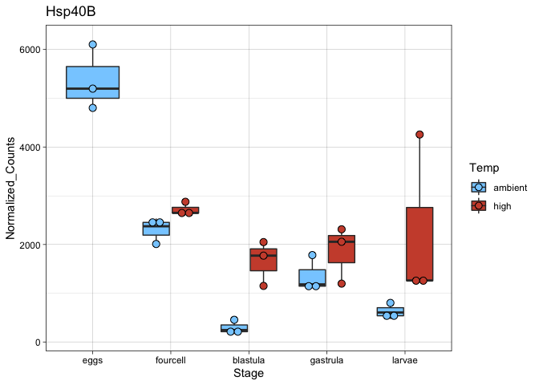
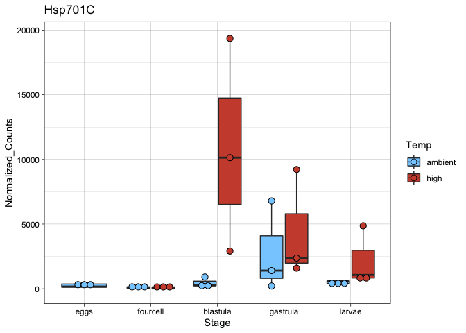

HSP-Vis
================
Maggie Schedl
7/1/2020

``` r
library(DESeq2)
```

    ## Loading required package: S4Vectors

    ## Loading required package: stats4

    ## Loading required package: BiocGenerics

    ## Loading required package: parallel

    ## 
    ## Attaching package: 'BiocGenerics'

    ## The following objects are masked from 'package:parallel':
    ## 
    ##     clusterApply, clusterApplyLB, clusterCall, clusterEvalQ,
    ##     clusterExport, clusterMap, parApply, parCapply, parLapply,
    ##     parLapplyLB, parRapply, parSapply, parSapplyLB

    ## The following objects are masked from 'package:stats':
    ## 
    ##     IQR, mad, sd, var, xtabs

    ## The following objects are masked from 'package:base':
    ## 
    ##     anyDuplicated, append, as.data.frame, basename, cbind, colnames,
    ##     dirname, do.call, duplicated, eval, evalq, Filter, Find, get, grep,
    ##     grepl, intersect, is.unsorted, lapply, Map, mapply, match, mget,
    ##     order, paste, pmax, pmax.int, pmin, pmin.int, Position, rank,
    ##     rbind, Reduce, rownames, sapply, setdiff, sort, table, tapply,
    ##     union, unique, unsplit, which, which.max, which.min

    ## 
    ## Attaching package: 'S4Vectors'

    ## The following object is masked from 'package:base':
    ## 
    ##     expand.grid

    ## Loading required package: IRanges

    ## Loading required package: GenomicRanges

    ## Loading required package: GenomeInfoDb

    ## Loading required package: SummarizedExperiment

    ## Loading required package: Biobase

    ## Welcome to Bioconductor
    ## 
    ##     Vignettes contain introductory material; view with
    ##     'browseVignettes()'. To cite Bioconductor, see
    ##     'citation("Biobase")', and for packages 'citation("pkgname")'.

    ## Loading required package: DelayedArray

    ## Loading required package: matrixStats

    ## 
    ## Attaching package: 'matrixStats'

    ## The following objects are masked from 'package:Biobase':
    ## 
    ##     anyMissing, rowMedians

    ## 
    ## Attaching package: 'DelayedArray'

    ## The following objects are masked from 'package:matrixStats':
    ## 
    ##     colMaxs, colMins, colRanges, rowMaxs, rowMins, rowRanges

    ## The following objects are masked from 'package:base':
    ## 
    ##     aperm, apply, rowsum

``` r
library(ggplot2)
library(pheatmap)
library(RColorBrewer)
library(reshape2)
library(rsconnect)
library(gplots)
```

    ## 
    ## Attaching package: 'gplots'

    ## The following object is masked from 'package:IRanges':
    ## 
    ##     space

    ## The following object is masked from 'package:S4Vectors':
    ## 
    ##     space

    ## The following object is masked from 'package:stats':
    ## 
    ##     lowess

``` r
library(ashr)
library(dplyr)
```

    ## 
    ## Attaching package: 'dplyr'

    ## The following object is masked from 'package:matrixStats':
    ## 
    ##     count

    ## The following object is masked from 'package:Biobase':
    ## 
    ##     combine

    ## The following objects are masked from 'package:GenomicRanges':
    ## 
    ##     intersect, setdiff, union

    ## The following object is masked from 'package:GenomeInfoDb':
    ## 
    ##     intersect

    ## The following objects are masked from 'package:IRanges':
    ## 
    ##     collapse, desc, intersect, setdiff, slice, union

    ## The following objects are masked from 'package:S4Vectors':
    ## 
    ##     first, intersect, rename, setdiff, setequal, union

    ## The following objects are masked from 'package:BiocGenerics':
    ## 
    ##     combine, intersect, setdiff, union

    ## The following objects are masked from 'package:stats':
    ## 
    ##     filter, lag

    ## The following objects are masked from 'package:base':
    ## 
    ##     intersect, setdiff, setequal, union

``` r
library(tidyr)
```

    ## 
    ## Attaching package: 'tidyr'

    ## The following object is masked from 'package:reshape2':
    ## 
    ##     smiths

    ## The following object is masked from 'package:S4Vectors':
    ## 
    ##     expand

``` r
library(dlookr)
```

    ## Loading required package: mice

    ## 
    ## Attaching package: 'mice'

    ## The following objects are masked from 'package:SummarizedExperiment':
    ## 
    ##     cbind, rbind

    ## The following objects are masked from 'package:DelayedArray':
    ## 
    ##     cbind, rbind

    ## The following objects are masked from 'package:IRanges':
    ## 
    ##     cbind, rbind

    ## The following objects are masked from 'package:S4Vectors':
    ## 
    ##     cbind, rbind

    ## The following objects are masked from 'package:BiocGenerics':
    ## 
    ##     cbind, rbind

    ## The following objects are masked from 'package:base':
    ## 
    ##     cbind, rbind

    ## Registered S3 method overwritten by 'quantmod':
    ##   method            from
    ##   as.zoo.data.frame zoo

    ## 
    ## Attaching package: 'dlookr'

    ## The following object is masked from 'package:IRanges':
    ## 
    ##     transform

    ## The following object is masked from 'package:S4Vectors':
    ## 
    ##     transform

    ## The following object is masked from 'package:base':
    ## 
    ##     transform

``` r
library(tximport)
library(naniar)
library(tidyverse)
```

    ## ── Attaching packages ────────────────────────────────────────────────────────────────────────────────────── tidyverse 1.3.0 ──

    ## ✓ tibble  3.0.1     ✓ stringr 1.4.0
    ## ✓ readr   1.3.1     ✓ forcats 0.5.0
    ## ✓ purrr   0.3.4

    ## ── Conflicts ───────────────────────────────────────────────────────────────────────────────────────── tidyverse_conflicts() ──
    ## x dplyr::collapse()   masks IRanges::collapse()
    ## x dplyr::combine()    masks Biobase::combine(), BiocGenerics::combine()
    ## x dplyr::count()      masks matrixStats::count()
    ## x dplyr::desc()       masks IRanges::desc()
    ## x tidyr::expand()     masks S4Vectors::expand()
    ## x dplyr::filter()     masks stats::filter()
    ## x dplyr::first()      masks S4Vectors::first()
    ## x dplyr::lag()        masks stats::lag()
    ## x ggplot2::Position() masks BiocGenerics::Position(), base::Position()
    ## x purrr::reduce()     masks GenomicRanges::reduce(), IRanges::reduce()
    ## x dplyr::rename()     masks S4Vectors::rename()
    ## x purrr::simplify()   masks DelayedArray::simplify()
    ## x dplyr::slice()      masks IRanges::slice()

``` r
library(dplyr)
library(stringr)
library(ggpubr)
```

Read i orthogroups file and do same file manipulations as in annotation
script

``` r
orthologs <- read.delim("LORF_EL90.pep__v__SPU_peptide.tsv", sep = "\t")
head(orthologs)
```

    ##   Orthogroup
    ## 1  OG0000000
    ## 2  OG0000000
    ## 3  OG0000001
    ## 4  OG0000001
    ## 5  OG0000002
    ## 6  OG0000003
    ##                                                                           LORF_EL90.pep
    ## 1 TRINITY_DN56081_c1_g2_i2.p1, TRINITY_DN56081_c1_g3_i1.p1, TRINITY_DN56081_c1_g1_i1.p1
    ## 2                              TRINITY_DN56081_c0_g1_i2.p1, TRINITY_DN56081_c0_g1_i5.p1
    ## 3                                                          TRINITY_DN108939_c0_g1_i1.p1
    ## 4                                                           TRINITY_DN10826_c0_g1_i6.p1
    ## 5                              TRINITY_DN17786_c0_g1_i2.p1, TRINITY_DN17786_c0_g1_i5.p1
    ## 6                             TRINITY_DN49892_c0_g1_i11.p1, TRINITY_DN35058_c0_g1_i6.p1
    ##                                                                                                                                                                                                                                                                                                  SPU_peptide
    ## 1                                                                                                                                                                                                                                                                         SPU_027035, SPU_004012, SPU_027207
    ## 2                         SPU_023183, SPU_022564, SPU_002888, SPU_008707, SPU_026036, SPU_008498, SPU_000863, SPU_018384, SPU_025179, SPU_016759, SPU_003303, SPU_003553, SPU_015033, SPU_003539, SPU_003247, SPU_006610, SPU_022001, SPU_005383, SPU_003797, SPU_017505, SPU_009659, SPU_013038, SPU_016060
    ## 3                                                                                                                                                                                                                                                                                     SPU_027574, SPU_019249
    ## 4 SPU_009978, SPU_019937, SPU_018594, SPU_001189, SPU_018839, SPU_007888, SPU_007889, SPU_027473, SPU_012635, SPU_020572, SPU_020571, SPU_009630, SPU_006586, SPU_008153, SPU_017855, SPU_024683, SPU_017108, SPU_024682, SPU_002327, SPU_011979, SPU_013146, SPU_010581, SPU_009699, SPU_011131, SPU_013233
    ## 5 SPU_001711, SPU_010740, SPU_015261, SPU_000464, SPU_014175, SPU_002486, SPU_002905, SPU_002772, SPU_007666, SPU_005645, SPU_007820, SPU_009181, SPU_015741, SPU_002828, SPU_003576, SPU_024346, SPU_014085, SPU_000892, SPU_000474, SPU_016236, SPU_013389, SPU_012142, SPU_006563, SPU_013690, SPU_015560
    ## 6                                                                                                                                                                                                                                                                                                 SPU_002006

``` r
EL.orthologs <- orthologs %>% 
  select(1,2)
head(EL.orthologs)
```

    ##   Orthogroup
    ## 1  OG0000000
    ## 2  OG0000000
    ## 3  OG0000001
    ## 4  OG0000001
    ## 5  OG0000002
    ## 6  OG0000003
    ##                                                                           LORF_EL90.pep
    ## 1 TRINITY_DN56081_c1_g2_i2.p1, TRINITY_DN56081_c1_g3_i1.p1, TRINITY_DN56081_c1_g1_i1.p1
    ## 2                              TRINITY_DN56081_c0_g1_i2.p1, TRINITY_DN56081_c0_g1_i5.p1
    ## 3                                                          TRINITY_DN108939_c0_g1_i1.p1
    ## 4                                                           TRINITY_DN10826_c0_g1_i6.p1
    ## 5                              TRINITY_DN17786_c0_g1_i2.p1, TRINITY_DN17786_c0_g1_i5.p1
    ## 6                             TRINITY_DN49892_c0_g1_i11.p1, TRINITY_DN35058_c0_g1_i6.p1

``` r
# collapse df in to one column multiple rows instead of one row multiple columns
tr.orthogroups <- separate_rows(EL.orthologs, "LORF_EL90.pep", sep = ",", convert = FALSE)
head(tr.orthogroups)
```

    ## # A tibble: 6 x 2
    ##   Orthogroup LORF_EL90.pep                 
    ##   <chr>      <chr>                         
    ## 1 OG0000000  "TRINITY_DN56081_c1_g2_i2.p1" 
    ## 2 OG0000000  " TRINITY_DN56081_c1_g3_i1.p1"
    ## 3 OG0000000  " TRINITY_DN56081_c1_g1_i1.p1"
    ## 4 OG0000000  "TRINITY_DN56081_c0_g1_i2.p1" 
    ## 5 OG0000000  " TRINITY_DN56081_c0_g1_i5.p1"
    ## 6 OG0000001  "TRINITY_DN108939_c0_g1_i1.p1"

``` r
# remove extra characters of .p#s
tr.orthogroups <-mapply(gsub, pattern = ".p1", replacement = "", tr.orthogroups)
tr.orthogroups <- as.data.frame(tr.orthogroups)
# I don't know why this always removes the column names but it does
# remove .p2
tr.orthogroups <-mapply(gsub, pattern = ".p2", replacement = "", tr.orthogroups)
tr.orthogroups <- as.data.frame(tr.orthogroups)
# remove .p3
tr.orthogroups <-mapply(gsub, pattern = ".p3", replacement = "", tr.orthogroups)
tr.orthogroups <- as.data.frame(tr.orthogroups)
# remove .p4
tr.orthogroups <-mapply(gsub, pattern = ".p4", replacement = "", tr.orthogroups)
tr.orthogroups <- as.data.frame(tr.orthogroups)
# remove .p5
tr.orthogroups <-mapply(gsub, pattern = ".p5", replacement = "", tr.orthogroups)
tr.orthogroups <- as.data.frame(tr.orthogroups)
# add column names
colnames(tr.orthogroups) <- c("Orthogroup", "transcript_id")
head(tr.orthogroups)
```

    ##   Orthogroup             transcript_id
    ## 1  OG0000000  TRINITY_DN56081_c1_g2_i2
    ## 2  OG0000000  TRINITY_DN56081_c1_g3_i1
    ## 3  OG0000000  TRINITY_DN56081_c1_g1_i1
    ## 4  OG0000000  TRINITY_DN56081_c0_g1_i2
    ## 5  OG0000000  TRINITY_DN56081_c0_g1_i5
    ## 6  OG0000001 TRINITY_DN108939_c0_g1_i1

``` r
# remove the isoform notations from this file, because the counts file is only by gene. Its ok to collapse by uniquing the transcript ID because they should be in the same orthogroup 
# I can use . as any character! 
tr.orthogroups.genes <-mapply(gsub, pattern = "_i.", replacement = "", tr.orthogroups)
tr.orthogroups.genes <- as.data.frame(tr.orthogroups.genes)
# there might be random spaces in the file??
tr.orthogroups.genes <-mapply(gsub, pattern = " ", replacement = "", tr.orthogroups.genes)
tr.orthogroups.genes <- as.data.frame(tr.orthogroups.genes)
colnames(tr.orthogroups.genes) <- c("Orthogroup", "transcript_id")
tr.orthogroups.genes.d <- unique(tr.orthogroups.genes)

tr.orthogroups.genes[1:100,]
```

    ##     Orthogroup          transcript_id
    ## 1    OG0000000  TRINITY_DN56081_c1_g2
    ## 2    OG0000000  TRINITY_DN56081_c1_g3
    ## 3    OG0000000  TRINITY_DN56081_c1_g1
    ## 4    OG0000000  TRINITY_DN56081_c0_g1
    ## 5    OG0000000  TRINITY_DN56081_c0_g1
    ## 6    OG0000001 TRINITY_DN108939_c0_g1
    ## 7    OG0000001  TRINITY_DN10826_c0_g1
    ## 8    OG0000002  TRINITY_DN17786_c0_g1
    ## 9    OG0000002  TRINITY_DN17786_c0_g1
    ## 10   OG0000003 TRINITY_DN49892_c0_g11
    ## 11   OG0000003  TRINITY_DN35058_c0_g1
    ## 12   OG0000003 TRINITY_DN114943_c0_g1
    ## 13   OG0000003  TRINITY_DN78128_c0_g1
    ## 14   OG0000004   TRINITY_DN6826_c0_g1
    ## 15   OG0000005 TRINITY_DN110841_c0_g1
    ## 16   OG0000005  TRINITY_DN46534_c0_g1
    ## 17   OG0000005  TRINITY_DN92340_c0_g1
    ## 18   OG0000006  TRINITY_DN42618_c0_g1
    ## 19   OG0000006  TRINITY_DN26758_c0_g1
    ## 20   OG0000006  TRINITY_DN72314_c0_g1
    ## 21   OG0000006  TRINITY_DN76548_c0_g1
    ## 22   OG0000006  TRINITY_DN74097_c0_g1
    ## 23   OG0000007  TRINITY_DN91752_c0_g1
    ## 24   OG0000008  TRINITY_DN35209_c0_g1
    ## 25   OG0000008  TRINITY_DN35209_c0_g2
    ## 26   OG0000009  TRINITY_DN68318_c0_g1
    ## 27   OG0000009  TRINITY_DN98384_c0_g1
    ## 28   OG0000009  TRINITY_DN79843_c0_g1
    ## 29   OG0000010  TRINITY_DN72839_c0_g1
    ## 30   OG0000011  TRINITY_DN23187_c0_g1
    ## 31   OG0000011  TRINITY_DN34527_c0_g1
    ## 32   OG0000011  TRINITY_DN42403_c0_g1
    ## 33   OG0000011  TRINITY_DN17592_c0_g1
    ## 34   OG0000011 TRINITY_DN33021_c0_g10
    ## 35   OG0000011  TRINITY_DN31699_c0_g1
    ## 36   OG0000011  TRINITY_DN31699_c0_g1
    ## 37   OG0000011  TRINITY_DN42166_c0_g1
    ## 38   OG0000011  TRINITY_DN79436_c0_g1
    ## 39   OG0000011  TRINITY_DN17106_c1_g1
    ## 40   OG0000011  TRINITY_DN60091_c0_g1
    ## 41   OG0000011  TRINITY_DN52646_c0_g1
    ## 42   OG0000011  TRINITY_DN18134_c0_g1
    ## 43   OG0000011  TRINITY_DN20561_c0_g1
    ## 44   OG0000011  TRINITY_DN61326_c0_g1
    ## 45   OG0000011  TRINITY_DN43346_c0_g1
    ## 46   OG0000011  TRINITY_DN45540_c0_g1
    ## 47   OG0000011  TRINITY_DN48062_c0_g1
    ## 48   OG0000012  TRINITY_DN82227_c0_g1
    ## 49   OG0000012  TRINITY_DN82227_c0_g1
    ## 50   OG0000012  TRINITY_DN45193_c0_g1
    ## 51   OG0000012  TRINITY_DN45193_c0_g1
    ## 52   OG0000012  TRINITY_DN51900_c0_g1
    ## 53   OG0000013  TRINITY_DN64607_c0_g1
    ## 54   OG0000013  TRINITY_DN40302_c0_g1
    ## 55   OG0000013  TRINITY_DN40302_c0_g1
    ## 56   OG0000014   TRINITY_DN3740_c0_g1
    ## 57   OG0000015 TRINITY_DN110830_c0_g1
    ## 58   OG0000017  TRINITY_DN15019_c0_g1
    ## 59   OG0000017  TRINITY_DN15019_c0_g1
    ## 60   OG0000017 TRINITY_DN109560_c0_g1
    ## 61   OG0000018  TRINITY_DN64986_c0_g1
    ## 62   OG0000018 TRINITY_DN106894_c0_g1
    ## 63   OG0000018  TRINITY_DN64986_c0_g1
    ## 64   OG0000019 TRINITY_DN102067_c0_g1
    ## 65   OG0000019 TRINITY_DN115068_c0_g1
    ## 66   OG0000020  TRINITY_DN65263_c0_g1
    ## 67   OG0000020  TRINITY_DN65263_c0_g1
    ## 68   OG0000020  TRINITY_DN65263_c0_g1
    ## 69   OG0000020  TRINITY_DN78837_c0_g1
    ## 70   OG0000020  TRINITY_DN59168_c0_g1
    ## 71   OG0000020   TRINITY_DN7000_c0_g2
    ## 72   OG0000020  TRINITY_DN51152_c0_g1
    ## 73   OG0000020  TRINITY_DN72197_c0_g1
    ## 74   OG0000020  TRINITY_DN33746_c0_g1
    ## 75   OG0000020  TRINITY_DN78842_c0_g1
    ## 76   OG0000020  TRINITY_DN34255_c0_g1
    ## 77   OG0000020  TRINITY_DN54484_c0_g1
    ## 78   OG0000020  TRINITY_DN62929_c0_g1
    ## 79   OG0000020  TRINITY_DN46633_c0_g1
    ## 80   OG0000021  TRINITY_DN35207_c0_g2
    ## 81   OG0000021  TRINITY_DN33378_c0_g2
    ## 82   OG0000021  TRINITY_DN33378_c0_g2
    ## 83   OG0000021  TRINITY_DN42287_c0_g1
    ## 84   OG0000021  TRINITY_DN42287_c0_g1
    ## 85   OG0000021 TRINITY_DN104561_c0_g1
    ## 86   OG0000021  TRINITY_DN84167_c0_g1
    ## 87   OG0000021 TRINITY_DN24349_c0_g10
    ## 88   OG0000021  TRINITY_DN24349_c0_g1
    ## 89   OG0000021  TRINITY_DN24349_c0_g1
    ## 90   OG0000021  TRINITY_DN40403_c0_g1
    ## 91   OG0000021  TRINITY_DN75469_c0_g1
    ## 92   OG0000021 TRINITY_DN107161_c0_g1
    ## 93   OG0000021  TRINITY_DN73480_c0_g1
    ## 94   OG0000022  TRINITY_DN59104_c0_g1
    ## 95   OG0000023  TRINITY_DN46228_c0_g1
    ## 96   OG0000023  TRINITY_DN63184_c0_g1
    ## 97   OG0000023  TRINITY_DN67584_c0_g1
    ## 98   OG0000023  TRINITY_DN53859_c0_g1
    ## 99   OG0000023  TRINITY_DN10093_c0_g1
    ## 100  OG0000023  TRINITY_DN10093_c0_g1

``` r
tr.orthogroups.genes.d[1:100,]
```

    ##     Orthogroup          transcript_id
    ## 1    OG0000000  TRINITY_DN56081_c1_g2
    ## 2    OG0000000  TRINITY_DN56081_c1_g3
    ## 3    OG0000000  TRINITY_DN56081_c1_g1
    ## 4    OG0000000  TRINITY_DN56081_c0_g1
    ## 6    OG0000001 TRINITY_DN108939_c0_g1
    ## 7    OG0000001  TRINITY_DN10826_c0_g1
    ## 8    OG0000002  TRINITY_DN17786_c0_g1
    ## 10   OG0000003 TRINITY_DN49892_c0_g11
    ## 11   OG0000003  TRINITY_DN35058_c0_g1
    ## 12   OG0000003 TRINITY_DN114943_c0_g1
    ## 13   OG0000003  TRINITY_DN78128_c0_g1
    ## 14   OG0000004   TRINITY_DN6826_c0_g1
    ## 15   OG0000005 TRINITY_DN110841_c0_g1
    ## 16   OG0000005  TRINITY_DN46534_c0_g1
    ## 17   OG0000005  TRINITY_DN92340_c0_g1
    ## 18   OG0000006  TRINITY_DN42618_c0_g1
    ## 19   OG0000006  TRINITY_DN26758_c0_g1
    ## 20   OG0000006  TRINITY_DN72314_c0_g1
    ## 21   OG0000006  TRINITY_DN76548_c0_g1
    ## 22   OG0000006  TRINITY_DN74097_c0_g1
    ## 23   OG0000007  TRINITY_DN91752_c0_g1
    ## 24   OG0000008  TRINITY_DN35209_c0_g1
    ## 25   OG0000008  TRINITY_DN35209_c0_g2
    ## 26   OG0000009  TRINITY_DN68318_c0_g1
    ## 27   OG0000009  TRINITY_DN98384_c0_g1
    ## 28   OG0000009  TRINITY_DN79843_c0_g1
    ## 29   OG0000010  TRINITY_DN72839_c0_g1
    ## 30   OG0000011  TRINITY_DN23187_c0_g1
    ## 31   OG0000011  TRINITY_DN34527_c0_g1
    ## 32   OG0000011  TRINITY_DN42403_c0_g1
    ## 33   OG0000011  TRINITY_DN17592_c0_g1
    ## 34   OG0000011 TRINITY_DN33021_c0_g10
    ## 35   OG0000011  TRINITY_DN31699_c0_g1
    ## 37   OG0000011  TRINITY_DN42166_c0_g1
    ## 38   OG0000011  TRINITY_DN79436_c0_g1
    ## 39   OG0000011  TRINITY_DN17106_c1_g1
    ## 40   OG0000011  TRINITY_DN60091_c0_g1
    ## 41   OG0000011  TRINITY_DN52646_c0_g1
    ## 42   OG0000011  TRINITY_DN18134_c0_g1
    ## 43   OG0000011  TRINITY_DN20561_c0_g1
    ## 44   OG0000011  TRINITY_DN61326_c0_g1
    ## 45   OG0000011  TRINITY_DN43346_c0_g1
    ## 46   OG0000011  TRINITY_DN45540_c0_g1
    ## 47   OG0000011  TRINITY_DN48062_c0_g1
    ## 48   OG0000012  TRINITY_DN82227_c0_g1
    ## 50   OG0000012  TRINITY_DN45193_c0_g1
    ## 52   OG0000012  TRINITY_DN51900_c0_g1
    ## 53   OG0000013  TRINITY_DN64607_c0_g1
    ## 54   OG0000013  TRINITY_DN40302_c0_g1
    ## 56   OG0000014   TRINITY_DN3740_c0_g1
    ## 57   OG0000015 TRINITY_DN110830_c0_g1
    ## 58   OG0000017  TRINITY_DN15019_c0_g1
    ## 60   OG0000017 TRINITY_DN109560_c0_g1
    ## 61   OG0000018  TRINITY_DN64986_c0_g1
    ## 62   OG0000018 TRINITY_DN106894_c0_g1
    ## 64   OG0000019 TRINITY_DN102067_c0_g1
    ## 65   OG0000019 TRINITY_DN115068_c0_g1
    ## 66   OG0000020  TRINITY_DN65263_c0_g1
    ## 69   OG0000020  TRINITY_DN78837_c0_g1
    ## 70   OG0000020  TRINITY_DN59168_c0_g1
    ## 71   OG0000020   TRINITY_DN7000_c0_g2
    ## 72   OG0000020  TRINITY_DN51152_c0_g1
    ## 73   OG0000020  TRINITY_DN72197_c0_g1
    ## 74   OG0000020  TRINITY_DN33746_c0_g1
    ## 75   OG0000020  TRINITY_DN78842_c0_g1
    ## 76   OG0000020  TRINITY_DN34255_c0_g1
    ## 77   OG0000020  TRINITY_DN54484_c0_g1
    ## 78   OG0000020  TRINITY_DN62929_c0_g1
    ## 79   OG0000020  TRINITY_DN46633_c0_g1
    ## 80   OG0000021  TRINITY_DN35207_c0_g2
    ## 81   OG0000021  TRINITY_DN33378_c0_g2
    ## 83   OG0000021  TRINITY_DN42287_c0_g1
    ## 85   OG0000021 TRINITY_DN104561_c0_g1
    ## 86   OG0000021  TRINITY_DN84167_c0_g1
    ## 87   OG0000021 TRINITY_DN24349_c0_g10
    ## 88   OG0000021  TRINITY_DN24349_c0_g1
    ## 90   OG0000021  TRINITY_DN40403_c0_g1
    ## 91   OG0000021  TRINITY_DN75469_c0_g1
    ## 92   OG0000021 TRINITY_DN107161_c0_g1
    ## 93   OG0000021  TRINITY_DN73480_c0_g1
    ## 94   OG0000022  TRINITY_DN59104_c0_g1
    ## 95   OG0000023  TRINITY_DN46228_c0_g1
    ## 96   OG0000023  TRINITY_DN63184_c0_g1
    ## 97   OG0000023  TRINITY_DN67584_c0_g1
    ## 98   OG0000023  TRINITY_DN53859_c0_g1
    ## 99   OG0000023  TRINITY_DN10093_c0_g1
    ## 101  OG0000023  TRINITY_DN40415_c0_g1
    ## 102  OG0000023 TRINITY_DN102989_c0_g1
    ## 103  OG0000024  TRINITY_DN45722_c0_g1
    ## 104  OG0000024 TRINITY_DN35920_c0_g17
    ## 105  OG0000024  TRINITY_DN73627_c0_g1
    ## 106  OG0000024   TRINITY_DN8604_c0_g1
    ## 107  OG0000025  TRINITY_DN36347_c0_g1
    ## 110  OG0000025  TRINITY_DN29599_c0_g1
    ## 111  OG0000026  TRINITY_DN76575_c0_g1
    ## 112  OG0000026 TRINITY_DN76575_c0_g15
    ## 116  OG0000026 TRINITY_DN76575_c0_g11
    ## 117  OG0000026 TRINITY_DN76575_c0_g14
    ## 120  OG0000026 TRINITY_DN76575_c0_g13
    ## 123  OG0000027  TRINITY_DN72186_c0_g1

Read in the conts file This is from the combined
model

``` r
normalized_counts_dds <- read.delim("normalized_counts_dds.txt", sep = "\t")

colnames(normalized_counts_dds) <- c("transcript_id","29_4cell_rep_1" ,"29_4cell_rep_2" ,"29_4cell_rep_3", "29_blast_rep_1", "29_blast_rep_2" ,"29_blast_rep_3", "29_gast_rep_1",  "29_gast_rep_2",  "29_gast_rep_3", "29_larv_rep_1",  "29_larv_rep_2",  "29_larv_rep_3", "33_4cell_rep_1", "33_4cell_rep_2", "33_4cell_rep_3", "33_blast_rep_1", "33_blast_rep_2", "33_blast_rep_3", "33_gast_rep_1", "33_gast_rep_2",  "33_gast_rep_3",  "33_larv_rep_1",  "33_larv_rep_2",  "33_larv_rep_3", "eggs_rep_1" , "eggs_rep_2",  "eggs_rep_3"  )
head(normalized_counts_dds)
```

    ##            transcript_id 29_4cell_rep_1 29_4cell_rep_2 29_4cell_rep_3
    ## 1 TRINITY_DN100003_c0_g1      0.6596409      0.0000000       0.000000
    ## 2  TRINITY_DN10000_c0_g1    245.2934858    436.1378270     592.285287
    ## 3 TRINITY_DN100013_c0_g1      3.2732692      0.7317713       3.132227
    ## 4 TRINITY_DN100032_c0_g1      0.0000000      0.0000000       0.000000
    ## 5 TRINITY_DN100034_c0_g1     25.2194694      2.9671748     482.069172
    ## 6 TRINITY_DN100035_c0_g1      0.6627851      0.0000000       0.000000
    ##   29_blast_rep_1 29_blast_rep_2 29_blast_rep_3 29_gast_rep_1 29_gast_rep_2
    ## 1       0.000000       2.330338        0.00000      2.236774      0.000000
    ## 2    1012.195279     836.015127      904.48344    760.736235    550.773207
    ## 3       0.000000       0.000000        0.00000      1.109960      0.000000
    ## 4       2.554428       0.000000        0.00000      6.741026      0.000000
    ## 5       7.674936       0.000000       84.00324      0.000000      0.000000
    ## 6       0.000000       0.000000        0.00000      7.865877      8.046165
    ##   29_gast_rep_3 29_larv_rep_1 29_larv_rep_2 29_larv_rep_3 33_4cell_rep_1
    ## 1     17.438597      0.000000     11.787526     5.7987548      0.0000000
    ## 2    505.793084    696.078306    300.530327   376.9056264    207.2712893
    ## 3      2.257490      0.000000      0.000000     0.9591771      3.8800986
    ## 4     13.709918      9.061931      9.473254    15.5340991      0.0000000
    ## 5      8.390833      1.296526      0.000000     0.0000000     33.0458872
    ## 6      6.094338      7.768713     24.871559    17.4788538      0.7857461
    ##   33_4cell_rep_2 33_4cell_rep_3 33_blast_rep_1 33_blast_rep_2 33_blast_rep_3
    ## 1       0.000000       0.000000       2.080696       1.282274      4.9203840
    ## 2     398.347466     598.111444     833.512023     626.832366    598.1305745
    ## 3       0.000000       1.879087       0.000000       1.272400      3.9058466
    ## 4       0.000000       0.000000       1.045146       0.000000      6.9210666
    ## 5       1.639985     459.050736       6.280374       2.580565    236.6720465
    ## 6       0.000000       0.000000       2.090654       0.000000      0.9888989
    ##   33_gast_rep_1 33_gast_rep_2 33_gast_rep_3 33_larv_rep_1 33_larv_rep_2
    ## 1      4.582290      9.052549    12.4744746      1.203557     14.215564
    ## 2    716.901157    405.953252   481.5169149    602.773665    253.067256
    ## 3      0.000000      0.000000     0.9524059      1.194504      1.881200
    ## 4      2.301649      5.683783     9.6392154     35.062536     11.424173
    ## 5      1.152556      0.000000     0.9653528      1.210864      4.767171
    ## 6     13.812264     12.506467     1.9281696      3.627779     16.186999
    ##   33_larv_rep_3 eggs_rep_1 eggs_rep_2 eggs_rep_3
    ## 1     1.7291657    0.00000   0.000000   0.000000
    ## 2   380.7379881  189.06947 251.791403 651.988611
    ## 3     0.0000000    0.00000   0.000000   1.621334
    ## 4    33.0044731    0.00000   0.000000   0.000000
    ## 5     0.8698426   30.24205   1.904393 692.723534
    ## 6    19.9798120    0.00000   0.000000   0.000000

``` r
counts_dds_orthogroups <- merge(normalized_counts_dds, tr.orthogroups.genes.d, by= "transcript_id", sort = TRUE )
head(counts_dds_orthogroups)
```

    ##            transcript_id 29_4cell_rep_1 29_4cell_rep_2 29_4cell_rep_3
    ## 1      TRINITY_DN1_c0_g1   1525.2931225     1055.75121      3887.1416
    ## 2     TRINITY_DN10_c0_g1    218.9623850       17.85284       652.2288
    ## 3    TRINITY_DN100_c0_g1   1936.2004864     1248.62278      2002.0052
    ## 4   TRINITY_DN1000_c1_g1    488.8102540      475.82717       764.6208
    ## 5  TRINITY_DN10000_c0_g1    245.2934858      436.13783       592.2853
    ## 6 TRINITY_DN100003_c0_g1      0.6596409        0.00000         0.0000
    ##   29_blast_rep_1 29_blast_rep_2 29_blast_rep_3 29_gast_rep_1 29_gast_rep_2
    ## 1      8465.8548    5510.562339     15838.1453   4629.475106     3480.4523
    ## 2     18061.7012   22146.482243     16507.4466   9432.963810    11029.4570
    ## 3      8480.8062    6594.337487      6871.8474   4975.803475     5326.9765
    ## 4       343.0609     364.836499       449.7334    405.356820      563.3738
    ## 5      1012.1953     836.015127       904.4834    760.736235      550.7732
    ## 6         0.0000       2.330338         0.0000      2.236774        0.0000
    ##   29_gast_rep_3 29_larv_rep_1 29_larv_rep_2 29_larv_rep_3 33_4cell_rep_1
    ## 1     9205.1098     6944.6664    2624.55566   7468.076235      1587.5235
    ## 2     9056.0805    10119.4735   13620.71192   8288.045792       253.2844
    ## 3     5031.1780     4319.4069    2984.27103   3970.378375      1946.0540
    ## 4      390.8323      529.3630     487.76805    356.129044       528.3288
    ## 5      505.7931      696.0783     300.53033    376.905626       207.2713
    ## 6       17.4386        0.0000      11.78753      5.798755         0.0000
    ##   33_4cell_rep_2 33_4cell_rep_3 33_blast_rep_1 33_blast_rep_2 33_blast_rep_3
    ## 1      1093.9295      3488.9028    6183.663200    4957.303527    9401.982053
    ## 2        33.7148       412.5793   12533.300214   15905.943486    8807.145990
    ## 3      1335.8978      1673.7495    6144.282605    7517.413594    5057.644626
    ## 4       449.6783       623.3024     376.045352     502.287275     520.269279
    ## 5       398.3475       598.1114     833.512023     626.832366     598.130575
    ## 6         0.0000         0.0000       2.080696       1.282274       4.920384
    ##   33_gast_rep_1 33_gast_rep_2 33_gast_rep_3 33_larv_rep_1 33_larv_rep_2
    ## 1    6541.88911   4074.786060   10010.12666   6859.423584    2466.40463
    ## 2    9179.31616  10803.578478    8971.67993   7714.132486   14305.95015
    ## 3    4694.73694   4701.263328    3554.62936   3469.405069    3013.74914
    ## 4     500.56578    609.513820     460.79712    420.467965     460.83407
    ## 5     716.90116    405.953252     481.51691    602.773665     253.06726
    ## 6       4.58229      9.052549      12.47447      1.203557      14.21556
    ##   33_larv_rep_3 eggs_rep_1 eggs_rep_2 eggs_rep_3 Orthogroup
    ## 1   7361.753303  1320.2167 1100.41685  3674.5034  OG0009146
    ## 2   9377.019057   263.5568   64.93252   453.8350  OG0009109
    ## 3   3334.713199  2185.2433 1255.34260  1694.1266  OG0003068
    ## 4    316.847883   562.4990  609.84291   895.0971  OG0003190
    ## 5    380.737988   189.0695  251.79140   651.9886  OG0010723
    ## 6      1.729166     0.0000    0.00000     0.0000  OG0012527

``` r
dim(normalized_counts_dds) # 13296
```

    ## [1] 13296    28

``` r
dim(counts_dds_orthogroups) # 13226
```

    ## [1] 13226    29

``` r
# not all the ones in the original orthogroups file are present because lowly expressed genes were filtered out in making the normalized count matrix
```

Read in the annotation file that has orthogroups and limited to HSP only
(used grep in the terminal to subset for only HSP containing
lines)

``` r
annot.ortho.SPU.HSP <- read.delim("annot.ortho.SPU.HSP.txt", sep = "\t", header = FALSE)
colnames(annot.ortho.SPU.HSP) <- c("line", "spu_id",   "Orthogroup",  "family_member" ,"common_name", "synonyms",  "best_genbank_hit")
annot.ortho.SPU.HSP$line <- NULL
head(annot.ortho.SPU.HSP)
```

    ##       spu_id Orthogroup family_member common_name synonyms best_genbank_hit
    ## 1 SPU_001586  OG0006739         HSP90     Hsp902A  Hatpase     NP_001016282
    ## 2 SPU_002779  OG0009336         HSP70     Hsp703B    HSC70           Q06068
    ## 3 SPU_008560  OG0009128         HSP70     Hsp702A    HSC70         BAD90025
    ## 4 SPU_008656  OG0010480         HSP40      Hsp40D     DNAJ     NP_001035581
    ## 5 SPU_009165  OG0002270         HSP70     Hsp701A    HSC70         BAD12572
    ## 6 SPU_009477  OG0002278         HSP70     Hsp701C    HSC70       CAA43653

Separate out the orhtogroup and the commonname columns and then merge by
orthogroup to the counts matrix

``` r
ortho.HSP <- annot.ortho.SPU.HSP[,c(2,4)]

dim(ortho.HSP) #18
```

    ## [1] 18  2

``` r
EL.ortho.HSP.counts <- merge(counts_dds_orthogroups, ortho.HSP, by= "Orthogroup", sort = TRUE)
EL.ortho.HSP.counts
```

    ##    Orthogroup         transcript_id 29_4cell_rep_1 29_4cell_rep_2
    ## 1   OG0002005 TRINITY_DN17752_c0_g1        0.00000         0.0000
    ## 2   OG0002270   TRINITY_DN398_c0_g1    22133.93561     21736.3201
    ## 3   OG0002278   TRINITY_DN580_c0_g1       35.68852       255.8697
    ## 4   OG0003197  TRINITY_DN1032_c0_g1     2253.05343       918.7596
    ## 5   OG0003576  TRINITY_DN2616_c1_g2      209.08741       104.6085
    ## 6   OG0004475  TRINITY_DN8072_c0_g1      193.83336       378.9423
    ## 7   OG0004700 TRINITY_DN10465_c0_g2      429.98329       376.7659
    ## 8   OG0006739  TRINITY_DN2740_c0_g1     1015.07331       141.2604
    ## 9   OG0007435  TRINITY_DN9050_c0_g1     1071.92234       958.1766
    ## 10  OG0007775 TRINITY_DN13584_c0_g1        0.00000         0.0000
    ## 11  OG0009128    TRINITY_DN61_c1_g1     3283.28582      2206.4340
    ## 12  OG0009155     TRINITY_DN5_c0_g1     6329.10277      5395.8723
    ## 13  OG0009326   TRINITY_DN634_c0_g1     3962.47805      3481.8321
    ## 14  OG0009336   TRINITY_DN736_c0_g1     3660.96694      4082.8902
    ## 15  OG0009774  TRINITY_DN4175_c0_g1     2373.98806      2533.7028
    ## 16  OG0010026  TRINITY_DN5452_c0_g1      762.65733       849.4494
    ## 17  OG0010480  TRINITY_DN7880_c0_g1     4294.47276      5483.2221
    ## 18  OG0011815 TRINITY_DN38542_c0_g1      115.69443       203.6287
    ##    29_4cell_rep_3 29_blast_rep_1 29_blast_rep_2 29_blast_rep_3 29_gast_rep_1
    ## 1        10.26627     177.321261     255.480526      491.05551      88.41048
    ## 2     21851.03003   60129.111452   64740.715356    47703.36329   54341.53003
    ## 3        42.43880     214.697703     258.199224      905.39319    1400.92863
    ## 4      1423.05862    1184.124252    1248.563203     1943.21603    3562.50504
    ## 5       299.19480    5766.026655    6256.177903     6400.58929    1356.05703
    ## 6       814.69734    3516.522717    1942.473128     2876.20675    9810.06492
    ## 7       250.83506     277.528017     369.201439      233.76885     400.49839
    ## 8       935.16645    1709.043925    2045.575340     1271.29903    2661.48634
    ## 9       988.32637    2559.179833    2267.831945     2750.49786    1150.33935
    ## 10        0.00000       5.029605       3.457526       24.78058      43.14392
    ## 11     3584.91055    4845.372521    7494.643816     8723.11020   14176.17598
    ## 12     7457.11191    7555.430140    7304.764140     8558.14455   11768.31461
    ## 13     4114.25543    9596.120198    8397.014985     8414.93432    5513.72310
    ## 14     3638.77912    9025.149413   11948.538858     7832.18646   11747.40996
    ## 15     2010.33417     244.875564     179.761744      456.02869    1108.54905
    ## 16      595.61343     352.433576     450.994767      443.23357     335.93286
    ## 17     5339.10000    4786.021838    6316.758957     4924.22686    3011.24561
    ## 18      169.90143     107.651727     117.445788      127.63923     166.83805
    ##    29_gast_rep_2 29_gast_rep_3 29_larv_rep_1 29_larv_rep_2 29_larv_rep_3
    ## 1      97.194331      426.3329      28.81558     254.97672      80.44229
    ## 2   75243.775457    60939.6885   33660.76516   34463.83379   32138.52235
    ## 3     209.440814     6794.0751     220.27266     603.40183     595.26690
    ## 4    4820.833942     6842.2032   12510.38241   14062.00813   11736.92718
    ## 5    2131.358003     1521.2552    1497.71306    2216.84950    1236.02651
    ## 6    6885.358079     5974.5034    6637.90047    6335.75030    6463.20811
    ## 7     535.688404      420.9943     276.11154     305.91881     306.23347
    ## 8    3052.416953     2084.8811    1753.03448    1540.47747    1640.16553
    ## 9    1880.740613     1910.2878     865.93949     961.88335     937.60054
    ## 10      3.960635      155.9975      11.47063      25.65078      18.16352
    ## 11  24152.817121    27186.5592   16326.24563   21279.59405   13855.44809
    ## 12  11572.481983    12907.1809   10117.89210    7696.74500    8634.93147
    ## 13   6667.917717     5528.8989    3255.98606    2813.01652    2588.92204
    ## 14  12657.712084    10439.6840    8893.96644    8395.68339    8616.05949
    ## 15   1181.974549     1782.8462     471.70900     802.31194     605.17966
    ## 16    404.604236      401.2175     402.68191     466.94580     404.27384
    ## 17   3872.945276     3078.5415    2384.60938    2282.11558    2147.55381
    ## 18    168.499919      149.7869     107.81413     124.75570     124.69088
    ##    33_4cell_rep_1 33_4cell_rep_2 33_4cell_rep_3 33_blast_rep_1 33_blast_rep_2
    ## 1        1.589736        0.00000   9.621105e-01      484.79224      2231.9124
    ## 2    21514.728098    23112.72953   2.108757e+04    83262.87209    122315.6404
    ## 3       21.497971      261.63873   2.393705e+01     2911.37421     19358.3174
    ## 4     2438.380830      986.86405   1.675298e+03     1691.20418      3329.7904
    ## 5      203.026873       68.88971   2.276543e+02     3739.47784      5088.3639
    ## 6      191.110707      370.35044   8.822341e+02     3757.88694      2658.8714
    ## 7      453.907474      385.32890   1.894923e+02      280.47421       461.8386
    ## 8      897.453964      134.78722   7.760429e+02     1817.09306      2421.0624
    ## 9     1254.279338      923.72255   9.097739e+02     2174.86120      3215.8855
    ## 10       3.093609        1.61219   0.000000e+00       62.76834       986.5597
    ## 11    3352.062751     2147.99834   3.303680e+03     8430.52878     22893.5875
    ## 12    5737.007312     5027.47694   6.812148e+03     6523.64329     10362.1207
    ## 13    4076.458853     3401.13153   3.682936e+03    12113.20860     17775.8183
    ## 14    3635.407357     3858.58468   3.425534e+03    10969.53092     23254.9153
    ## 15    2648.131766     2876.48401   2.644016e+03     1150.86655      1771.7790
    ## 16     782.780973      836.32479   5.877609e+02      311.46415       404.6347
    ## 17    4585.587024     5352.82593   4.988845e+03     4714.93748      5689.4252
    ## 18     107.996258      189.77383   2.022800e+02      115.35633       116.3478
    ##    33_blast_rep_3 33_gast_rep_1 33_gast_rep_2 33_gast_rep_3 33_larv_rep_1
    ## 1       2025.1856     232.16249      520.6336     1377.5718     106.42108
    ## 2      70096.9530   57115.41334    76990.7655    68472.1249   47798.59458
    ## 3      10139.0234    1588.51485     2370.5163     9222.4720     594.06333
    ## 4       2496.9813   12632.81045    12931.6653    18694.2725   23919.23272
    ## 5       2828.6177    1175.78247     1564.4867     1327.5557    1691.82842
    ## 6       2380.6148    7489.99036     6322.0875     5640.4761    6975.56561
    ## 7        224.7485     442.50440      596.4527      522.1662     257.86933
    ## 8       1251.6596    2269.93177     2718.0056     2364.6236    1297.34904
    ## 9       2207.3386    1401.05754     2458.9278     2236.7475     950.57010
    ## 10       325.0239      67.98748      130.9550      287.6225      32.14408
    ## 11     15215.7385   36869.54701    53088.0736    54455.4754   27986.36075
    ## 12      7485.0661   12266.10428    12320.5124    14976.9168    8057.54454
    ## 13      9399.1366    5359.10053     6470.9567     5720.9334    3345.33744
    ## 14      8980.6257   11746.42169    14674.3019    12317.4377    8281.66051
    ## 15      2049.6511    1197.89331     2311.7303     2055.9334    1253.62787
    ## 16       319.4805     364.88911      399.2089      461.3231     378.49323
    ## 17      4784.9362    2984.09518     3468.5220     3228.1051    2066.99572
    ## 18       155.7705     163.96809      190.4784      149.9049     120.09803
    ##    33_larv_rep_2 33_larv_rep_3   eggs_rep_1   eggs_rep_2   eggs_rep_3
    ## 1      399.05047     471.50202     5.267756     1.923881     6.443997
    ## 2    46662.49197   41685.97530 16793.909858 11081.008936 13606.796412
    ## 3     4868.28395    1065.96551   168.358160   559.654963    68.127158
    ## 4    15062.60333   24080.60356  2610.710646  1920.457964  1913.214443
    ## 5     1922.40790    1532.02096   134.545724    62.854399   124.431679
    ## 6     6864.62724    6093.57170   207.258784   505.559961   873.726324
    ## 7      385.12098     253.94992   338.858559   277.040565   217.889535
    ## 8     1371.26666    1167.36659   594.767926    84.939856   589.643808
    ## 9     1119.84754    1205.45435  1565.343186  1273.831938  1033.397175
    ## 10     153.74558      28.22172     5.123927     4.680293     8.846118
    ## 11   30585.02169   28753.69982  4326.970446  3817.861853  5443.471659
    ## 12    9871.34313    7187.39672  6758.156090  8670.160796  7658.427039
    ## 13    5279.65187    2904.39399  4985.108827  4883.654518  5077.479884
    ## 14   10903.84413    8578.79450  4410.582782  6088.576424  4614.988270
    ## 15    4256.07687    1262.36343  4801.921057  6103.108900  5196.752591
    ## 16     398.31924     395.64576   968.573069  1185.809631   806.829747
    ## 17    2342.51724    1817.54057  4943.937359  7382.739078  5815.216851
    ## 18      93.60919      97.60361    60.600711    87.766508    86.538026
    ##    common_name
    ## 1      Hsp20.2
    ## 2      Hsp701A
    ## 3      Hsp701C
    ## 4       Hsp901
    ## 5       Hsp40A
    ## 6        Perlc
    ## 7      Hsp701G
    ## 8      Hsp902A
    ## 9       Hsp40F
    ## 10       Hsp70
    ## 11     Hsp702A
    ## 12     Hsp701H
    ## 13      Hsp40E
    ## 14     Hsp703B
    ## 15      Hsp40B
    ## 16     Hsp100A
    ## 17      Hsp40D
    ## 18     Hspbap1

``` r
dim(EL.ortho.HSP.counts) #18 
```

    ## [1] 18 30

``` r
# all HSP are present in the counts dataset

Sample_info <- read.csv("el-treatment-data.csv", header=TRUE, sep=",")
```

can I do a for loop of plotting these?

``` r
# Hsp20.2
# separate out row number
gene<- EL.ortho.HSP.counts[1,]
# 
gene_samp <- gene[,c(3:29)]
# transpose
t.gene_samp <- as.data.frame(t(gene_samp))
# add in other info for graphing 
t.gene_samp_info <- cbind(Sample_info, t.gene_samp)
rownames(t.gene_samp_info) <- NULL
colnames(t.gene_samp_info) <- c("Sample", "Stage", "Temp", "Normalized_Counts")
t.gene_samp_info$Stage <- factor(t.gene_samp_info$Stage,
    levels = c('eggs','fourcell', "blastula", "gastrula", "larvae"),ordered = TRUE)
t.gene_samp_info$Temp <- factor(t.gene_samp_info$Temp,
    levels = c("ambient", "high"),ordered = TRUE)
Hsp20.2_point <- ggplot(t.gene_samp_info, aes(x=Stage, y=Normalized_Counts, fill = Temp, group = Temp)) + 
  geom_point(shape = 23, size = 3) + stat_summary(fun=mean, geom="line", aes(group=Temp, color = Temp)) + theme_linedraw() + ggtitle("Hsp20.2") + scale_fill_manual(values=c("#29b9d9", "#f28950"))
Hsp20.2_point
```

<!-- -->

``` r
# Hsp701A
# separate out row number
gene<- EL.ortho.HSP.counts[2,]
# 
gene_samp <- gene[,c(3:29)]
# transpose
t.gene_samp <- as.data.frame(t(gene_samp))
# add in other info for graphing 
t.gene_samp_info <- cbind(Sample_info, t.gene_samp)
rownames(t.gene_samp_info) <- NULL
colnames(t.gene_samp_info) <- c("Sample", "Stage", "Temp", "Normalized_Counts")
t.gene_samp_info$Stage <- factor(t.gene_samp_info$Stage,
    levels = c('eggs','fourcell', "blastula", "gastrula", "larvae"),ordered = TRUE)
t.gene_samp_info$Temp <- factor(t.gene_samp_info$Temp,
    levels = c("ambient", "high"),ordered = TRUE)
Hsp701A_point <- ggplot(t.gene_samp_info, aes(x=Stage, y=Normalized_Counts, fill = Temp, group = Temp)) + 
  geom_point(shape = 23, size = 3) + stat_summary(fun=mean, geom="line", aes(group=Temp, color = Temp)) + theme_linedraw() + ggtitle("Hsp701A") + scale_fill_manual(values=c("#29b9d9", "#f28950"))
Hsp701A_point
```

<!-- -->

``` r
# Hsp701C
# separate out row number
gene<- EL.ortho.HSP.counts[3,]
# 
gene_samp <- gene[,c(3:29)]
# transpose
t.gene_samp <- as.data.frame(t(gene_samp))
# add in other info for graphing 
t.gene_samp_info <- cbind(Sample_info, t.gene_samp)
rownames(t.gene_samp_info) <- NULL
colnames(t.gene_samp_info) <- c("Sample", "Stage", "Temp", "Normalized_Counts")
t.gene_samp_info$Stage <- factor(t.gene_samp_info$Stage,
    levels = c('eggs','fourcell', "blastula", "gastrula", "larvae"),ordered = TRUE)
t.gene_samp_info$Temp <- factor(t.gene_samp_info$Temp,
    levels = c("ambient", "high"),ordered = TRUE)
Hsp701C_point <- ggplot(t.gene_samp_info, aes(x=Stage, y=Normalized_Counts, fill = Temp, group = Temp)) + 
  geom_point(shape = 23, size = 3) + stat_summary(fun=mean, geom="line", aes(group=Temp, color = Temp)) + theme_linedraw() + ggtitle("Hsp701C") + scale_fill_manual(values=c("#29b9d9", "#f28950"))
Hsp701C_point
```

<!-- -->

``` r
# Hsp901
# separate out row number
gene<- EL.ortho.HSP.counts[4,]
# 
gene_samp <- gene[,c(3:29)]
# transpose
t.gene_samp <- as.data.frame(t(gene_samp))
# add in other info for graphing 
t.gene_samp_info <- cbind(Sample_info, t.gene_samp)
rownames(t.gene_samp_info) <- NULL
colnames(t.gene_samp_info) <- c("Sample", "Stage", "Temp", "Normalized_Counts")
t.gene_samp_info$Stage <- factor(t.gene_samp_info$Stage,
    levels = c('eggs','fourcell', "blastula", "gastrula", "larvae"),ordered = TRUE)
t.gene_samp_info$Temp <- factor(t.gene_samp_info$Temp,
    levels = c("ambient", "high"),ordered = TRUE)
Hsp901_point <- ggplot(t.gene_samp_info, aes(x=Stage, y=Normalized_Counts, fill = Temp, group = Temp)) + 
  geom_point(shape = 23, size = 3) + stat_summary(fun=mean, geom="line", aes(group=Temp, color = Temp)) + theme_linedraw() + ggtitle("Hsp901") + scale_fill_manual(values=c("#29b9d9", "#f28950"))
Hsp901_point
```

<!-- -->

``` r
# Hsp40A
# separate out row number
gene<- EL.ortho.HSP.counts[5,]
# 
gene_samp <- gene[,c(3:29)]
# transpose
t.gene_samp <- as.data.frame(t(gene_samp))
# add in other info for graphing 
t.gene_samp_info <- cbind(Sample_info, t.gene_samp)
rownames(t.gene_samp_info) <- NULL
colnames(t.gene_samp_info) <- c("Sample", "Stage", "Temp", "Normalized_Counts")
t.gene_samp_info$Stage <- factor(t.gene_samp_info$Stage,
    levels = c('eggs','fourcell', "blastula", "gastrula", "larvae"),ordered = TRUE)
t.gene_samp_info$Temp <- factor(t.gene_samp_info$Temp,
    levels = c("ambient", "high"),ordered = TRUE)
Hsp40A_point <- ggplot(t.gene_samp_info, aes(x=Stage, y=Normalized_Counts, fill = Temp, group = Temp)) + 
  geom_point(shape = 23, size = 3) + stat_summary(fun=mean, geom="line", aes(group=Temp, color = Temp)) + theme_linedraw() + ggtitle("Hsp40A") + scale_fill_manual(values=c("#29b9d9", "#f28950"))
Hsp40A_point
```

<!-- -->

``` r
# Perlc
# separate out row number
gene<- EL.ortho.HSP.counts[6,]
# 
gene_samp <- gene[,c(3:29)]
# transpose
t.gene_samp <- as.data.frame(t(gene_samp))
# add in other info for graphing 
t.gene_samp_info <- cbind(Sample_info, t.gene_samp)
rownames(t.gene_samp_info) <- NULL
colnames(t.gene_samp_info) <- c("Sample", "Stage", "Temp", "Normalized_Counts")
t.gene_samp_info$Stage <- factor(t.gene_samp_info$Stage,
    levels = c('eggs','fourcell', "blastula", "gastrula", "larvae"),ordered = TRUE)
t.gene_samp_info$Temp <- factor(t.gene_samp_info$Temp,
    levels = c("ambient", "high"),ordered = TRUE)
Perlc_point <- ggplot(t.gene_samp_info, aes(x=Stage, y=Normalized_Counts, fill = Temp, group = Temp)) + 
  geom_point(shape = 23, size = 3) + stat_summary(fun=mean, geom="line", aes(group=Temp, color = Temp)) + theme_linedraw() + ggtitle("Perlc") + scale_fill_manual(values=c("#29b9d9", "#f28950"))
Perlc_point
```

<!-- -->

``` r
# Hsp701G
# separate out row number
gene<- EL.ortho.HSP.counts[7,]
# 
gene_samp <- gene[,c(3:29)]
# transpose
t.gene_samp <- as.data.frame(t(gene_samp))
# add in other info for graphing 
t.gene_samp_info <- cbind(Sample_info, t.gene_samp)
rownames(t.gene_samp_info) <- NULL
colnames(t.gene_samp_info) <- c("Sample", "Stage", "Temp", "Normalized_Counts")
t.gene_samp_info$Stage <- factor(t.gene_samp_info$Stage,
    levels = c('eggs','fourcell', "blastula", "gastrula", "larvae"),ordered = TRUE)
t.gene_samp_info$Temp <- factor(t.gene_samp_info$Temp,
    levels = c("ambient", "high"),ordered = TRUE)
Hsp701G_point <- ggplot(t.gene_samp_info, aes(x=Stage, y=Normalized_Counts, fill = Temp, group = Temp)) + 
  geom_point(shape = 23, size = 3) + stat_summary(fun=mean, geom="line", aes(group=Temp, color = Temp)) + theme_linedraw() + ggtitle("Hsp701G") + scale_fill_manual(values=c("#29b9d9", "#f28950"))
Hsp701G_point
```

<!-- -->

``` r
# Hsp902A
# separate out row number
gene<- EL.ortho.HSP.counts[8,]
# 
gene_samp <- gene[,c(3:29)]
# transpose
t.gene_samp <- as.data.frame(t(gene_samp))
# add in other info for graphing 
t.gene_samp_info <- cbind(Sample_info, t.gene_samp)
rownames(t.gene_samp_info) <- NULL
colnames(t.gene_samp_info) <- c("Sample", "Stage", "Temp", "Normalized_Counts")
t.gene_samp_info$Stage <- factor(t.gene_samp_info$Stage,
    levels = c('eggs','fourcell', "blastula", "gastrula", "larvae"),ordered = TRUE)
t.gene_samp_info$Temp <- factor(t.gene_samp_info$Temp,
    levels = c("ambient", "high"),ordered = TRUE)
Hsp902A_point <- ggplot(t.gene_samp_info, aes(x=Stage, y=Normalized_Counts, fill = Temp, group = Temp)) + 
  geom_point(shape = 23, size = 3) + stat_summary(fun=mean, geom="line", aes(group=Temp, color = Temp)) + theme_linedraw() + ggtitle("Hsp902A") + scale_fill_manual(values=c("#29b9d9", "#f28950"))
Hsp902A_point
```

<!-- -->

``` r
# Hsp40F
# separate out row number
gene<- EL.ortho.HSP.counts[9,]
# 
gene_samp <- gene[,c(3:29)]
# transpose
t.gene_samp <- as.data.frame(t(gene_samp))
# add in other info for graphing 
t.gene_samp_info <- cbind(Sample_info, t.gene_samp)
rownames(t.gene_samp_info) <- NULL
colnames(t.gene_samp_info) <- c("Sample", "Stage", "Temp", "Normalized_Counts")
t.gene_samp_info$Stage <- factor(t.gene_samp_info$Stage,
    levels = c('eggs','fourcell', "blastula", "gastrula", "larvae"),ordered = TRUE)
t.gene_samp_info$Temp <- factor(t.gene_samp_info$Temp,
    levels = c("ambient", "high"),ordered = TRUE)
Hsp40F_point <- ggplot(t.gene_samp_info, aes(x=Stage, y=Normalized_Counts, fill = Temp, group = Temp)) + 
  geom_point(shape = 23, size = 3) + stat_summary(fun=mean, geom="line", aes(group=Temp, color = Temp)) + theme_linedraw() + ggtitle("Hsp40F") + scale_fill_manual(values=c("#29b9d9", "#f28950"))
Hsp40F_point
```

<!-- -->

``` r
#   Hsp70
# separate out row number
gene<- EL.ortho.HSP.counts[10,]
# 
gene_samp <- gene[,c(3:29)]
# transpose
t.gene_samp <- as.data.frame(t(gene_samp))
# add in other info for graphing 
t.gene_samp_info <- cbind(Sample_info, t.gene_samp)
rownames(t.gene_samp_info) <- NULL
colnames(t.gene_samp_info) <- c("Sample", "Stage", "Temp", "Normalized_Counts")
t.gene_samp_info$Stage <- factor(t.gene_samp_info$Stage,
    levels = c('eggs','fourcell', "blastula", "gastrula", "larvae"),ordered = TRUE)
t.gene_samp_info$Temp <- factor(t.gene_samp_info$Temp,
    levels = c("ambient", "high"),ordered = TRUE)
Hsp70_point <- ggplot(t.gene_samp_info, aes(x=Stage, y=Normalized_Counts, fill = Temp, group = Temp)) + 
  geom_point(shape = 23, size = 3) + stat_summary(fun=mean, geom="line", aes(group=Temp, color = Temp)) + theme_linedraw() + ggtitle("Hsp70") + scale_fill_manual(values=c("#29b9d9", "#f28950"))
Hsp70_point
```

<!-- -->

``` r
#   Hsp702A
# separate out row number
gene<- EL.ortho.HSP.counts[11,]
# 
gene_samp <- gene[,c(3:29)]
# transpose
t.gene_samp <- as.data.frame(t(gene_samp))
# add in other info for graphing 
t.gene_samp_info <- cbind(Sample_info, t.gene_samp)
rownames(t.gene_samp_info) <- NULL
colnames(t.gene_samp_info) <- c("Sample", "Stage", "Temp", "Normalized_Counts")
t.gene_samp_info$Stage <- factor(t.gene_samp_info$Stage,
    levels = c('eggs','fourcell', "blastula", "gastrula", "larvae"),ordered = TRUE)
t.gene_samp_info$Temp <- factor(t.gene_samp_info$Temp,
    levels = c("ambient", "high"),ordered = TRUE)
Hsp702A_point <- ggplot(t.gene_samp_info, aes(x=Stage, y=Normalized_Counts, fill = Temp, group = Temp)) + 
  geom_point(shape = 23, size = 3) + stat_summary(fun=mean, geom="line", aes(group=Temp, color = Temp)) + theme_linedraw() + ggtitle("Hsp702A") + scale_fill_manual(values=c("#29b9d9", "#f28950"))
Hsp702A_point
```

<!-- -->

``` r
# Hsp701H
# separate out row number
gene<- EL.ortho.HSP.counts[12,]
# 
gene_samp <- gene[,c(3:29)]
# transpose
t.gene_samp <- as.data.frame(t(gene_samp))
# add in other info for graphing 
t.gene_samp_info <- cbind(Sample_info, t.gene_samp)
rownames(t.gene_samp_info) <- NULL
colnames(t.gene_samp_info) <- c("Sample", "Stage", "Temp", "Normalized_Counts")
t.gene_samp_info$Stage <- factor(t.gene_samp_info$Stage,
    levels = c('eggs','fourcell', "blastula", "gastrula", "larvae"),ordered = TRUE)
t.gene_samp_info$Temp <- factor(t.gene_samp_info$Temp,
    levels = c("ambient", "high"),ordered = TRUE)
Hsp701H_point <- ggplot(t.gene_samp_info, aes(x=Stage, y=Normalized_Counts, fill = Temp, group = Temp)) + 
  geom_point(shape = 23, size = 3) + stat_summary(fun=mean, geom="line", aes(group=Temp, color = Temp)) + theme_linedraw() + ggtitle("Hsp701H") + scale_fill_manual(values=c("#29b9d9", "#f28950"))
Hsp701H_point
```

<!-- -->

``` r
# Hsp40E
# separate out row number
gene<- EL.ortho.HSP.counts[13,]
# 
gene_samp <- gene[,c(3:29)]
# transpose
t.gene_samp <- as.data.frame(t(gene_samp))
# add in other info for graphing 
t.gene_samp_info <- cbind(Sample_info, t.gene_samp)
rownames(t.gene_samp_info) <- NULL
colnames(t.gene_samp_info) <- c("Sample", "Stage", "Temp", "Normalized_Counts")
t.gene_samp_info$Stage <- factor(t.gene_samp_info$Stage,
    levels = c('eggs','fourcell', "blastula", "gastrula", "larvae"),ordered = TRUE)
t.gene_samp_info$Temp <- factor(t.gene_samp_info$Temp,
    levels = c("ambient", "high"),ordered = TRUE)
Hsp40E_point <- ggplot(t.gene_samp_info, aes(x=Stage, y=Normalized_Counts, fill = Temp, group = Temp)) + 
  geom_point(shape = 23, size = 3) + stat_summary(fun=mean, geom="line", aes(group=Temp, color = Temp)) + theme_linedraw() + ggtitle("Hsp40E") + scale_fill_manual(values=c("#29b9d9", "#f28950"))
Hsp40E_point
```

<!-- -->

``` r
# Hsp703B
# separate out row number
gene<- EL.ortho.HSP.counts[14,]
# 
gene_samp <- gene[,c(3:29)]
# transpose
t.gene_samp <- as.data.frame(t(gene_samp))
# add in other info for graphing 
t.gene_samp_info <- cbind(Sample_info, t.gene_samp)
rownames(t.gene_samp_info) <- NULL
colnames(t.gene_samp_info) <- c("Sample", "Stage", "Temp", "Normalized_Counts")
t.gene_samp_info$Stage <- factor(t.gene_samp_info$Stage,
    levels = c('eggs','fourcell', "blastula", "gastrula", "larvae"),ordered = TRUE)
t.gene_samp_info$Temp <- factor(t.gene_samp_info$Temp,
    levels = c("ambient", "high"),ordered = TRUE)
Hsp703B_point <- ggplot(t.gene_samp_info, aes(x=Stage, y=Normalized_Counts, fill = Temp, group = Temp)) + 
  geom_point(shape = 23, size = 3) + stat_summary(fun=mean, geom="line", aes(group=Temp, color = Temp)) + theme_linedraw() + ggtitle("Hsp703B") + scale_fill_manual(values=c("#29b9d9", "#f28950"))
Hsp703B_point
```

<!-- -->

``` r
#   Hsp40B
# separate out row number
gene<- EL.ortho.HSP.counts[15,]
# 
gene_samp <- gene[,c(3:29)]
# transpose
t.gene_samp <- as.data.frame(t(gene_samp))
# add in other info for graphing 
t.gene_samp_info <- cbind(Sample_info, t.gene_samp)
rownames(t.gene_samp_info) <- NULL
colnames(t.gene_samp_info) <- c("Sample", "Stage", "Temp", "Normalized_Counts")
t.gene_samp_info$Stage <- factor(t.gene_samp_info$Stage,
    levels = c('eggs','fourcell', "blastula", "gastrula", "larvae"),ordered = TRUE)
t.gene_samp_info$Temp <- factor(t.gene_samp_info$Temp,
    levels = c("ambient", "high"),ordered = TRUE)
Hsp40B_point <- ggplot(t.gene_samp_info, aes(x=Stage, y=Normalized_Counts, fill = Temp, group = Temp)) + 
  geom_point(shape = 23, size = 3) + stat_summary(fun=mean, geom="line", aes(group=Temp, color = Temp)) + theme_linedraw() + ggtitle("Hsp40B") + scale_fill_manual(values=c("#29b9d9", "#f28950"))
Hsp40B_point
```

<!-- -->

``` r
# Hsp100A
# separate out row number
gene<- EL.ortho.HSP.counts[16,]
# 
gene_samp <- gene[,c(3:29)]
# transpose
t.gene_samp <- as.data.frame(t(gene_samp))
# add in other info for graphing 
t.gene_samp_info <- cbind(Sample_info, t.gene_samp)
rownames(t.gene_samp_info) <- NULL
colnames(t.gene_samp_info) <- c("Sample", "Stage", "Temp", "Normalized_Counts")
t.gene_samp_info$Stage <- factor(t.gene_samp_info$Stage,
    levels = c('eggs','fourcell', "blastula", "gastrula", "larvae"),ordered = TRUE)
t.gene_samp_info$Temp <- factor(t.gene_samp_info$Temp,
    levels = c("ambient", "high"),ordered = TRUE)
Hsp100A_point <- ggplot(t.gene_samp_info, aes(x=Stage, y=Normalized_Counts, fill = Temp, group = Temp)) + 
  geom_point(shape = 23, size = 3) + stat_summary(fun=mean, geom="line", aes(group=Temp, color = Temp)) + theme_linedraw() + ggtitle("Hsp100A") + scale_fill_manual(values=c("#29b9d9", "#f28950"))
Hsp100A_point
```

<!-- -->

``` r
# Hsp40D
# separate out row number
gene<- EL.ortho.HSP.counts[17,]
# 
gene_samp <- gene[,c(3:29)]
# transpose
t.gene_samp <- as.data.frame(t(gene_samp))
# add in other info for graphing 
t.gene_samp_info <- cbind(Sample_info, t.gene_samp)
rownames(t.gene_samp_info) <- NULL
colnames(t.gene_samp_info) <- c("Sample", "Stage", "Temp", "Normalized_Counts")
t.gene_samp_info$Stage <- factor(t.gene_samp_info$Stage,
    levels = c('eggs','fourcell', "blastula", "gastrula", "larvae"),ordered = TRUE)
t.gene_samp_info$Temp <- factor(t.gene_samp_info$Temp,
    levels = c("ambient", "high"),ordered = TRUE)
Hsp40D_point <- ggplot(t.gene_samp_info, aes(x=Stage, y=Normalized_Counts, fill = Temp, group = Temp)) + 
  geom_point(shape = 23, size = 3) + stat_summary(fun=mean, geom="line", aes(group=Temp, color = Temp)) + theme_linedraw() + ggtitle("Hsp40D") + scale_fill_manual(values=c("#29b9d9", "#f28950"))
Hsp40D_point
```

<!-- -->

``` r
# Hspbap1
# separate out row number
gene<- EL.ortho.HSP.counts[18,]
# 
gene_samp <- gene[,c(3:29)]
# transpose
t.gene_samp <- as.data.frame(t(gene_samp))
# add in other info for graphing 
t.gene_samp_info <- cbind(Sample_info, t.gene_samp)
rownames(t.gene_samp_info) <- NULL
colnames(t.gene_samp_info) <- c("Sample", "Stage", "Temp", "Normalized_Counts")
t.gene_samp_info$Stage <- factor(t.gene_samp_info$Stage,
    levels = c('eggs','fourcell', "blastula", "gastrula", "larvae"),ordered = TRUE)
t.gene_samp_info$Temp <- factor(t.gene_samp_info$Temp,
    levels = c("ambient", "high"),ordered = TRUE)
Hspbap1_point <- ggplot(t.gene_samp_info, aes(x=Stage, y=Normalized_Counts, fill = Temp, group = Temp)) + 
  geom_point(shape = 23, size = 3) + stat_summary(fun=mean, geom="line", aes(group=Temp, color = Temp)) + theme_linedraw() + ggtitle("Hspbap1") + scale_fill_manual(values=c("#29b9d9", "#f28950"))
Hspbap1_point
```

<!-- -->

separate graphs into two groups by
eye

``` r
temp_difference <- ggarrange(Hsp40B_point, Hsp702A_point, Hsp70_point, Hsp40A_point, Hsp901_point, Hsp701C_point, Hsp701A_point, Hsp20.2_point, Hsp40E_point, Hsp901_point, ncol = 5, nrow = 2)
temp_difference
```

<!-- -->

``` r
no_temp_diff <- ggarrange(Hspbap1_point, Hsp40D_point, Hsp100A_point, Hsp703B_point, Hsp701H_point, Hsp40F_point, Hsp701G_point, Perlc_point, ncol = 4, nrow = 2)

no_temp_diff
```

<!-- -->
