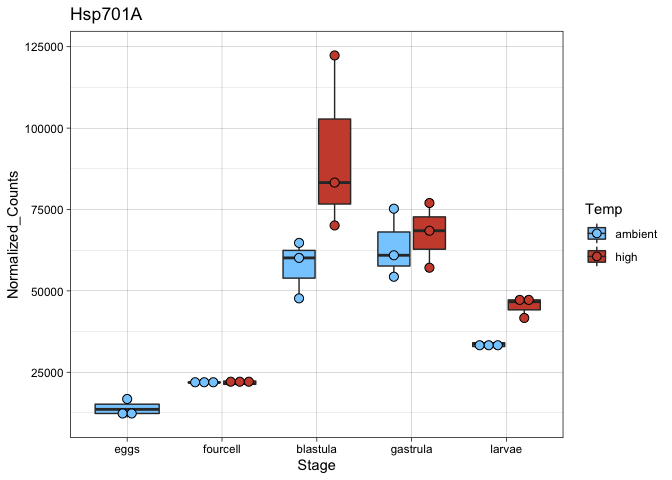

HSP-Vis
================
Maggie Schedl
7/1/2020

``` r
library(DESeq2)
```

    ## Loading required package: S4Vectors

    ## Loading required package: stats4

    ## Loading required package: BiocGenerics

    ## Loading required package: parallel

    ## 
    ## Attaching package: 'BiocGenerics'

    ## The following objects are masked from 'package:parallel':
    ## 
    ##     clusterApply, clusterApplyLB, clusterCall, clusterEvalQ,
    ##     clusterExport, clusterMap, parApply, parCapply, parLapply,
    ##     parLapplyLB, parRapply, parSapply, parSapplyLB

    ## The following objects are masked from 'package:stats':
    ## 
    ##     IQR, mad, sd, var, xtabs

    ## The following objects are masked from 'package:base':
    ## 
    ##     anyDuplicated, append, as.data.frame, basename, cbind, colnames,
    ##     dirname, do.call, duplicated, eval, evalq, Filter, Find, get, grep,
    ##     grepl, intersect, is.unsorted, lapply, Map, mapply, match, mget,
    ##     order, paste, pmax, pmax.int, pmin, pmin.int, Position, rank,
    ##     rbind, Reduce, rownames, sapply, setdiff, sort, table, tapply,
    ##     union, unique, unsplit, which, which.max, which.min

    ## 
    ## Attaching package: 'S4Vectors'

    ## The following object is masked from 'package:base':
    ## 
    ##     expand.grid

    ## Loading required package: IRanges

    ## Loading required package: GenomicRanges

    ## Loading required package: GenomeInfoDb

    ## Loading required package: SummarizedExperiment

    ## Loading required package: Biobase

    ## Welcome to Bioconductor
    ## 
    ##     Vignettes contain introductory material; view with
    ##     'browseVignettes()'. To cite Bioconductor, see
    ##     'citation("Biobase")', and for packages 'citation("pkgname")'.

    ## Loading required package: DelayedArray

    ## Loading required package: matrixStats

    ## 
    ## Attaching package: 'matrixStats'

    ## The following objects are masked from 'package:Biobase':
    ## 
    ##     anyMissing, rowMedians

    ## 
    ## Attaching package: 'DelayedArray'

    ## The following objects are masked from 'package:matrixStats':
    ## 
    ##     colMaxs, colMins, colRanges, rowMaxs, rowMins, rowRanges

    ## The following objects are masked from 'package:base':
    ## 
    ##     aperm, apply, rowsum

``` r
library(ggplot2)
library(pheatmap)
library(RColorBrewer)
library(reshape2)
library(rsconnect)
library(gplots)
```

    ## 
    ## Attaching package: 'gplots'

    ## The following object is masked from 'package:IRanges':
    ## 
    ##     space

    ## The following object is masked from 'package:S4Vectors':
    ## 
    ##     space

    ## The following object is masked from 'package:stats':
    ## 
    ##     lowess

``` r
library(ashr)
library(dplyr)
```

    ## 
    ## Attaching package: 'dplyr'

    ## The following object is masked from 'package:matrixStats':
    ## 
    ##     count

    ## The following object is masked from 'package:Biobase':
    ## 
    ##     combine

    ## The following objects are masked from 'package:GenomicRanges':
    ## 
    ##     intersect, setdiff, union

    ## The following object is masked from 'package:GenomeInfoDb':
    ## 
    ##     intersect

    ## The following objects are masked from 'package:IRanges':
    ## 
    ##     collapse, desc, intersect, setdiff, slice, union

    ## The following objects are masked from 'package:S4Vectors':
    ## 
    ##     first, intersect, rename, setdiff, setequal, union

    ## The following objects are masked from 'package:BiocGenerics':
    ## 
    ##     combine, intersect, setdiff, union

    ## The following objects are masked from 'package:stats':
    ## 
    ##     filter, lag

    ## The following objects are masked from 'package:base':
    ## 
    ##     intersect, setdiff, setequal, union

``` r
library(tidyr)
```

    ## 
    ## Attaching package: 'tidyr'

    ## The following object is masked from 'package:reshape2':
    ## 
    ##     smiths

    ## The following object is masked from 'package:S4Vectors':
    ## 
    ##     expand

``` r
library(dlookr)
```

    ## Loading required package: mice

    ## 
    ## Attaching package: 'mice'

    ## The following objects are masked from 'package:SummarizedExperiment':
    ## 
    ##     cbind, rbind

    ## The following objects are masked from 'package:DelayedArray':
    ## 
    ##     cbind, rbind

    ## The following objects are masked from 'package:IRanges':
    ## 
    ##     cbind, rbind

    ## The following objects are masked from 'package:S4Vectors':
    ## 
    ##     cbind, rbind

    ## The following objects are masked from 'package:BiocGenerics':
    ## 
    ##     cbind, rbind

    ## The following objects are masked from 'package:base':
    ## 
    ##     cbind, rbind

    ## Registered S3 method overwritten by 'quantmod':
    ##   method            from
    ##   as.zoo.data.frame zoo

    ## 
    ## Attaching package: 'dlookr'

    ## The following object is masked from 'package:IRanges':
    ## 
    ##     transform

    ## The following object is masked from 'package:S4Vectors':
    ## 
    ##     transform

    ## The following object is masked from 'package:base':
    ## 
    ##     transform

``` r
library(tximport)
library(naniar)
library(tidyverse)
```

    ## ── Attaching packages ─────────────────────────────────────── tidyverse 1.3.0 ──

    ## ✓ tibble  3.0.1     ✓ stringr 1.4.0
    ## ✓ readr   1.3.1     ✓ forcats 0.5.0
    ## ✓ purrr   0.3.4

    ## ── Conflicts ────────────────────────────────────────── tidyverse_conflicts() ──
    ## x dplyr::collapse()   masks IRanges::collapse()
    ## x dplyr::combine()    masks Biobase::combine(), BiocGenerics::combine()
    ## x dplyr::count()      masks matrixStats::count()
    ## x dplyr::desc()       masks IRanges::desc()
    ## x tidyr::expand()     masks S4Vectors::expand()
    ## x dplyr::filter()     masks stats::filter()
    ## x dplyr::first()      masks S4Vectors::first()
    ## x dplyr::lag()        masks stats::lag()
    ## x ggplot2::Position() masks BiocGenerics::Position(), base::Position()
    ## x purrr::reduce()     masks GenomicRanges::reduce(), IRanges::reduce()
    ## x dplyr::rename()     masks S4Vectors::rename()
    ## x purrr::simplify()   masks DelayedArray::simplify()
    ## x dplyr::slice()      masks IRanges::slice()

``` r
library(dplyr)
library(stringr)
library(ggpubr)
```

Read i orthogroups file and do same file manipulations as in annotation
script

``` r
orthologs <- read.delim("LORF_EL90.pep__v__SPU_peptide.tsv", sep = "\t")
head(orthologs)
```

    ##   Orthogroup
    ## 1  OG0000000
    ## 2  OG0000000
    ## 3  OG0000001
    ## 4  OG0000001
    ## 5  OG0000002
    ## 6  OG0000003
    ##                                                                           LORF_EL90.pep
    ## 1 TRINITY_DN56081_c1_g2_i2.p1, TRINITY_DN56081_c1_g3_i1.p1, TRINITY_DN56081_c1_g1_i1.p1
    ## 2                              TRINITY_DN56081_c0_g1_i2.p1, TRINITY_DN56081_c0_g1_i5.p1
    ## 3                                                          TRINITY_DN108939_c0_g1_i1.p1
    ## 4                                                           TRINITY_DN10826_c0_g1_i6.p1
    ## 5                              TRINITY_DN17786_c0_g1_i2.p1, TRINITY_DN17786_c0_g1_i5.p1
    ## 6                             TRINITY_DN49892_c0_g1_i11.p1, TRINITY_DN35058_c0_g1_i6.p1
    ##                                                                                                                                                                                                                                                                                                  SPU_peptide
    ## 1                                                                                                                                                                                                                                                                         SPU_027035, SPU_004012, SPU_027207
    ## 2                         SPU_023183, SPU_022564, SPU_002888, SPU_008707, SPU_026036, SPU_008498, SPU_000863, SPU_018384, SPU_025179, SPU_016759, SPU_003303, SPU_003553, SPU_015033, SPU_003539, SPU_003247, SPU_006610, SPU_022001, SPU_005383, SPU_003797, SPU_017505, SPU_009659, SPU_013038, SPU_016060
    ## 3                                                                                                                                                                                                                                                                                     SPU_027574, SPU_019249
    ## 4 SPU_009978, SPU_019937, SPU_018594, SPU_001189, SPU_018839, SPU_007888, SPU_007889, SPU_027473, SPU_012635, SPU_020572, SPU_020571, SPU_009630, SPU_006586, SPU_008153, SPU_017855, SPU_024683, SPU_017108, SPU_024682, SPU_002327, SPU_011979, SPU_013146, SPU_010581, SPU_009699, SPU_011131, SPU_013233
    ## 5 SPU_001711, SPU_010740, SPU_015261, SPU_000464, SPU_014175, SPU_002486, SPU_002905, SPU_002772, SPU_007666, SPU_005645, SPU_007820, SPU_009181, SPU_015741, SPU_002828, SPU_003576, SPU_024346, SPU_014085, SPU_000892, SPU_000474, SPU_016236, SPU_013389, SPU_012142, SPU_006563, SPU_013690, SPU_015560
    ## 6                                                                                                                                                                                                                                                                                                 SPU_002006

``` r
EL.orthologs <- orthologs %>% 
  select(1,2)
head(EL.orthologs)
```

    ##   Orthogroup
    ## 1  OG0000000
    ## 2  OG0000000
    ## 3  OG0000001
    ## 4  OG0000001
    ## 5  OG0000002
    ## 6  OG0000003
    ##                                                                           LORF_EL90.pep
    ## 1 TRINITY_DN56081_c1_g2_i2.p1, TRINITY_DN56081_c1_g3_i1.p1, TRINITY_DN56081_c1_g1_i1.p1
    ## 2                              TRINITY_DN56081_c0_g1_i2.p1, TRINITY_DN56081_c0_g1_i5.p1
    ## 3                                                          TRINITY_DN108939_c0_g1_i1.p1
    ## 4                                                           TRINITY_DN10826_c0_g1_i6.p1
    ## 5                              TRINITY_DN17786_c0_g1_i2.p1, TRINITY_DN17786_c0_g1_i5.p1
    ## 6                             TRINITY_DN49892_c0_g1_i11.p1, TRINITY_DN35058_c0_g1_i6.p1

``` r
# collapse df in to one column multiple rows instead of one row multiple columns
tr.orthogroups <- separate_rows(EL.orthologs, "LORF_EL90.pep", sep = ",", convert = FALSE)
head(tr.orthogroups)
```

    ## # A tibble: 6 x 2
    ##   Orthogroup LORF_EL90.pep                 
    ##   <chr>      <chr>                         
    ## 1 OG0000000  "TRINITY_DN56081_c1_g2_i2.p1" 
    ## 2 OG0000000  " TRINITY_DN56081_c1_g3_i1.p1"
    ## 3 OG0000000  " TRINITY_DN56081_c1_g1_i1.p1"
    ## 4 OG0000000  "TRINITY_DN56081_c0_g1_i2.p1" 
    ## 5 OG0000000  " TRINITY_DN56081_c0_g1_i5.p1"
    ## 6 OG0000001  "TRINITY_DN108939_c0_g1_i1.p1"

``` r
# remove extra characters of .p#s
tr.orthogroups <-mapply(gsub, pattern = ".p1", replacement = "", tr.orthogroups)
tr.orthogroups <- as.data.frame(tr.orthogroups)
# I don't know why this always removes the column names but it does
# remove .p2
tr.orthogroups <-mapply(gsub, pattern = ".p2", replacement = "", tr.orthogroups)
tr.orthogroups <- as.data.frame(tr.orthogroups)
# remove .p3
tr.orthogroups <-mapply(gsub, pattern = ".p3", replacement = "", tr.orthogroups)
tr.orthogroups <- as.data.frame(tr.orthogroups)
# remove .p4
tr.orthogroups <-mapply(gsub, pattern = ".p4", replacement = "", tr.orthogroups)
tr.orthogroups <- as.data.frame(tr.orthogroups)
# remove .p5
tr.orthogroups <-mapply(gsub, pattern = ".p5", replacement = "", tr.orthogroups)
tr.orthogroups <- as.data.frame(tr.orthogroups)
# add column names
colnames(tr.orthogroups) <- c("Orthogroup", "transcript_id")
head(tr.orthogroups)
```

    ##   Orthogroup             transcript_id
    ## 1  OG0000000  TRINITY_DN56081_c1_g2_i2
    ## 2  OG0000000  TRINITY_DN56081_c1_g3_i1
    ## 3  OG0000000  TRINITY_DN56081_c1_g1_i1
    ## 4  OG0000000  TRINITY_DN56081_c0_g1_i2
    ## 5  OG0000000  TRINITY_DN56081_c0_g1_i5
    ## 6  OG0000001 TRINITY_DN108939_c0_g1_i1

``` r
# remove the isoform notations from this file, because the counts file is only by gene. Its ok to collapse by uniquing the transcript ID because they should be in the same orthogroup 
# I can use . as any character! 
tr.orthogroups.genes <-mapply(gsub, pattern = "_i.", replacement = "", tr.orthogroups)
tr.orthogroups.genes <- as.data.frame(tr.orthogroups.genes)
# there might be random spaces in the file??
tr.orthogroups.genes <-mapply(gsub, pattern = " ", replacement = "", tr.orthogroups.genes)
tr.orthogroups.genes <- as.data.frame(tr.orthogroups.genes)
colnames(tr.orthogroups.genes) <- c("Orthogroup", "transcript_id")
tr.orthogroups.genes.d <- unique(tr.orthogroups.genes)

tr.orthogroups.genes[1:100,]
```

    ##     Orthogroup          transcript_id
    ## 1    OG0000000  TRINITY_DN56081_c1_g2
    ## 2    OG0000000  TRINITY_DN56081_c1_g3
    ## 3    OG0000000  TRINITY_DN56081_c1_g1
    ## 4    OG0000000  TRINITY_DN56081_c0_g1
    ## 5    OG0000000  TRINITY_DN56081_c0_g1
    ## 6    OG0000001 TRINITY_DN108939_c0_g1
    ## 7    OG0000001  TRINITY_DN10826_c0_g1
    ## 8    OG0000002  TRINITY_DN17786_c0_g1
    ## 9    OG0000002  TRINITY_DN17786_c0_g1
    ## 10   OG0000003 TRINITY_DN49892_c0_g11
    ## 11   OG0000003  TRINITY_DN35058_c0_g1
    ## 12   OG0000003 TRINITY_DN114943_c0_g1
    ## 13   OG0000003  TRINITY_DN78128_c0_g1
    ## 14   OG0000004   TRINITY_DN6826_c0_g1
    ## 15   OG0000005 TRINITY_DN110841_c0_g1
    ## 16   OG0000005  TRINITY_DN46534_c0_g1
    ## 17   OG0000005  TRINITY_DN92340_c0_g1
    ## 18   OG0000006  TRINITY_DN42618_c0_g1
    ## 19   OG0000006  TRINITY_DN26758_c0_g1
    ## 20   OG0000006  TRINITY_DN72314_c0_g1
    ## 21   OG0000006  TRINITY_DN76548_c0_g1
    ## 22   OG0000006  TRINITY_DN74097_c0_g1
    ## 23   OG0000007  TRINITY_DN91752_c0_g1
    ## 24   OG0000008  TRINITY_DN35209_c0_g1
    ## 25   OG0000008  TRINITY_DN35209_c0_g2
    ## 26   OG0000009  TRINITY_DN68318_c0_g1
    ## 27   OG0000009  TRINITY_DN98384_c0_g1
    ## 28   OG0000009  TRINITY_DN79843_c0_g1
    ## 29   OG0000010  TRINITY_DN72839_c0_g1
    ## 30   OG0000011  TRINITY_DN23187_c0_g1
    ## 31   OG0000011  TRINITY_DN34527_c0_g1
    ## 32   OG0000011  TRINITY_DN42403_c0_g1
    ## 33   OG0000011  TRINITY_DN17592_c0_g1
    ## 34   OG0000011 TRINITY_DN33021_c0_g10
    ## 35   OG0000011  TRINITY_DN31699_c0_g1
    ## 36   OG0000011  TRINITY_DN31699_c0_g1
    ## 37   OG0000011  TRINITY_DN42166_c0_g1
    ## 38   OG0000011  TRINITY_DN79436_c0_g1
    ## 39   OG0000011  TRINITY_DN17106_c1_g1
    ## 40   OG0000011  TRINITY_DN60091_c0_g1
    ## 41   OG0000011  TRINITY_DN52646_c0_g1
    ## 42   OG0000011  TRINITY_DN18134_c0_g1
    ## 43   OG0000011  TRINITY_DN20561_c0_g1
    ## 44   OG0000011  TRINITY_DN61326_c0_g1
    ## 45   OG0000011  TRINITY_DN43346_c0_g1
    ## 46   OG0000011  TRINITY_DN45540_c0_g1
    ## 47   OG0000011  TRINITY_DN48062_c0_g1
    ## 48   OG0000012  TRINITY_DN82227_c0_g1
    ## 49   OG0000012  TRINITY_DN82227_c0_g1
    ## 50   OG0000012  TRINITY_DN45193_c0_g1
    ## 51   OG0000012  TRINITY_DN45193_c0_g1
    ## 52   OG0000012  TRINITY_DN51900_c0_g1
    ## 53   OG0000013  TRINITY_DN64607_c0_g1
    ## 54   OG0000013  TRINITY_DN40302_c0_g1
    ## 55   OG0000013  TRINITY_DN40302_c0_g1
    ## 56   OG0000014   TRINITY_DN3740_c0_g1
    ## 57   OG0000015 TRINITY_DN110830_c0_g1
    ## 58   OG0000017  TRINITY_DN15019_c0_g1
    ## 59   OG0000017  TRINITY_DN15019_c0_g1
    ## 60   OG0000017 TRINITY_DN109560_c0_g1
    ## 61   OG0000018  TRINITY_DN64986_c0_g1
    ## 62   OG0000018 TRINITY_DN106894_c0_g1
    ## 63   OG0000018  TRINITY_DN64986_c0_g1
    ## 64   OG0000019 TRINITY_DN102067_c0_g1
    ## 65   OG0000019 TRINITY_DN115068_c0_g1
    ## 66   OG0000020  TRINITY_DN65263_c0_g1
    ## 67   OG0000020  TRINITY_DN65263_c0_g1
    ## 68   OG0000020  TRINITY_DN65263_c0_g1
    ## 69   OG0000020  TRINITY_DN78837_c0_g1
    ## 70   OG0000020  TRINITY_DN59168_c0_g1
    ## 71   OG0000020   TRINITY_DN7000_c0_g2
    ## 72   OG0000020  TRINITY_DN51152_c0_g1
    ## 73   OG0000020  TRINITY_DN72197_c0_g1
    ## 74   OG0000020  TRINITY_DN33746_c0_g1
    ## 75   OG0000020  TRINITY_DN78842_c0_g1
    ## 76   OG0000020  TRINITY_DN34255_c0_g1
    ## 77   OG0000020  TRINITY_DN54484_c0_g1
    ## 78   OG0000020  TRINITY_DN62929_c0_g1
    ## 79   OG0000020  TRINITY_DN46633_c0_g1
    ## 80   OG0000021  TRINITY_DN35207_c0_g2
    ## 81   OG0000021  TRINITY_DN33378_c0_g2
    ## 82   OG0000021  TRINITY_DN33378_c0_g2
    ## 83   OG0000021  TRINITY_DN42287_c0_g1
    ## 84   OG0000021  TRINITY_DN42287_c0_g1
    ## 85   OG0000021 TRINITY_DN104561_c0_g1
    ## 86   OG0000021  TRINITY_DN84167_c0_g1
    ## 87   OG0000021 TRINITY_DN24349_c0_g10
    ## 88   OG0000021  TRINITY_DN24349_c0_g1
    ## 89   OG0000021  TRINITY_DN24349_c0_g1
    ## 90   OG0000021  TRINITY_DN40403_c0_g1
    ## 91   OG0000021  TRINITY_DN75469_c0_g1
    ## 92   OG0000021 TRINITY_DN107161_c0_g1
    ## 93   OG0000021  TRINITY_DN73480_c0_g1
    ## 94   OG0000022  TRINITY_DN59104_c0_g1
    ## 95   OG0000023  TRINITY_DN46228_c0_g1
    ## 96   OG0000023  TRINITY_DN63184_c0_g1
    ## 97   OG0000023  TRINITY_DN67584_c0_g1
    ## 98   OG0000023  TRINITY_DN53859_c0_g1
    ## 99   OG0000023  TRINITY_DN10093_c0_g1
    ## 100  OG0000023  TRINITY_DN10093_c0_g1

``` r
tr.orthogroups.genes.d[1:100,]
```

    ##     Orthogroup          transcript_id
    ## 1    OG0000000  TRINITY_DN56081_c1_g2
    ## 2    OG0000000  TRINITY_DN56081_c1_g3
    ## 3    OG0000000  TRINITY_DN56081_c1_g1
    ## 4    OG0000000  TRINITY_DN56081_c0_g1
    ## 6    OG0000001 TRINITY_DN108939_c0_g1
    ## 7    OG0000001  TRINITY_DN10826_c0_g1
    ## 8    OG0000002  TRINITY_DN17786_c0_g1
    ## 10   OG0000003 TRINITY_DN49892_c0_g11
    ## 11   OG0000003  TRINITY_DN35058_c0_g1
    ## 12   OG0000003 TRINITY_DN114943_c0_g1
    ## 13   OG0000003  TRINITY_DN78128_c0_g1
    ## 14   OG0000004   TRINITY_DN6826_c0_g1
    ## 15   OG0000005 TRINITY_DN110841_c0_g1
    ## 16   OG0000005  TRINITY_DN46534_c0_g1
    ## 17   OG0000005  TRINITY_DN92340_c0_g1
    ## 18   OG0000006  TRINITY_DN42618_c0_g1
    ## 19   OG0000006  TRINITY_DN26758_c0_g1
    ## 20   OG0000006  TRINITY_DN72314_c0_g1
    ## 21   OG0000006  TRINITY_DN76548_c0_g1
    ## 22   OG0000006  TRINITY_DN74097_c0_g1
    ## 23   OG0000007  TRINITY_DN91752_c0_g1
    ## 24   OG0000008  TRINITY_DN35209_c0_g1
    ## 25   OG0000008  TRINITY_DN35209_c0_g2
    ## 26   OG0000009  TRINITY_DN68318_c0_g1
    ## 27   OG0000009  TRINITY_DN98384_c0_g1
    ## 28   OG0000009  TRINITY_DN79843_c0_g1
    ## 29   OG0000010  TRINITY_DN72839_c0_g1
    ## 30   OG0000011  TRINITY_DN23187_c0_g1
    ## 31   OG0000011  TRINITY_DN34527_c0_g1
    ## 32   OG0000011  TRINITY_DN42403_c0_g1
    ## 33   OG0000011  TRINITY_DN17592_c0_g1
    ## 34   OG0000011 TRINITY_DN33021_c0_g10
    ## 35   OG0000011  TRINITY_DN31699_c0_g1
    ## 37   OG0000011  TRINITY_DN42166_c0_g1
    ## 38   OG0000011  TRINITY_DN79436_c0_g1
    ## 39   OG0000011  TRINITY_DN17106_c1_g1
    ## 40   OG0000011  TRINITY_DN60091_c0_g1
    ## 41   OG0000011  TRINITY_DN52646_c0_g1
    ## 42   OG0000011  TRINITY_DN18134_c0_g1
    ## 43   OG0000011  TRINITY_DN20561_c0_g1
    ## 44   OG0000011  TRINITY_DN61326_c0_g1
    ## 45   OG0000011  TRINITY_DN43346_c0_g1
    ## 46   OG0000011  TRINITY_DN45540_c0_g1
    ## 47   OG0000011  TRINITY_DN48062_c0_g1
    ## 48   OG0000012  TRINITY_DN82227_c0_g1
    ## 50   OG0000012  TRINITY_DN45193_c0_g1
    ## 52   OG0000012  TRINITY_DN51900_c0_g1
    ## 53   OG0000013  TRINITY_DN64607_c0_g1
    ## 54   OG0000013  TRINITY_DN40302_c0_g1
    ## 56   OG0000014   TRINITY_DN3740_c0_g1
    ## 57   OG0000015 TRINITY_DN110830_c0_g1
    ## 58   OG0000017  TRINITY_DN15019_c0_g1
    ## 60   OG0000017 TRINITY_DN109560_c0_g1
    ## 61   OG0000018  TRINITY_DN64986_c0_g1
    ## 62   OG0000018 TRINITY_DN106894_c0_g1
    ## 64   OG0000019 TRINITY_DN102067_c0_g1
    ## 65   OG0000019 TRINITY_DN115068_c0_g1
    ## 66   OG0000020  TRINITY_DN65263_c0_g1
    ## 69   OG0000020  TRINITY_DN78837_c0_g1
    ## 70   OG0000020  TRINITY_DN59168_c0_g1
    ## 71   OG0000020   TRINITY_DN7000_c0_g2
    ## 72   OG0000020  TRINITY_DN51152_c0_g1
    ## 73   OG0000020  TRINITY_DN72197_c0_g1
    ## 74   OG0000020  TRINITY_DN33746_c0_g1
    ## 75   OG0000020  TRINITY_DN78842_c0_g1
    ## 76   OG0000020  TRINITY_DN34255_c0_g1
    ## 77   OG0000020  TRINITY_DN54484_c0_g1
    ## 78   OG0000020  TRINITY_DN62929_c0_g1
    ## 79   OG0000020  TRINITY_DN46633_c0_g1
    ## 80   OG0000021  TRINITY_DN35207_c0_g2
    ## 81   OG0000021  TRINITY_DN33378_c0_g2
    ## 83   OG0000021  TRINITY_DN42287_c0_g1
    ## 85   OG0000021 TRINITY_DN104561_c0_g1
    ## 86   OG0000021  TRINITY_DN84167_c0_g1
    ## 87   OG0000021 TRINITY_DN24349_c0_g10
    ## 88   OG0000021  TRINITY_DN24349_c0_g1
    ## 90   OG0000021  TRINITY_DN40403_c0_g1
    ## 91   OG0000021  TRINITY_DN75469_c0_g1
    ## 92   OG0000021 TRINITY_DN107161_c0_g1
    ## 93   OG0000021  TRINITY_DN73480_c0_g1
    ## 94   OG0000022  TRINITY_DN59104_c0_g1
    ## 95   OG0000023  TRINITY_DN46228_c0_g1
    ## 96   OG0000023  TRINITY_DN63184_c0_g1
    ## 97   OG0000023  TRINITY_DN67584_c0_g1
    ## 98   OG0000023  TRINITY_DN53859_c0_g1
    ## 99   OG0000023  TRINITY_DN10093_c0_g1
    ## 101  OG0000023  TRINITY_DN40415_c0_g1
    ## 102  OG0000023 TRINITY_DN102989_c0_g1
    ## 103  OG0000024  TRINITY_DN45722_c0_g1
    ## 104  OG0000024 TRINITY_DN35920_c0_g17
    ## 105  OG0000024  TRINITY_DN73627_c0_g1
    ## 106  OG0000024   TRINITY_DN8604_c0_g1
    ## 107  OG0000025  TRINITY_DN36347_c0_g1
    ## 110  OG0000025  TRINITY_DN29599_c0_g1
    ## 111  OG0000026  TRINITY_DN76575_c0_g1
    ## 112  OG0000026 TRINITY_DN76575_c0_g15
    ## 116  OG0000026 TRINITY_DN76575_c0_g11
    ## 117  OG0000026 TRINITY_DN76575_c0_g14
    ## 120  OG0000026 TRINITY_DN76575_c0_g13
    ## 123  OG0000027  TRINITY_DN72186_c0_g1

Read in the conts file This is from the combined
model

``` r
normalized_counts_dds <- read.delim("normalized_counts_dds.txt", sep = "\t")

colnames(normalized_counts_dds) <- c("transcript_id","29_4cell_rep_1" ,"29_4cell_rep_2" ,"29_4cell_rep_3", "29_blast_rep_1", "29_blast_rep_2" ,"29_blast_rep_3", "29_gast_rep_1",  "29_gast_rep_2",  "29_gast_rep_3", "29_larv_rep_1",  "29_larv_rep_2",  "29_larv_rep_3", "33_4cell_rep_1", "33_4cell_rep_2", "33_4cell_rep_3", "33_blast_rep_1", "33_blast_rep_2", "33_blast_rep_3", "33_gast_rep_1", "33_gast_rep_2",  "33_gast_rep_3",  "33_larv_rep_1",  "33_larv_rep_2",  "33_larv_rep_3", "eggs_rep_1" , "eggs_rep_2",  "eggs_rep_3"  )
head(normalized_counts_dds)
```

    ##            transcript_id 29_4cell_rep_1 29_4cell_rep_2 29_4cell_rep_3
    ## 1 TRINITY_DN100003_c0_g1      0.6596409      0.0000000       0.000000
    ## 2  TRINITY_DN10000_c0_g1    245.2934858    436.1378270     592.285287
    ## 3 TRINITY_DN100013_c0_g1      3.2732692      0.7317713       3.132227
    ## 4 TRINITY_DN100032_c0_g1      0.0000000      0.0000000       0.000000
    ## 5 TRINITY_DN100034_c0_g1     25.2194694      2.9671748     482.069172
    ## 6 TRINITY_DN100035_c0_g1      0.6627851      0.0000000       0.000000
    ##   29_blast_rep_1 29_blast_rep_2 29_blast_rep_3 29_gast_rep_1 29_gast_rep_2
    ## 1       0.000000       2.330338        0.00000      2.236774      0.000000
    ## 2    1012.195279     836.015127      904.48344    760.736235    550.773207
    ## 3       0.000000       0.000000        0.00000      1.109960      0.000000
    ## 4       2.554428       0.000000        0.00000      6.741026      0.000000
    ## 5       7.674936       0.000000       84.00324      0.000000      0.000000
    ## 6       0.000000       0.000000        0.00000      7.865877      8.046165
    ##   29_gast_rep_3 29_larv_rep_1 29_larv_rep_2 29_larv_rep_3 33_4cell_rep_1
    ## 1     17.438597      0.000000     11.787526     5.7987548      0.0000000
    ## 2    505.793084    696.078306    300.530327   376.9056264    207.2712893
    ## 3      2.257490      0.000000      0.000000     0.9591771      3.8800986
    ## 4     13.709918      9.061931      9.473254    15.5340991      0.0000000
    ## 5      8.390833      1.296526      0.000000     0.0000000     33.0458872
    ## 6      6.094338      7.768713     24.871559    17.4788538      0.7857461
    ##   33_4cell_rep_2 33_4cell_rep_3 33_blast_rep_1 33_blast_rep_2 33_blast_rep_3
    ## 1       0.000000       0.000000       2.080696       1.282274      4.9203840
    ## 2     398.347466     598.111444     833.512023     626.832366    598.1305745
    ## 3       0.000000       1.879087       0.000000       1.272400      3.9058466
    ## 4       0.000000       0.000000       1.045146       0.000000      6.9210666
    ## 5       1.639985     459.050736       6.280374       2.580565    236.6720465
    ## 6       0.000000       0.000000       2.090654       0.000000      0.9888989
    ##   33_gast_rep_1 33_gast_rep_2 33_gast_rep_3 33_larv_rep_1 33_larv_rep_2
    ## 1      4.582290      9.052549    12.4744746      1.203557     14.215564
    ## 2    716.901157    405.953252   481.5169149    602.773665    253.067256
    ## 3      0.000000      0.000000     0.9524059      1.194504      1.881200
    ## 4      2.301649      5.683783     9.6392154     35.062536     11.424173
    ## 5      1.152556      0.000000     0.9653528      1.210864      4.767171
    ## 6     13.812264     12.506467     1.9281696      3.627779     16.186999
    ##   33_larv_rep_3 eggs_rep_1 eggs_rep_2 eggs_rep_3
    ## 1     1.7291657    0.00000   0.000000   0.000000
    ## 2   380.7379881  189.06947 251.791403 651.988611
    ## 3     0.0000000    0.00000   0.000000   1.621334
    ## 4    33.0044731    0.00000   0.000000   0.000000
    ## 5     0.8698426   30.24205   1.904393 692.723534
    ## 6    19.9798120    0.00000   0.000000   0.000000

``` r
counts_dds_orthogroups <- merge(normalized_counts_dds, tr.orthogroups.genes.d, by= "transcript_id", sort = TRUE )
head(counts_dds_orthogroups)
```

    ##            transcript_id 29_4cell_rep_1 29_4cell_rep_2 29_4cell_rep_3
    ## 1      TRINITY_DN1_c0_g1   1525.2931225     1055.75121      3887.1416
    ## 2     TRINITY_DN10_c0_g1    218.9623850       17.85284       652.2288
    ## 3    TRINITY_DN100_c0_g1   1936.2004864     1248.62278      2002.0052
    ## 4   TRINITY_DN1000_c1_g1    488.8102540      475.82717       764.6208
    ## 5  TRINITY_DN10000_c0_g1    245.2934858      436.13783       592.2853
    ## 6 TRINITY_DN100003_c0_g1      0.6596409        0.00000         0.0000
    ##   29_blast_rep_1 29_blast_rep_2 29_blast_rep_3 29_gast_rep_1 29_gast_rep_2
    ## 1      8465.8548    5510.562339     15838.1453   4629.475106     3480.4523
    ## 2     18061.7012   22146.482243     16507.4466   9432.963810    11029.4570
    ## 3      8480.8062    6594.337487      6871.8474   4975.803475     5326.9765
    ## 4       343.0609     364.836499       449.7334    405.356820      563.3738
    ## 5      1012.1953     836.015127       904.4834    760.736235      550.7732
    ## 6         0.0000       2.330338         0.0000      2.236774        0.0000
    ##   29_gast_rep_3 29_larv_rep_1 29_larv_rep_2 29_larv_rep_3 33_4cell_rep_1
    ## 1     9205.1098     6944.6664    2624.55566   7468.076235      1587.5235
    ## 2     9056.0805    10119.4735   13620.71192   8288.045792       253.2844
    ## 3     5031.1780     4319.4069    2984.27103   3970.378375      1946.0540
    ## 4      390.8323      529.3630     487.76805    356.129044       528.3288
    ## 5      505.7931      696.0783     300.53033    376.905626       207.2713
    ## 6       17.4386        0.0000      11.78753      5.798755         0.0000
    ##   33_4cell_rep_2 33_4cell_rep_3 33_blast_rep_1 33_blast_rep_2 33_blast_rep_3
    ## 1      1093.9295      3488.9028    6183.663200    4957.303527    9401.982053
    ## 2        33.7148       412.5793   12533.300214   15905.943486    8807.145990
    ## 3      1335.8978      1673.7495    6144.282605    7517.413594    5057.644626
    ## 4       449.6783       623.3024     376.045352     502.287275     520.269279
    ## 5       398.3475       598.1114     833.512023     626.832366     598.130575
    ## 6         0.0000         0.0000       2.080696       1.282274       4.920384
    ##   33_gast_rep_1 33_gast_rep_2 33_gast_rep_3 33_larv_rep_1 33_larv_rep_2
    ## 1    6541.88911   4074.786060   10010.12666   6859.423584    2466.40463
    ## 2    9179.31616  10803.578478    8971.67993   7714.132486   14305.95015
    ## 3    4694.73694   4701.263328    3554.62936   3469.405069    3013.74914
    ## 4     500.56578    609.513820     460.79712    420.467965     460.83407
    ## 5     716.90116    405.953252     481.51691    602.773665     253.06726
    ## 6       4.58229      9.052549      12.47447      1.203557      14.21556
    ##   33_larv_rep_3 eggs_rep_1 eggs_rep_2 eggs_rep_3 Orthogroup
    ## 1   7361.753303  1320.2167 1100.41685  3674.5034  OG0009146
    ## 2   9377.019057   263.5568   64.93252   453.8350  OG0009109
    ## 3   3334.713199  2185.2433 1255.34260  1694.1266  OG0003068
    ## 4    316.847883   562.4990  609.84291   895.0971  OG0003190
    ## 5    380.737988   189.0695  251.79140   651.9886  OG0010723
    ## 6      1.729166     0.0000    0.00000     0.0000  OG0012527

``` r
dim(normalized_counts_dds) # 13296
```

    ## [1] 13296    28

``` r
dim(counts_dds_orthogroups) # 13226
```

    ## [1] 13226    29

``` r
# not all the ones in the original orthogroups file are present because lowly expressed genes were filtered out in making the normalized count matrix
```

Read in the annotation file that has orthogroups and limited to HSP
only, hopefully these commands with grep get all of the HSPs

grep Hsp annot.ortho.SPU.txt \> HSP.SPU.txt

``` r
HSP.SPU <- read.delim("HSP.SPU.txt", sep = "\t", header = FALSE)
colnames(HSP.SPU) <- c("line", "spu_id",   "Orthogroup",  "family_member" ,"common_name", "synonyms",  "best_genbank_hit")
HSP.SPU$line <- NULL
HSP.SPU
```

    ##        spu_id Orthogroup
    ## 1  SPU_000319  OG0010717
    ## 2  SPU_001496  OG0010353
    ## 3  SPU_001586  OG0006739
    ## 4  SPU_002779  OG0009336
    ## 5  SPU_005713  OG0007787
    ## 6  SPU_005958  OG0007868
    ## 7  SPU_007592  OG0011268
    ## 8  SPU_008238  OG0010858
    ## 9  SPU_008560  OG0009128
    ## 10 SPU_008656  OG0010480
    ## 11 SPU_009165  OG0002270
    ## 12 SPU_009477  OG0002278
    ## 13 SPU_009870  OG0007460
    ## 14 SPU_010672  OG0009946
    ## 15 SPU_010733  OG0006951
    ## 16 SPU_011395  OG0004700
    ## 17 SPU_011848  OG0004567
    ## 18 SPU_013575  OG0010930
    ## 19 SPU_016115  OG0009557
    ## 20 SPU_016286  OG0007517
    ## 21 SPU_016562  OG0003576
    ## 22 SPU_016611  OG0004321
    ## 23 SPU_016958  OG0010826
    ## 24 SPU_017259  OG0003473
    ## 25 SPU_018117  OG0002631
    ## 26 SPU_018193  OG0003955
    ## 27 SPU_019484  OG0011815
    ## 28 SPU_020294  OG0002005
    ## 29 SPU_020322  OG0003273
    ## 30 SPU_020500  OG0007775
    ## 31 SPU_021154  OG0007435
    ## 32 SPU_021175  OG0006932
    ## 33 SPU_022158  OG0009155
    ## 34 SPU_022236  OG0009774
    ## 35 SPU_023947  OG0005170
    ## 36 SPU_024081  OG0008091
    ## 37 SPU_024103  OG0009926
    ## 38 SPU_024667  OG0003967
    ## 39 SPU_024990  OG0009484
    ## 40 SPU_025424  OG0010026
    ## 41 SPU_025633  OG0003715
    ## 42 SPU_026592  OG0010788
    ## 43 SPU_026935  OG0011060
    ## 44 SPU_027527  OG0003197
    ## 45 SPU_028183  OG0006525
    ## 46 SPU_028919  OG0009326
    ##                                                  family_member common_name
    ## 1                   alpha-crystallin-Hsps_p23-like superfamily     Nudcd2l
    ## 2                           DnaJ superfamily, SANT superfamily     Dnajhc1
    ## 3                                                        HSP90     Hsp902A
    ## 4                                                        HSP70     Hsp703B
    ## 5                                                         <NA>      Hspbp1
    ## 6                                          DUF1977 superfamily    Dnajhb12
    ## 7                                             DnaJ superfamily    Dnajhc17
    ## 8                        DnaJ superfamily, DUF1992 superfamily     Dnajc28
    ## 9                                                        HSP70     Hsp702A
    ## 10                                                       HSP40      Hsp40D
    ## 11                                                       HSP70     Hsp701A
    ## 12                                                       HSP70     Hsp701C
    ## 13                                            DnaJ superfamily     Dnajhc9
    ## 14                                                        <NA>        Hsp8
    ## 15                                                        <NA>     Hspc105
    ## 16                                                       HSP70     Hsp701G
    ## 17                                    DnaJ domain, SANT domain      Dnajc2
    ## 18                                                        <NA>     Dnajc8l
    ## 19                                                        DnaJ     Dnajc13
    ## 20                  alpha-crystallin-Hsps_p23-like superfamily       Nudc3
    ## 21                                                       HSP40      Hsp40A
    ## 22                                            DnaJ superfamily    Dnajhc5b
    ## 23                                            DnaJ superfamily    Dnajhc30
    ## 24              DnaJ superfamily, thioredoxin-like superfamily    Dnajhc10
    ## 25              DnaJ superfamily, thioredoxin-like superfamily     Dnajc16
    ## 26                                                        <NA>       Sipp1
    ## 27                                            JmjC superfamily     Hspbap1
    ## 28                                                       HSP20     Hsp20.2
    ## 29                                   heat shock protein 90 kDa    Hsp902a1
    ## 30                                                        <NA>       Hsp70
    ## 31                                                       HSP40      Hsp40F
    ## 32                                                        <NA>    HspC152l
    ## 33                                                       HSP70     Hsp701H
    ## 34                                                      HSP40B      Hsp40B
    ## 35                           TPR superfamily, DnaJ superfamily      Dnajc7
    ## 36 alpha-crystallin-Hsps_p23-like superfamily, TPR superfamily      Dyx1c1
    ## 37                                                        <NA>       HspD1
    ## 38                                            DnaJ superfamily     Dnajc25
    ## 39                                            DnaJ superfamily      Dnajb9
    ## 40                                                      HSP100     Hsp100A
    ## 41                                                        <NA>      Dnaja3
    ## 42                            TM2 superfaily, DnaJ superfamily    Dnajhc22
    ## 43                                            DnaJ superfamily     Dnajc11
    ## 44                                                       HSP90      Hsp901
    ## 45                                            DnaJ superfamily    Dnajhc4L
    ## 46                                                       HSP40      Hsp40E
    ##                                                                                             synonyms
    ## 1                                                                           NudC domain containing 2
    ## 2                                                        DnaJ (Hsp40) homolog, subfamily C, member 1
    ## 3                                                                                            Hatpase
    ## 4                                                                                              HSC70
    ## 5                                            hsp70-interacting protein; hsp70-binding protein HspBP2
    ## 6                                                       DnaJ (Hsp40) homolog, subfamily B, member 12
    ## 7                                                        DnaJ (Hsp40) homolog, subfamily C member 17
    ## 8                                                       DnaJ (Hsp40) homolog, subfamily C, member 28
    ## 9                                                                                              HSC70
    ## 10                                                                                              DNAJ
    ## 11                                                                                             HSC70
    ## 12                                                                                             HSC70
    ## 13                                                       DnaJ (Hsp40) homolog, subfamily C, member 9
    ## 14                                                                              heat shock protein 8
    ## 15                                                       NAD(P) dependent steroid dehydrogenase-like
    ## 16                                                                                             HSC70
    ## 17                                                       DnaJ (Hsp40) homolog, subfamily C, member 2
    ## 18                                                       DnaJ (Hsp40) homolog, subfamily C, member 8
    ## 19                  DnaJ (Hsp40) homolog subfamily C member 13, Rme8, Dnajhc13, Dnajc13-2, Dnajc13-3
    ## 20                                                                          NudC domain containing 3
    ## 21                                                                                              DNAJ
    ## 22                                                  DnaJ (Hsp40) homolog, subfamily C, member 5 beta
    ## 23 DnaJ (Hsp40) homolog, subfamily C, member 30; Williams-Beuren syndrome critical region protein 18
    ## 24                                                      DnaJ (Hsp40) homolog, subfamily C, member 10
    ## 25                                    DnaJ (Hsp40) homolog, subfamily C, member 16; KIAA0962 protein
    ## 26                                                                    Hsp70/Hsp90-organizing protein
    ## 27                                                      HSPB (heat shock 27kDa) associated protein 1
    ## 28                                                                             alpha-crystallin, p26
    ## 29                                                                                              <NA>
    ## 30                                                                      HSP70, heat shock protein 70
    ## 31                                                                                              DNAJ
    ## 32                                                                     hypothetical protein LOC51504
    ## 33                                                                                             HSC70
    ## 34                                                                                              DNAJ
    ## 35                                       DnaJ (Hsp40) homolog, subfamily C, member 7; DNAJC7 protein
    ## 36                                                       dyslexia susceptibility 1 candidate 1; EKN1
    ## 37                                                                                       chaperonin 
    ## 38                                                      DnaJ (Hsp 40) homolog, subfamily C member 25
    ## 39                                                       DnaJ (Hsp40) homolog, subfamily B, member 9
    ## 40                                                                                              ClpB
    ## 41                                                       DnaJ (Hsp40) homolog, subfamily A, member 3
    ## 42                                                       DnaJ (Hsp40) homolog, subfamily C member 22
    ## 43                                                      DnaJ (Hsp40) homolog, subfamily C, member 11
    ## 44                                                                                           Hatpase
    ## 45                                                  DnaJ (Hsp40) homolog, subfamily C, member 4 like
    ## 46                                                                                              DNAJ
    ##    best_genbank_hit
    ## 1        CAJ83725.1
    ## 2    NP_001011351.1
    ## 3      NP_001016282
    ## 4            Q06068
    ## 5        AAH01236.1
    ## 6        BAA88308.1
    ## 7        AAH00048.1
    ## 8        AAH20175.2
    ## 9          BAD90025
    ## 10     NP_001035581
    ## 11         BAD12572
    ## 12       CAA43653  
    ## 13      NP_598842.1
    ## 14             <NA>
    ## 15         18043625
    ## 16         CAH93155
    ## 17        NP_446228
    ## 18        NP_055095
    ## 19     XP_003222244
    ## 20      NP_056147.2
    ## 21 NP_001027731    
    ## 22       EDL34878.1
    ## 23       AAS07471.1
    ## 24      NP_077143.2
    ## 25       CAI22371.1
    ## 26         AAB94760
    ## 27       AAH11897.1
    ## 28       AJ616737.1
    ## 29      NP_571403.1
    ## 30       AAW32098.2
    ## 31        NP_080676
    ## 32      NP_057488  
    ## 33         CAH93155
    ## 34         AAH84307
    ## 35       AAH11837.2
    ## 36       AAL73230.1
    ## 37        NP_955472
    ## 38       AAH48318.1
    ## 39       AAH42713.1
    ## 40           Q60649
    ## 41             <NA>
    ## 42      NP_079178.2
    ## 43       AAH08772.1
    ## 44         AAL79732
    ## 45      NP_065591.1
    ## 46       CAI29674

``` r
dim(HSP.SPU) # 46
```

    ## [1] 46  6

Separate out the orhtogroup and the commonname columns and then merge by
orthogroup to the counts matrix

``` r
ortho.HSP <- HSP.SPU[,c(2,4)]

dim(ortho.HSP) #18
```

    ## [1] 46  2

``` r
EL.ortho.HSP.counts <- merge(counts_dds_orthogroups, ortho.HSP, by= "Orthogroup", sort = TRUE)
EL.ortho.HSP.counts
```

    ##    Orthogroup         transcript_id 29_4cell_rep_1 29_4cell_rep_2
    ## 1   OG0002005 TRINITY_DN17752_c0_g1       0.000000       0.000000
    ## 2   OG0002270   TRINITY_DN398_c0_g1   22133.935609   21736.320137
    ## 3   OG0002278   TRINITY_DN580_c0_g1      35.688519     255.869747
    ## 4   OG0002631 TRINITY_DN14675_c0_g1     674.007964     918.015224
    ## 5   OG0003197  TRINITY_DN1032_c0_g1    2253.053433     918.759600
    ## 6   OG0003273  TRINITY_DN1144_c0_g1   10443.298886    5538.705870
    ## 7   OG0003473  TRINITY_DN1742_c0_g1    2230.674282    2899.952086
    ## 8   OG0003576  TRINITY_DN2616_c1_g2     209.087408     104.608457
    ## 9   OG0003715  TRINITY_DN3018_c1_g1    1464.437286    1480.701290
    ## 10  OG0003955  TRINITY_DN3695_c0_g1    6131.683628    4665.444455
    ## 11  OG0003967  TRINITY_DN3642_c0_g1    1330.817190     931.703888
    ## 12  OG0004321  TRINITY_DN6756_c0_g1     269.289928     283.892372
    ## 13  OG0004567  TRINITY_DN9460_c0_g1    1013.697382     791.023076
    ## 14  OG0004700 TRINITY_DN10465_c0_g2     429.983294     376.765891
    ## 15  OG0005170 TRINITY_DN15102_c0_g1    3461.965627    3591.280026
    ## 16  OG0006525  TRINITY_DN2286_c0_g2    1322.181035    2218.915288
    ## 17  OG0006739  TRINITY_DN2740_c0_g1    1015.073307     141.260424
    ## 18  OG0006932  TRINITY_DN4621_c0_g1     139.574423      95.830282
    ## 19  OG0006951  TRINITY_DN4639_c0_g1     861.260722    1163.332316
    ## 20  OG0007435  TRINITY_DN9050_c0_g1    1071.922336     958.176619
    ## 21  OG0007460  TRINITY_DN9084_c0_g1     171.926667     247.810745
    ## 22  OG0007517  TRINITY_DN9395_c0_g1     477.709549     370.563915
    ## 23  OG0007775 TRINITY_DN13584_c0_g1       0.000000       0.000000
    ## 24  OG0007787 TRINITY_DN13625_c0_g1       4.653612       6.687448
    ## 25  OG0007868 TRINITY_DN15277_c0_g1    1863.514502    1912.817591
    ## 26  OG0008091 TRINITY_DN18578_c0_g1     213.846568     212.295736
    ## 27  OG0009128    TRINITY_DN61_c1_g1    3283.285825    2206.434024
    ## 28  OG0009155     TRINITY_DN5_c0_g1    6329.102772    5395.872284
    ## 29  OG0009326   TRINITY_DN634_c0_g1    3962.478050    3481.832092
    ## 30  OG0009336   TRINITY_DN736_c0_g1    3660.966940    4082.890247
    ## 31  OG0009484  TRINITY_DN1344_c0_g1    1560.668071    1561.523616
    ## 32  OG0009557  TRINITY_DN1864_c2_g1    2089.312290    2265.222746
    ## 33  OG0009774  TRINITY_DN4175_c0_g1    2373.988060    2533.702820
    ## 34  OG0009926  TRINITY_DN5256_c0_g1    2879.377114    1566.748830
    ## 35  OG0009946  TRINITY_DN5308_c1_g1     706.003778     566.404820
    ## 36  OG0010026  TRINITY_DN5452_c0_g1     762.657330     849.449429
    ## 37  OG0010353  TRINITY_DN7274_c0_g1    2052.673735    1028.926271
    ## 38  OG0010480  TRINITY_DN7880_c0_g1    4294.472762    5483.222071
    ## 39  OG0010717 TRINITY_DN10060_c0_g1     472.635673     546.819706
    ## 40  OG0010788 TRINITY_DN11645_c0_g1     603.046904     611.602233
    ## 41  OG0010826 TRINITY_DN11811_c0_g1     976.613623     741.077681
    ## 42  OG0010858 TRINITY_DN12279_c0_g2     252.452568     282.910447
    ## 43  OG0010930 TRINITY_DN13048_c0_g1     874.742960     628.791398
    ## 44  OG0011060 TRINITY_DN14648_c0_g1     104.421677      28.992123
    ## 45  OG0011268 TRINITY_DN19072_c0_g1     354.079396     377.194305
    ## 46  OG0011815 TRINITY_DN38542_c0_g1     115.694427     203.628725
    ##    29_4cell_rep_3 29_blast_rep_1 29_blast_rep_2 29_blast_rep_3 29_gast_rep_1
    ## 1        10.26627     177.321261     255.480526      491.05551      88.41048
    ## 2     21851.03003   60129.111452   64740.715356    47703.36329   54341.53003
    ## 3        42.43880     214.697703     258.199224      905.39319    1400.92863
    ## 4       559.54787     639.790359     870.922633      690.67935     512.88140
    ## 5      1423.05862    1184.124252    1248.563203     1943.21603    3562.50504
    ## 6      7814.01771   18231.930027   13451.024482    15845.10221   23045.02866
    ## 7      2638.43965    2165.773422    2960.086953     2833.44370     615.83495
    ## 8       299.19480    5766.026655    6256.177903     6400.58929    1356.05703
    ## 9      2251.82535     994.705570    1258.105260      914.70103    1215.46374
    ## 10     5353.26358    2346.570268    1963.263798     1993.00224    2596.77435
    ## 11      625.35901     600.903440     439.137411      344.96162     374.16496
    ## 12      325.16858     683.078849     589.580421      837.37302     423.86067
    ## 13      764.52278     342.306100     118.663898      231.51774     736.38680
    ## 14      250.83506     277.528017     369.201439      233.76885     400.49839
    ## 15     3560.91433    1925.001212    2256.543408     1678.70611    1412.34899
    ## 16     1445.68583    1778.519422    2502.397297     1770.91324     616.27129
    ## 17      935.16645    1709.043925    2045.575340     1271.29903    2661.48634
    ## 18       82.68959    1042.768361     747.826136      637.94079    1105.41810
    ## 19      565.83545     551.204558     856.379808      632.73133     668.63529
    ## 20      988.32637    2559.179833    2267.831945     2750.49786    1150.33935
    ## 21      205.82804     241.811683     279.059187      228.25594     328.62440
    ## 22      382.14578     386.738570     430.701222      305.54584     295.12638
    ## 23        0.00000       5.029605       3.457526       24.78058      43.14392
    ## 24       38.81002     436.942556     391.030606      314.13827     651.46407
    ## 25     2395.68683     723.475038     813.220341      947.39703     623.99563
    ## 26      296.81179     510.732053     851.644737      627.64239     298.37666
    ## 27     3584.91055    4845.372521    7494.643816     8723.11020   14176.17598
    ## 28     7457.11191    7555.430140    7304.764140     8558.14455   11768.31461
    ## 29     4114.25543    9596.120198    8397.014985     8414.93432    5513.72310
    ## 30     3638.77912    9025.149413   11948.538858     7832.18646   11747.40996
    ## 31     2390.26433    8121.944296   10050.627150     9437.61944    8481.22454
    ## 32     1743.31405    1211.842691     769.376860     1129.56809    2864.67967
    ## 33     2010.33417     244.875564     179.761744      456.02869    1108.54905
    ## 34     1744.56338    5156.157974    3524.207215     3257.33148    8776.38677
    ## 35      716.33435     249.621750     153.681089      190.54611     216.19589
    ## 36      595.61343     352.433576     450.994767      443.23357     335.93286
    ## 37     2096.23422     187.178897     128.063209      241.34005     245.83853
    ## 38     5339.10000    4786.021838    6316.758957     4924.22686    3011.24561
    ## 39      407.21203     211.106920     232.160096      284.27162     231.83937
    ## 40      419.96213     170.440889     217.265031      150.07470     317.88000
    ## 41      575.40458    1260.015200    1526.714444     1095.96711     391.97334
    ## 42      516.89931     262.497527     198.316111      248.05897     298.47912
    ## 43      633.09999    1359.544536     830.621682     1176.95822     784.87375
    ## 44      166.76928     519.189320     352.440835      277.80093     672.05819
    ## 45      373.82623     385.402826     359.062476      252.25035     257.91756
    ## 46      169.90143     107.651727     117.445788      127.63923     166.83805
    ##    29_gast_rep_2 29_gast_rep_3 29_larv_rep_1 29_larv_rep_2 29_larv_rep_3
    ## 1      97.194331      426.3329      28.81558     254.97672      80.44229
    ## 2   75243.775457    60939.6885   33660.76516   34463.83379   32138.52235
    ## 3     209.440814     6794.0751     220.27266     603.40183     595.26690
    ## 4     735.825810      540.5301     264.85718     394.55223     392.33103
    ## 5    4820.833942     6842.2032   12510.38241   14062.00813   11736.92718
    ## 6   24322.331778    31963.8982   13040.22443   16198.83983   14608.03341
    ## 7     955.020423      737.8750     417.19942     531.39500     442.50570
    ## 8    2131.358003     1521.2552    1497.71306    2216.84950    1236.02651
    ## 9    1422.958358      928.7175     979.62491     718.97952     773.63316
    ## 10   2353.292882     3078.7113    4470.71684    4603.53071    4520.18286
    ## 11    385.334798      348.3970     290.89481     320.72014     241.52831
    ## 12    427.810036      609.0850     587.13492     696.25863     816.33915
    ## 13    275.553095      412.0648    1056.45111     833.19930     912.13682
    ## 14    535.688404      420.9943     276.11154     305.91881     306.23347
    ## 15   1869.943612     1768.1094    1023.01072    1147.36981    1239.00932
    ## 16    854.672024      723.8581     417.49855     475.85898     497.44010
    ## 17   3052.416953     2084.8811    1753.03448    1540.47747    1640.16553
    ## 18    987.393098      915.1644     772.56791     401.43159     574.51438
    ## 19    813.428672      720.8259     613.25622     530.03847     625.54846
    ## 20   1880.740613     1910.2878     865.93949     961.88335     937.60054
    ## 21    304.210167      324.2589     343.65197     311.96707     378.31876
    ## 22    433.535864      287.8944     264.78740     243.38709     234.59303
    ## 23      3.960635      155.9975      11.47063      25.65078      18.16352
    ## 24    500.373313      669.3469     671.45440     490.62560     521.08400
    ## 25    907.327600      589.4870     338.74454     477.23764     434.10818
    ## 26    574.438662      343.4923     241.31827     384.50368     271.46541
    ## 27  24152.817121    27186.5592   16326.24563   21279.59405   13855.44809
    ## 28  11572.481983    12907.1809   10117.89210    7696.74500    8634.93147
    ## 29   6667.917717     5528.8989    3255.98606    2813.01652    2588.92204
    ## 30  12657.712084    10439.6840    8893.96644    8395.68339    8616.05949
    ## 31  10464.969472     7995.1193    3638.69105    2813.75946    4108.30261
    ## 32   2463.991086     2477.8836    2958.82204    3250.24960    2968.28867
    ## 33   1181.974549     1782.8462     471.70900     802.31194     605.17966
    ## 34   7868.475058    10161.4665    5907.19493    6518.33770    6079.21367
    ## 35    107.839983      161.8332     179.05394      74.76930     167.36551
    ## 36    404.604236      401.2175     402.68191     466.94580     404.27384
    ## 37    299.777986      246.1690     306.67015     223.45464     235.83060
    ## 38   3872.945276     3078.5415    2384.60938    2282.11558    2147.55381
    ## 39    311.263553      296.0313     239.90966     224.19082     306.35279
    ## 40    453.012589      365.2804     406.55788     497.81247     378.92654
    ## 41    555.493163      474.9554     258.27980     292.04466     343.59222
    ## 42    274.212229      258.0893     401.03893     371.57738     241.38545
    ## 43    737.781803      866.4595     734.41625     507.98094     749.28852
    ## 44    502.620032      550.3984     648.37585     477.77636     632.40696
    ## 45    313.513075      261.8935     308.87453     264.72021     231.64009
    ## 46    168.499919      149.7869     107.81413     124.75570     124.69088
    ##    33_4cell_rep_1 33_4cell_rep_2 33_4cell_rep_3 33_blast_rep_1 33_blast_rep_2
    ## 1        1.589736       0.000000   9.621105e-01      484.79224      2231.9124
    ## 2    21514.728098   23112.729532   2.108757e+04    83262.87209    122315.6404
    ## 3       21.497971     261.638729   2.393705e+01     2911.37421     19358.3174
    ## 4      607.046158     899.774076   5.142556e+02      593.40773       903.3049
    ## 5     2438.380830     986.864055   1.675298e+03     1691.20418      3329.7904
    ## 6     9711.606047    5377.878144   7.029924e+03    36984.07861     68219.2291
    ## 7     2386.707935    3000.252049   2.326536e+03     1633.72106      2382.5995
    ## 8      203.026873      68.889714   2.276543e+02     3739.47784      5088.3639
    ## 9     1509.111732    1456.058257   2.136784e+03     1123.38579      1468.8815
    ## 10    6110.034342    4545.787423   5.679393e+03     3304.25284      4564.3039
    ## 11    1440.635826     929.739758   6.047816e+02      570.34586       443.3006
    ## 12     306.647662     315.469567   2.919715e+02      591.46598       731.7020
    ## 13    1029.895950     780.744369   8.504593e+02      388.16055       144.8432
    ## 14     453.907474     385.328900   1.894923e+02      280.47421       461.8386
    ## 15    3571.148820    3697.042098   3.731424e+03     2344.43986      2978.0692
    ## 16    1406.535828    2168.307262   1.434929e+03     1180.22864      2177.2313
    ## 17     897.453964     134.787218   7.760429e+02     1817.09306      2421.0624
    ## 18     146.562344      97.722337   6.104107e+01      830.22629       966.5767
    ## 19     964.311757    1034.551768   5.821672e+02      555.93855       846.9571
    ## 20    1254.279338     923.722553   9.097739e+02     2174.86120      3215.8855
    ## 21     187.299761     257.531890   2.076636e+02      246.03316       277.4704
    ## 22     433.230380     356.274226   3.384701e+02      443.26094       567.0795
    ## 23       3.093609       1.612190   0.000000e+00       62.76834       986.5597
    ## 24       7.093470       5.749776   1.812593e+01      431.99086       677.2893
    ## 25    2009.236933    1900.248467   2.265185e+03      821.48545       795.6538
    ## 26     249.588589     222.369129   2.906732e+02      386.50578       697.2361
    ## 27    3352.062751    2147.998344   3.303680e+03     8430.52878     22893.5875
    ## 28    5737.007312    5027.476943   6.812148e+03     6523.64329     10362.1207
    ## 29    4076.458853    3401.131533   3.682936e+03    12113.20860     17775.8183
    ## 30    3635.407357    3858.584680   3.425534e+03    10969.53092     23254.9153
    ## 31    1551.486127    1637.442523   2.197582e+03     7115.95245     12001.6053
    ## 32    1950.380526    2354.351446   1.910507e+03     1678.62864      1298.8571
    ## 33    2648.131766    2876.484013   2.644016e+03     1150.86655      1771.7790
    ## 34    2784.286044    1534.680323   1.567603e+03     7894.90327     12748.8505
    ## 35     766.136156     590.012979   6.528641e+02      268.16189       105.8834
    ## 36     782.780973     836.324794   5.877609e+02      311.46415       404.6347
    ## 37    2176.506201    1084.825375   1.909957e+03      392.35747       159.0691
    ## 38    4585.587024    5352.825934   4.988845e+03     4714.93748      5689.4252
    ## 39     406.868311     582.321401   4.277139e+02      237.65923       369.1028
    ## 40     622.724024     643.230498   5.190352e+02      187.70780       341.2714
    ## 41     948.315339     776.526156   5.663034e+02     1054.11344      1091.4549
    ## 42     269.366165     291.396289   5.281573e+02      294.43295       285.4512
    ## 43     874.051964     670.464436   5.080192e+02     1088.41284       738.6379
    ## 44      91.469317      23.009691   1.460277e+02      420.65064       408.6336
    ## 45     335.508501     388.234345   2.907574e+02      317.46793       418.4671
    ## 46     107.996258     189.773830   2.022800e+02      115.35633       116.3478
    ##    33_blast_rep_3 33_gast_rep_1 33_gast_rep_2 33_gast_rep_3 33_larv_rep_1
    ## 1       2025.1856     232.16249      520.6336     1377.5718     106.42108
    ## 2      70096.9530   57115.41334    76990.7655    68472.1249   47798.59458
    ## 3      10139.0234    1588.51485     2370.5163     9222.4720     594.06333
    ## 4        662.3956     409.21730      687.5469      462.6664     307.20087
    ## 5       2496.9813   12632.81045    12931.6653    18694.2725   23919.23272
    ## 6      29419.8177   32546.58221    41950.6370    49200.9660   22417.56760
    ## 7       2090.6975     489.86419      862.7600      777.0252     398.11843
    ## 8       2828.6177    1175.78247     1564.4867     1327.5557    1691.82842
    ## 9       1253.3782    1257.73436     1419.1875     1012.7904     923.36839
    ## 10      3506.0552    5337.73027     4250.9234     5840.4123    7767.97304
    ## 11       334.2744     397.11914      417.3513      250.4245     337.16105
    ## 12       648.8813     472.27633      445.9724      624.7675     622.32888
    ## 13       138.9565     794.72928      309.2135      642.4062     740.26904
    ## 14       224.7485     442.50440      596.4527      522.1662     257.86933
    ## 15      2546.7641    1715.94142     1963.1921     1932.6929    1022.15412
    ## 16      1500.1308     478.65050      617.8368      514.1834     493.14126
    ## 17      1251.6596    2269.93177     2718.0056     2364.6236    1297.34904
    ## 18       449.2638     975.32971      792.3880      687.3531     482.62338
    ## 19       576.5895     609.82658      804.3034      624.9088     516.90565
    ## 20      2207.3386    1401.05754     2458.9278     2236.7475     950.57010
    ## 21       192.1519     361.97832      310.8665      297.3901     353.64600
    ## 22       309.3153     374.99626      446.7741      316.9823     320.02119
    ## 23       325.0239      67.98748      130.9550      287.6225      32.14408
    ## 24       329.3444     840.48784      618.0985      767.7762     771.41348
    ## 25      1274.8280     509.95377      687.2017      567.2372     349.08598
    ## 26       449.8919     332.16041      468.2260      440.4944     219.31384
    ## 27     15215.7385   36869.54701    53088.0736    54455.4754   27986.36075
    ## 28      7485.0661   12266.10428    12320.5124    14976.9168    8057.54454
    ## 29      9399.1366    5359.10053     6470.9567     5720.9334    3345.33744
    ## 30      8980.6257   11746.42169    14674.3019    12317.4377    8281.66051
    ## 31      6889.1895    5491.05370     8713.6483     2604.6785    2802.50703
    ## 32      1374.5404    3096.30178     3230.9680     2945.8735    3135.02418
    ## 33      2049.6511    1197.89331     2311.7303     2055.9334    1253.62787
    ## 34      5643.8086   11664.54630    13678.8985    15725.6356    8128.81743
    ## 35       245.7719     260.67004      116.2094      206.7361     128.44597
    ## 36       319.4805     364.88911      399.2089      461.3231     378.49323
    ## 37       632.2533     303.79958      292.0988      215.7482     268.19623
    ## 38      4784.9362    2984.09518     3468.5220     3228.1051    2066.99572
    ## 39       273.3727     273.21483      357.5559      297.3921     231.32484
    ## 40       201.4010     452.62414      585.0963      368.4597     362.70425
    ## 41       727.6330     354.20316      395.4594      443.5522     247.27237
    ## 42       266.6607     371.50161      316.8166      268.6382     439.99006
    ## 43       718.5220     777.43384      680.1994      812.4919     734.35834
    ## 44       231.2456     735.76299      585.2942      643.3265     605.51956
    ## 45       253.7601     275.72747      337.3123      220.3106     313.91597
    ## 46       155.7705     163.96809      190.4784      149.9049     120.09803
    ##    33_larv_rep_2 33_larv_rep_3   eggs_rep_1   eggs_rep_2   eggs_rep_3
    ## 1      399.05047     471.50202     5.267756     1.923881     6.443997
    ## 2    46662.49197   41685.97530 16793.909858 11081.008936 13606.796412
    ## 3     4868.28395    1065.96551   168.358160   559.654963    68.127158
    ## 4      388.01810     322.23015   491.006381   538.595837   429.734140
    ## 5    15062.60333   24080.60356  2610.710646  1920.457964  1913.214443
    ## 6    29564.26553   21828.83738  6389.148614  4579.870278  3947.909000
    ## 7      573.42985     433.35371  2752.629955  3481.106339  2421.585615
    ## 8     1922.40790    1532.02096   134.545724    62.854399   124.431679
    ## 9      858.89751     738.27999  1107.767963  1521.921918  2347.583845
    ## 10    6635.67927    7620.63041  7309.129916  4570.412119  6197.273532
    ## 11     387.71344     220.42457  1321.380409   597.043479   501.940958
    ## 12     646.67038     742.48779   356.291990   245.174907   350.439195
    ## 13     740.54666     709.62950   737.937905   486.712031   564.620896
    ## 14     385.12098     253.94992   338.858559   277.040565   217.889535
    ## 15    1654.59478    1256.65516  2590.996247  2659.679284  1895.806324
    ## 16     578.61517     460.71002  1573.490655  2476.820796  1572.187204
    ## 17    1371.26666    1167.36659   594.767926    84.939856   589.643808
    ## 18     411.52393     349.31431   174.415005   146.853483    52.475666
    ## 19     513.05888     509.92337  1259.336425  2097.349637   833.241636
    ## 20    1119.84754    1205.45435  1565.343186  1273.831938  1033.397175
    ## 21     315.65224     327.99917   201.309591   547.628272   475.487736
    ## 22     249.11997     242.08394   409.257912   368.911583   321.036885
    ## 23     153.74558      28.22172     5.123927     4.680293     8.846118
    ## 24     918.74974     536.73237     8.357306     0.000000     5.431731
    ## 25     462.88707     356.13080  1824.803930   981.777942  1818.621631
    ## 26     366.36398     293.33462   284.891228   324.919842   396.097098
    ## 27   30585.02169   28753.69982  4326.970446  3817.861853  5443.471659
    ## 28    9871.34313    7187.39672  6758.156090  8670.160796  7658.427039
    ## 29    5279.65187    2904.39399  4985.108827  4883.654518  5077.479884
    ## 30   10903.84413    8578.79450  4410.582782  6088.576424  4614.988270
    ## 31    2880.14008    3303.09567  1513.051339  1662.925538  2072.650169
    ## 32    3314.26591    3187.87153  2616.612960  2937.473438  2855.338710
    ## 33    4256.07687    1262.36343  4801.921057  6103.108900  5196.752591
    ## 34    7972.74398    7771.74762  3436.415368  2742.368951  2436.310549
    ## 35      48.66075      95.75321   546.859708   485.028331   412.157247
    ## 36     398.31924     395.64576   968.573069  1185.809631   806.829747
    ## 37     247.48628     198.76630  1926.376270   690.941249  1362.751378
    ## 38    2342.51724    1817.54057  4943.937359  7382.739078  5815.216851
    ## 39     365.24363     248.82868   289.971337   457.153754   207.776455
    ## 40     511.00723     356.41162   742.846890   868.086313   511.168175
    ## 41     229.06041     292.57082  1118.072479  1139.067624   699.577961
    ## 42     394.16648     299.53044   193.126858   271.654669   392.555917
    ## 43     488.53899     644.18883   717.006275   304.944158   440.566698
    ## 44     421.36392     482.05900    78.386807    24.810914   145.991492
    ## 45     267.21768     211.57588   164.931862   191.577949   153.914783
    ## 46      93.60919      97.60361    60.600711    87.766508    86.538026
    ##    common_name
    ## 1      Hsp20.2
    ## 2      Hsp701A
    ## 3      Hsp701C
    ## 4      Dnajc16
    ## 5       Hsp901
    ## 6     Hsp902a1
    ## 7     Dnajhc10
    ## 8       Hsp40A
    ## 9       Dnaja3
    ## 10       Sipp1
    ## 11     Dnajc25
    ## 12    Dnajhc5b
    ## 13      Dnajc2
    ## 14     Hsp701G
    ## 15      Dnajc7
    ## 16    Dnajhc4L
    ## 17     Hsp902A
    ## 18    HspC152l
    ## 19     Hspc105
    ## 20      Hsp40F
    ## 21     Dnajhc9
    ## 22       Nudc3
    ## 23       Hsp70
    ## 24      Hspbp1
    ## 25    Dnajhb12
    ## 26      Dyx1c1
    ## 27     Hsp702A
    ## 28     Hsp701H
    ## 29      Hsp40E
    ## 30     Hsp703B
    ## 31      Dnajb9
    ## 32     Dnajc13
    ## 33      Hsp40B
    ## 34       HspD1
    ## 35        Hsp8
    ## 36     Hsp100A
    ## 37     Dnajhc1
    ## 38      Hsp40D
    ## 39     Nudcd2l
    ## 40    Dnajhc22
    ## 41    Dnajhc30
    ## 42     Dnajc28
    ## 43     Dnajc8l
    ## 44     Dnajc11
    ## 45    Dnajhc17
    ## 46     Hspbap1

``` r
dim(EL.ortho.HSP.counts) #46
```

    ## [1] 46 30

``` r
# all HSP are present in the counts dataset

Sample_info <- read.csv("el-treatment-data.csv", header=TRUE, sep=",")
```

Plotting the DEG HSPs, so bring in the DEG files to see which ones are
in there Want to plot only HSP plots that are ones that are
significantly differentially expressed in one of the life stages by
temperature

Gasturla DEGS

``` r
gast_DEGs <- read.csv("Gastrula_temp_DEG_annot.csv", header = TRUE)
gast_DEGs
```

    ##        X     spu_id Orthogroup
    ## 1    517 SPU_001138  OG0006664
    ## 2    762 SPU_001669  OG0003991
    ## 3    784 SPU_001722  OG0006655
    ## 4    956 SPU_002120  OG0011063
    ## 5   1847 SPU_004105  OG0008208
    ## 6   1954 SPU_004345  OG0009117
    ## 7   2280 SPU_005005  OG0003954
    ## 8   2737 SPU_006003  OG0009137
    ## 9   3770 SPU_008319  OG0007092
    ## 10  3890 SPU_008575  OG0009250
    ## 11  3913 SPU_008633  OG0001155
    ## 12  4026 SPU_008889  OG0009574
    ## 13  4132 SPU_009124  OG0006145
    ## 14  4817 SPU_010691  OG0003733
    ## 15  5524 SPU_012317  OG0006937
    ## 16  5900 SPU_013125  OG0011101
    ## 17  7084 SPU_015831  OG0000903
    ## 18  7405 SPU_016547  OG0006392
    ## 19  8140 SPU_018193  OG0003955
    ## 20  9034 SPU_020197  OG0010530
    ## 21  9545 SPU_021241  OG0005235
    ## 22 10034 SPU_022358  OG0005154
    ## 23 10670 SPU_023772  OG0007051
    ## 24 11254 SPU_025092  OG0007708
    ## 25 11405 SPU_025453  OG0008048
    ## 26 11451 SPU_025548  OG0009967
    ## 27 11684 SPU_026008  OG0002437
    ## 28 12340 SPU_027527  OG0003197
    ## 29 12818 SPU_028629  OG0011199
    ##                                         family_member   common_name
    ## 1                                  carbonic anhydrase      Cara14LA
    ## 2                           HCO3_cotransp superfamily       Slc4a11
    ## 3                               prefoldin superfamily          Uri1
    ## 4                                                <NA>          <NA>
    ## 5                                                <NA>          <NA>
    ## 6                                                <NA>       Fabp2L2
    ## 7                                                <NA>     Uhrf1bp1L
    ## 8                                                <NA>          <NA>
    ## 9                                                <NA>          <NA>
    ## 10                                               <NA>         Pdia4
    ## 11                                               <NA>         Lct_3
    ## 12                                              F-box          Emi1
    ## 13                   LIM superfamily, SH3 superfamily         Lisp1
    ## 14                                               <NA>         Ddx3Y
    ## 15                                               <NA>          <NA>
    ## 16                            Sodium:solute symporter     Slc5a12L1
    ## 17                   Glyco_tranf_GTA-type superfamily     B4galt5_5
    ## 18                                               <NA>        Sfrs7l
    ## 19                                               <NA>         Sipp1
    ## 20                                           profilin      Profilin
    ## 21                                               <NA>          <NA>
    ## 22 hexokinase_1 superfamily, hexokinase_2 superfamily         Hk1_2
    ## 23                                               <NA>        Mgam_3
    ## 24                                               <NA>         Lct_1
    ## 25                             7TM GPCR_1 superfamily        Gpr27L
    ## 26                                               <NA>         Gst11
    ## 27                        collagen-fibrillar I/II/III FcolI/II/IIIf
    ## 28                                              HSP90        Hsp901
    ## 29                              AdoHcyase superfamily       Rdh8_11
    ##                                                                                                                              synonyms
    ## 1                                                                                                                                <NA>
    ## 2                                                            solute carrier family 4, sodium bicarbonate cotransporter-like member 11
    ## 3                                                        unconventional prefoldin RPB5 interactor 1, uri, NNX3, PPP1R19, Rmp, C19orf2
    ## 4                                                                                                                                <NA>
    ## 5                                                                                                                                <NA>
    ## 6                                                                                                   fatty acid binding protein 2-like
    ## 7                                                                                                        UHRF1 binding protein 1-like
    ## 8                                                                                                                                <NA>
    ## 9                                                                                                                                <NA>
    ## 10                                                                  Protein disulfide-isomerase A4 precursor (Protein ERp-72) (ERp72)
    ## 11                     Lactase-phlorizin hydrolase precursor (Lactase-glycosylceramidase) [Includes: Lactase ; Phlorizin hydrolase ] 
    ## 12                                                                                              Early mitotic inhibitor, FBX5, Fbo031
    ## 13                                                                                                              LIM and SH3 protein 1
    ## 14                                                                                 DEAD (Asp-Glu-Ala-Asp) box polypeptide 3, Y-linked
    ## 15                                                                                                                               <NA>
    ## 16                                                  solute carrier family 5 (sodium/glucose cotransporter), member 12-like, Slc5a12_1
    ## 17 carbohydrate (N-acetylgalactosamine 4-0) sulfotransferase 14-1 polypeptide 5-5; beta-1,4-galactosyltransferase (beta-1,4-GalT) V-5
    ## 18                                                                                       splicing factor, arginine/serine-rich 7-like
    ## 19                                                                                                     Hsp70/Hsp90-organizing protein
    ## 20                                                                                                                            SpCoel1
    ## 21                                                                                                                               <NA>
    ## 22                                                                                                                     hexokinase 1-2
    ## 23                                                                                                               maltase-glucoamylase
    ## 24                     Lactase-phlorizin hydrolase precursor (Lactase-glycosylceramidase) [Includes: Lactase ; Phlorizin hydrolase ] 
    ## 25                                                                                                 G protein-coupled receptor 27-like
    ## 26                                                                                                          glutathione S-transferase
    ## 27                                                                                                                               <NA>
    ## 28                                                                                                                            Hatpase
    ## 29                                                                                                         retinol dehydrogenase 8-11
    ##    best_genbank_hit
    ## 1          AAH46995
    ## 2        EDL28289.1
    ## 3      XP_002735303
    ## 4              <NA>
    ## 5              <NA>
    ## 6      XP_005495341
    ## 7       XP_416170.1
    ## 8              <NA>
    ## 9              <NA>
    ## 10           119531
    ## 11           126428
    ## 12       XM849747.1
    ## 13       CAA57833.1
    ## 14        NP_004651
    ## 15             <NA>
    ## 16                 
    ## 17      XP_417519.2
    ## 18           Q16629
    ## 19         AAB94760
    ## 20         47551153
    ## 21             <NA>
    ## 22       AAI35850.1
    ## 23          4758712
    ## 24           126428
    ## 25   NP_001107906.1
    ## 26        XP_783826
    ## 27         CAA61929
    ## 28         AAL79732
    ## 29      NP_056540.1

Looks like the HSP DEG for this stage is only HSP901, which is in the
family of HSP90

Blastula DEGS

``` r
blast_DEGs <- read.csv("Blastula_temp_DEG_annot.csv", header = TRUE)
blast_DEGs
```

    ##         X     spu_id Orthogroup
    ## 1      11 SPU_000021  OG0005252
    ## 2      91 SPU_000188  OG0004572
    ## 3     221 SPU_000478  OG0009714
    ## 4     352 SPU_000764  OG0011406
    ## 5     380 SPU_000832  OG0010152
    ## 6     723 SPU_001583  OG0003461
    ## 7     818 SPU_001799  OG0007001
    ## 8    1057 SPU_002333  OG0001100
    ## 9    1100 SPU_002431  OG0010533
    ## 10   1118 SPU_002476  OG0004880
    ## 11   1154 SPU_002533  OG0009968
    ## 12   1484 SPU_003250  OG0002419
    ## 13   1487 SPU_003261  OG0003785
    ## 14   1546 SPU_003416  OG0001734
    ## 15   1671 SPU_003697  OG0011364
    ## 16   1736 SPU_003831  OG0004847
    ## 17   1852 SPU_004118  OG0004549
    ## 18   1959 SPU_004351  OG0002459
    ## 19   2027 SPU_004484  OG0011637
    ## 20   2070 SPU_004575  OG0008169
    ## 21   2194 SPU_004836  OG0001029
    ## 22   2280 SPU_005005  OG0003954
    ## 23   2619 SPU_005727  OG0010926
    ## 24   2761 SPU_006054  OG0007291
    ## 25   2772 SPU_006082  OG0007359
    ## 26   2955 SPU_006478  OG0009997
    ## 27   3058 SPU_006725  OG0008613
    ## 28   3103 SPU_006811  OG0010045
    ## 29   3340 SPU_007327  OG0007078
    ## 30   3482 SPU_007643  OG0010615
    ## 31   3710 SPU_008184  OG0000133
    ## 32   3758 SPU_008292  OG0009186
    ## 33   3816 SPU_008419  OG0000820
    ## 34   3882 SPU_008560  OG0009128
    ## 35   4022 SPU_008881  OG0004006
    ## 36   4156 SPU_009165  OG0002270
    ## 37   4179 SPU_009229  OG0004871
    ## 38   4221 SPU_009305  OG0005181
    ## 39   4272 SPU_009424  OG0008301
    ## 40   4304 SPU_009477  OG0002278
    ## 41   4315 SPU_009507  OG0005592
    ## 42   4372 SPU_009640  OG0000841
    ## 43   4373 SPU_009641  OG0000841
    ## 44   4402 SPU_009707  OG0008717
    ## 45   4673 SPU_010343  OG0000517
    ## 46   4704 SPU_010422  OG0002469
    ## 47   4707 SPU_010426  OG0010068
    ## 48   4711 SPU_010438  OG0005950
    ## 49   4774 SPU_010604  OG0009912
    ## 50   4781 SPU_010623  OG0003095
    ## 51   4804 SPU_010664  OG0001833
    ## 52   4865 SPU_010784  OG0007720
    ## 53   4884 SPU_010824  OG0004251
    ## 54   5116 SPU_011351  OG0001327
    ## 55   5144 SPU_011423  OG0003883
    ## 56   5164 SPU_011480  OG0003839
    ## 57   5240 SPU_011692  OG0000137
    ## 58   5350 SPU_011939  OG0007498
    ## 59   5397 SPU_012045  OG0006972
    ## 60   5439 SPU_012126  OG0008224
    ## 61   5460 SPU_012179  OG0002474
    ## 62   5491 SPU_012240  OG0004070
    ## 63   5684 SPU_012669  OG0007450
    ## 64   5690 SPU_012679  OG0006464
    ## 65   5796 SPU_012912  OG0006609
    ## 66   5807 SPU_012929  OG0000208
    ## 67   5820 SPU_012949  OG0009579
    ## 68   5881 SPU_013090  OG0003238
    ## 69   5894 SPU_013109  OG0006367
    ## 70   5997 SPU_013360  OG0007716
    ## 71   6320 SPU_014099  OG0010240
    ## 72   6354 SPU_014179  OG0003601
    ## 73   6389 SPU_014261  OG0003560
    ## 74   6538 SPU_014588  OG0007527
    ## 75   6620 SPU_014795  OG0009142
    ## 76   6633 SPU_014819  OG0010467
    ## 77   6735 SPU_015071  OG0001988
    ## 78   6753 SPU_015104  OG0004079
    ## 79   6907 SPU_015423  OG0003545
    ## 80   7013 SPU_015669  OG0008056
    ## 81   7415 SPU_016585  OG0002490
    ## 82   7509 SPU_016784  OG0009962
    ## 83   7575 SPU_016934  OG0000421
    ## 84   7716 SPU_017260  OG0004393
    ## 85   7723 SPU_017278  OG0008697
    ## 86   7811 SPU_017478  OG0008302
    ## 87   8085 SPU_018085  OG0003571
    ## 88   8140 SPU_018193  OG0003955
    ## 89   8301 SPU_018551  OG0004501
    ## 90   8354 SPU_018692  OG0009870
    ## 91   8486 SPU_018965  OG0009896
    ## 92   8499 SPU_018986  OG0005493
    ## 93   8519 SPU_019023  OG0009865
    ## 94   8570 SPU_019141  OG0007619
    ## 95   8611 SPU_019253  OG0003245
    ## 96   8774 SPU_019591  OG0009366
    ## 97   8958 SPU_020031  OG0004876
    ## 98   9034 SPU_020197  OG0010530
    ## 99   9054 SPU_020236  OG0001068
    ## 100  9101 SPU_020322  OG0003273
    ## 101  9415 SPU_020987  OG0003119
    ## 102  9624 SPU_021429  OG0003262
    ## 103  9626 SPU_021441  OG0001924
    ## 104  9642 SPU_021484  OG0006811
    ## 105  9691 SPU_021592  OG0002294
    ## 106  9780 SPU_021793  OG0006768
    ## 107  9910 SPU_022075  OG0006614
    ## 108  9938 SPU_022153  OG0006459
    ## 109  9959 SPU_022200  OG0003975
    ## 110  9974 SPU_022236  OG0009774
    ## 111  9990 SPU_022260  OG0006824
    ## 112 10194 SPU_022734  OG0003441
    ## 113 10276 SPU_022916  OG0003277
    ## 114 10340 SPU_023049  OG0004256
    ## 115 10434 SPU_023253  OG0006471
    ## 116 10449 SPU_023288  OG0007082
    ## 117 10491 SPU_023368  OG0004035
    ## 118 10698 SPU_023835  OG0006744
    ## 119 10717 SPU_023876  OG0001294
    ## 120 10736 SPU_023916  OG0000133
    ## 121 10821 SPU_024103  OG0009926
    ## 122 10873 SPU_024221  OG0006909
    ## 123 10943 SPU_024395  OG0002444
    ## 124 11410 SPU_025468  OG0001015
    ## 125 11476 SPU_025615  OG0009786
    ## 126 11559 SPU_025771  OG0006703
    ## 127 11652 SPU_025957  OG0001416
    ## 128 11655 SPU_025963  OG0004115
    ## 129 11974 SPU_026663  OG0010366
    ## 130 12059 SPU_026886  OG0009462
    ## 131 12206 SPU_027239  OG0004494
    ## 132 12312 SPU_027462  OG0007236
    ## 133 12530 SPU_027983  OG0010306
    ## 134 12572 SPU_028094  OG0002544
    ## 135 12613 SPU_028166  OG0005485
    ## 136 12704 SPU_028359  OG0010941
    ## 137 12712 SPU_028378  OG0004407
    ## 138 12736 SPU_028435  OG0009187
    ## 139 12888 SPU_028778  OG0011365
    ## 140 12980 SPU_030141  OG0007939
    ##                                                                                family_member
    ## 1                                                       HSCB_C superfamily, DnaJ superfamily
    ## 2                                                                                       <NA>
    ## 3                                                                                       <NA>
    ## 4                                                                                       <NA>
    ## 5                                                                                     myosin
    ## 6                                              alpha-crystallin superfamily, SGS superfamily
    ## 7                                                           C2 superfamily, FerI superfamily
    ## 8                                                                                       <NA>
    ## 9                                                                                       ABCB
    ## 10                                                                                      <NA>
    ## 11                                                                                      <NA>
    ## 12                                                                                      <NA>
    ## 13                                                       SPEC superfamily, RT_G2 superfamily
    ## 14                                                                       EGF_Lam superfamily
    ## 15                                                                          GAS2 superfamily
    ## 16                                                                                      <NA>
    ## 17                                                                                      <NA>
    ## 18                                                                                      <NA>
    ## 19                                                       Beach superfamily, WD40 superfamily
    ## 20                                                                           RNB superfamily
    ## 21                                                                                      <NA>
    ## 22                                                                                      <NA>
    ## 23                                                                           MAM superfamily
    ## 24                                                                            PI3/PI4-kinase
    ## 25                                                                     Bardet-Biedl syndrome
    ## 26                                                                       DUF1692 superfamily
    ## 27                                                                          Sec7 superfamily
    ## 28                                                                                      <NA>
    ## 29                                                                                      <NA>
    ## 30                                                                                      <NA>
    ## 31                                                                                      <NA>
    ## 32                                                                                      <NA>
    ## 33                                                                       X11-like PTB domain
    ## 34                                                                                     HSP70
    ## 35                                                                       DUF1741 superfamily
    ## 36                                                                                     HSP70
    ## 37                                                                                      <NA>
    ## 38                                                                                      <NA>
    ## 39                                                                                      <NA>
    ## 40                                                                                     HSP70
    ## 41                                                                            WW superfamily
    ## 42                                                                                      <NA>
    ## 43                                                                                      <NA>
    ## 44                                                                      nt_trans superfamily
    ## 45                                                                                      <NA>
    ## 46                                                                                      <NA>
    ## 47                                                                                   zf-C2H2
    ## 48                                                                              homeobox-POU
    ## 49                                                            cysteine_hydrolase superfamily
    ## 50                                                                     RNA recognition motif
    ## 51                                                                         RhoGEF CZH domain
    ## 52                                                                                      <NA>
    ## 53                                                                          WD40 superfamily
    ## 54                                                          PPM serine threonine phosphatase
    ## 55                                                                     SprT-like superfamily
    ## 56                                                                                      <NA>
    ## 57                                                                                 ion_trans
    ## 58                                                                                    DUF410
    ## 59                                                                    Radial spoke protein 3
    ## 60                                                                        DUF395 superfamily
    ## 61                                                                                      <NA>
    ## 62                                                                                      <NA>
    ## 63                                                                                      <NA>
    ## 64                                                                                   tubulin
    ## 65                                                                                   zf-C2H2
    ## 66                                                                                      <NA>
    ## 67                                                                                   zf-C2H2
    ## 68                                                                 Exo_endo_phos superfamily
    ## 69                                                                                      <NA>
    ## 70                                                                                      <NA>
    ## 71                                                                                      <NA>
    ## 72                                                                                      <NA>
    ## 73                                                                          WD40 superfamily
    ## 74                                             mib/herc2 domain, zf-ZZ type, ankyrin repeats
    ## 75                                                                            cation channel
    ## 76                                                                                      <NA>
    ## 77                                                                                   zf-C2H2
    ## 78                                                                                       Rab
    ## 79                                                                                      <NA>
    ## 80  Inhibitor_I29 superfamily, peptidase_C1 superfamily, LRR_RI superfamily, RRM superfamily
    ## 81                                                                                      KCNH
    ## 82                                                                                      <NA>
    ## 83                                                                              MAGUK family
    ## 84                                                                                      <NA>
    ## 85                                                                           RRM superfamily
    ## 86                                                                                      <NA>
    ## 87                                                                                      <NA>
    ## 88                                                                                      <NA>
    ## 89                                                                     PX_domain superfamily
    ## 90                                                                           Groucho/TLE/Grg
    ## 91                                                                                      <NA>
    ## 92                                                                                      <NA>
    ## 93                                                             guanylate cyclase superfamily
    ## 94                                                                                      <NA>
    ## 95                                                                                   RhoGEF 
    ## 96                                                                                    Tektin
    ## 97                                             Cu2_monooxygen_C superfamily, NHL superfamily
    ## 98                                                                                  profilin
    ## 99                                                                                      <NA>
    ## 100                                                                heat shock protein 90 kDa
    ## 101                                                                                     <NA>
    ## 102                                                     DUF1126 superfamily, EFh superfamily
    ## 103                                                                                     <NA>
    ## 104                                                                  RING-finger superfamily
    ## 105                                                                                     <NA>
    ## 106                                                                                     <NA>
    ## 107                                                                                  histone
    ## 108                                                                    casein kinase I alpha
    ## 109                                                                                     <NA>
    ## 110                                                                                   HSP40B
    ## 111                                                                                     <NA>
    ## 112                                                                                     <NA>
    ## 113                                                                                 Frizzled
    ## 114                                                                                  DUF1075
    ## 115                                                                   7TM GPCR_1 superfamily
    ## 116                                                                                     <NA>
    ## 117                                                    ankyrin superfamily, SOCS superfamily
    ## 118                                                                                     <NA>
    ## 119                                                                                     <NA>
    ## 120                                                                                     <NA>
    ## 121                                                                                     <NA>
    ## 122                                                                            sorting nexin
    ## 123                                                                                     <NA>
    ## 124                                                                                     <NA>
    ## 125                                                        Retinoblastoma-associated protein
    ## 126                                                                                     <NA>
    ## 127                                                                                     <NA>
    ## 128                                                          pseudoU_synthasease superfamily
    ## 129                                                                                     <NA>
    ## 130                                                                                     <NA>
    ## 131                                                                                     <NA>
    ## 132                                                                          phospholipase C
    ## 133                                                                                     <NA>
    ## 134                                                                                   RhoGEF
    ## 135                                                                      DUF2296 superfamily
    ## 136                                                                     nucleoside_deaminase
    ## 137                                                                                     <NA>
    ## 138                                                                                     <NA>
    ## 139                                                                           CH superfamily
    ## 140                                                                                     <NA>
    ##     common_name
    ## 1         HscbL
    ## 2          <NA>
    ## 3        Glod4L
    ## 4        Sarmr4
    ## 5           MyV
    ## 6        Sugt1L
    ## 7          Otof
    ## 8        Cnpy2h
    ## 9        Abcb1b
    ## 10         Hype
    ## 11        Melkl
    ## 12    Hypp_3100
    ## 13      Macf1-2
    ## 14       AtrnL1
    ## 15     Hypp_395
    ## 16      Cramp1L
    ## 17        Rgp1h
    ## 18         Aff3
    ## 19         Nbea
    ## 20       Dis3L2
    ## 21     Ewsr1l_1
    ## 22    Uhrf1bp1L
    ## 23    Hypp_1617
    ## 24       Frap_1
    ## 25       Bbs2_1
    ## 26       Ergic3
    ## 27        Psd3L
    ## 28        MyIph
    ## 29       Mrpl2l
    ## 30    Hypp_1739
    ## 31         <NA>
    ## 32         <NA>
    ## 33        Apba1
    ## 34      Hsp702A
    ## 35    C10orf76L
    ## 36      Hsp701A
    ## 37    Hypp_1835
    ## 38         Pmvk
    ## 39         <NA>
    ## 40      Hsp701C
    ## 41          Wac
    ## 42     Tsnaxip1
    ## 43    Hypp_1863
    ## 44        Cars2
    ## 45     Ddx5_17L
    ## 46       Ppp4r4
    ## 47         Z128
    ## 48         Pou6
    ## 49         Pnca
    ## 50        Sfrs2
    ## 51     Zizimin1
    ## 52       Radr_2
    ## 53       Pwp2-2
    ## 54        Ppm1g
    ## 55     Hypp_646
    ## 56    Hypp_1980
    ## 57       CcLta1
    ## 58         Get4
    ## 59        Rsp3h
    ## 60    Hypp_2018
    ## 61         <NA>
    ## 62      Znf259l
    ## 63         <NA>
    ## 64       Atub13
    ## 65         Z150
    ## 66    Hypp_3018
    ## 67         Z122
    ## 68        Ttrap
    ## 69         <NA>
    ## 70         <NA>
    ## 71      Pgtaf1A
    ## 72         Hars
    ## 73        Wdr75
    ## 74         Mib1
    ## 75        Trpc4
    ## 76         Dex1
    ## 77         Z398
    ## 78        Rabl6
    ## 79     Selenbp1
    ## 80     Hypp_797
    ## 81        Kcnh7
    ## 82         <NA>
    ## 83         Cask
    ## 84     Hypp_868
    ## 85    Hypp_2317
    ## 86         Dgki
    ## 87          Pck
    ## 88        Sipp1
    ## 89       Zcchc2
    ## 90          Gro
    ## 91         <NA>
    ## 92       Ccdc42
    ## 93      Adcy9_1
    ## 94     Atp8a1_1
    ## 95        Itsn2
    ## 96    Tektin1-2
    ## 97          Pam
    ## 98     Profilin
    ## 99         <NA>
    ## 100    Hsp902a1
    ## 101       Adss2
    ## 102       Efhc1
    ## 103        <NA>
    ## 104      March6
    ## 105        Cpc1
    ## 106      Slc8a2
    ## 107     ClvhH2a
    ## 108       Ck1a1
    ## 109         Wnk
    ## 110      Hsp40B
    ## 111       Prps1
    ## 112       U2af2
    ## 113      Fzd5/8
    ## 114      Fam162
    ## 115     Htr6L_1
    ## 116   Hypp_2210
    ## 117        Asb5
    ## 118        <NA>
    ## 119       Mlcka
    ## 120        <NA>
    ## 121       HspD1
    ## 122        Snx2
    ## 123     Camk4_1
    ## 124        <NA>
    ## 125       Rbl_1
    ## 126      Rhogdi
    ## 127      Nbea_2
    ## 128        Pus7
    ## 129     Tep1L_6
    ## 130      Rbm12L
    ## 131       Fit2L
    ## 132        Plcg
    ## 133        <NA>
    ## 134    Rhogef10
    ## 135         Lnp
    ## 136        Nsda
    ## 137   Hypp_2953
    ## 138   Hypp_2955
    ## 139      Gas2L2
    ## 140      IL17rL
    ##                                                                                                             synonyms
    ## 1                                                      similar to co-chaperone protein HscB, mitochondrial precursor
    ## 2                                                                                                               <NA>
    ## 3                                                                                     glyoxalase domain containing 4
    ## 4                                                                                                     Sarm-related 4
    ## 5                                                                                                           myosin V
    ## 6                                                         SGT1, suppressor of G2 allele of SKP1 (S. cerevisiae)-like
    ## 7                                                   otoferlin, brain otoferlin long isoform, otoferlin isoform CRA_b
    ## 8                                                                                                   canopy 2 homolog
    ## 9                                                                                                     P-glycoprotein
    ## 10                                                                                  Huntingtin interacting protein E
    ## 11                                                                          maternal embryonic leucine zipper kinase
    ## 12                                                                                         hypothetical protein-3100
    ## 13                                                                         microtubule-actin crosslinking factor 1-2
    ## 14                                                                                                  attractin-like 1
    ## 15                                                           hypothetical protein-395; growth arrest-specific 2-like
    ## 16                                                                                    Crm, cramped (Drosophila)-like
    ## 17                                                                                retrograde golgi transport homolog
    ## 18                                                                                         AF4/FMR2 family, member 3
    ## 19                                                                                                      neurobeachin
    ## 20                                                               DIS3 mitotic control homolog (S. cerevisiae)-like 2
    ## 21                                                                     Ewing sarcoma breakpoint region 1 isoform EWS
    ## 22                                                                                      UHRF1 binding protein 1-like
    ## 23                                                                                         hypothetical protein-1617
    ## 24                                                                       FKBP12-rapamycin complex-associated protein
    ## 25  Bardet-Biedl syndrome 2 protein, Jumonji AT rich interactive domain 1B, Retinoblastoma-binding protein 2, RBBP-2
    ## 26                                                                                                 ERGIC and golgi 3
    ## 27                                                                      pleckstrin and Sec7 domain containing 3-like
    ## 28                                                                                                              <NA>
    ## 29                                                                                mitochondrial ribosomal protein L2
    ## 30                                                                                         hypothetical protein-1739
    ## 31                                                                                                              <NA>
    ## 32                                                                                                              <NA>
    ## 33                                     amyloid beta (A4) precursor protein binding family A member 1-like, Apba1/2/3
    ## 34                                                                                                             HSC70
    ## 35                                                                    human chromosome 10 open reading frame 76-like
    ## 36                                                                                                             HSC70
    ## 37                                          hypothetical protein-1835; human chromosome 7 open reading frame 57-like
    ## 38                                                                                          Phosphomevalonate kinase
    ## 39                                                                                                              <NA>
    ## 40                                                                                                             HSC70
    ## 41                                                                     WW domain-containing adaptor with coiled-coil
    ## 42                                                        translin-associated factor X (Tsnax)-interacting protein 1
    ## 43                                          hypothetical protein-1863; human chromosome 7 open reading frame 31-like
    ## 44                                                             cysteinyl-tRNA synthetase 2, mitochondrial (putative)
    ## 45                                                                               DEAD box polypeptide 17 isoform p82
    ## 46                                                                       protein phosphatase 4, regulatory subunit 4
    ## 47                                                                                           zinc finger protein 128
    ## 48                                                                        POU class 6 homeobox, Brn5-like, Hypp_2286
    ## 49                                                                                     pyrazinamidase/nicotinamidase
    ## 50                                                                           splicing factor, arginine/serine-rich 2
    ## 51                                                                                 Dock9, dedicator of cytokinesis 9
    ## 52                                                                                                              <NA>
    ## 53                                                                PWP2 periodic tryptophan protein homolog (yeast)-2
    ## 54                                                                   Protein phosphatase magnesium-dependent 1 gamma
    ## 55                                                                                          hypothetical protein-646
    ## 56                                                                                         hypothetical protein-1980
    ## 57                                                                                                              <NA>
    ## 58                                                               golgi to ER traffic protein 4 homolog, Cee, C7orf20
    ## 59                                                                                            radial spoke 3 homolog
    ## 60                                                                                         hypothetical protein-2018
    ## 61                                                                                                              <NA>
    ## 62                                                                                          zinc finger protein 259 
    ## 63                                                                                                              <NA>
    ## 64                                                                                                              <NA>
    ## 65                                                                                           zinc finger protein 150
    ## 66                                                                                         hypothetical protein-3018
    ## 67                                                                                           zinc finger protein 122
    ## 68                                                                          TRAF and TNF receptor associated protein
    ## 69                                                                                                              <NA>
    ## 70                                                                                                              <NA>
    ## 71                                                                                                              <NA>
    ## 72                                                                                         histidyl-tRNA synthetase 
    ## 73                                                                                               WD repeat domain 75
    ## 74                                                                                     mindbomb 1-like (partial), Mb
    ## 75                                                                                                             TRPC4
    ## 76                                                                        defective in exine formation (A. thaliana)
    ## 77                                                                                           zinc finger protein 398
    ## 78                            RAB member RAS oncogene family-like 6; Rab-like GTP-binding protein 1, Rbel1, C9orf86L
    ## 79                                                                                        Selenium-binding protein 1
    ## 80                                                                          hypothetical protein-797; cathepsin-like
    ## 81                                   similar to potassium voltage-gated channel, subfamily H (eag-related), member 7
    ## 82                                                                                                              <NA>
    ## 83                                                               Calcium/Calmodulin-dependent Serine Protein Kinase 
    ## 84                                                                                          hypothetical protein-868
    ## 85                                                     hypothetical protein-2317; paraneoplastic antigen family-like
    ## 86                                     Diacylglycerol kinase, iota (Diglyceride kinase) (DGK-iota) (DAG kinase iota)
    ## 87                                               phosphoenolpyruvate carboxykinase, Pck1/2-like, PEPCK, Pck2, Pck2_1
    ## 88                                                                                    Hsp70/Hsp90-organizing protein
    ## 89                                                                             zinc finger, CCHC domain containing 2
    ## 90             co-repressor protein groucho, transducin-like enhancer of split-like, Tle-like, Groucho, Tle1/Groucho
    ## 91                                                                                                              <NA>
    ## 92                                                                                  coiled-coil domain containing 42
    ## 93                                                                                             adenylate cyclase 9-1
    ## 94                                          ATPase, aminophospholipid transporter (APLT), class I, type 8A, member 1
    ## 95                                                                                               Intersectin2, SH3D1
    ## 96                                                                                                              <NA>
    ## 97                                                                     peptidylglycine alpha-amidating monooxygenase
    ## 98                                                                                                           SpCoel1
    ## 99                                                                                                              <NA>
    ## 100                                                                                                             <NA>
    ## 101                  Adenylosuccinate synthetase, non-muscle isozyme (IMP--aspartate ligase 2) (AdSS 2) (AMPSase 2) 
    ## 102                                                                         EF-hand domain (C-terminal) containing 1
    ## 103                                                                                                             <NA>
    ## 104                                    membrane-associated ring finger (C3HC4) 6; E3 ubiquitin-protein ligase MARCH6
    ## 105                                                                                     CPC1, Central Pair Complex 1
    ## 106                                                   solute carrier family 8 (sodium/calcium exchanger), member 2  
    ## 107                                                                                                             <NA>
    ## 108                                                     casein kinase I alpha-like, CKIa-like, Csnk1a1-like, SpCk1a1
    ## 109                                                                                    ''with no K (lysine)'' kinase
    ## 110                                                                                                             DNAJ
    ## 111               Ribose-phosphate pyrophosphokinase I (Phosphoribosyl pyrophosphate synthetase I) (PRS-I) (PPRibP) 
    ## 112                                                        U2 (RNU2) small nuclear RNA auxiliary factor 2 isoform a 
    ## 113                                                                 frizzled homolog 5 and 8-like, Frizz5/8, SpFz5/8
    ## 114                                                     family with sequence similarity 162, Fam162a/b-like, Fam162a
    ## 115                                                                5-hydroxytryptamine (serotonin) receptor 6-like-1
    ## 116                                                                                        Hypothetical protein_2210
    ## 117                                                                         ankyrin repeat and SOCS box-containing 5
    ## 118                                                                                                             <NA>
    ## 119                                                                              myosin light chain kinase isoform 1
    ## 120                                                                                                             <NA>
    ## 121                                                                                                      chaperonin 
    ## 122                                                          sorting nexin 2-like, Snx1/2, Snx1 (Drosophila) homolog
    ## 123                                        calcium/calmodulin-dependent protein kinase IV, CaMK4, calspermin, Camk4b
    ## 124                                                                                                             <NA>
    ## 125                                                      retinoblastoma-like 1 and 2 -like (partial), Rbl1/2, Rbl1_1
    ## 126                                                                                 Rho GDP disassociation inhibitor
    ## 127                                                                                                   neurobeachin-2
    ## 128                                                               pseudouridylate synthase 7 homolog (S. cerevisiae)
    ## 129                                                                           telomerase-associated protein 1-like-6
    ## 130                                                                                    RNA binding motif protein 12 
    ## 131                                                                   fat-inducing transcript 2-like; C20orf142-like
    ## 132                   phospholipase C gamma, 1-phosphatidylinositol 4,5-bisphosphate phosphodiesterase gamma, Plcg_1
    ## 133                                                                                                             <NA>
    ## 134                                                              ARHGEF10, Rho guanine nucleotide exchange factor 10
    ## 135                                                   limb and neural patterns; KIAA1715 protein-like; lunapark-like
    ## 136                                                                                             nucleoside_deaminase
    ## 137                                                                                        hypothetical protein-2953
    ## 138                                                                                        hypothetical protein-2955
    ## 139                                                                                  growth arrest-specific 2 like 2
    ## 140                                                                                           IL17R-like,IL17RA-like
    ##         best_genbank_hit
    ## 1             ACI66807.1
    ## 2                   <NA>
    ## 3         NP_001014249.1
    ## 4                   <NA>
    ## 5               47550963
    ## 6         NP_001039668.1
    ## 7            NP_919224.1
    ## 8            NP_064337.1
    ## 9              XP_418707
    ## 10            NP_009007 
    ## 11             NP_055606
    ## 12                  <NA>
    ## 13            CAM18553.1
    ## 14            EAW49460.1
    ## 15        XP_002071047.1
    ## 16        XP_001058347.1
    ## 17        NP_001073965.1
    ## 18            EAX01857.1
    ## 19            CAC18813.1
    ## 20            EDL40198.1
    ## 21                  <NA>
    ## 22           XP_416170.1
    ## 23            EDO47788.1
    ## 24                P42345
    ## 25             NM_031885
    ## 26           NP_079792.1
    ## 27            AAH75044.1
    ## 28               1679607
    ## 29            NP_057034 
    ## 30        XP_002221036.1
    ## 31                  <NA>
    ## 32                  <NA>
    ## 33              ELK29064
    ## 34              BAD90025
    ## 35           NP_078017.2
    ## 36              BAD12572
    ## 37            EDO44760.1
    ## 38              32363399
    ## 39                  <NA>
    ## 40            CAA43653  
    ## 41           NP_057712.2
    ## 42           NP_077765.1
    ## 43            EEN59017.1
    ## 44           NP_078813.1
    ## 45  NP_004387, NP_006377
    ## 46            AAI11888.1
    ## 47             NP_758828
    ## 48          XP_005107010
    ## 49            EAT45737.1
    ## 50          XP_001198082
    ## 51             NM_015296
    ## 52            BAB84714.1
    ## 53           NP_005040.2
    ## 54              AAA67321
    ## 55            AAI54363.1
    ## 56        XP_002124436.1
    ## 57             XP_392298
    ## 58       \\tNP_001086312
    ## 59          XP_002740588
    ## 60            EEN69227.1
    ## 61                      
    ## 62             NP_003895
    ## 63                  <NA>
    ## 64                  <NA>
    ## 65          XP_002598906
    ## 66                  <NA>
    ## 67          XP_001376491
    ## 68            BAE39751.1
    ## 69                  <NA>
    ## 70                  <NA>
    ## 71                  <NA>
    ## 72            NP_002100 
    ## 73            BAE40124.1
    ## 74             XP_779955
    ## 75             XP_781318
    ## 76            AF257187_1
    ## 77          XP_002738230
    ## 78          XP_001366532
    ## 79               6094240
    ## 80            ACN12472.1
    ## 81             NM_131912
    ## 82                  <NA>
    ## 83              CAI41633
    ## 84                  <NA>
    ## 85        XP_001920183.1
    ## 86              12643642
    ## 87            AAH63224.2
    ## 88              AAB94760
    ## 89           NP_060212.4
    ## 90             AAV32819 
    ## 91                  <NA>
    ## 92        NP_001100479.1
    ## 93           NP_033754.2
    ## 94              62088954
    ## 95             NM_011365
    ## 96             NP_653306
    ## 97            EAW49087.1
    ## 98              47551153
    ## 99                  <NA>
    ## 100          NP_571403.1
    ## 101              1172749
    ## 102           EAX04370.1
    ## 103                 <NA>
    ## 104           BAA25523.1
    ## 105                 <NA>
    ## 106             22507355
    ## 107                 <NA>
    ## 108         NP_001158490
    ## 109            NP_065973
    ## 110             AAH84307
    ## 111             46397477
    ## 112            NP_009210
    ## 113         NP_001161547
    ## 114      \\tXP_002008475
    ## 115           AAH74995.1
    ## 116         XP_001175735
    ## 117          NP_543150.1
    ## 118                 <NA>
    ## 119                 <NA>
    ## 120                 <NA>
    ## 121            NP_955472
    ## 122         NP_001171861
    ## 123          XP_797047.1
    ## 124                 <NA>
    ## 125         XP_002737957
    ## 126             BC106044
    ## 127       XP_001848700.1
    ## 128           AAH08544.2
    ## 129          NP_009041.2
    ## 130            NP_690051
    ## 131       NP_001073941.1
    ## 132         XP_002742254
    ## 133                 <NA>
    ## 134            NM_014629
    ## 135           EDL79174.1
    ## 136           BC085551.1
    ## 137       XP_002224474.1
    ## 138           EDO35841.1
    ## 139       NP_001013781.1
    ## 140             AAH11624

Hsp702A Hsp701A Hsp701C Hsp902a1 Hsp40B

larvae has Hsp40B as well

Have to separate out EL.ortho.HSP.counts by the row that is the correct
HSP

Plot Hsp40B Significantly differentially expressed for Larvae and
Blastula

``` r
#   Hsp40B
# separate out row number 33
gene<- EL.ortho.HSP.counts[33,]
# 
gene_samp <- gene[,c(3:29)]
# transpose
t.gene_samp <- as.data.frame(t(gene_samp))
# add in other info for graphing 
t.gene_samp_info <- cbind(Sample_info, t.gene_samp)
rownames(t.gene_samp_info) <- NULL
colnames(t.gene_samp_info) <- c("Sample", "Stage", "Temp", "Normalized_Counts")
t.gene_samp_info$Stage <- factor(t.gene_samp_info$Stage,
    levels = c('eggs','fourcell', "blastula", "gastrula", "larvae"),ordered = TRUE)
t.gene_samp_info$Temp <- factor(t.gene_samp_info$Temp,
    levels = c("ambient", "high"),ordered = TRUE)
Hsp40B_box <- ggplot(t.gene_samp_info, aes(x=Stage, y=Normalized_Counts, fill = Temp)) + 
  geom_boxplot() + ggtitle("Hsp40B") + scale_fill_manual(values=c("skyblue1", "tomato3")) +  theme_linedraw() + geom_dotplot(binaxis='y', stackdir='center', position=position_jitterdodge(0), dotsize = .75)
Hsp40B_box
```

    ## `stat_bindot()` using `bins = 30`. Pick better value with `binwidth`.

<!-- -->

HSP702A DEG for Blastula

``` r
#   Hsp702A
# separate out row number 27
gene<- EL.ortho.HSP.counts[27,]
# 
gene_samp <- gene[,c(3:29)]
# transpose
t.gene_samp <- as.data.frame(t(gene_samp))
# add in other info for graphing 
t.gene_samp_info <- cbind(Sample_info, t.gene_samp)
rownames(t.gene_samp_info) <- NULL
colnames(t.gene_samp_info) <- c("Sample", "Stage", "Temp", "Normalized_Counts")
t.gene_samp_info$Stage <- factor(t.gene_samp_info$Stage,
    levels = c('eggs','fourcell', "blastula", "gastrula", "larvae"),ordered = TRUE)
t.gene_samp_info$Temp <- factor(t.gene_samp_info$Temp,
    levels = c("ambient", "high"),ordered = TRUE)
Hsp702A_box <- ggplot(t.gene_samp_info, aes(x=Stage, y=Normalized_Counts, fill = Temp)) + 
  geom_boxplot() + ggtitle("Hsp702A") + scale_fill_manual(values=c("skyblue1", "tomato3")) +  theme_linedraw() + geom_dotplot(binaxis='y', stackdir='center', position=position_jitterdodge(0), dotsize = .75)
Hsp702A_box
```

    ## `stat_bindot()` using `bins = 30`. Pick better value with `binwidth`.

<!-- -->

HSP901 DEG for gastrula

``` r
# Hsp901
# separate out row number 5
gene<- EL.ortho.HSP.counts[5,]
# 
gene_samp <- gene[,c(3:29)]
# transpose
t.gene_samp <- as.data.frame(t(gene_samp))
# add in other info for graphing 
t.gene_samp_info <- cbind(Sample_info, t.gene_samp)
rownames(t.gene_samp_info) <- NULL
colnames(t.gene_samp_info) <- c("Sample", "Stage", "Temp", "Normalized_Counts")
t.gene_samp_info$Stage <- factor(t.gene_samp_info$Stage,
    levels = c('eggs','fourcell', "blastula", "gastrula", "larvae"),ordered = TRUE)
t.gene_samp_info$Temp <- factor(t.gene_samp_info$Temp,
    levels = c("ambient", "high"),ordered = TRUE)
Hsp901_box <- ggplot(t.gene_samp_info, aes(x=Stage, y=Normalized_Counts, fill = Temp)) + 
  geom_boxplot() + ggtitle("Hsp901") + scale_fill_manual(values=c("skyblue1", "tomato3")) +  theme_linedraw() + geom_dotplot(binaxis='y', stackdir='center', position=position_jitterdodge(0), dotsize = .75)
Hsp901_box
```

    ## `stat_bindot()` using `bins = 30`. Pick better value with `binwidth`.

<!-- -->

HSP701C DEG for Blastula

``` r
# Hsp701C
# separate out row number  3
gene<- EL.ortho.HSP.counts[3,]
# 
gene_samp <- gene[,c(3:29)]
# transpose
t.gene_samp <- as.data.frame(t(gene_samp))
# add in other info for graphing 
t.gene_samp_info <- cbind(Sample_info, t.gene_samp)
rownames(t.gene_samp_info) <- NULL
colnames(t.gene_samp_info) <- c("Sample", "Stage", "Temp", "Normalized_Counts")
t.gene_samp_info$Stage <- factor(t.gene_samp_info$Stage,
    levels = c('eggs','fourcell', "blastula", "gastrula", "larvae"),ordered = TRUE)
t.gene_samp_info$Temp <- factor(t.gene_samp_info$Temp,
    levels = c("ambient", "high"),ordered = TRUE)
Hsp701C_box <- ggplot(t.gene_samp_info, aes(x=Stage, y=Normalized_Counts, fill = Temp)) + 
  geom_boxplot() + ggtitle("Hsp701C") + scale_fill_manual(values=c("skyblue1", "tomato3")) +  theme_linedraw() + geom_dotplot(binaxis='y', stackdir='center', position=position_jitterdodge(0), dotsize = .75)
Hsp701C_box
```

    ## `stat_bindot()` using `bins = 30`. Pick better value with `binwidth`.

<!-- -->

Hsp701A DEG for Blastula

``` r
# Hsp701A
# separate out row number
gene<- EL.ortho.HSP.counts[2,]
# 
gene_samp <- gene[,c(3:29)]
# transpose
t.gene_samp <- as.data.frame(t(gene_samp))
# add in other info for graphing 
t.gene_samp_info <- cbind(Sample_info, t.gene_samp)
rownames(t.gene_samp_info) <- NULL
colnames(t.gene_samp_info) <- c("Sample", "Stage", "Temp", "Normalized_Counts")
t.gene_samp_info$Stage <- factor(t.gene_samp_info$Stage,
    levels = c('eggs','fourcell', "blastula", "gastrula", "larvae"),ordered = TRUE)
t.gene_samp_info$Temp <- factor(t.gene_samp_info$Temp,
    levels = c("ambient", "high"),ordered = TRUE)
Hsp701A_box <- ggplot(t.gene_samp_info, aes(x=Stage, y=Normalized_Counts, fill = Temp)) + 
  geom_boxplot() + ggtitle("Hsp701A") + scale_fill_manual(values=c("skyblue1", "tomato3")) +  theme_linedraw() + geom_dotplot(binaxis='y', stackdir='center', position=position_jitterdodge(0), dotsize = .75)
Hsp701A_box
```

    ## `stat_bindot()` using `bins = 30`. Pick better value with `binwidth`.

<!-- -->

Hsp902a1 DEG for Blastula

``` r
# Hsp902a1
# separate out row number
gene<- EL.ortho.HSP.counts[6,]
# 
gene_samp <- gene[,c(3:29)]
# transpose
t.gene_samp <- as.data.frame(t(gene_samp))
# add in other info for graphing 
t.gene_samp_info <- cbind(Sample_info, t.gene_samp)
rownames(t.gene_samp_info) <- NULL
colnames(t.gene_samp_info) <- c("Sample", "Stage", "Temp", "Normalized_Counts")
t.gene_samp_info$Stage <- factor(t.gene_samp_info$Stage,
    levels = c('eggs','fourcell', "blastula", "gastrula", "larvae"),ordered = TRUE)
t.gene_samp_info$Temp <- factor(t.gene_samp_info$Temp,
    levels = c("ambient", "high"),ordered = TRUE)
Hsp902a1_box <- ggplot(t.gene_samp_info, aes(x=Stage, y=Normalized_Counts, fill = Temp)) + 
  geom_boxplot() + ggtitle("Hsp902a1") + scale_fill_manual(values=c("skyblue1", "tomato3")) +  theme_linedraw() + geom_dotplot(binaxis='y', stackdir='center', position=position_jitterdodge(0), dotsize = .75)
Hsp902a1_box
```

    ## `stat_bindot()` using `bins = 30`. Pick better value with `binwidth`.

<!-- -->

Combine all these plots into
one

``` r
temp.HSP.box <- ggarrange(Hsp902a1_box, Hsp701A_box, Hsp701C_box, Hsp901_box, Hsp702A_box, Hsp40B_box, ncol = 3, nrow = 2)
```

    ## `stat_bindot()` using `bins = 30`. Pick better value with `binwidth`.
    ## `stat_bindot()` using `bins = 30`. Pick better value with `binwidth`.
    ## `stat_bindot()` using `bins = 30`. Pick better value with `binwidth`.
    ## `stat_bindot()` using `bins = 30`. Pick better value with `binwidth`.
    ## `stat_bindot()` using `bins = 30`. Pick better value with `binwidth`.
    ## `stat_bindot()` using `bins = 30`. Pick better value with `binwidth`.

``` r
temp.HSP.box 
```

<!-- -->

``` r
ggsave("temp.HSP.box.png", width = 15, height = 7)
```
